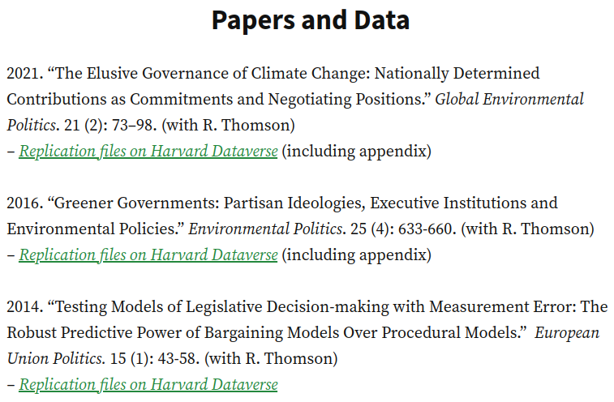
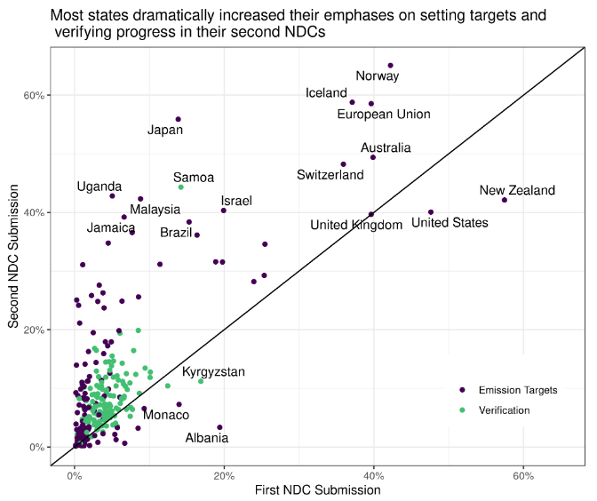

---
output:
  xaringan::moon_reader:
    css: ["default", "extra.css"]
    lib_dir: libs
    seal: false
    nature:
      highlightStyle: github
      highlightLines: true
      countIncrementalSlides: false
      ratio: '16:9'
---

```{r, echo = FALSE, warning = FALSE, message = FALSE}
##xaringan::inf_mr()
## For offline work: https://bookdown.org/yihui/rmarkdown/some-tips.html#working-offline
## Images not appearing? Put images folder inside the libs folder as that is the main data directory

library(tidyverse)
library(readxl)

knitr::opts_chunk$set(echo = FALSE,
                      eval = TRUE,
                      error = FALSE,
                      message = FALSE,
                      warning = FALSE,
                      comment = NA)
```

background-image: url('libs/Images/background-worldmap3.png')
background-size: 105%
background-class: top
class: middle

```{r, fig.align='right', out.width='90%'}

```

???

## Prep for Class
1. Bring playing cards AND markers to class

<br>

Welcome all!

- Thanks for coming over and welcome to the Dept of Political Science and International Affairs

<br>

We're very proud of our department over here and hope you keep us in mind as you make future plans!

- Small class sizes

- PhD faculty

- Money for study abroad and community engagement

- and much more

<br>

At the end of class today if there's anything I can tell you about what we do or how we can help you, let me know.


---

background-image: url('libs/Images/background-worldmap3.png')
background-size: 105%
background-class: top
class: middle

.center[.size40[.content-box-blue[**Dr. Justin Leinaweaver**]]]

.pull-left[

<br>

```{r, fig.align='right', out.width='100%'}

```
]

.pull-right[
```{r, fig.align='right', out.width='100%'}

```
]

???

Quick intro

<br>

I'm Dr. Leinaweaver

- Undergrad at Florida State with majors in History and Political Science

- Masters in International Relations at University College Dublin

- PhD in Political Science at Trinity College Dublin

- This is my 12th year at Drury

<br>

My research tends to focus on how we solve big problems at the global level

- The figure on the right is from an ongoing project exploring the ongoing global climate negotiations

<br>

In essence, this study leverages natural language processing techniques from computer science to help us analyze global climate negotiations in almost real time.

- This plot shows some good news in that countries are beginning to focus their pledges more and more on concrete emissions reductions and verification!

<br>

**SLIDE**: Our plan for today


---

background-image: url('libs/Images/background-worldmap3.png')
background-size: 105%
background-class: top
class: middle

.size60[**IR Basics: Why Are There Wars?**]

<br>

.size50[

**Today's Agenda**

- The Neorealist answer
]

<br>

.center[.size40[
  Justin Leinaweaver (Spring 2024)
]]

???

Today I want to explore some of the basic ground we cover in Introduction to International Relations here at Drury

- Most semesters I focus the second section of our class on this big question: Why are there wars?

<br>

Our first stab at answering this question explores the realist models of neorealism and offensive realism

- I don't mean to imply from this starting place that "realism" is "right" or "true"

- We start there because it is a grand-daddy theory of IR and because it is frequently invoked by experts and politicians to this day

<br>

Before we dive into Waltz, let's set the stage by talking about political science in big picture.

### What do you think it means that the discipline includes the word science in its title?

### - e.g. what does it mean to study politics "scientifically"?

- (**SLIDE**)


---

background-image: url('libs/Images/background-blue_triangles2.png')
background-size: 100%
background-position: center
class: middle

.pull-left[
.textblack[

.size45[
.content-box-white[**Scientific Method**]

- The goal is inference

- The procedures are public 

- The conclusions are uncertain
]]]

.pull-right[
```{r, fig.align='right', out.width='100%'}
knitr::include_graphics("libs/Images/05_1-science_meme.jpg")
```
]

???

There are lots of different processes that might describe themselves as a "scientific method."

- e.g. question -> theory  -> hypothesis -> testing...

<br>

Underpinning any of these "methods" are essentially these three criteria

- *talk through bullet points*

<br>

In short, you can study anything "scientifically" if you commit yourself to:

- Building knowledge using empirical observations,

- Being transparent in what you do, and

- never forgetting that your answers are always uncertain

<br>

That last one is key

- Unlike philosophy, religion or the humanities, the sciences operate in a probabilistic world of inductive logic

- Nothing can be proved conclusively

- Our job is to measure the uncertainty, not to hide it, not to deny it

<br>

**SLIDE**: So, our job today is to think about war "scientifically"


---

background-image: url('libs/Images/06_1-WW1.jpg')
background-size: 100%
background-position: center

???

The question of "why do wars happen?" is actually MUCH tougher to answer than you might think.

- Wars are IMMENSELY costly in terms of blood and treasure, BUT

- That doesn't seem to stop us from having them all the bloody time

<br>

Let's just talk about the start of the 20th century

### Anybody know how long WWI was? Or how many countries were involved?
- (4 years, approx 30 countries)

<br>

And the costs were INSANE

- Nearly 10 million soldiers killed, 21 million wounded

- Costs hundreds of billions of dollars

- Leads to the collapse of four empires
    - The Russian Empire, the German Empire, the Austro-Hungarian Empire and the Ottoman Empire

- The Bolsheviks take over Russia and the fascists take over Italy

- Spreads the flu epidemic that killed 25 million around the world

<br>

### After paying therse massive costs, how does the world respond?

- (**SLIDE**: Let's do it again!)


---

background-image: url('libs/Images/06_1-WW1-2.jpg')
background-size: 100%
background-position: center

???

And then 20 years later we decided to do it all again! 

<br>

World War 2: 
- kills **MORE** people, 

- costs **MORE** money,

- destroys **MORE** of the global economy

- Pushes us to **develop and USE NUCLEAR WEAPONS**!

<br>

It is the incredible death and destruction of WW1 and WW2 that leads to the birth of International Relations as a subfield of political science.

- The idea is to better understand these horrible events so we can prevent them.

<br>

**SLIDE**: So, let's talk about predicting war


---

background-image: url('libs/Images/background-worldmap3.png')
background-size: 105%
background-class: top
class: middle, center

.size65[
It is .textblue[**easy**] to predict the **outbreak of war** before it happens

vs

It is .textred[**hard**] to predict the **outbreak of war** before it happens
]

???


<br>

*Split class in half and get them to work making each list as we walk in*

<br>

*PRESENT and DISCUSS each LIST*

<br>

### Ok, sum this up for me, are you convinced war is a predictable occcurrence or not? Why?

<br>

**SLIDE**: This brings us to realism


---

background-image: url('libs/Images/05_2-putin_with_gun.png')
background-size: 100%
background-position: center

.right[.content-box-grey[.size40[**The Realist Paradigm**]]]

.size70[

<br>

<br>

]

.left[.content-box-grey[.size40[**Neorealism**]]]

.left[.content-box-grey[.size40[**Offensive realism**]]]

.left[.content-box-grey[.size40[**Defensive realism**]]]

???

As I told you at the start, realism is an umbrella term for a series of related models that happens to represent some of the oldest models of IR.

- In other words, they share similar roots but each is a distinct model of IR.

<br>

Today we'll focus on Ken Waltz's neorealism

- **SLIDE**: As a segue, let's play a game!


---

background-image: url('libs/Images/background-space1.jpg')
background-size: 100%
background-position: center
class: middle, center, inverse

.size80[.center[**Survive or Die!**]]

<br>

.size60[
The object of this game is to survive. 

If you lose your card, you .textred[**DIE**].
]

???

*Have someone distribute the cards while you explain the game*

<br>

It's a pretty simple game.

- SLIDE: How it works...


---

background-image: url('libs/Images/background-space1.jpg')
background-size: 100%
background-position: center
class: middle, center, inverse

.size70[.center[**Survive or Die!**]]

<br>

.size40[1) You may challenge anyone to a duel (no refusals)]

--

<br>

.size40[2) Duel: Rock-paper-scissors (best 2 out of 3)]

--

<br>

.size40[3) Winner survives, loser hands over .textred[ONE] card]

--

<br>

.size40[4) .textred[**0 cards left = You're Dead**]]

--

<br>

.size40[5) At end of game the cards = Bonus Points!]

???

Go!

<br>

### Ok, what just happened? Report back!

<br>

A useful way to analyze an event, like our game, is to break down your analysis of it into three parts: the interests, the institutions and the interactions.

- Think of this like learning the alphabet of social science modeling / theory building.


---

background-image: url('libs/Images/background-blue_triangles2.png')
background-size: 100%
background-position: center
class: middle

.size60[.content-box-white[**Frieden, Lake and Schultz (2016)**]]

<br>

.size45[
**Interests**

"…[The] preferences of actors over the possible outcomes that might result from their political choices" (45).
]

???

The first element we should clarify are the interests.

- "…[The] preferences of actors over the possible outcomes that might result from their political choices" (45).

<br>

In other words:

- Who are the actors making the key decisions in this event? AND

- What do they want?

<br>

A useful model of IR should identify the key actors and what they want.

### Questions?

<br>

### In our game who/what were the interests?


---

background-image: url('libs/Images/background-blue_triangles2.png')
background-size: 100%
background-position: center
class: middle

.size65[.content-box-white[**Frieden, Lake and Schultz (2016)**]]

<br>

.size45[
**Institutions**

"A set of rules, known and shared by the community, that structure political interactions in particular ways" (67).
]

???

The second element we should clarify are the institutions

- "A set of rules, known and shared by the community, that structure political interactions in particular ways" (67).

- In other words: What are the important rules that structure the decision-making of the actors you are focusing on?

<br>

A useful model of IR should define the key rules of the system.

### Questions?

<br>

### In our game who/what were the institutions?


---

background-image: url('libs/Images/background-blue_triangles2.png')
background-size: 100%
background-position: center
class: middle

.size65[.content-box-white[**Frieden, Lake and Schultz (2016)**]]

<br>

.size45[
**Interactions**

"The ways in which the choices of two or more actors combine to produce political outcomes" (51).
]

???

The third element we should clarify are the Interactions

- "The ways in which the choices of two or more actors combine to produce political outcomes" (51).

- How does the collision of the interests in a situation complicate things?

- In other words, why can't each actor get what they want from a situation?

<br>

A useful model of IR should define how interactions happen and how they change the game.

### Questions?

<br>

### In our game who/what were the interactions and how did they complicate your decisions?


---

background-image: url('libs/Images/background-blue_triangles2.png')
background-size: 100%
background-position: center
class: middle

.size45[.content-box-white[**Frieden, Lake and Schultz (2016)**]]

.size30[
**Interests**

"…[The] preferences of actors over the possible outcomes that might result from their political choices" (45).

**Interactions**

"The ways in which the choices of two or more actors combine to produce political outcomes" (51).

**Institutions**

"A set of rules, known and shared by the community, that structure political interactions in particular ways" (67).
]

???

Think of interests, interactions and institutions as a shortcut to designing a model of political behavior.

### Any questions on these three concepts?

<br>

### Do we understand how these help us design a model of behavior or decision-making?

+ The interests tell us who is making the decisions and what they want.

+ The institutions tell us what are the rules that matter.

+ The interactions tells us what happens when these different interests collide.


---

background-image: url('libs/Images/05_2-putin_with_gun_v2.png')
background-size: 100%
background-position: center
class: middle

.size50[.center[.content-box-grey[**Neorealism**]]]

<br>

.size40[Let's diagram the model!]

.size40[
+ Who are the key interests?

+ What are the key institutions?

+ What are the primary interactions that matter?
]

???

On your own, 5 mins, diagram Neorealism as an answer to these three questions

<br>

Consolidate diagrams with the person next to you

<br>

Pairs group up and let's get these diagrams on the board!

<br>

### Groups, report back!

<br>

**SLIDE**: Here's the traditional view of neorealism's key assumptions.


---

background-image: url('libs/Images/background-slate_v2.png')
background-size: 100%
background-position: center
class: middle

.size50[.center[.content-box-grey[**Neorealism**]]]

### Interests
.size35[
+ Unitary states want security, not power
]

### Institutions
.size35[
+ International anarchy
]

### Interactions
.size35[
+ You must fend for yourself (threats are everywhere)
+ Security dilemmas dominate
]

???

Let's start by discussing the interests in this model

<br>

### What is meant by a unitary state? 
### - Does it help if I tell you this is often referred to as the black box assumption?
- (By unitary, we mean forming a single entity.)

- The black box: All of the characteristics of the state (e.g. wealth, regime type, voting system) go inside the box and the lid is closed.

### Since we cannot see inside the box, should we spend time measuring or debating what is inside?
- (Nope.)

<br>

### What does 'security, not power' mean?
- (Power is the means to the end, not the end.)
    - The end is survival

<br>

### What is the counterintuitive conclusion about power raised by Waltz?
- (Too much power makes you a threat to everyone else!)

<br>

Neorealists focus on states as the key units embedded in the international system.

- HOWEVER, what they care about is the placement of units in the system, NOT by reference to their internal qualities themselves.

- Neorealism is a view of international politics with black boxes of different sizes running into each other on a map of the world.


---

background-image: url('libs/Images/background-slate_v2.png')
background-size: 100%
background-position: center
class: middle

.size50[.center[.content-box-grey[**Neorealism**]]]

### Interests
.size35[
+ Unitary states want security, not power
]

### Institutions
.size35[
+ International anarchy
]

### Interactions
.size35[
+ You must fend for yourself (threats are everywhere)
+ Security dilemmas dominate
]

???

Now let's talk about the institutions in Neorealism

<br>

### What is meant by anarchy?
- (“...absence of a central monopoly of legitimate force.”)

### What does that mean?
- (No world police.)
    - monopoly: exclusive control of
    - legitimate force: legal / allowable violence

<br>

The final element of this model is the interactions.

### Why does everything look like a threat to states?

- Every state will feel more secure in a world where its security is greater than yours

- And, every time a state acts to enhance its own security it impacts your security!

<br>

**SLIDE**: Let's talk about this Security Dilemma dynamic.


---

background-image: url('libs/Images/02_3-neighbors.png')
background-size: 100%
background-position: center

.center[.content-box-red[.size40[**The Security Dilemma**]]]

???

One of the key predictions of neorealism is the security dilemma.

<br>

Just because it makes me deeply happy, let me briefly illustrate the security dilemma.

<br>

Imagine new neighbors move in next door to you.

- You don't know them and you're not sure what they are up to so you decide to build a fence.


---

class: middle, slidepink

.size60[.center[**The Security Dilemma**]]

.pull-left[

```{r, fig.align='left', out.width='90%'}
knitr::include_graphics("libs/Images/02_3-Wilson.jpg")
```

]

.pull-right[

]

???

That seems eminently reasonable, right?

From your new neighbors perspective, they just bought their dream house and the day after they moved in their new neighbors build a fence and start watching them suspiciously.

#### How would you react to that?


---

class: middle, slidepink

.size60[.center[**The Security Dilemma**]]

.pull-left[

```{r, fig.align='left', out.width='90%'}
knitr::include_graphics("libs/Images/02_3-Wilson.jpg")
```

]

.pull-right[

<br>

```{r, fig.align='right', out.width='100%'}
knitr::include_graphics("libs/Images/02_3-dog_hatchet.png")
```

]

???

Of course, you buy a guard dog to protect you.

The big, mean guard dog makes you feel much safer.

- No one can get near your house or your family without you knowing about it.

<br>

Unfortunately, your neighbor is terrified of dogs.

- He didn’t like you but had no intention of ever going near your house.

- He starts having nightmares about the dog, so...


---

class: middle, slidepink

.size60[.center[**The Security Dilemma**]]

.pull-left[

<br>
<br>

```{r, fig.align='left', out.width='100%'}
knitr::include_graphics("libs/Images/02_3-handgun.jpg")
```

]

.pull-right[

<br>

```{r, fig.align='right', out.width='100%'}
knitr::include_graphics("libs/Images/02_3-dog_hatchet.png")
```

]

???

He buys himself a gun to feel safe.

<br>

You are now living next to a guy you don’t know very well who has been acting strangely since you moved in and has now bought a gun.

- Your dog stands no chance against a gun and now you are having nightmares about being unsafe.

- You decide the only solution is to up your security!

<br>

If one dog made you feel safe, then...


---

class: middle, slidepink

.size60[.center[**The Security Dilemma**]]

.pull-left[

<br>
<br>

```{r, fig.align='left', out.width='100%'}
knitr::include_graphics("libs/Images/02_3-handgun.jpg")
```

]

.pull-right[

<br>

```{r, fig.align='right', out.width='100%'}
knitr::include_graphics("libs/Images/02_3-wolves.jpg")
```

]

???

A pack of ravenous wolves will make you feel safer!

<br>

This makes your neighbor absolutely crap himself in terror.

His small gun will be useless against a pack of wolves so he ups his own security...


---

class: middle, slidepink

.size60[.center[**The Security Dilemma**]]

.pull-left[

<br>
<br>

```{r, fig.align='left', out.width='100%'}
knitr::include_graphics("libs/Images/02_3-tank.jpg")
```

]

.pull-right[

<br>

```{r, fig.align='right', out.width='100%'}
knitr::include_graphics("libs/Images/02_3-wolves.jpg")
```

]

???

An M1 Abrahms tank is a nice centerpiece for your front yard, no?


---

class: middle, slidepink

.size60[.center[**The Security Dilemma**]]

.pull-left[

<br>
<br>

```{r, fig.align='left', out.width='100%'}
knitr::include_graphics("libs/Images/02_3-tank.jpg")
```

]

.pull-right[

<br>

```{r, fig.align='right', out.width='100%'}
knitr::include_graphics("libs/Images/02_3-shark_laser.jpg")
```

]

???

This forces you to do the only logical thing you can.

Install a moat and fill it with sharks...

<br>

This is an example of an arms race created by the security dilemma.

### So, what is the fundamental lesson of a security dilemma?
- (Purely defensive moves look threatening in a world of uncertainty and anarchy.)

- At no point did either you nor your neighbor act with the intention of attacking the other person.

- These were entirely defensive moves only and they still spiral out of control!

<br>

### Do we believe the security dilemma is a useful prediction for state behavior in the world? Why or why not?


---

background-image: url('libs/Images/background-slate_v2.png')
background-size: 100%
background-position: center
class: middle

.size50[.center[.content-box-grey[**Neorealism**]]]

### Interests
.size35[
+ Unitary states want security, not power
]

### Institutions
.size35[
+ International anarchy
]

### Interactions
.size35[
+ You must fend for yourself (threats are everywhere)
+ Security dilemmas dominate
]

???

OK, summarize this all for me.

### Per the Neorealist model, how likely is cooperation?
- (1. Cooperation super unlikely)
    - Cooperation hard to start and even harder to maintain.

### What should be the most important part of every state's budget?
- (2. Defense!)
    - States should actively seek to build up their own protections

### How should a state react when a natural disaster strikes in a faraway land? Send aid?
- (3. Aid to people in desperate places unlikely, unless...)

<br>

Connect this to current events for me!

### Examples of current international political events going on in the world that are well explained by this model?

- *FORCE THIS DISCUSSION*

<br>

### Examples of current international political events going on in the world that are NOT well explained by this model?

### - What would neorealists miss?

- *FORCE THIS DISCUSSION*


---


background-image: url('libs/Images/background-worldmap3.png')
background-size: 105%
background-class: top
class: middle

```{r, fig.align='right', out.width='90%'}

```

???

### Just to wrap up, any questions for me on Drury or the political science program?


