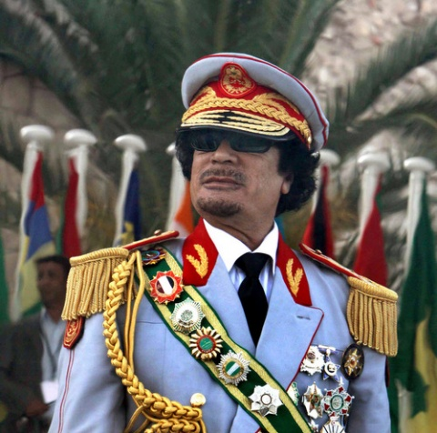
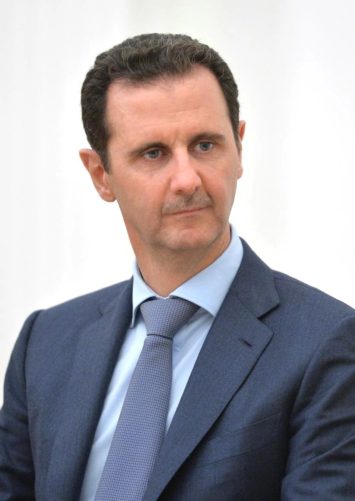

---
output:
  xaringan::moon_reader:
    css: ["default", "extra.css"]
    lib_dir: libs
    seal: false
    nature:
      highlightStyle: github
      highlightLines: true
      countIncrementalSlides: false
      ratio: '16:9'
---

```{r, echo = FALSE, warning = FALSE, message = FALSE}
##xaringan::inf_mr()
## For offline work: https://bookdown.org/yihui/rmarkdown/some-tips.html#working-offline
## Images not appearing? Put images folder inside the libs folder as that is the main data directory

library(tidyverse)
library(readxl)
library(stargazer)
##library(kableExtra)
##library(modelr)

knitr::opts_chunk$set(echo = FALSE,
                      eval = TRUE,
                      error = FALSE,
                      message = FALSE,
                      warning = FALSE,
                      comment = NA)
```

class: middle, center, slideblue

.size50[**PLSC 152: Intro to International Relations**]

<br>

.size50[

Name one .textblue[**positive**] and one .textred[**negative**] thing the US has done on the world stage in the last 20 years.

]

<br>

.size40[
  Justin Leinaweaver (Spring 2022)
]

???

* As students come in, encourage discussion of a big question *

ON BALANCE OVER THE LAST TWENTY YEARS, HAS AMERICA HAD A NET POSITIVE OR NET NEGATIVE IMPACT ON THE WORLD?

* ON BOARD *


---

class: slideblue

.size80[**Today's Agenda**]

<br>

.size50[

1. What do we explore in International Relations (IR)?

2. Plan for the semester

]

<br>
<br>

.center[.size40[
  Justin Leinaweaver (Spring 2022)
]]

???

Welcome to PLSC 152: Introduction to International Relations

IS EVERYBODY IN THE RIGHT PLACE?

Today's Agenda
1. What do we explore in International Relations (IR)?
2. Plan for the semester


---

class: slideblue, middle

.size80[**Introductions**]

.size60[
1. Name

2. Year in school

3. Major
]

???

Let's go around the room for introductions.
- I'll go first.

1. I'm Dr. Justin Leinaweaver.

2. FSU undergrad, masters in IR at UCD and PhD at Trinity.
  + My ninth year at Drury

3. I'm a political scientist
  + Research interests: international politics, environmental politics and bargaining / negotiations.

<br>

YOUR TURN:
1) NAME,
2) YEAR, and
3) MAJOR


---

class: slideblue, middle, center

.size60[
On balance, has the US been a net .textblue[**positive**] or .textred[**negative**] influence on the world over the last 20 years?
]

???

SO, ON BALANCE, HAS THE US BEEN A NET POSITIVE OR NEGATIVE INFLUENCE ON THE WORLD OVER THE LAST 20 YEARS?

<br>

Welcome to International Relations (IR).

IR is the study of politics at the international level.

What do I mean by politics and the international level?

Let's talk examples!


---

background-image: url('libs/Images/01_1-putin_meme.jpg')
background-size: 85%
background-class: center

???

WHO IS THIS?
(Putin)

HOW HAS PUTIN IMPACTED THE WORLD?
- EXAMPLES?


---

background-image: url('libs/Images/01_1-kim_jong_un.jpg')
background-size: 100%
background-class: center

???

WHO IS THIS?
(Kim Jong Un)

HOW HAS KIM JONG UN IMPACTED THE WORLD?
- EXAMPLES?

<br>

Let me clarify, international relations is not simply the study of individuals, but that can be part of it.


---

class: middle, slidegreen

.pull-left[

```{r, fig.retina=3, fig.align='center', out.width='95%'}

```

]

.pull-right[

```{r, fig.retina=3, fig.align='center', out.width='70%'}

```

]

???

Let me clarify, international relations is not simply the study of individuals, but that can be part of it.

Let's use two more leaders to get at the kinds of question we will be studying.

DOES ANYBODY RECOGNIZE EITHER OF THESE MEN?

WHAT DO WE KNOW ABOUT THEM?

(Left: Muammar Gaddafi)
- Dictator of Libya for over 40 years.
- Not a nice guy, and more than a little nuts.
- Gave himself fancy titles, such as:
- The colonel
- The Dean of Arab Rulers
- The Keeper of Arab Nationalism
- The Head of the Coalition of Coastal and Desert States
- And, of course, Africa's "King of Kings"

(Right: Bashar al-Assad)
- Syrian President (e.g. dictator)

<br>

These two "gentlemen" offer us an excellent example of the kinds of puzzles international relations tries to answer.


---

background-image: url('libs/Images/01_1-iraq-tahrir-peace.jpg')
background-size: 100%
background-class: center

???

In the winter of 2010 a popular protest of an autocratic regime launched in Tunisia and these protests caught fire across the Mid East.

- People in the streets, demands for change and accountability

This has come to be referred to as the Arab Spring.

<br>

ANYBODY KNOW HOW GADDAFI AND ASSAD RESPONDED TO THEIR PEOPLE FILLING THE STREETS DEMANDING POLITICAL CHANGE?


---

background-image: url('libs/Images/01_1-civil_war.png')
background-size: 100%
background-class: center

???

Both leaders respond to these demands with violence and repression.

10s of thousands killed in Libya in 2011.

Syria's civil war is now believed to have somewhere above 500k deaths since 2011.

<br>

DOES ANYONE KNOW HOW THE INTERNATIONAL COMMUNITY RESPONDED TO THES KILLINGS?


---

background-image: url('libs/Images/01_1-response_gaddafi.png')
background-size: 100%
background-class: center

???

Western powers respond aggressively to Gaddafi's actions.

- no fly zone

- NATO bombings

- Gaddafi eventually captured and killed by rebel forces.


---

background-image: url('libs/Images/01_1-Nikki_Haley.png')
background-size: 100%
background-class: center

???

Global response to Assad much less definitive.

In the Syrian case, al-Assad has waged a brutal war against his own people and is now winning.
- prolonged civil war with international participation
- Assad has basically won

<br>

In international relations we study puzzles like this.

Why did two dictators, reacting to the same situation with brutal violence reach such different ends?

Put yourself in the shoes of the American president or the leader of a western democracy.

WHAT MIGHT STOP YOU FROM INTERVENING MILITARILY TO PROTECT PEACEFUL PROTESTORS IN OTHER COUNTRIES?

ANY IDEAS?


---

background-image: url('libs/Images/01_1-mideast_map.png')
background-size: 100%
background-class: center

???

One set of IR scholars we will study this semester would ask, does either situation represent a threat to you or to global stability?

WHAT IS THE RISK THE CONFLICT MAY SPREAD?

WHICH SEEMS MORE LIKELY FOR TERRORISM?

Both countries on the Mediterranean, but Libya much closer to Europe (e.g. NATO).


---

background-image: url('libs/Images/01_1-Assad_putin.png')
background-size: 100%
background-class: center

???

A second set of IR scholars we will study would emphasize who your friends are.

<br>

Assad protected and defended by the Russians and the Iranians.

ANYBODY KNOW WHY THE RUSSIANS MIGHT WANT TO PROTECT ASSAD?

<br>

(- Russia has a naval base they lease from Syria in Tartus. Gives them access to the Mediterranean.)
(- Russia tends to oppose any interference in the domestic affairs of dictatorships; avoid the precedent!)
(- ?)

<br>

On the other side, Gaddafi was fairly isolated and the UN authorized action against him.


---

background-image: url('libs/Images/01_1-assad_quote.png')
background-size: 100%
background-class: center

???

A third set of IR scholars we will study this term would argue that context of the conflict matters.

Assad has claimed since 2011 that there is no civil war, in fact, he is battling terrorists!

IS THIS A PERSUASIVE ARGUMENT? WHY OR WHY NOT?


---

background-image: url('libs/Images/01_1-gaddafi_quote.png')
background-size: 100%
background-class: center

???

Gaddafi took a different approach...

Compares his own people to rats and declares his aim of exterminating them.

<br>

In the end, IR theory offers us different tools for explaining international politics.

We'll be learning a series of these tools this semester.

Probably not hard to see why Gaddafi is dead and Assad is not, right?

<br>

We have four learning outcomes this semester.

All four are in the syllabus but let's step through them for a moment.


---

background-image: url('libs/Images/background-blue_triangles.jpg')
background-size: 100%
background-class: center
class: middle, center

# LO1: Content Knowledge
.size55[
Students should have substantial familiarity with the basic concepts and theoretical approaches in international relations.
]

???

**Translated**

Learn the big ideas and basic definitions you need to explain international events.


---

background-image: url('libs/Images/background-blue_triangles.jpg')
background-size: 100%
background-class: center
class: middle, center

# LO2: Methods Knowledge
.size55[
Students should demonstrate an introductory level facility with the methods and approaches of international relations research.
]

???

**Translated**

Learn to use the tools of social scientists for analyzing the world.


---

background-image: url('libs/Images/background-blue_triangles.jpg')
background-size: 100%
background-class: center
class: middle, center

# LO3: Critical Thinking & Problem Solving Skills
.size55[
Students should be able to understand, analyze, and produce arguments, and evaluate evidence, on contemporary questions of international relations.
]

???

**Translated**

Practice applying those tools to solve big problems and answer important questions.


---

background-image: url('libs/Images/background-blue_triangles.jpg')
background-size: 100%
background-class: center
class: middle, center

# LO4: Communication Skills
.size55[
Students should demonstrate effective written communication skills.
]

???

**Translated**

Learn to write logical, clear, credible and critical arguments so good that they will convince smart people you are right!

<br>

EVERYBODY GOOD WITH THESE?

ANY QUESTIONS OR CONCERNS SO FAR?


---

background-image: url('libs/Images/01_1-newspapers.jpg')
background-size: 100%
class: center

???

In order for us to bring current events into class, you guys have to be aware of what's going on in the world.

SO, try to keep up with what's going on!

- Skim the international section of a good news site everyday.

Let's make sure we always have current events we can draw on in our discussions!


---

class: middle, center

.size60[**Course Grade**]

```{css, echo=F}
/* Change the background color to white for shaded rows (even rows) */
.remark-slide thead, .remark-slide tr:nth-child(2n) {
      background-color: white;
}
```

```{r}
tibble(
  col1 = c("Participation", "Argument Paper 1", "Argument Paper 2", "Argument Paper 3", "Total"),
  col2 = c("", "(Feb 11)", "(Apr 1)", "(Final Exam)", ""),
  col3 = c(rep(20, 4), 100)
) |>
  kableExtra::kbl(align = c("l", "c", "c"), col.names = c("", "", "%")) |>
  kableExtra::kable_styling(font_size = 50) |>
  kableExtra::column_spec(1, width = "11em") |>
  kableExtra::column_spec(2, width = "7em") |>
  kableExtra::row_spec(c(0, 5), bold = TRUE, background = "#b3ccff")

```


---

class: middle, slidepurple

.size60[**Participation**]

.size50[
+ Get to class on time,

+ Have the materials you need to be productive,

+ Be engaged while in class (e.g., no sleeping, playing with your gadgets, leaving early, arriving late).
]

???

Let's talk participation.

In order for me to ensure you make progress on our learning objectives I need you in class and playing along.

This class is a seminar, not a lecture.

I want you to be a well informed citizen of the world and that means taking ownership of the process.

Therefore, I have made participation worth 20% of the final grade, AND

I expect you to earn a participation point in every class.

How?
1. Do the reading,

2. Bring the reading, and

3. Be actively engaged in class (no sleeping, playing with your gadgets, leaving early, arriving late).

QUESTIONS?

These are basically free points for everybody.

The two most common ways people lose these points?

- Come to class late, or 

- come to class without the assignment completed for the day


---

background-image: url('libs/Images/01_1-coyote.jpg')
background-size: 85%
class: center

???

The only way I can ensure everyone makes progress on the LOs is by being in class and doing the work.

This means I have to make sure you are here!

So, this class has an attendance cliff.

If you have more than five unexcused absences during the semester you will not be able to earn greater than a C+.

Regardless of assignment grades.


---

background-image: url('libs/Images/01_1-office_space.jpg')
background-size: 65%
background-class: center

???

**Excused absence coming up?**

Illness? Sports?

Let me know **ahead of time** and I'll give you an assignment to complete to earn your lost participation points. 

Easy peasy.

<br>

Here's the other part of this deal.

Covid is still a GIANT pain in the ass and life always gets hectic during the semester.

Keep me in the loop and I will have your back!

I am not here to make your life harder.

I genuinely want you to learn this material.

So, if things are getting rough for you please come talk to me.

**I will always offer you flexibility in the face of struggle IF YOU COME TO ME BEFORE DEADLINES HAVE PASSED!**

SOUND FAIR?

<br>

ANY QUESTIONS ON ATTENDANCE AND PARTICIPATION?


---

background-image: url('libs/Images/01_1-matrix_meme.jpg')
background-size: 95%
class: center

???

Your first job is to download the syllabus from Moodle and read it carefully.

It includes detail on everything you need to know.
- Assignment deadlines
- Readings
- Drury policies

ALSO, I can see who downloaded it, so don’t delay!

<br>

We'll be using Moodle for submitting assignments and sharing readings.

Let me know if you have trouble using our Moodle site.


---

class: middle, slidegreen

.size60[**For Friday**]

.size40[
1. Labossiere, M. (2008, March 13). Argument Basics.

2. Argument 1...

3. Argument 2...
]

???

The world of science is a world of making arguments.

So, your readings for Friday will help us practice what that means.

These are in the syllabus and the readings are on Moodle if the web links don't work.

Read these and be ready to analyze their arguments in class on Friday.

QUESTIONS?