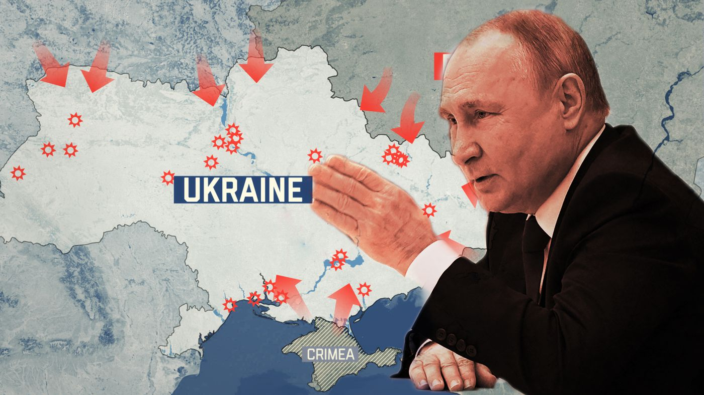
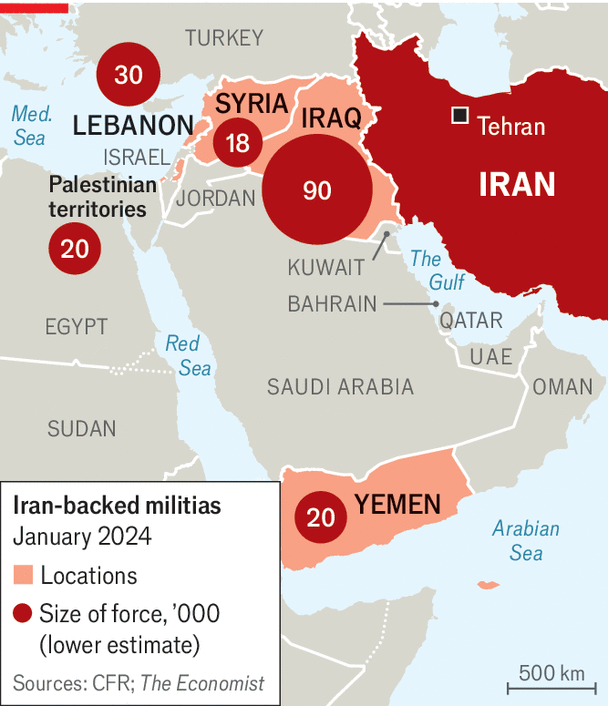
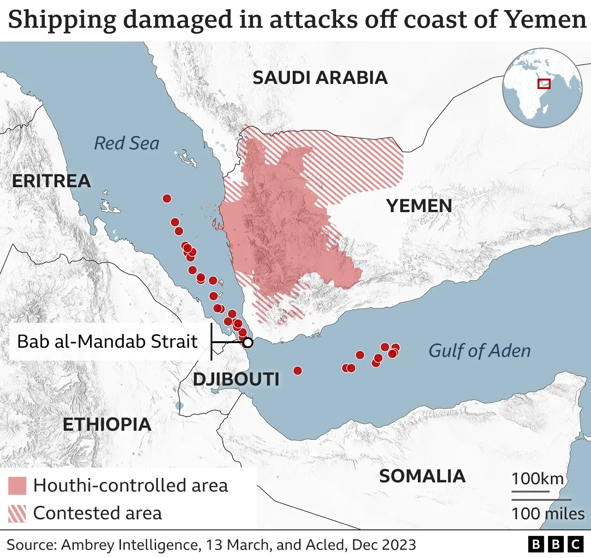
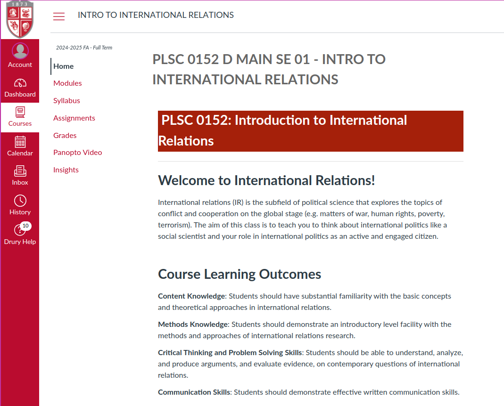
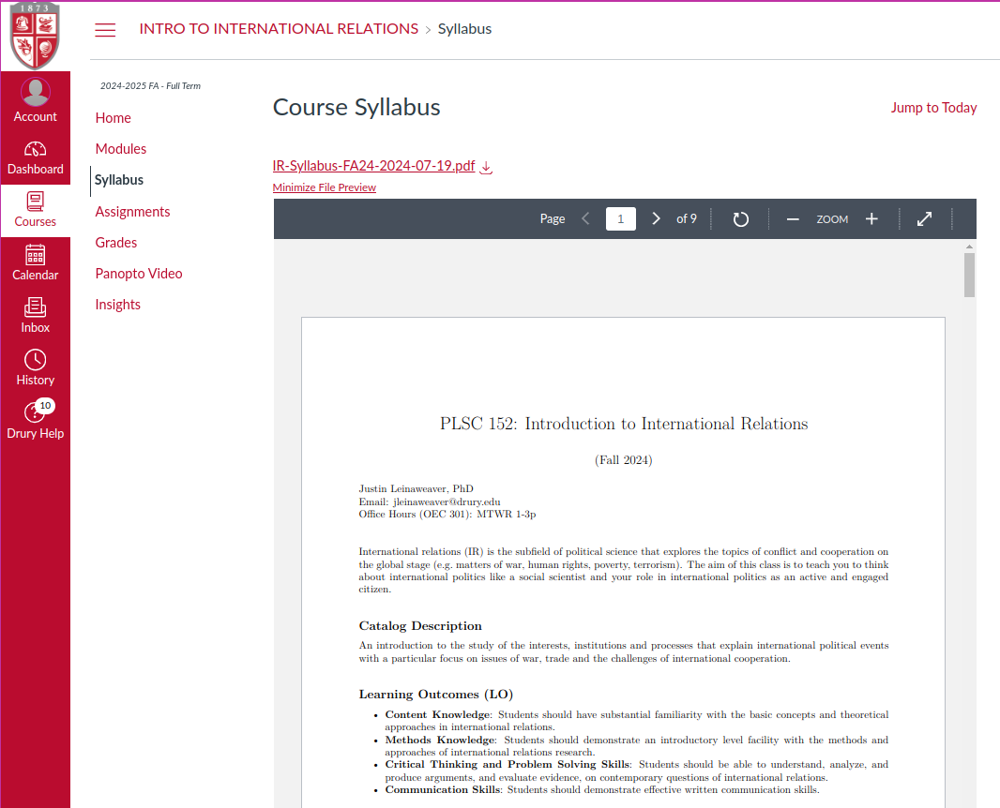

## Intro to International Relations {background-image="./Images/background-worldmap4.png" .center}

```{r}
# background-size="1920px 1080px"
library(tidyverse)
library(readxl)
```

<br>

<br>

Make a list of **positive** and **negative** things the US has done on the world stage in the last 20 years.

<br>

<br>

::: r-stack
Justin Leinaweaver (Spring 2025)
:::

::: notes
Prep for Class

1. Update attendance list before class

2. Make sure this week's modules visible in Canvas

3. Log into Canvas on classroom PC

<br>

*As students come in*

Welcome all.

- Sit down, introduce yourself to the people around you and get chatting about my prompt on the board.

- Build two lists as a group!

<br>

*ON BOARD*

### Ok, what is on your lists?

- SHARE and DISCUSS

<br>

**SLIDE**: Let's make sure we're all in the right place!
:::


## Introductions {background-image="Images/background-worldmap4.png"  .center}

::: {.r-fit-text}

1. Name

2. Year in school

3. Major

4. Earliest memory of a "big" international event

:::

::: notes

1. Name: I'm Dr. Leinaweaver.

2. Year in school: 12th year at Drury

3. Major: Political scientist with primary research interests in international policy-making and problem-solving

4. Earliest memory? Berlin wall coming down and finding out our world map had to change. Kind of blew my mind.

<br>

### Your turn!

<br>

**SLIDE**: Back to the board!
:::


## On balance, has the US been a net positive or negative influence on the world over the last 20 years? {background-image="Images/background-worldmap4.png" .center}

::: notes

All of this adds up to a big, tough to handle question.

- I don't want to pretend our lists on the board are comprehensive or that this question isn't crazy reductive.

<br>

However, I'd like to take this opportunity to get a sense of how our class thinks about the role of the US in the world BEFORE we start our work this semester.

### So, what do you think?

:::


## {background-image="Images/01_1-international-certificate.jpg"}

::: notes

Welcome to International Relations (IR).

<br>

Our job this semester is to analyze "politics" happening at the international level.

- What does that mean? We'll get there!

<br>

Today's Agenda: Set up our class and plan for the semester
:::


## Learning Outcomes {background-image="Images/background-worldmap4.png"  .center}

::: {.incremental}
- LO 1: Learn about the big ideas and debates of IR scholars

- LO 2: Learn to use the tools of IR scholars to explain events

- LO 3: Use the tools to explain international political events

- LO 4: Write convincing arguments
:::

::: notes

Big picture, we have four learning outcomes this semester.

- All four are in the syllabus, but let me simplify them for you.

<br>

1. Content Knowledge
    - Learn the big ideas and basic definitions you need to explain international political events.

2. Methods Knowledge
    - Learn to use the tools of social scientists for analyzing international political events.

3. Critical Thinking & Problem Solving Skills
    - Practice applying social science tools to solve big problems and answer important questions.

4. Communication Skills
    - Practice writing logical, clear, credible and critical arguments so good that they will convince smart people you are right!

<br>

### Everybody good with these?

<br>

**SLIDE**: To make progress on these LOs I've divided the semester into four sections.

:::


## Semester Outline: Section 1 {background-image="Images/background-worldmap4.png" .center}

<br>

**Arguments, Evidence and International Relations**

- Making logical arguments,

- Testing those arguments scientifically, and

- Learning to think in terms of models

::: notes

Section 1 sets us up for the semester.

:::


## {background-image="Images/01_1-Putin.jpg"}

::: notes

**Anybody recognize this fella?**

- (President of Russia Vladimir Putin)

<br>

**And why has old Vladdy been in the news so much over the last few years?**

- (SLIDE: Dude just will not stop invading Ukraine!)

:::


## Semester Outline: Section 2 {background-image="Images/background-worldmap4.png" .center}

<br>

**Why Are There Wars?**

```{r, fig.align='center'}

```

::: notes

In Section 2 of our we explore the grand-daddy of all IR research questions.

- Why Are There Wars?

<br>

**From what you've heard, why did Russia invade Ukraine?**

*ON BOARD*

- Power? 
- Personality? 
- Territory/Resources? 
- Threats from Alliances?

<br>

**Is this a "good" list if our aim is to be able to explain where wars are likely to start in the future? Why or why not?**

:::


## {background-image="Images/01_1-Khamenei.png"}

::: notes

**Anybody recognize this kindly looking fella? Or the flag behind him?**

- (Supreme Leader of Iran, Ali Khamenei)

<br>

To be clear, this is Ali Khamenei not to be confused with his predecessor Ruhollah Khomeini

- Not confusing at all.

<br>

**And what are some of the MANY reasons this guy, and his country, have been in the news over the last few years?**

- Nuclear weapons program / nuclear enrichment

- Providing aid and weapons to terror groups like Hamas, Hezbollah and the Houthi fighters in Yemen

- Suppressing pro-democracy protests at home

- Launching missile/drone attacks against Israel

- Supporting groups that target American bases and troops in Iraq

- and on and on and on...

<br>

SLIDE: militia support, houthi support, nuke program

:::


## {background-image="Images/background-worldmap4.png"}

{.absolute top=0 left=0 width="450"}

::: {.fragment}

{.absolute top=0 right=0 width="550"}

:::

::: {.fragment}

{.absolute bottom=0 right=200 width="550"}

:::

::: notes

Iran has definitely been an active participant in Middle East politics for a long time, and to the extreme annoyance of many of its neighbors!

- REVEAL: Offering support in terms of money, arms and expertise to militias throughout the region

- REVEAL: The houthis in Yemen have used Iranian support to destabilize global trade using missile strikes against shipping in the Red Sea

- REVEAL: And, of course, their threatened nuclear program!

<br>

**From what you've heard, why is Iran working so hard to destabilize the Middle East?**

- **Why won't they simply "play nice" with their neighbors?**

<br>

*ON BOARD*

- Pushing back against the US-led order?

- Asserting their own domestic security?

- Supporting their allies in the region / those with a similar view to their own?

- Power projection?

- Technological advancement?

<br>

**If you were the President of the US, what would you do to get Iran to act differently?**

<br>

**Setting aside threats and violence, what would you be willing to offer Iran to change its behavior? Anything?**

:::


## Semester Outline: Section 3 {background-image="Images/background-worldmap4.png" .center}

```{r, fig.align='center'}
knitr::include_graphics("Images/01_1-Iranian_nukes.jpg")
```

::: {.r-fit-text}
Why is it so Hard to Cooperate With Other Countries?
:::

::: notes

In Section 3 of the class we ask why is it so Hard to Cooperate with Other Countries?

- We have a good start here to mapping out the challenges of cooperation when the stakes are so high!

:::


## {background-image="Images/01_1-Yalta-Conference.jpg"}

::: notes

Last photo quiz!

- **Who are these three gentlemen and what are we looking at here?**

- Churchill, FDR and Stalin at the Yalta Conference

- The Yalta Conference held in 1945 in Crimea is where the winning powers of WW2 got together to plan the future of Europe.

<br>

Clearly the world has changed a lot since 1945.

- For one thing, we now have color photographs!

<br>

**What are the biggest differences between today and 1945?**

<br>

**And what are the biggest similarities between today and 1945?**

:::


## Semester Outline: Section 4 {background-image="Images/background-worldmap4.png" .center}

```{r, fig.align='center'}
knitr::include_graphics("Images/01_1-Old_Institutions.webp")
```

::: {.r-fit-text}
What is the Future of Transnational Politics and IR?
:::

::: notes

Here's the thing, most of the world's international infrastructure was designed at the end of WWII

- The United Nations, the International Court of Justice, the World Bank, the International Monetary Fund, etc. all founded in around 1944/1945

<br>

In Section 4 of the class I want us to ask if 80 years later these institutions are still adapted well to the complexities of today

- If not, what do we do about it?

:::


## Semester Outline {background-image="Images/background-worldmap4.png" .center}

<br>

1. Arguments, Evidence and International Relations

2. Why Are There Wars?

3. Why is it so Hard to Cooperate With Other Countries?

4. What is the Future of Transnational Politics and IR?

::: notes

Alright, so that's our plan for the semester.

### Questions on this?

:::


## {background-image="Images/01_1-newspapers.jpg"}

::: notes

We will kick off most classes with current events discussions.

- This REQUIRES you to follow global news!

<br>

**Part of your job in this class is to keep up with international current events!**

- Skim the international section of a good news site everyday.

- Let's make sure we always have current events we can draw on in our discussions!
:::


## All Supporting Material is on Canvas  {background-image="Images/background-worldmap4.png"  .center}

```{r, fig.align='center'}

```

::: notes
Everybody log into Canvas with me and let's get oriented in our class infrastructure!

<br>

*Log into Canvas, set to student view and step them through the main pages*

- Home page,

- Grades,

- Assignments,

- Modules (with readings and assignment for Thursday)
:::


## The answer is in the syllabus  {background-image="Images/background-worldmap4.png" .center}

```{r, fig.align='center'}

```

::: notes

Everybody open the syllabus and let's hit the highlights!

- LOs

- Grade composition

- Attendance cliff (> 3 unexcused absences = Grade cap of 'C')

- Excused absence coming up? **It is your responsibility to email me BEFORE the absence in order to receive a make-up assignment.**

- Participation points!

- Paper requirements: APA, submitted on Canvas, NO AI TOOLS

- Weekly plan (should essentially match the modules on Canvas)

<br>

**Any questions on our aims for the semester or my expectations for you as represented by the syllabus?**

<br>

Please keep me in the loop this semester!

- I genuinely want you to make progress on our learning outcomes

- So, if things are getting rough for you please come talk to me.

- I will always offer you flexibility in the face of struggle IF YOU COME TO ME BEFORE DEADLINES HAVE PASSED!

<br>

**Questions on this?**
:::


## For Next Class {background-image="Images/background-worldmap4.png"}

```{r, fig.align='center'}
knitr::include_graphics("Images/01_1-Canvas_Modules2_SP24.png")
```

::: notes
Readings and an assignment for next class

<br>

I have found that requiring these pre-class questions sets us up for much livelier engagement in class!

- Plus makes tracking participation points easier!

<br>

**Questions on what I'm asking you to do?**

- NOTE: The forum closes BEFORE class starts (9:59 am) so make sure to get these in!

<br>

Welcome to the class and let me know if you have any questions!
:::
