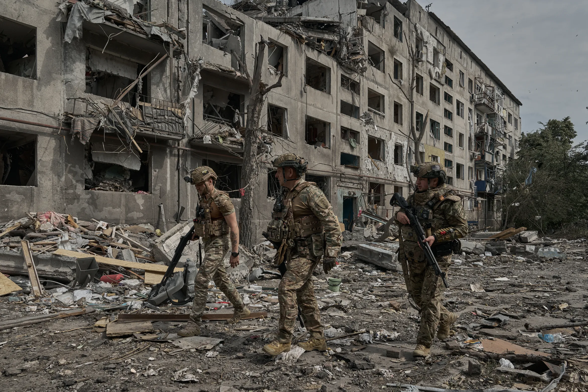
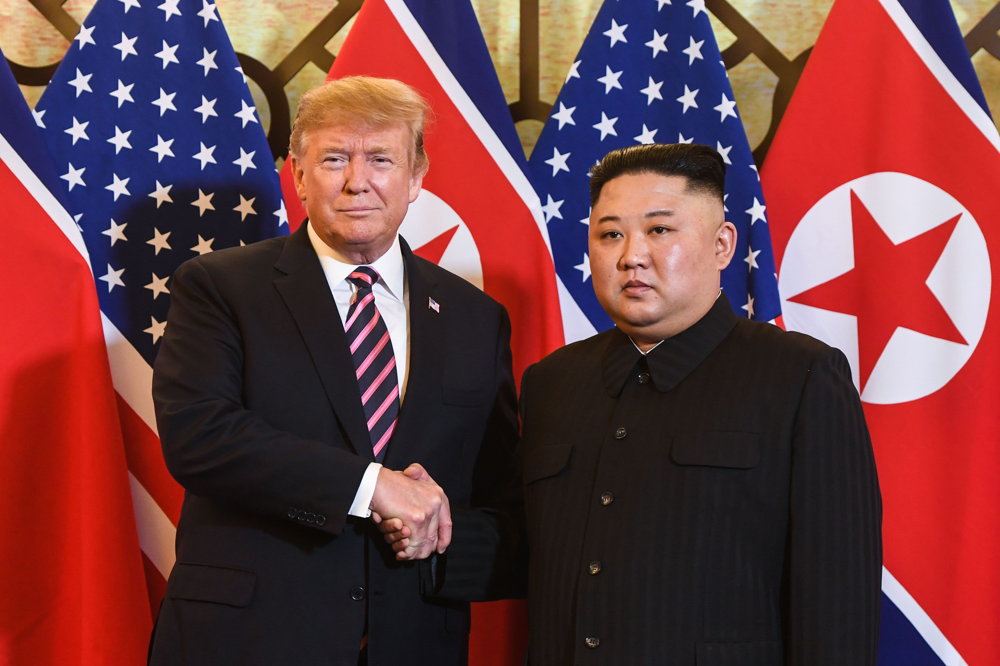
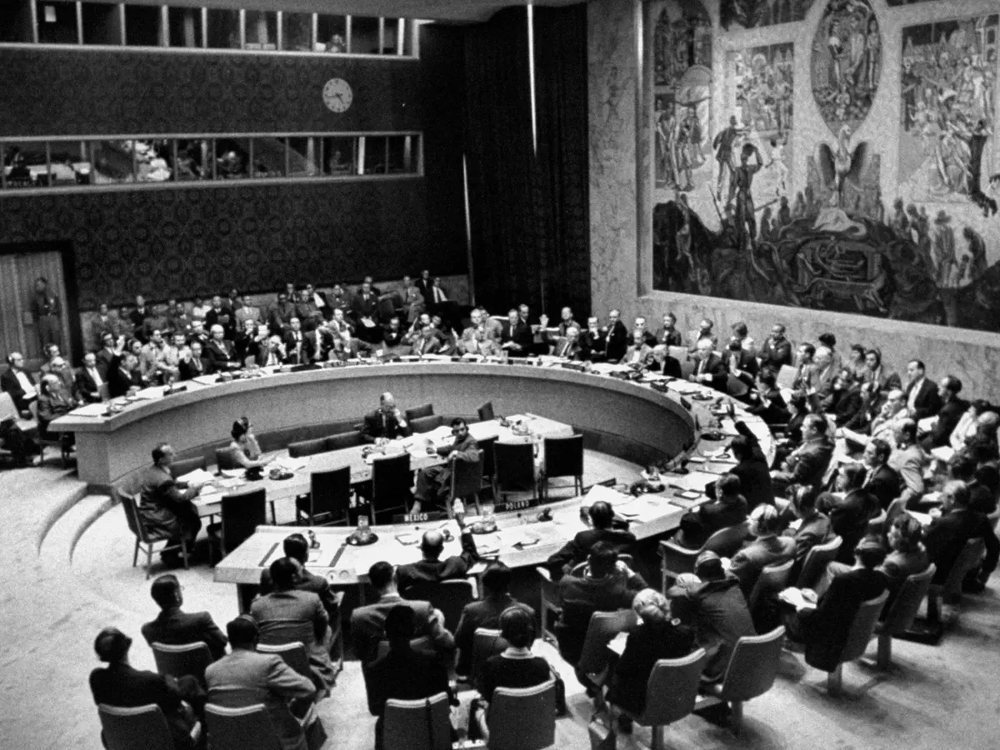
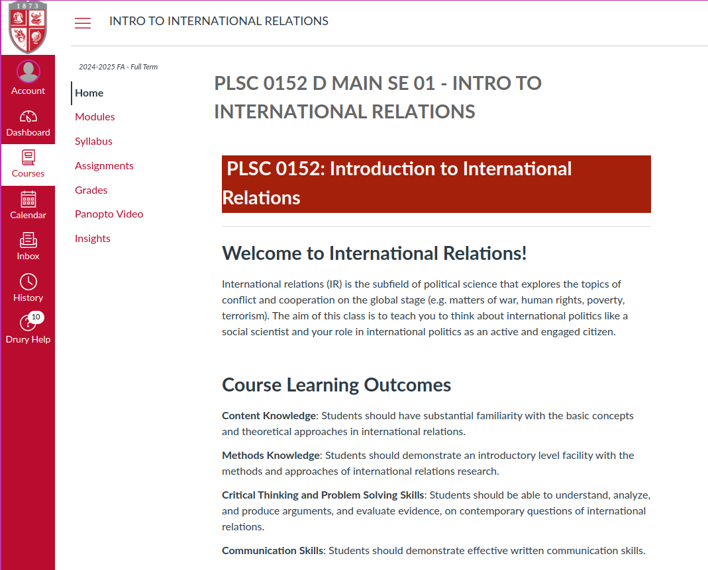
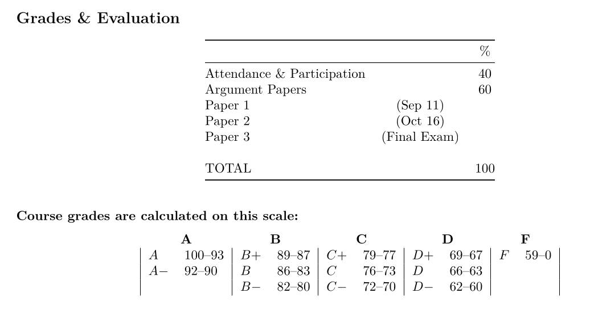
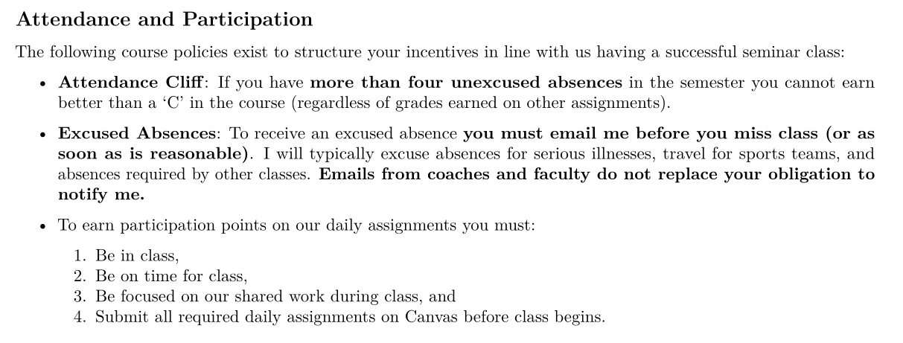

## Intro to International Relations {background-image="./Images/background-worldmap4.png" .center}

```{r}
# background-size="1920px 1080px"
library(tidyverse)
library(readxl)
```

<br>

<br>

Make a list of **positive** and **negative** things the US has done on the world stage in the last 10 years.

<br>

<br>

::: r-stack
Justin Leinaweaver (Fall 2026)
:::

::: notes
Prep for Class

1. Update attendance list before class

2. Make sure this week's modules visible in Canvas

<br>

*As students come in*

Welcome all.

- Sit down, introduce yourself to the people around you and get chatting about my prompt on the board.

- Build two lists as a group!

<br>

*ON BOARD*

### Ok, what is on your lists?

- SHARE and DISCUSS

<br>

**SLIDE**: Let's make sure we're all in the right place!
:::


##  {background-image="Images/background-worldmap4.png"  .center}

::: {.r-fit-text}

1. Name

2. Year in school

3. Major

4. Primary source(s) of news

:::

::: notes

My aim with this last one is to get a sense for where your inputs come from

- If good science depends on measuring the world, let's see what data you are all working with!

<br>

1. Name: I'm Dr. Leinaweaver.

2. Year in school: 15th year at Drury

3. Major: Political scientist with primary research interests in international policy-making and problem-solving

4. News: Wall Street Journal, NY Times, and Foreign Policy

<br>

**SLIDE**: Back to the board!
:::


## On balance, has the US been a net positive or negative influence on the world over the last 10 years? {background-image="Images/background-worldmap4.png" .center}

::: notes

All of this adds up to a big, tough to handle question.

- I don't want to pretend our lists on the board are comprehensive or that this question isn't crazy reductive.

<br>

However, I'd like to take this opportunity to get a sense of how our class thinks about the role of the US in the world BEFORE we start our work this semester.

### So, what do you think?

:::


## {background-image="Images/01_1-international-certificate.jpg"}

::: notes

Welcome to International Relations (IR).

<br>

Our job this semester is to analyze "politics" happening at the international level.

<br>

And, what does that mean? 

- **SLIDE**: We'll explore this task by dividing our semester into four sections

:::


## Semester Outline: Section 1 {background-image="Images/background-worldmap4.png" .center}

<br>

::: {.r-fit-text}

**Arguments, Evidence and International Relations**

- Making logical arguments,

- Testing those arguments scientifically, and

- Learning to think in terms of models

:::

::: notes

Section 1 sets us up for the semester.

- Here we learn the basic structure we will use for making and evaluating arguments in this class

<br>

This means learning to study politics "scientifically"

- Which is a whole other can of worms...

<br>

Once this is done we can start digging into the BIG questions that inspired the creation of international relations

- **SLIDE**: Such as...

:::


## {background-image="Images/01_1-Putin.jpg"}

::: notes

**Anybody recognize this fella?**

- (President of Russia Vladimir Putin)

<br>

**And what country did old Vladdy launch an invasion of most recently?**

- (SLIDE: Poor Ukraine)

:::


## {background-image="Images/05_2-putin_ukraine.jpg"}

::: notes

**From what you've heard, why did Russia invade Ukraine?**

<br>

*ON BOARD: Putin Invades Ukraine*

- Power? 
- Personality? 
- Territory/Resources? 
- Threats from Alliances?

<br>

**SLIDE**: One more time!

:::


## {background-image="Images/01_1-Trump_war_Iran.webp"}

::: notes

**From what you've heard, why did President Trump launch a war with Iran?**

<br>

*ON BOARD: Trump Attacks Iran*

- Power? 
- Personality? 
- Territory/Resources? 
- Threats from Alliances?

<br>

**SLIDE**: Section 2 of the class

:::


## Semester Outline: Section 2 {background-image="Images/background-worldmap4.png" .center}

<br>

**Why Are There Wars?**

{style="display: block; margin: 0 auto"}

::: notes

In Section 2 of our we explore the grand-daddy of all IR research questions.

- Why Are There Wars?

<br>

**When we compare these two lists do we see any similarities?**

<br>

**What are the key differences?**

<br>

**Is this a "good" list if our aim is to be able to explain where wars are likely to start in the future?**

- **In other words, would knowing just these things about a random country help you predict the likelihood of war? Why or why not?**

<br>

**SLIDE**: Let's kick off our next question with another world leader

:::


## {background-image="Images/01_1-Kim_Jong_Un.jpg"}

::: notes

**And who is this handsome fella?**

- (Kim Jong Un, the dear leader of the Democratic People's Republic of Korea)

<br>

**And why is the world annoyed and scared of this guy?**

- (**SLIDE**: Dude has nukes and seems to be a little nuts)

:::


## {background-image="Images/01_1-kim-jong-un-nukes.jpg"}

::: notes

**Anybody know how many nukes North Korea is estimated to have currently?**

- (Per the Arms Control Association:)

    - North Korea is estimated to have assembled 50 nuclear warheads, as of January 2024, and
    
    - They have enough fissile material for an estimated 70-90 MORE nuclear weapons

<br>

Making this choice has led North Korea to be cut off from basically all international trade and opportunities for growth.

- The country is cartoonishly impoverished and the people outside the elite suffer massively.

<br>

**Why on Earth would a country's leadership choose to impoverish themselves in order to develop a weapon they couldn't ever possibly use without inviting their own destruction?**

<br>

**SLIDE**: Section 3 research question

:::


## Semester Outline: Section 3 {background-image="Images/background-worldmap4.png" .center}

```{r, fig.align='center'}

```

::: {.r-fit-text}
Why is it so Hard to Cooperate With Other Countries?
:::

::: notes

In Section 3 of the class we ask why is it so Hard to Cooperate with Other Countries?

<br>

Most countries would prefer to live in a world where Iran stops doing all this destabilizing stuff, but for so many reasons it's hard to get to that world!

- We have a good start here to mapping out the challenges of cooperation when the stakes are so high!

<br>

**SLIDE**: Last photo quiz!

:::


## {background-image="Images/01_1-Yalta-Conference.jpg"}

::: notes

**Who are these three gentlemen and what are we looking at here?**

- Churchill, FDR and Stalin at the Yalta Conference

- The Yalta Conference held in 1945 in Crimea is where the winning powers of WW2 got together to plan the future of Europe.

<br>

Clearly the world has changed a lot since 1945.

- For one thing, we now have color photographs!

<br>

**How much has the world changed since 1945?**

- **What are the biggest differences between today and 1945?**

:::


## Semester Outline: Section 4 {background-image="Images/background-worldmap4.png" .center}

```{r, fig.align='center'}

```

::: {.r-fit-text}
What is the Future of Transnational Politics and IR?
:::

::: notes

Here's the thing, most of the world's international infrastructure was designed at the end of WWII

- The United Nations was designed to maintain peace 

- The International Court of Justice was designed to help countries settle disputes without fighting

- The World Bank was designed to reduce poverty and promote long-term economic development

- The International Monetary Fund was designed to do a bunch of stuff related to promoting trade and growth

<br>

Basically all of these, and more, were founded in around 1944/1945

<br>

In Section 4 of the class I want us to ask if 80 years later these institutions are still adapted well to the complexities of today

- If not, what do we do about it?

:::


## Semester Outline {background-image="Images/background-worldmap4.png" .center}

<br>

::: {.r-fit-text}

1. Arguments, Evidence and International Relations

2. Why Are There Wars?

3. Why is it so Hard to Cooperate With Other Countries?

4. What is the Future of Transnational Politics and IR?
:::

::: notes

Alright, so that's our plan for the semester.

<br>

**Questions on this?**

:::


## {background-image="Images/01_1-newspapers.jpg"}

::: notes

We will kick off most classes with current events discussions.

- This REQUIRES you to follow global news!

<br>

**Part of your job in this class is to keep up with international current events!**

- Skim the international section of a good news site everyday.

- Let's make sure we always have current events we can draw on in our discussions!

<br>

**SLIDE**: Everybody now log into our class page on Canvas

:::


## All Supporting Material is on Canvas  {background-image="Images/background-worldmap4.png"  .center}

```{r, fig.align='center'}

```

::: notes

Everything you need to succeed in this class is hosted on our class Canvas page

- All the readings,

- All the assignments,

- All your grades, and

- All of our class policies are in the syllabus

<br>

**SLIDE**: Let me make sure to draw your attention to some of the important class policies in the syllabus

:::


## The answer is in the syllabus (part 1) {background-image="Images/background-worldmap4.png" .center}

<br>

::: {.r-fit-text}
::: {.incremental}

**Learning Outcomes**

- LO 1: The big ideas and basic definitions of the field

- LO 2 & 3: To use the tools of social scientists

- LO 4: To write convincing arguments
:::
:::

::: notes

First page of the syllabus lists our learning outcomes for the semester

- Let me simplify them for you.

<br>

1. Content Knowledge
    - Learn the big ideas and basic definitions you need to explain international political events.

2. Methods Knowledge
    - Learn to use the tools of social scientists for analyzing international political events.

3. Critical Thinking & Problem Solving Skills
    - Practice applying social science tools to solve big problems and answer important questions.

4. Communication Skills
    - Practice writing logical, clear, credible and critical arguments so good that they will convince smart people you are right!

<br>

### Everybody good with these?

<br>

**SLIDE**: Your final grade

:::


## The answer is in the syllabus (part 2) {background-image="Images/background-worldmap4.png" .center}



::: notes

Final grade is a mix of written papers and daily participation assignments that help to get you ready for our daily seminar

<br>

**Any questions on the big picture here?**

<br>

**SLIDE**: Let's unpack what I mean when I call this a seminar

:::


## The answer is in the syllabus (part 3) {background-image="Images/background-worldmap4.png" .center}



::: notes

Everybody read these points and then let's discuss them.

<br>

**Any questions about the attendance cliff?**

- If you're not in class then I can't ensure you make progress on our LOs

<br>

**Any questions about how to request an excused absence?**

- Coaches emails DO NOT cover you!

<br>

**Any questions about the participation points policy?**

<br>

**SLIDE**: Syllabus part 4

:::


## The answer is in the syllabus (part 4) {background-image="Images/background-worldmap4.png" .center}

{style="display: block; margin: 0 auto"}

::: notes

You may not use any AI tools in this class. 

- Any AI use will be treated as plagiarism.

<br>

That means: 

- No AI search

- No AI summaries of articles or books

- No AI for outlining or writing

- No AI for data analysis

- No AI to simply clean up your grammar (e.g. Grammarly).

<br>

Think of this class like training to play a sport

- The time you spend in the gym getting stronger and more flexible makes you a better athlete regardless of the sport you end up playing. 

- That's what we're doing in this class when we learn to critically analyze texts and become better writers.

- I'm getting you ready to succeed out in the real world

- Using AI tools is like bringing a forklift into the weight room. Yeah, you lifted the weights, but it was a waste of your time.

<br>

Other key point: Lots of people are worried about AI taking their jobs, e.g. replacing them in the workforce. 

- If you use AI to do your thinking for you then you are literally replacing yourself with AI

- You are setting yourself up with skills that are basically without value

<br>

So, let's not waste this opportunity working together this semester

- Let's get stronger and be better adapted to whatever the world looks like when you graduate

<br>

**Questions on this policy?**

<br>

**SLIDE**: Next class

:::


## For Next Class {background-image="Images/background-worldmap4.png" .center}

<br>

### Check the syllabus and Modules page for the readings and the discussion assignment.


::: notes
Readings and an assignment for next class

1. The readings: I am giving you the Labossiere reading on logical arguments and two op-eds for us to unpack

2. The pre-class assignment: I have found that requiring these pre-class questions sets us up for much livelier engagement in class!

    - Plus makes tracking participation points easier!

<br>

**Questions on what I'm asking you to do?**

- NOTE: The forum closes BEFORE class starts (9:59 am) so make sure to get these in!

<br>

Welcome to the class and let me know if you have any questions!
:::
