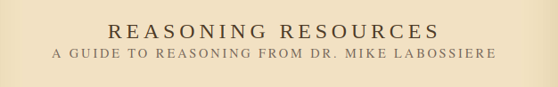
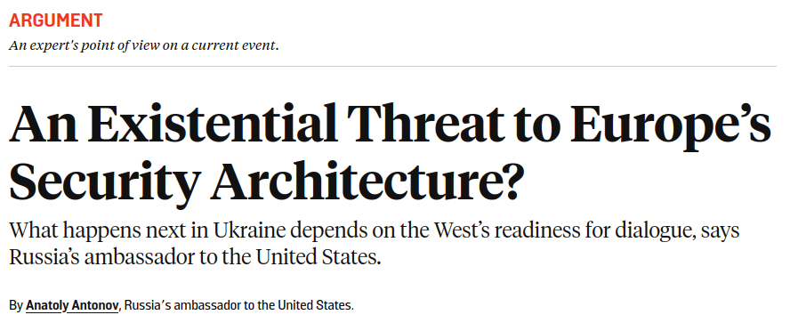
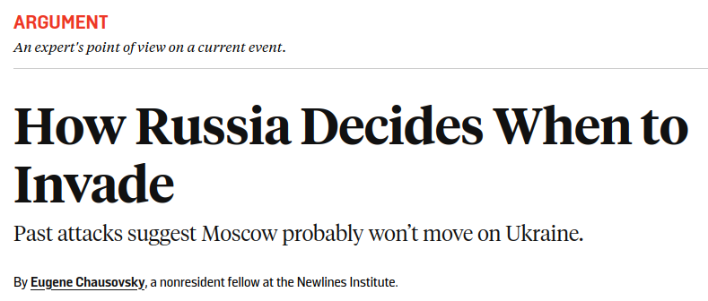

---
output:
  xaringan::moon_reader:
    css: ["default", "extra.css"]
    lib_dir: libs
    seal: false
    nature:
      highlightStyle: github
      highlightLines: true
      countIncrementalSlides: false
      ratio: '16:9'
---

```{r, echo = FALSE, warning = FALSE, message = FALSE}
##xaringan::inf_mr()
## For offline work: https://bookdown.org/yihui/rmarkdown/some-tips.html#working-offline
## Images not appearing? Put images folder inside the libs folder as that is the main data directory

library(tidyverse)
library(readxl)
library(stargazer)
##library(kableExtra)
##library(modelr)

knitr::opts_chunk$set(echo = FALSE,
                      eval = TRUE,
                      error = FALSE,
                      message = FALSE,
                      warning = FALSE,
                      comment = NA)
```

class: slideblue

.size70[**Today's Agenda**]

<br>

.size50[

1. What are the characteristics of a "good" argument?

2. Evaluating the arguments in our op-eds

]

<br>
<br>

.center[.size40[
  Justin Leinaweaver (Spring 2022)
]]

???

## Prep for Class
1. ...

<br>

* Opening Discussion *

ANYTHING INTERESTING GOING ON IN WORLD POLITICS AT THE MOMENT?

<br>

EVERYBODY HAVE THE READINGS FOR TODAY?


---

background-image: url('libs/Images/01_2-Girl_yells_yak.jpg')
background-size: 100%
background-position: center

???

Let's start by talking about argument quality.

Bad arguments are everywhere and are common in the political arena.

HOW DO EACH OF YOU JUDGE WHETHER AN ARGUMENT IS "GOOD" OR "BAD"?
(Ultimately, the judge of an argument's quality is whether or not it convinces people of its thesis.)

WHAT IS A THESIS?
(The central idea of your argument.)
- The thing you want people to take away from it.

<br>

WHEN WAS THE LAST TIME IN YOUR LIFE SOMEONE CHANGED YOUR MIND ABOUT SOMETHING WITH AN ARGUMENT?

- EXAMPLES?

- HOW SPECIFICALLY DID THEY DO IT? CERTAIN STRATEGIES EMPLOYED?

* ON BOARD? *

<br>

While being "convincing" is the goal, that's also a subjective test of quality.

In academia we have developed criteria that we argue are necessary for an argument to be convincing.
 
 

---

background-image: url('libs/Images/background-slate_v2.png')
background-size: 100%
background-position: center
class: middle, center

.size80[**To be convincing an argument should be .textred[logical, clear, credible] and .textred[critical].**]

???

In academic terms, "being convincing" means being logical, clear, credible and critical.

For the important arguments in our lives, concerning the issues we care most about, people demand you put in some serious work to shift their position.

<br>

Let's talk through each of these elements.

This is the rubric I use when grading argument papers in my classes.


---

background-image: url('libs/Images/background-slate_v2.png')
background-size: 100%
background-position: center
class: middle

.size50[.textred[**Logical**] arguments support their conclusion with well specified premises.]

--

.size50[.textred[**Clear**] arguments are easy to read & understand.]

--

.size50[.textred[**Credible**] arguments use high quality evidence and include proper citations.]

--

.size50[.textred[**Critical**] arguments acknowledge the limitations of our evidence and address counter-arguments.]

???

Everybody take a moment to read this.

These details are in the syllabus.

Please keep these elements in mind as you write for this class.

<br>

WHAT QUESTIONS DO YOU HAVE ABOUT THIS RUBRIC?

WHICH ELEMENTS NEED MORE EXPLANATION?


---

background-image: url('libs/Images/background-slate_v2.png')
background-size: 100%
background-position: center
class: middle

.size60[**Argument Basics**]

```{r, fig.align='center', out.width='75%'}

```

<br>

.size60[Conclusion?]

???

During the course of the semester we will spend time exploring each of these criteria.

For today our focus is primarily on logic and clarity.

SLIDE

Open up the Labossiere reading and tell me:

1. WHAT IS A CONCLUSION?
(This is the claim that is supposed to be supported by the premises.)

--

.size60[Premises?]

???

2. WHAT IS A PREMISE?
(A premise is a claim given as evidence or a reason for accepting the conclusion.)

--

.size60[Inductive arguments?]

???

In this class, and throughout the social sciences, we tend to rely on inductive rather than deductive validity as our test of logic.

3. HOW DO I KNOW IF AN INDUCTIVE ARGUMENT IS LOGICAL?
(If we accept the premises as true then the conclusion is likely to be true.)
(- By these terms, inductive arguments are either strong or weak.)

<br>

For the rest of today we're going to explore an important question AND practice two skills we will use a TON this semester.

1. Diagramming arguments and 2. evaluating the strength of their logic


---

background-image: url('libs/Images/background-slate_v2.png')
background-size: 100%
background-position: center
class: middle, center

```{r, fig.align='center', out.width='95%'}

```

<br>

.size50[Identify the .textblue[**four most important premises**] in this argument.]

???

Let's start with the argument from Mike Hayes in Time Magazine.

* ON 1/2 BOARD *

WHAT'S THE CONCLUSION TO THIS ARGUMENT?
(Therefore, Biden's withdrawal, no matter how messy, is the right choice)

<br>

EVERYBODY TAKE A FEW MINUTES ON YOUR OWN TO IDENTIFY THE KEY PREMISES IN THIS ARTICLE.

One way to think about finding the premises is to look at the structure of the article itself. 

Each paragraph should advance the argument in a useful way.

Describing the aim of the paragraph is one way to identify what the author thinks is important to her argument.

<br>

COMPARE ARGUMENT DIAGRAMS WITH THE PERSON NEXT TO YOU.

<br>

TIME FOR PREMISES!

* Call on people, chance to learn names *

(- Wars always require some political settlement to end them)
(- Combat in Afghanistan has been going on for a long time at significant cost)
(- HUGE investment means the Afghan military is far more capable than when we got there and the region is less threatening to the Afghan government)
(- Huge opportunity costs to remaining, we need our flexibility and prep time for the newer and bigger threats.)
(- Keeping even a small force in Afghanistan is way more costly than you'd think)
(- We must fight against the sunk costs fallacy)
(- The Afghan government won't do what is necessary as long as we are there running things)
(- The Taliban is not a regional threat)
(- We face serious transnational threats elsewhere)

<br>

LET'S TIGHTEN THIS UP, ANY PREMISES WE CAN COMBINE? ANY WE SHOULD REMOVE?

ARE WE HAPPY WITH THIS DIAGRAM OF THE ARGUMENT?
- HAVE WE COVERED THE MAIN POINTS?

ARE WE CONVINCED WE GOT THE CONCLUSION RIGHT?

<br>

Time to analyze the logic!
- BY THE TERMS OF INDUCTIVE REASONING, IS THIS A STRONG OR WEAK ARGUMENT?
- MAKE YOUR CASE!

Remember, this is different from asking if it is convincing.
- Not about evidence, just logic!


---

background-image: url('libs/Images/background-slate_v2.png')
background-size: 100%
background-position: center
class: middle, center

```{r, fig.align='center', out.width='95%'}

```

<br>

.size50[Identify the .textblue[**four most important premises**] in this argument.]

???

Let's repeat this exercise on The Washington Post opinion argument by Max Boot.

* ON 1/2 BOARD *

WHAT'S THE CONCLUSION TO THE ARGUMENT?
(Therefore, Pres Biden must rapidly send US forces back into Afghanistan)

EVERYBODY TAKE 5 MINUTES ON YOUR OWN TO DIAGRAM THE REST OF THE ARGUMENT.

<br>

COMPARE ARGUMENT DIAGRAMS WITH THE PERSON BESIDE YOU.

<br>

* On 1/2 the board *

TIME FOR PREMISES!
* Call on people, chance to learn names *

(- The situation in Afghanistan is bad and getting worse)
(- Taliban targeting government officials)
(- Civilian casualties on the rise, refugee numbers increasing)
(- Biden administration making delusional arguments to do nothing)
(- Taliban doesn't care about international legitimacy or making peace with neighbors)
(- Taliban not even respecting the terrible deal negotiated by Trump's team)
(- Afghan forces cannot stand on their own.)

<br>

LET'S TIGHTEN THIS UP, ANY PREMISES WE CAN COMBINE? ANY WE SHOULD REMOVE?

ARE WE HAPPY WITH THIS DIAGRAM OF THE ARGUMENT?
- HAVE WE COVERED THE MAIN POINTS?

ARE WE CONVINCED WE GOT THE CONCLUSION RIGHT?

<br>

Time to analyze the logic!
- BY THE TERMS OF INDUCTIVE REASONING, IS THIS A STRONG OR WEAK ARGUMENT?
- MAKE YOUR CASE!

<br>

ON BALANCE, WHICH ARGUMENT DO YOU FIND MORE CONVINCING? WHY?


---

background-image: url('libs/Images/background-blue_triangles.jpg')
background-size: 100%
background-position: center
class: middle

.size60[**For Monday**]

.size40[
Donovan, T., & Hoover, K. (2014). "The Elements of Science." In *The Elements of Social Scientific Thinking*.

+ What is science?

+ What is theory?

+ Can political science really be a "science"?
]
