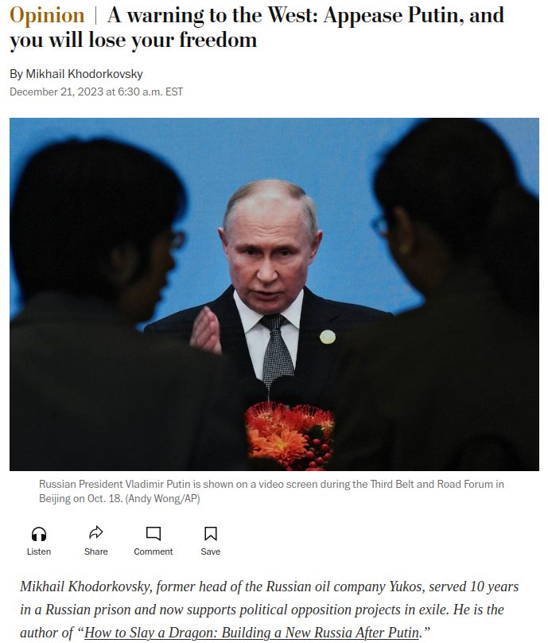
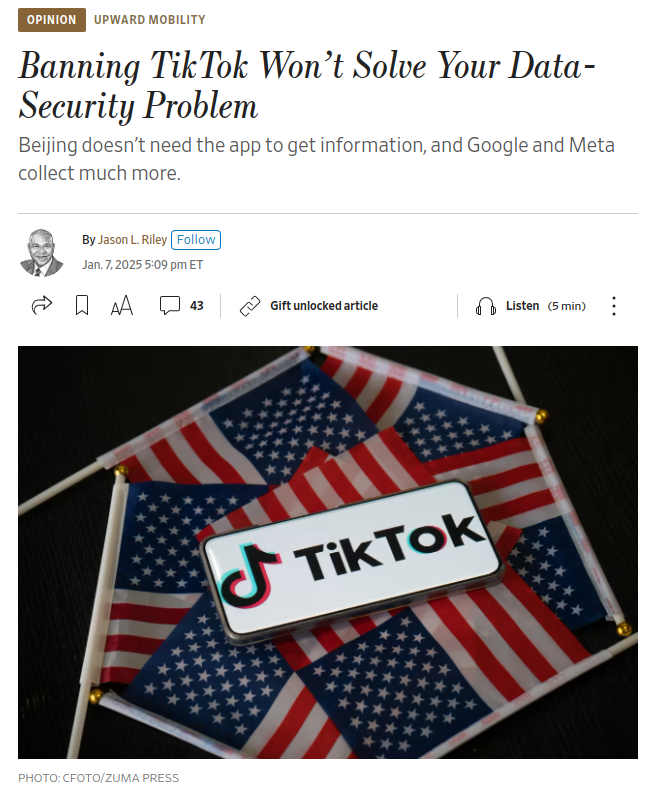

## Today's Agenda {background-image="Images/background-worldmap4.png" .center}

```{r}
# background-size="1920px 1080px"
library(tidyverse)
library(readxl)
```

<br>

::: {.r-fit-text}

**I. Arguments, Evidence and International Relations**

1. The elements of effective arguments
    
2. Evaluating our examples

:::

<br>

::: r-stack
Justin Leinaweaver (Spring 2025)
:::

::: notes
Prep for Class

1. Review Canvas submissions

2. Readings
    - Labossiere (2008) on the logic of arguments
    - [Kohdorkovsky (2023)](https://www.washingtonpost.com/opinions/2023/12/21/warning-west-putin-appeasement-russia/) on not appeasing Putin
    - [Riley (2025)](https://www.wsj.com/opinion/banning-tiktok-wont-solve-your-data-security-problem-supreme-court-case-869877cd) on banning TikTok

<br>

Welcome back all!

<br>

**Before we dive in, any questions on the syllabus?**

- Attendance cliff?

- Participation assignments?

- etc?
:::


## Unpacking an Argument {background-image="Images/background-worldmap4.png"  .center}

{style="display: block; margin: 0 auto"}

::: notes
**Before we talk about the arguments themselves, how did the task go for you?**

- **How often have you been asked to do this kind of exercise before?**

<br>

**SLIDE**: Let's start by talking about the quality of an argument.
:::


## {background-image="Images/01_2-Girl_yells_yak.jpg"  .center}

::: notes

Bad arguments are everywhere and are common in the political arena.

- In fact, when you say "politics" I think many people's minds go to something like this.

- Clearly this is not what we aspire to.

<br>

**How do you, personally, judge whether an argument is "good" or "bad"?**

- **In other words, in your mind what are the characteristics of a good argument?**

<br>

In academic terms, our definition of a good argument tends to focus on whether it convinces you of its thesis

- **What is a thesis?**

    - (The central idea of your argument.)
    
    - The thing you want people to take away from it.

<br>

**When was the last time in your life someone changed your mind about something with an argument? Examples?**

<br>

**How specifically did they do it? Certain strategies employed?**

<br>

While being "convincing" is the goal, that's also a subjective test of quality.

- In academia we have developed criteria that we argue are necessary for an argument to be convincing.

:::
 

## To be convincing an argument should be logical, clear, credible and critical {background-image="Images/background-worldmap4.png" .center}

::: notes

For the important arguments in our lives, concerning the issues we care most about, people demand you put in some serious work to shift their position.

<br>

Let's talk through each of these elements.

- FYI this is the rubric I use when grading argument papers in my classes.
:::


## To be convincing an argument should be logical, clear, credible and critical {background-image="Images/background-worldmap4.png" .center}

::: {.incremental}
- **Logical** arguments support their conclusion with well specified premises.

- **Clear** arguments are easy to read & understand.

- **Credible** arguments use high quality evidence and citations.

- **Critical** arguments acknowledge the limitations of evidence and address counter-arguments.
:::

::: notes

The rubric is in the syllabus so you can consult it as you write and revise for this class.

- The key is, a convincing academic argument must do ALL FOUR OF THESE THINGS well.

<br>

**What questions do you have about this rubric?**

- **Which elements need more explanation?**

<br>

During the course of the semester we will spend time exploring each of these criteria.

- For today our focus is primarily on logic and clarity.
:::


## Argument Basics {background-image="Images/background-worldmap4.png" .center}

{style="display: block; margin: 0 auto"}

::: {.incremental}
- Conclusion

- Premise

- Inductive Arguments
:::

::: notes
I want to use the Labossiere reading to highlight the key components of a high quality argument.

- Again, these are the elements you will need to write papers and make arguments in this class.

<br>

**REVEAL: According to Labossiere (2008), what is the conclusion of an argument?**

+ (This is the main point of the argument, e.g. the thesis or key takeaway)

<br>

**REVEAL: According to Labossiere (2008), what is a premise?**

+ (A premise is a claim given as evidence or a reason for accepting the conclusion.)

- So, the basic structure of every logical argument is a series of premises that support a conclusion.

<br>

REVEAL: Induction represents how we think about the quality of the connection between our premises and our conclusion.

- In this class, and throughout the social sciences, we tend to rely on inductive reasoning.

- This is a form of reasoning that moves from the specific to the general

- e.g. An argument that provides a series of empirical observations that all support a more general conclusion
    
<br>

**SLIDE**: Let's look at some examples
:::


## Inductive Arguments {background-image="Images/background-worldmap4.png" .center}

**From the Specific to the General**

<br>

::: {.incremental}
- In the summer, there are ducks on our pond. Therefore, summer will likely bring ducks to our pond.

- Every cat that you've observed purrs. Therefore, most cats must purr.

- All the children in this daycare center like to play with Lego. Therefore, all children probably like to play with Lego.
:::

::: notes
REVEAL x 3

<br>

**Does everyone see how each of these arguments build from a specific premise to a general conclusion?**

- Inductive arguments use specific premises to support a more general conclusion

- Inductive arguments often use indicator words: probably, likely, tends to, etc

- Inductive arguments often make claims about the future based on the way things have typically happened in the past

<br>

**Questions on the basic structure of an inductive argument?**

:::


## Inductive Arguments {background-image="Images/background-worldmap4.png" .center}

**Quality: Weak to Strong**

<br>

- In the summer, there are ducks on our pond. Therefore, summer will likely bring ducks to our pond.

- Every cat that you've observed purrs. Therefore, most cats must purr.

- All the children in this daycare center like to play with Lego. Therefore, all children probably like to play with Lego.

::: notes

Inductive arguments can also be classified along a continuum of weak to strong.

<br>

A "strong" inductive argument "succeeds in having its conclusion be probably true, given the truth of the premises" ([Critical thinking book](https://iu.pressbooks.pub/shockeyphilp102summer/chapter/inductive-arguments/)).

- In other words, if we assume these premises are true is the conclusion more likely to be true.

<br>

**Are all of these "strong" inductive arguments? Why or why not?**

- (Yes!)

<br>

**Are these convincing arguments? Why or why not?**

- **What could you add to each to make them more convincing?**

<br>

Keep in mind: strong inductive arguments DOES NOT MEAN convincing!

- You're making an educated or informed guess based on the information or data that you have.

- No amount of supporting observations can EVER prove an inductive argument.
    - It's all about strength of the argument, never certainty
    
:::


## To be convincing an argument should be logical, clear, credible and critical {background-image="Images/background-worldmap4.png" .center}

<br>

::: {.r-fit-text}

The Components of a Logical Argument:

+ Conclusion

+ Premise(s)

+ Inductive Reasoning (in this class)
:::

::: notes

So, this represents the crux of the "logic" portion of our class writing rubric.

<br>

The arguments you make in this class must be logical and that means they are:

- Designed to advance a single, clear conclusion,

- Built upon clear, well supported premises, and

- Inductively strong.

<br>

**Questions on any of this?**

<br>

**SLIDE**: Let's apply these elements to the arguments I had you evaluate before class.
:::


## {background-image="Images/background-worldmap4.png" .center}

{style="display: block; margin: 0 auto"}

::: notes

Ok, the first argument we need to evaluate was written by Mikhail Khodorkovsky. [BBC Profile](https://www.bbc.com/news/world-europe-12082222)

- He is the former head of the Russian oil company Yukos

- Once ranked as high as 15th on the Forbes global wealth list with a net worth approaching $15 billion

- After he began financially supporting opposition parties in Russia he was charged with tax evasion and embezzlement 

- Ended up serving 10 years in a Russian prison

- He now supports political opposition projects in exile

<br>

**ALWAYS important to think about who is making the argument and what motivates them!**

<br>

**Before digging into the argument itself, anything about this source we should keep in mind? Any concerns?**
:::


## {background-image="Images/background-worldmap4.png"}

::: {.r-fit-text}
What is the conclusion of this argument?
:::

{style="display: block; margin: 0 auto"}

::: notes

Let's start by identifying the central conclusion in the argument.

- Remember, he's chosen to publish this in an American newspaper

- He's speaking directly to us, so consider that as you think about the many different pieces of the essay

<br>

**So, what's the conclusion of his argument?**

- **What is he trying to convince us to do?**

- (**SLIDE**)
:::


## {background-image="Images/background-worldmap4.png"}

{style="display: block; margin: 0 auto"}

Therefore, the US must increase its financial and military support for Ukraine immediately (and stop any consideration of negotiations or ceasefires).

::: notes

This represents my summary of the central argument here.

- As I said, he covers a lot of ground in this essay so we may slightly differ on what we each think is central.

<br>

**Everybody ok with using this as our target?**

- **Any tweaks needed?**

<br>

**Per the Labossiere reading and the argument rubric for our class, what do we need to evaluate?**

<br>

We have to evaluate the Logic, Clarity, Credibility and Critical Analysis in the argument.

- **SLIDE**: Let's build up to this.
:::


## {background-image="Images/background-worldmap4.png"}

{style="display: block; margin: 0 auto"}

Identify the **three most important premises** in this argument

::: notes

Take a few minutes on your own to identify the three most important premises in the article.

- Try to think about this from a 30,000 foot view
- What are the big reasons he gives to support the conclusion?
- Each paragraph in the argument either reveals a premise or explains and supports a premise.
- Your first job is to find the premises.

<br>

**Questions?**

Let's get to it!

<br>

Compare your list of premises to the person next to you.

<br>

Alright, let's get ideas up *ON THE BOARD*

- *Call on people, chance to learn names*

- **SLIDE**: My version

<br>

**Notes**

- Putin is an "expansionist fascist dictator"
- Appeasing an expansionist cannot work, they will continuously increase their demands
- Putin invaded, Ukraine because it was developing into a vibrant democracy aligned with European values
- Western support for Ukraine is only at the level that keeps it from losing but is not enough for it to win
- Congress delaying the latest aid package is purely about politics and not American interests
- Peace talks or negotiations with Putin reward expansionist behavior and will lead to future attempts at expansion by the Russians.
- Future attempts at expansion by the Russians will almost inevitably hit a NATO country.
- The success experienced by Western countries over the last 400 years is due to our embrace of freedom (trade, expression, ideas)
- The problem is that the success we have experienced in the West making our lives much more comfortable is that we no longer have an appetite for the sacrifices required to defend freedom.
- There are a number of examples of the West's inaction in the face of attacks on freedom. 
- Western inaction has emboldened the enemies of freedom EG China, Russia, Iran, Hamas,...
- Defeating Putin in Ukraine will accelerate his defeat as leader of Russia.
- If we don't act now, provide money and arms to Ukraine, we will be forced to sacrifice our children in a war to stop the next expansion by Russia and its allies.
- Therefore, the US must increase its financial and military support for Ukraine immediately (and stop any consideration of negotiations or ceasefires).
:::


## {background-image="Images/background-worldmap4.png" .center}

- Putin is an "expansionist" which means he will not stop at Ukraine's border

- Peace talks and negotiations reward Putin's expansionist tendencies

- The inaction of the "West" in the face of threats is encouraging enemies of freedom around the world 

- If we don't act now to defend Ukraine (arms and money) we will be forced to fight in the future

Therefore, the US must increase its financial and military support for Ukraine immediately (and stop any consideration of negotiations or ceasefires).

::: notes
**Per the rubric, are these premises clear?**

**Is the argument inductively logical? Why or why not?**

<br>

Let's talk evidence.

**What evidence does the author provide to support the first premise?**

- **Is it high quality and cited appropriately?**

*Repeat for each additional premise*

<br>

The final element of the rubric is critical analysis.

**Is there any critical analysis in the argument (e.g. counter-arguments or acknowledging limitations in evidence)?**

<br>

Ok let's talk.

**Are you convinced by this argument? Why or why not?**

<br>

**Any questions on the procedure for diagramming and evaluating an academic argument?**

- **SLIDE**: Let's practice this again!
:::


## {background-image="Images/background-worldmap4.png" .center}

{style="display: block; margin: 0 auto"}

::: notes

Our second argument comes from Jason Riley, an opinion columnist at The Wall Street Journal

<br>

**Before digging into the argument itself, anything about this source or type of source we should keep in mind?**

- **Any concerns?**

<br>

I typically avoid "opinion columnists" at ALL COSTS. Life is too short to read ill-informed hot takes

- HOWEVER, this makes it an excellent target for our critique!
:::


## {background-image="Images/background-worldmap4.png" .center}

{style="display: block; margin: 0 auto"}

::: {.r-fit-text}
What is the **conclusion** in this argument?
:::

::: notes

Just as we did before, let's start by identifying the conclusion.

<br>

**What is the conclusion to this argument?**

- **What is he trying to convince us to believe?**
:::


## {background-image="Images/background-worldmap4.png" .center}

{style="display: block; margin: 0 auto"}

::: {.r-fit-text}
Therefore, the US government should not ban TikTok.
:::

::: notes

**Everybody ok with using this as our target?**

- **Any tweaks needed or requested?**

:::


## {background-image="Images/background-worldmap4.png"}

{style="display: block; margin: 0 auto"}

Identify the **three most important premises** in this argument

::: notes

Alright, 30,000 foot view.

**What are the key premises in this argument?**

- *if enough time have them work on their own or in pairs first.*

- *ON BOARD*

<br>

**SLIDE**: My version

**Notes**

- Democrats use TikTok during campaigns so it can't be that "grave" a security threat
- Trump has grown to like TikTok as his "views" on the app grew
- Law passed to force a sale of, or ban, TikTok was bipartisan
- Courts are unlikely to overturn the law as it is written (the federal government has a compelling national-security interest in preventing a foreign adversary from harvesting the personal data of 170 million Americans)
- It is "worrisome" that Congress acted also to prevent “misinformation,” “propaganda,” and “divisive narratives” which are subjective
- HOWEVER, TikTok isn't the only social media site plagued by misinformation (and isn't even the only Chinese owned site with the issue)
- Banning TikTok is "security theater": Google and Meta do way more data collection and sell the info globally

:::


## {background-image="Images/background-worldmap4.png" .center}

- US politicians are hypocrites when it comes to TikTok 

- The bipartisan law to force a sale (ban) of TikTok is justified, in part, by subjective criteria (stopping misinformation, propaganda, divisive narratives)

- TikTok is not the only social media site with these problems, but is the only one being targeted

- Google and Meta do WAY more of this and sell the information globally, so China loses zero access to our information

Therefore, the US government should not ban TikTok.

::: notes

**Per the rubric, are these premises clear?**

<br>

**Is the argument inductively logical? Why or why not?**

<br>

**What high quality evidence does the author provide to support each premise?**

<br>

**Is there any critical analysis in the argument (e.g. counter-arguments or acknowledging limitations in evidence)?**

<br>

Ok let's talk.

**Are you convinced by this argument? Why or why not?**

<br>

We'll be doing this kind of exercise a LOT this semester so you'll get plenty of practice at it!

- **Any questions on the procedure for diagramming and evaluating an academic argument?**
:::


## {background-image="Images/01_2-globe_and_lights.jpg"}

::: notes

Our job over the next three classes is to lay the foundations we need to study international relations this semester.

- That will mean defining our key concepts, 

- discussing the "science" in political science, and 

- exploring the use of models for explaining events.

<br>

For next class we start by trying to define the most important concepts of our semester.

- What are these "international political events" we are trying to explain?

- In other words, what are we doing here?
:::


## For Next Class {background-image="Images/background-blue_triangles.jpg" .center}

<br>

### What do you have to have completed before our next class?

::: notes

**Check the syllabus and Canvas modules and report back!**

<br>

Find a recent "international political event" described in the news. 
- No overlapping events! First-come, first-served! 

1. An APA citation for your source 

2. Explain why this event is "international" (at least 1-2 sentences) 

3. Explain why this event is "political" (at least 1-2 sentences) 

4. Explain why this event is "specific" (at least 1-2 sentences).


<br>

### Has anybody ever used APA formatting for references and citations before?

That's what we'll be using in this class (and all the social sciences).

- If you're not sure how, follow the link to the Purdue OWL in the syllabus!

<br>

Submit your chosen event to Canvas before class.

- Answer must be specific and at least 2 complete sentences

- NO OVERLAP!

<br>

**Questions?**

:::
