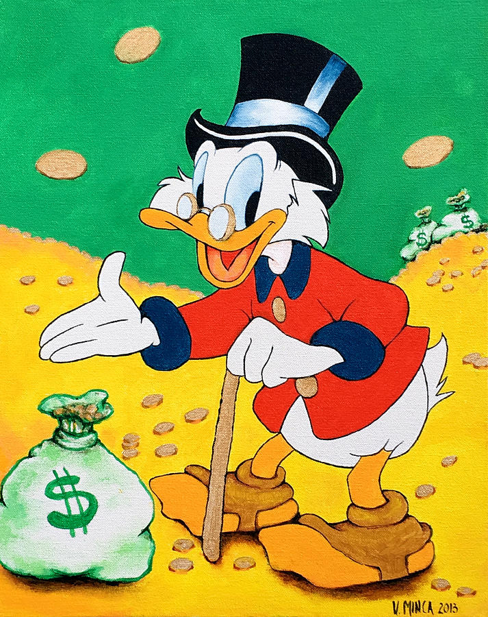
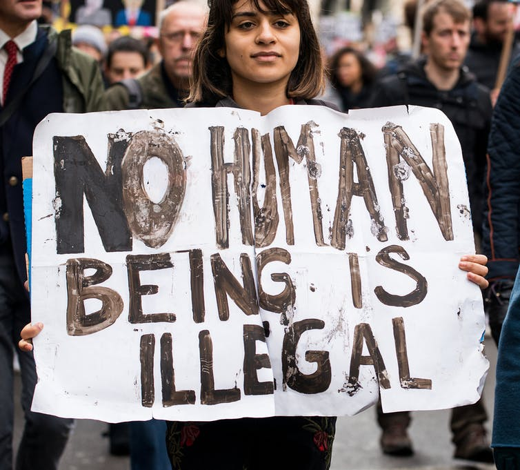
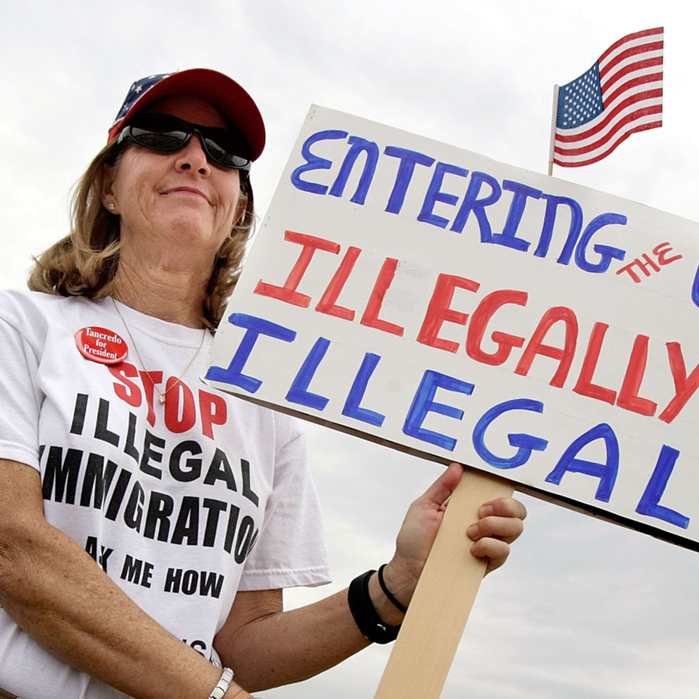
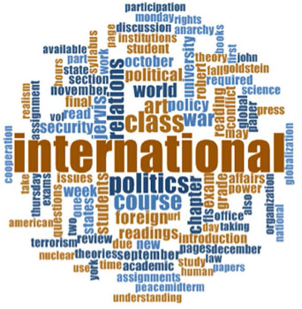

---
output:
  xaringan::moon_reader:
    css: ["default", "extra.css"]
    lib_dir: libs
    seal: false
    nature:
      highlightStyle: github
      highlightLines: true
      countIncrementalSlides: false
      ratio: '16:9'
---

```{r, echo = FALSE, warning = FALSE, message = FALSE}
##xaringan::inf_mr()
## For offline work: https://bookdown.org/yihui/rmarkdown/some-tips.html#working-offline
## Images not appearing? Put images folder inside the libs folder as that is the main data directory

library(tidyverse)
library(readxl)
library(stargazer)
##library(kableExtra)
##library(modelr)

knitr::opts_chunk$set(echo = FALSE,
                      eval = TRUE,
                      error = FALSE,
                      message = FALSE,
                      warning = FALSE,
                      comment = NA)
```

class: slideblue

.size80[**Today's Agenda**]

<br>

.size50[

1. What is "science"?

2. What is "politics"?

3. Can it be studied "scientifically"?

]

<br>

.center[.size40[
  Justin Leinaweaver (Spring 2022)
]]

???

## Prep for Class
1. Get out of jail free cards for our distribution game (print from GDrive)

<br>

Update with class notes from trying to define our concepts
- International: Involves the actions of more than one country

- Political: * we didn't really get to this *

- Event: A thing that happened

<br>

Welcome back everybody!

ANYTHING INTERESTING GOING ON IN WORLD POLITICS AT THE MOMENT?

<br>

EVERYBODY HAVE THE READINGS FOR TODAY?

<br>

This week we continue laying important foundations for the rest of the semester.

We need to make sure we're clear on what we're exploring and how we explore it.


---

.pull-left[

<br>

```{r, fig.align='center'}

```

]

.pull-right[

```{r, fig.align='center'}

```

]

???

For today you read Hoover and Donovan on "The Elements of Science."

Let's make sure it was clear.

Here is a picture of a chair and a very wealthy duck.

BASED ON THE READING, WHICH OF THESE TWO THINGS ARE CONCEPTS? 

- MAKE YOUR CASE!


---

.pull-left[

<br>

```{r, fig.align='center', out.width='70%'}

```

]

.pull-right[

```{r, fig.align='center', out.width='70%'}

```

]

<br>

.center[.size30[Concepts are "names for things, feelings and ideas generated or acquired by people in the course of relating to each other and to their environment" (13).]]

???

Concepts are "names for things, feelings and ideas generated or acquired by people in the course of relating to each other and to their environment" (13).

So, both of these are concepts.

They are names for things / ideas that allow us to communicate about the world.


---

background-image: url('libs/Images/02_1-scrooge2.jpg')
background-size: 100%
class: center

???

Where this gets complicated is when we disagree about the meaning of a specific concept.

IS WEALTH A CONTESTED CONCEPT? 

HOW COULD THE DEFINITION OF WEALTH BE UP FOR DEBATE?


---

background-image: url('libs/Images/02_1-graffiti.jpg')
background-size: 100%
class: center

???

"Wealth" is clearly a contested concept.

People are free to define wealth for themselves and those definitions will almost certainly conflict.

- Wealth is family and friends?
- Wealth is love?
- Wealth is a fancy house and car?
- Wealth is power?

One of the roots for much societal conflict is this difference in definitions.


---

background-image: url('libs/Images/02_1-chair2.jpg')
background-size: 100%
class: center

???

IS A CHAIR A CONTESTED CONCEPT?


IF YOU ARGUE WE ALL MAY HAVE DIFFERENT DEFINITIONS OF "CHAIR", ARE THE DIFFERENCES SUFFICIENT TO IMPACT OUR LIVES? WHY OR WHY NOT?


---

background-image: url('libs/Images/02_1-dog_toddler.png')
background-size: 50%
class: center

???

Of course, society may privilege some definitions over others...

A "chair" is also just as much a concept.

What I really like about this picture is that it encourages us to think about how defining concepts is a tool of power.

Getting others to accept your definition for a basic concept means you have the ability to frame our use and understanding of that thing.

This small child will clearly be impacted if we all decide to accept the dog's defintion of a chair.

<br>

GIVE ME SOME EXAMPLES OF OTHER FIGHTS WE ARE HAVING IN SOCIETY RIGHT NOW THAT ARE, AT THE CORE, FIGHTS ABOUT DEFINING A CONCEPT.


---

class: middle, slidegreen

.size40[.center[**Should the undocumented have the same rights as citizens in our society?**]]

.pull-left[

```{r, fig.align='center', out.width='100%'}

```

]

.pull-right[

```{r, fig.align='center', out.width='100%'}

```

]

???

1. The fight to define immigration

Who deserves to be protected in our society?

Who is a human being and who is a criminal?

Citizens, legal immigrants, illegal immigrants, children regardless of immigration status, asylum seekers?


---

background-image: url('libs/Images/02_1-us_capitol.jpg')
background-size: 100%
class: center

???

2. The fight to define government assistance

WHEN YOU THINK OF THE PROPER ROLE OF GOVERNMENT IN PROTECTING ITS CITIZENS, WHAT DO YOU THINK OF?


---

background-image: url('libs/Images/02_1-riot_police.jpg')
background-size: 100%
class: center

???

I think most people would agree protection from violence is absolutely part of the definition.

BUT WHERE IS OUR LINE BETWEEN VIOLENCE TO BE ENDED WITH FORCE AND LEGITIMATE PROTEST?


---

background-image: url('libs/Images/02_1-welfare.jpg')
background-size: 86%
class: center

???

What about protection from poverty or a lack of opportunity to succeed?

SHOULD THIS BE PART OF GOVERNMENT'S PROTECTIVE PURPOSE?

<br>

QUESTIONS ON THE IMPORTANCE AND POWER OF DEFINING CONCEPTS?


---

class: middle, slideblue

.pull-left[

<br>

.size35[
.textblack[**International**]

+ ?

.textblack[**Political**]

+ ?

.textblack[**Event**]

+ ?

]]

.pull-right[

```{r, fig.align='right', out.width='100%'}

```

]

???

The very organization of this class and IR as a subfield of political science hinges on us being able to define these three concepts.

Remember, our aim is not to create the perfect definition.

That's practically impossible.

Our job is to agree on a shared definition we can use to begin exploring the world.

<br>

LET'S START WITH WHAT IS HOPEFULLY THE EASIEST ONE, HOW DO WE DEFINE AN EVENT?

OR

BASED ON OUR CASE STUDIES FROM LAST WEEK, WHAT DEFINITION OF "EVENT" DID WE COME UP WITH?


---

class: middle, slideblue

.pull-left[

<br>

.size35[
.textblack[**International**]

+ ?

.textblack[**Political**]

+ ?

.textblack[**Event**]

+ .textblack[A thing or happening]

]]

.pull-right[

```{r, fig.align='right', out.width='100%'}

```

]

???

OK, WHEN YOU HEAR THE WORD INTERNATIONAL, WHAT DO YOU THINK OF?

OR

AGAIN, BASED ON OUR CASE STUDIES FROM LAST WEEK, WHAT DEFINITION OF "INTERNATIONAL" DID WE COME UP WITH?


---

class: middle, slideblue

.pull-left[

.size30[
.textblack[**International**]

+ .textblack[Global impact or]
+ .textblack[Involving > 1 state]

.textblack[**Political**]

+ ?

.textblack[**Event**]

+ .textblack[A thing or happening]

]]

.pull-right[

```{r, fig.align='right', out.width='100%'}

```

]


???

Alright, now it's time for the hard one.

WHEN YOU THINK OF THE WORD "POLITICAL" WHAT DO YOU THINK OF?

OR

BASED ON OUR CASE STUDIES FROM LAST WEEK, WHAT DEFINITION OF "POLITICAL" DID WE COME UP WITH?

* DISCUSS *

Segue to the game.


---

background-image: url('libs/Images/02_1-politics_game_1.png')
background-size: 100%
class: center

???

# Notes on the game FOR YOU
+ Class must distribute X "Get out of jail free" cards in ten minutes

+ Each card is worth a free excused absence OR a two day extension to a paper deadline (not the final)

+ Number of cards: Approx 25% of the class?

+ You keep all of the "get out of jail free" cards in hand until the end of the game. No one can just claim them by walking up and taking it. Students must make an affirmative case why they should get one. I like this! A literal government hand out!

<br>

Ok, let me see if I can help you get to how political scientists think about politics.

Let's play a game.

Here's the deal.

As a class you have to distribute a couple of index cards.


---

background-image: url('libs/Images/02_1-politics_game_2.png')
background-size: 100%
class: center

???

Each of these is a "get out of jail free" card.

You can use one of these to help yourself out of a jam in this class this semester.

- Miss a paper deadline? Add two days!

- Miss a class? Get an excused absence!

Exceptions?

- Class policies, not university policies (e.g. plagiarism) or laws (e.g. no murder)

- Can't apply to the final exam

**That's it, that's the game. Go!**

<br>

Ok, everybody take two minutes on your own to reflect on our game.

Write down a few notes: How did you approach this game? What was your strategy? Why?

Jot down some notes you could use to explain what just happened.

<br>

OK, WHAT JUST HAPPENED?

- How was it played?
- What was your experience?
- Did others play it differently?
- What was the outcome and why did we reach that end?

<br>

Now, assume for the moment that our game was a useful simulation of "politics."

Take your notes, take two more minutes and write me a short definition of politics.

Alright, let's hear what you came up with!

PRESENT and DISCUSS

<br>

Games and simulations are often a useful tool for exploring politics.

What we just played was a fairly basic distribution game.

It highlights a ton of important stuff, but we'll just focus on the big idea for now.


---

background-image: url('libs/Images/02_1-politics_game_3.png')
background-size: 100%
class: center

???

In various textbooks you'll see politics defined as:
- Who gets what, when and how?
- Decision-making that affects a community
- How we make the rules and whether or not they matter

In essence, anytime a group of people have to come together to make a decision, a political scientist can be found who is interested in the process.

ANY QUESTIONS ON THIS BROAD DEFINITION OF THE POLITICS CONCEPT?

<br>

Now let's talk about the "science" part of our reading for today.

Hoover and Donovan do a really nice job laying out how social scientists can follow a process in order to generate useful knowledge about the world.

I want you to use the reading to answer a fairly important question for me.


---

background-image: url('libs/Images/02_1-monkey_darts_politics.jpg')
background-size: 75%
class: center

???

ACCORDING TO THE CHAPTER, WHAT DO WE HAVE TO DO IN ORDER TO STUDY POLITICS SCIENTIFICALLY?

* Force this discussion *

<br>

Sub-questions:

1. CAN SOCIAL SCIENTISTS FOLLOW THE SCIENTIFIC METHOD? WHY OR WHY NOT?
("The point is that the scientific method seeks to test thoughts against observable evidence in a disciplined manner, with each step in the process made explicit" (H&D old p24))

(p29: One version of the scientific method)
1. Identify the concepts / variables to be studied
2. Form a hypothesis (...proposes a relationship between two or more variables p26)
3. Gather evidence
4. Compare evidence to hypotheses, derive conclusions
5. Discuss the uncertainty in those conclusions

<br>

2. WHAT DOES IT MEAN TO SAY POLITICAL SCIENTISTS SEARCH FOR VERIFIABLE ANSWERS?
(Science is NEVER just about taking someone’s word for something.)
- Knowledge that cannot be independently confirmed is not useful.
- We rely only on “observable evidence”
- “each step...made explicit” (p24)

<br>

An important takeaway for us.

Science is a process for generating knowledge, not a bucket of facts about the natural world.

You can study anything "scientifically."

MAKE SENSE?


---

background-image: url('libs/Images/02_1-theory_defined.png')
background-size: 100%
class: center

???

I also want to introduce the idea of theory today.

"...a set of related propositions that suggest why events occur in the manner that they do" (p32).

ANY FAMOUS THEORIES COME TO MIND?

(- Relativity?)
(- Gravity?)
(- the big bang?)

In simple terms, theories are the arguments we use to explain why things happen.

We'll get more into this on Wednesday.

The bottom-line at this point is that thinking theoretically makes you a much smarter and more capable consumer of news and citizen in a democracy.


---

background-image: url('libs/Images/02_1-politics_game_2.png')
background-size: 100%
class: center

???

Let's end today by applying a scientific perspective to our distribution game.

<br>

Imagine I'm about to bring you to a place where you can observe a different class play the distribution game with the same rules I gave you today.

What I'd like to know is what the expected outcome of their game will be.

** ON BOARD **

1. WHAT INFORMATION ABOUT THAT CLASS WOULD YOU WANT IF I ASKED YOU TO PREDICT THE OUTCOME OF THEIR GAME?

- CAN WE PHRASE THESE AS THEORIES OR HYPOTHESES?

<br>

2. WHAT SPECIFIC RULES CHANGES COULD WE PROPOSE THAT WOULD INFLUENCE THE OUTCOME OF THE GAME?


---

class: middle, slideblue

.size60[**For Wednesday**]

.size40[
Mingst, K. & Arreguin-Toft, I. (2017). Chapter 3, International Relations Theories. In *Essentials of International Relations*. New York and London: W. W. Norton & Company, 70–105.

+ Exploring theories / models of international relations
]

???

Chapter will introduce you to some of the big theories / models of international relations.
