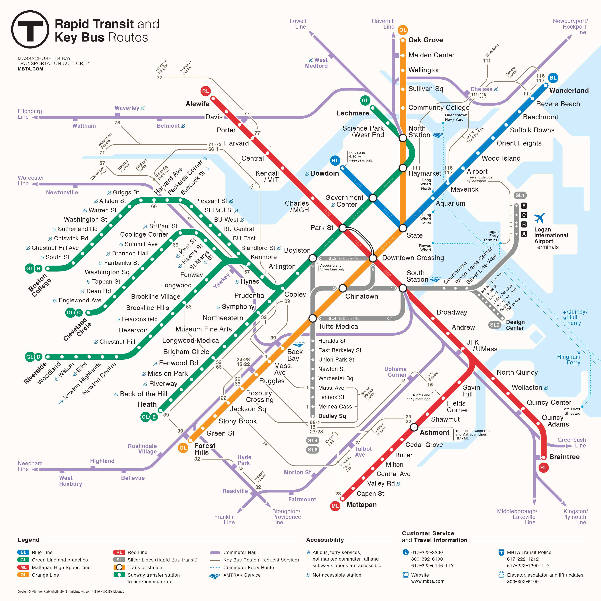
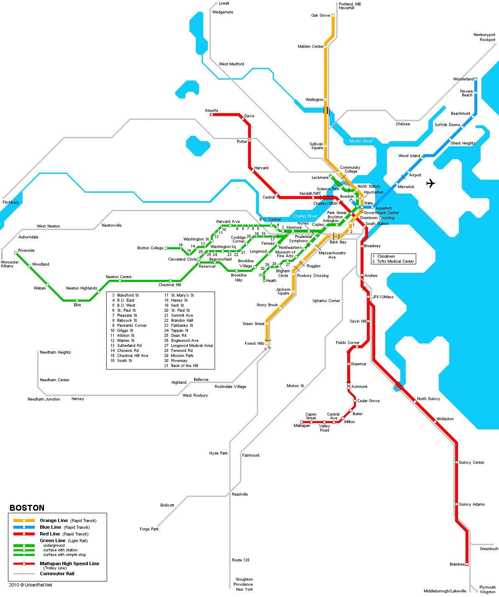
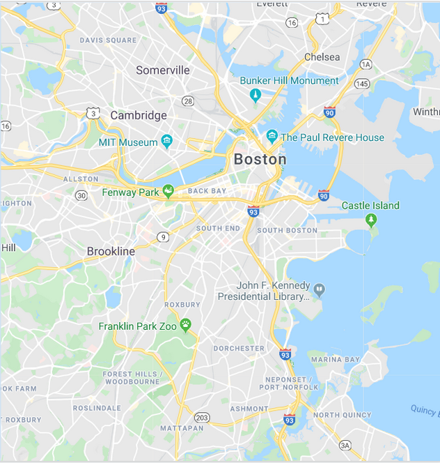

---
output:
  xaringan::moon_reader:
    css: ["default", "extra.css"]
    lib_dir: libs
    seal: false
    nature:
      highlightStyle: github
      highlightLines: true
      countIncrementalSlides: false
      ratio: '16:9'
---

```{r, echo = FALSE, warning = FALSE, message = FALSE}
##xaringan::inf_mr()
## For offline work: https://bookdown.org/yihui/rmarkdown/some-tips.html#working-offline
## Images not appearing? Put images folder inside the libs folder as that is the main data directory

library(tidyverse)
library(readxl)
library(stargazer)
##library(kableExtra)
##library(modelr)

knitr::opts_chunk$set(echo = FALSE,
                      eval = TRUE,
                      error = FALSE,
                      message = FALSE,
                      warning = FALSE,
                      comment = NA)
```

class: slideblue

.size80[**Today's Agenda**]

<br>

.size40[

1. What is a scientific model?

2. What are the "big" theories of international relations? (Mingst and Arreguin-Toft 2017, Chapter 3)

]

<br>

.center[.size40[
  Justin Leinaweaver (Spring 2022)
]]

???

## Prep for Class
1. ...

<br>

* Opening Discussion *

ANYTHING INTERESTING GOING ON IN WORLD POLITICS AT THE MOMENT?

<br>

EVERYBODY HAVE THE READINGS FOR TODAY?

<br>

For today I gave you a chapter from an IR textbook that introduced you to the big theories of international relations.

My hope is that this chapter gives you a sense of the scope of international relations and gives us a good path into using theories and models in IR.

LET'S START WITH THIS, HOW DOES THE DEFINITION OF "THEORY" IN THIS CHAPTER COMPARE TO THE DEFINITION FROM HOOVER AND DONOVAN WE DISCUSSED ON MONDAY?


---
class: middle, slideblue

.size50[.center[**Theory Defined**]]

.size40[Donovan and Hoover (2014)]

.size30[
+ "...a set of related propositions that suggest why events occur in the manner that they do" (32).
]

.size40[Mingst and Arreguin-Toft (2017)]

.size30[
+ "A theory is a set of propositions and concepts that combine to explain phenomena by specifying the relationships among the propositions. Theory's ultimate goal is to predict phenomena" (72).
]

???

WHAT THEORIES DOES THIS CHAPTER INTRODUCE?

ANY OF THE NAMES STICK WITH YOU?


---

class: middle, slideblue

.pull-left[
.size50[
.center[

**The "Big"**

**Theories of**

**International**

**Relations**

]]]

.pull-right[

.size40[
+ Realism
	  + Neorealism

+ Liberalism
	  + Institutionalism

+ Radicalism

+ Constructivism

]]

???

Before we talk about these or, heaven forbid, use one of them to explain a political outcome.

Let's dig a bit more deeply into what they are in scientific terms.

In other words, what is a model or theory?

**Everybody take out a blank piece of paper and something to write with.**


---

background-image: url('libs/Images/02_2-Drury_photo.jpg')
background-size: 100%
class: center

???

ANYBODY RECOGNIZE WHAT'S IN THIS PHOTO?
(Drury's campus!)

HOW COULD I USE THIS PHOTO TO FIND MY WAY FROM BURNHAM HALL TO SUNDERLAND?

IS THERE A TOOL, PERHAPS, BETTER SUITED TO THIS QUESTION?

(SLIDE)


---

background-image: url('libs/Images/02_2-Drury_Official_Map.png')
background-size: 90%
class: center

???

A map!

I'm assuming all of you have some experience using this map.

HAS IT BEEN USEFUL?

WHAT DOES IT DO WELL?

WHAT DOES IT NOT DO WELL?

<br>

I'd like each of you to take some ownership of the tool.

I'd like you to take a few minutes to draw me YOUR map of Drury University.

This is your personal map so I'd like it to identify the most important places on campus for you.

SLIDE


---

class: middle, slideblue

.size60[.center[**Draw YOUR map of Drury University**]]

<br>
<br>

.size40[
1. Identify the .textred[**five**] most important places on campus (to you), and

2. .textred[**Rank**] them from most to least important.
]

???

Your map must do two things:

1. Identify the five most important places on campus (to you), and

2. Rank them from most to least important.
- Make clear how those places rank against each other (most to least important).

WHAT QUESTIONS DO YOU HAVE ABOUT THE ASSIGNMENT?

<br>

Alright, get to work!

* Present and discuss volunteer maps *

<br>

Ok, everybody stand up and walk around checking out all the maps.

The "best" one gets extra credit!

Go!

<br>

NOW, WHICH MAP IS THE BEST ONE? WHY?

<br>

A trick question, right?

Let's take a step back and just try to define the concept.

BASED ON THESE EXAMPLES, CAN SOMEONE DEFINE A MAP FOR US?

- ASSUMING THESE ARE ALL EXAMPLES OF THE CONCEPT, WHAT DO THEY HAVE IN COMMON?

* ON BOARD *


---

class: middle, slidegreen

.left-column[
.size60[
.center[
.textblack[**The Boston "T"**]
]]]

.right-column[

```{r, fig.align='right', out.width='75%'}

```

]

???

Let's come at this one more way before we settle on a definition.

The Boston subway system represents a really interesting challenge for map makers.

The T map is considered an excellent map.

It makes super clear how to get from point A to B using the subway even for tourists who don't speak English.

HOWEVER, it is wildly inaccurate as a spatial representation of Boston.


---

class: middle, slidegreen

.pull-left[

```{r, fig.align='center', out.width='100%'}

```

]

.pull-right[

```{r, fig.align='center', out.width='100%'}

```

]

???

Red line: Braintree is WAY further south in reality than Mattapan.

Blue line north curves like crazy, not straight line at all.

The distance between the lines is mostly wrong too.

If you tried to use the T map to navigate by foot or car you would get incredibly lost.

<br>

SO, WHICH IS THE MORE ACCURATE MAP? WHY?

* DISCUSS *


---

.pull-left[

```{r, fig.align='center', out.width='100%'}

```

]

.pull-right[

```{r, fig.align='center', out.width='100%'}

```

]

???

"Accuracy" or "correctness" isn't really a useful metric for maps.

SLIDE

The map on the left makes navigating on the T easy.

The map on the right makes navigating by car possible.

<br>

Why not do both in one map?

Generally there is a trade-off between the number of purposes you can use a map for and its usefulness.

Usefulness is typically a function of simplicity!


---

class: slidegreen

.pull-left[

```{r, fig.align='center', out.width='80%'}

```

]

.pull-right[

<br>
<br>

.size40[**Maps are:**]

.size30[
+ Neither true nor false

+ Limited in their accuracy

+ Partial representations

+ Useful for only some uses

+ A reflection of the interests of the designer

]]

???

So, keep in mind:

- Maps are objects, not true or false

- Maps have limited accuracy

- Maps are partial (include some features of the world and omit others)

- Maps are purpose relative (useful for a specific purpose only)

<br>

DOES THIS LIST FIT FOR ALL THE MAPS YOU'VE USED IN YOUR LIFE?

<br>

ARE ALL OF THESE THINGS TRUE FOR THE MAPS WE'VE MADE IN CLASS TODAY?

<br>

SO, IF I ASK, WHICH OF THE MAPS YOU MADE IN CLASS IS "BEST" WHAT WOULD YOU SAY?

(It depends!)

We evaluate a map's usefulness based on what we need it to do for us, NOT ON ITS ACCURACY.


---

class: slidegreen

.pull-left[

```{r, fig.align='center', out.width='80%'}

```

]

.pull-right[

<br>
<br>

.size40[**Scientific models are:**]

.size30[
+ Neither true nor false

+ Limited in their accuracy

+ Partial representations

+ Useful for only some uses

+ A reflection of the interests of the designer

]]

???

All of this applies equally to scientific models.

"Scientific" models are like maps.
- limited accuracy
- represent reality
- REFLECT the interest of the USER

<br>

One more important note for you, this isn't just a discussion about the "social" sciences.

This applies to the natural sciences as well.


---

background-image: url('libs/Images/02_2-airfoil_wind_tunnel.gif')
background-size: 100%
class: center

???

ANYBODY RECOGNIZE THIS MODEL? WHAT IS IT?

(Testing designs for airplane wings using an airfoil model)

Airfoil: a structure with curved surfaces designed to give the most favorable ratio of lift to drag in flight, used as the basic form of the wings, fins, and horizontal stabilizer of most aircraft.

<br>

WHO HERE HAS FLOWN ON AN AIRPLANE?

DO YOU LIKE FLYING?

Aerospace engineers test plane designs using a model that includes the assumption that air is a continuum.

Represented here by long, straight lines.

<br>

ANYBODY KNOW WHAT IS WRONG WITH THIS ASSUMPTION?

---

background-image: url('libs/Images/02_2-air_particles.jpg')
background-size: 100%
class: center

???

The problem is that air is DEFINITELY NOT a continuum.

It is made up of many discrete particles.

This means when you fly you entrust your life to a model that WE KNOW IS BUILT ON INCORRECT ASSUMPTIONS.

So, why aren't planes dropping out of the sky all the time?


---

background-image: url('libs/Images/02_2-wind_tunnel_particles.gif')
background-size: 100%
class: center

???

Scientific Models: Simplifications of Reality

It turns out that under the very specific conditions of high speed flight, air behaves like a continuum.

This model allows for the MUCH easier design of new airplanes.

In other words, sometimes air behaves like a continuum and that sometimes is what flying a plane is like.

DOES THAT MAKE SENSE?

The "model" is absolutely wrong, but useful!

Remember, a model is a simplification of reality.

Reality is incredibly messy and complex.

We use models to identify the key components in reality that are relevant to what we are trying to explain.


---
class: middle, slideblue

.size50[.center[**Theory Defined**]]

.size40[Donovan and Hoover (2014)]

.size30[
+ "...a set of related propositions that suggest why events occur in the manner that they do" (32).
]

.size40[Mingst and Arreguin-Toft (2017)]

.size30[
+ "A theory is a set of propositions and concepts that combine to explain phenomena by specifying the relationships among the propositions. Theory's ultimate goal is to predict phenomena" (72).
]

???

We can go back to our defintions of theory and use them to better understand the wind tunnel approach to building a plane.

The goal of the wind tunnel is to accurately predict flight NOT to precisely represent every molecule in the air.

The theory of the wind tunnel is inaccurate but very useful SO LONG AS THE ASSUMPTIONS ARE MET.

DOES THAT MAKE SENSE?


---

class: middle, slideblue

.pull-left[
.size50[
.center[

**The "Big"**

**Theories of**

**International**

**Relations**

]]]

.pull-right[

.size40[
+ Realism
	  + Neorealism

+ Liberalism
	  + Institutionalism

+ Radicalism

+ Constructivism

]]

???

Ok, so for today you got a crash course in three broad approaches to modeling or theorizing about international politics.

WHICH OF THE THEORIES IN THE CHAPTER IS THE RIGHT ONE?

(Trick question, right?)

- Just making sure you were listening.

<br>

Let's briefly just talk about each of these as models (e.g. as maps).

HOW IS REALISM LIKE A MAP FOR INTERNATIONAL POLITICS?


---

background-image: url('libs/Images/02_2-theory_brief.png')
background-size: 80%
class: center

???

- WHAT DOES IT TELL ME TO FOCUS ON WHEN EXPLAINING THE WORLD?

- WHAT DOES IT EXCLUDE?

- WHAT ARE THE KEY ASSUMPTIONS THAT MAKE IT USEFUL?

- WHAT WOULD THIS MAP BE REALLY UNHELPFUL TO EXPLAIN?

<br>

CAN ANYBODY GIVE US A BIT OF CURRENT EVENTS THAT THE REALISM MAP WOULD BE USEFUL FOR EXPLAINING?

<br>

## If needed ##
- Russia protects Assad in Syria to protect its abaility to project force and prevent the West from remaking the government.
- US gets hit by Taliban on 9/11 so we invade Afghanistan.
- Russia interferes in 2016 election to weaken an opponent, undermine our government
- Gaddafi in Libya is a destabilizing force so the rest of the world let him get wiped out (or assisted directly) in a revolution.

<br>

HOW IS LIBERALISM LIKE A MAP FOR INTERNATIONAL POLITICS?


---

background-image: url('libs/Images/02_2-theory_brief_liberalism.png')
background-size: 80%
class: center

???

- WHAT DOES IT TELL ME TO FOCUS ON WHEN EXPLAINING THE WORLD?

- WHAT DOES IT EXCLUDE?

- WHAT ARE THE KEY ASSUMPTIONS THAT MAKE IT USEFUL?

- WHAT WOULD THIS MAP BE REALLY UNHELPFUL TO EXPLAIN?

<br>

AND HOW WOULD LIBERALISM TRY TO EXPLAIN THAT SAME CURRENT EVENT?

## If needed ##
- Weakness of international institutions?
- NATO bombing Libya

<br>

Now, as I've said, scientific models are like maps.

But maps can be compared and we can prefer some maps to others.

SO, HOW DO WE PICK BETWEEN COMPETING MODELS IF BOTH ARE AT LEAST SOMEWHAT WRONG?

- ANY IDEAS?


---

class: slidegreen, middle

.size60[**"Useful" Scientific Models...**]

<br>

--

.size50[1) are logical.]

???

REMIND ME, WHAT IS OUR TEST OF LOGIC IN HERE?
(Inductive arguments evaluated by strength of the argument.
("A strong argument is such that if the premises were true, then the conclusion is likely to be true.")
("A weak argument is such that if the premises were true, then the conclusion is not likely to be true.")

<br>

We will use the same skills for analyzing theories as we do for analyzing arguments.

Each theory makes assumptions (e.g. our premises) and we expect that those assumptions to be logically coherent.

--

.size50[2) accurately explain outcomes.]

???

HOW DO WE TEST THIS ONE?
(Examine the world! Find some evidence!)

--

.size50[3) explain more stuff than other theories.]

???

Let's say you have two logical and equally concise theories.

If one explains event "A" and the other explains events "A" and "B" we would definitely rather keep "B."

It is way more powerful!


--

.size50[4) need fewer assumptions to explain the same things.]

???

HAS ANYBODY EVER HEARD OF OCCAM'S RAZOR?
- WHAT IS IT?

(Technically: "entities should not be multiplied without necessity.")
- More popularly: "the simplest explanation is most likely the right one".

<br>

Either NASA astronauts landed on the moon

OR

The US government has undertaken the largest, most complicated and most successful mission to fool us all that they did.
- Hiding the filming,
- Tricking the Russians,
- Keeping the actors and crew quiet,
- Planting a mirror on the moon so experiments can be done from Earth,
- etc.

<br>

Don't stress the details of these broad theories.

The big lesson for today is about the nature of theories and models.

- What is a model / theory?

- Why are they useful?

- How do we evaluate them?

ANY QUESTIONS ON THIS?
