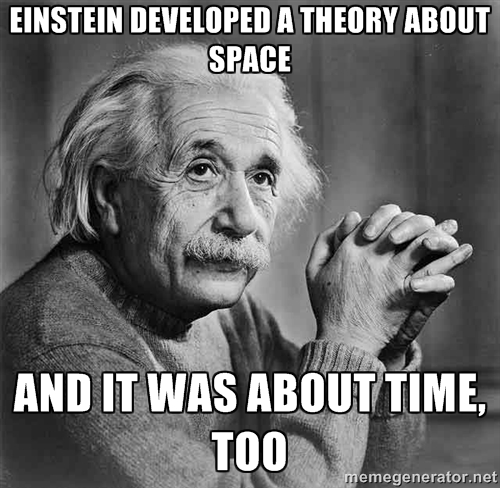
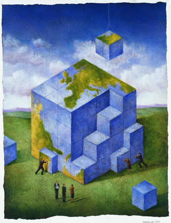

---
output:
  xaringan::moon_reader:
    css: ["default", "extra.css"]
    lib_dir: libs
    seal: false
    nature:
      highlightStyle: github
      highlightLines: true
      countIncrementalSlides: false
      ratio: '16:9'
---

```{r, echo = FALSE, warning = FALSE, message = FALSE}
##xaringan::inf_mr()
## For offline work: https://bookdown.org/yihui/rmarkdown/some-tips.html#working-offline
## Images not appearing? Put images folder inside the libs folder as that is the main data directory

library(tidyverse)
library(readxl)
library(stargazer)
##library(kableExtra)
##library(modelr)

knitr::opts_chunk$set(echo = FALSE,
                      eval = TRUE,
                      error = FALSE,
                      message = FALSE,
                      warning = FALSE,
                      comment = NA)
```

class: slideblue

.size80[**Today's Agenda**]

<br>

.size45[.center[Building models in International Relations]

+ What is our first assumption?
+ What will happen to Taiwan?
]

<br>

.center[.size40[
  Justin Leinaweaver (Spring 2022)
]]

???

## Prep for Class
1. Review the assigned current event articles.

.size10[
1. Waltz, K. (1959). "Man, the State, and War: A Theoretical Analysis." in *International Politics: Classic and Contemporary Readings.* Scott P. Handler eds, 29-32.

2. Chang, W., Xiong, Y. and Westcott, B. (2021, Oct 9). Chinese President Xi Jinping vows to pursue 'reunification' with Taiwan by peaceful means. *CNN*. [Link](https://www.cnn.com/2021/10/08/china/xi-jinping-taiwan-reunification-intl-hnk/index.html)

3. Myers, Steven Lee. (2020, Oct 5). China Ramps Up a War of Words, Warning the U.S. of Its Red Lines. *The New York Times*. Section A, Page 13 of the New York edition. [Link](https://www.nytimes.com/2020/10/05/world/asia/china-propaganda-united-states.html)

4. Sanger, David E. (2021, Oct 22). Biden Said the U.S. Would Protect Taiwan. But It’s Not That Clear-Cut. *The New York Times*. Section A, Page 9 of the New York edition. [Link](https://www.nytimes.com/2021/10/22/us/politics/biden-taiwan-defense-china.html)
]

<br>

* Opening Discussion *

### Anything interesting going on in world politics at the moment?

<br>

### Everybody have the readings for today?


---

background-image: url('libs/Images/background-slate.jpg')
background-size: 100%
background-position: center
class: middle

.pull-left[
.size40[

.center[**Science is the search for verifiable answers.**]

1. Inference is the goal

2. Procedures are public

3. Conclusions are uncertain

4. Content is method

]]

.pull-right[

<br>

```{r, fig.align='right', out.width='100%'}

```

]

???

Let's refresh our memories on our work from the first two weeks of class.

First, let's talk about the method, or "how", we intend to explore the world.

<br>

### Questions on the science of political science?

#### - What does "inference" refer to?
+ ("a conclusion reached on the basis of evidence and reasoning.")
+ (Ability to generalize from your data to the broader world)

#### - Why does science require uncertain conclusions? Aren't we trying to find the "right" answers?

<br>

Second, we shift to the target of our inquiry.

Our goal in IR is to explain international political events.

### How did we define "international," "political" and "event" in class?

(SLIDE)


---

background-image: url('libs/Images/background-slate.jpg')
background-size: 100%
background-position: center
class: middle

.size45[.center[**The Outcomes to Explain**]]

.pull-left[

.size35[
**International**

+ Global impact or
+ Involving > 1 state

**Political**

+ Who gets what, when and how?

**Event**

+ A thing or happening

]]

.pull-right[

```{r, fig.align='right', out.width='100%'}
knitr::include_graphics("libs/Images/02_1-word_cloud.jpg")
```

]

???

### Concept definitions make sense?

<br>

### How does the question of Taiwanese independence fit our three definitions?*

+ *Discuss*

<br>

Finally, on Wednesday we talked through what it means to think theoretically about the world.

### What did we make in class in order to help us think about what it means to explore the world using models?
+ (Maps!)

### And what is true about both maps and models?

(SLIDE)

<br>

*Other Terms You Could Use:*
- *Give me an example of a current international political event.*
- *Why is the example "political"?*


---

background-image: url('libs/Images/background-slate.jpg')
background-size: 100%
background-position: center
class: middle

.pull-left[

```{r, fig.align='center', out.width='80%'}
knitr::include_graphics("libs/Images/02_2-drury_map.jpg")
```

]

.pull-right[

<br>

.size40[**Scientific models are:**]

.size35[
+ Neither true nor false

+ Limited in their accuracy

+ Partial representations

+ Useful for only some uses

+ A reflection of the interests of the designer

]]

???

Science uses models to simplify a complex world and to help us explain what is happening around us.

The key is to remember that ALL MODELS ARE WRONG, but some of them are useful!

On Wednesday we talked about the simplifications provided by realism and liberalism, but we'll dig more into those in future weeks.

<br>

### What were the four conditions of a "useful" model we ended with in class on Wednesday?

+ ("Useful" Scientific Models...)
    + 1) are logical.
    + 2) accurately explain outcomes.
    + 3) explain more stuff than other theories.
    + 4) need fewer assumptions to explain the same things.
    
<br>

### Any questions on all of this material?

Good job all! We've covered a lot!


---

background-image: url('libs/Images/background-slate.jpg')
background-size: 100%
background-position: center
class: middle, inverse

```{r, fig.align='center', out.width='45%'}

```

???

Today I want us to get more practice in thinking about international politics from a scientific perspective.

+ And that means thinking in terms of models.

<br>

Models, just like arguments, represent conclusions supported by component parts.

+ The difference is that arguments are built on premises while models are built on assumptions.

### Can anybody define an "assumption" for us?

+ (SLIDE)


---

background-image: url('libs/Images/background-slate.jpg')
background-size: 100%
background-position: center
class: middle, inverse

.pull-left[

<br>

```{r, fig.align='right', out.width='85%'}

```
]

.pull-right[

<br>

<br>

<br>

.size40[
.center[**Assumption Defined:**

"A thing that is accepted as true or as certain to happen, without
proof..." (Oxford Languages).

]]]

???

### What does this mean in English?
+ *Discuss*

<br>

I promise I'm not trying to confuse you with all this lingo!

Let's clarify this distinction.

In our first week of class we diagrammed arguments, meaning we identified the premises that supported a conclusion.

### What is the role of a "good" premise in an argument?
+ (1. Clearly explained)
+ (2. Logically tied to the conclusion)
+ (3. Supported by high quality evidence)

### Make sense?

<br>

Clearly that is **VERY** different from what an assumption does per this definition.

Model assumptions should be clearly explained, but don't have to reflect "reality" as you think of it.

### What was the example of a model we discussed in class that is defintiely built on an assumption about air that isn't true.

#### - A model you bet your life on!

(SLIDE)


---

background-image: url('libs/Images/02-3-airplane.gif')
background-size: 100%
background-position: center
class: middle

???

Airplanes are designed using models that assume air is a continuum, but it is not!!!
- Except under very specific conditions when it kind of acts that way...

<br>

So, today I want us to keep exploring the idea of models.

Models make scientific explanations possible and they are built using assumptions that don't have to be "true".

Remember, we prefer useful models, NOT models that use more "true" assumptions.

### Is everybody clear on this? The difference between premises in an argument and assumptions in a model?


---

background-image: url('libs/Images/background-slate.jpg')
background-size: 100%
background-position: center
class: middle

.size60[.center[**What is the "right" first assumption? (Waltz 1959)**]]

<br>

.size50[
+ The First Image

+ The Second Image

+ The Third Image
]

???

Today I want us to dig into one of the grand-old articles of IR theory.

Ken Waltz's (1959) “Man, the State, and War: A Theoretical Analysis” is one of those articles almost everybody in an IR class reads at some point.

+ In it, Waltz is trying to bring order to a chaotic landscape of scientific arguments about war.

<br>

Waltz wants to help us think about IR theory by organizing models according to their first assumption.

+ Those assumptions he refers to as images.

+ Each image starts with a VERY different assumption about how the world works and it builds from there.

<br>

*Split class into small groups (3?), assign one image to each group*


---

background-image: url('libs/Images/background-slate.jpg')
background-size: 100%
background-position: center
class: middle

.size50[
**From the perspective of your image:**

1. What is the main cause of war?

2. Assuming this is correct, how do we prevent war?
]

???

Ok groups, take a few minutes and focus on your image.

+ Prepare an answer to these two questions that you can present to the class.

### Questions?

<br>

##### 1st image
+ Human behavior drives international outcomes 
+ "...the locus of important causes of war is found in the nature and behavior of man."

1. People are good, but war is caused by “false leaders” misleading a gullible public.
    + Real-world: Some have argued that GWB misled the American people into invading Iraq. Everybody remember the Colin Powell speech to the UNSC? The allegation about WMDs?
2. Man is inherently bellicose, war can only be prevented by distracting him.
    + Real-world: Maybe this is why we have the olympics? World cup?

<br>

##### 2nd image
+ Domestic politics / internal organization of the state drives international events
+ "...the internal organization of states is the key to understanding war and peace."
1. Some states are “bad” and wars are used to relieve the domestic tension.
    + Real-world: North Korea getting belligerent to distract its unhappy people from threatening the leadership.
2. “Good” government but bad policy or constraints push them into war.
    + Real-world: Hypothetical: US voters demand an end to NSA domestic spying which prevents the NSA from averting a terrorist attack. US responds by invading the country the terrorists came from.
3. State with some vague sense of being depraved economically or geographically may use war to fix it.
    + Real-world: Hitler’s pursuit of lebensraum (living space) involved invading his neighbors to claim territory for his own expansion.

<br>

##### 3rd image
+ Characteristics of international system drive international events.

### What does waltz mean when he writes that “in anarchy there is no automatic harmony”?

+ (The absence of a world police force to protect you means each state is entirely its own boss.)

+ If you must live in a world where anyone can attack you at any time and no one will come to your rescue, you may indeed become a scaredy cat.

+ "Because each state is the final judge of its own cause, any state may at any time use force to implement its policies. Because any state may at any time use force, all states must constantly be ready either to counter force with force or to pay the cost of weakness."


---

background-image: url('libs/Images/02_3-china_taiwan_cartoon.jpg')
background-size: 100%
background-position: center

???

For today I gave you a series of news articles discussing China's increasing moves to threaten Taiwanese independence.

### Groups, use your image to analyze what is going on in this case.

#### - Get ready to help us understand what is REALLY going on here (according to your assigned image)!

<br>

### Questions?

Get to it!


---

class: center, middle

.center[.size60[**First Image**]]

<iframe width="900" height="550" src="libs/Images/02_3-China_propaganda_against_Taiwan.mp4" frameborder="0" allow="accelerometer; encrypted-media; gyroscope; picture-in-picture" allowfullscreen></iframe>

???

### First Image

+ Propaganda meant to "misdirect the people's aggression"

+ Focused on people as impulsive actors (e.g. selfishness, misdirected aggressive impulses, stupidity)

+ Case: China's propaganda videos against Taiwan (e.g. attempts to misdirect aggressive impulses) 

https://www.nytimes.com/2020/10/05/world/asia/china-propaganda-united-states(.html)


---

background-image: url('libs/Images/china-map.gif')
background-size: 75%
background-position: left

.right[.size50[**Second**]]

.right[.size50[**Image**]]

???

### Second Image

+ Focused on domestic politics (e.g. bad governments, good government constrained by limits on its power (protect our civil liberties) that prevents it from acting as it needs to on the world stage, or states reacting to "geographic or economic deprivations" as in, it's what we are owed, it's ours!)

+ Case: "Those who forget their heritage, betray their motherland and seek to split the country will come to no good," Xi said." 

+ (https://www.cnn.com/2021/10/08/china/xi-jinping-taiwan-reunification-intl-hnk/index.html)

+ Official maps of China always include Taiwan


---

background-image: url('libs/Images/02_3-china_taiwan_US_cartoon.jpg')
background-size: 90%
background-position: center

.right[.size60[**Third Image**]]

???

### Third Image

+ Image 3: Focused on the international system (anarchy)

+ Case: The US is talking defense but would we really fight? 

+ (https://www.nytimes.com/2021/10/22/us/politics/biden-taiwan-defense-china.html)


---

background-image: url('libs/Images/background-slate.jpg')
background-size: 100%
background-position: center
class: middle

.size60[.center[**Which image offers the "best" advice for preventing future wars?**]]

<br>

.size50[
+ The First Image

+ The Second Image

+ The Third Image
]

???

### Which image offers the "best" advice for preventing future wars?
+ *Discuss*

<br>

### Which offers the least useful advice? Why?
+ *Discuss*

<br>

### What about for international political events that aren't focused on war? Is one image clearly better than the others?
+ *Discuss*

<br>

### Out of curiosity, could we construct a single theory of war that uses all three images?

We can’t blend them because they are fundamentally incompatible.

They assume that international events are explained by fundamentally different causes!

Either international events are driven by human behavior or by the state or by the system.

Can’t be all three at once and still be a logically coherent argument.

### Make sense?


---

background-image: url('libs/Images/background-blue_triangles2.png')
background-size: 100%
background-position: center
class: middle

.size70[**For Monday**]

<br>

.size40[.center[**Who or what is currently the biggest international threat to the United States?**]]

.size40[
Bring one piece of .textred[**HIGH QUALITY**] published evidence you can use to answer the question.

Be ready to provide the class with a correctly formatted, .textred[**APA style citation**] for your piece of evidence (see the Purdue OWL for guidance).
]

???

Next week we start working on your first paper assignments!

Get off to a good start, find us something good!

You will have to **SUBMIT** your citation in class on Monday so **be prepared!**


