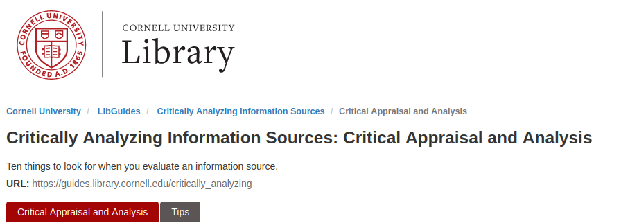

---
output:
  xaringan::moon_reader:
    css: ["default", "extra.css"]
    lib_dir: libs
    seal: false
    nature:
      highlightStyle: github
      highlightLines: true
      countIncrementalSlides: false
      ratio: '16:9'
---

```{r, echo = FALSE, warning = FALSE, message = FALSE}
##xaringan::inf_mr()
## For offline work: https://bookdown.org/yihui/rmarkdown/some-tips.html#working-offline
## Images not appearing? Put images folder inside the libs folder as that is the main data directory

library(tidyverse)
library(readxl)
library(stargazer)
##library(kableExtra)
##library(modelr)

knitr::opts_chunk$set(echo = FALSE,
                      eval = TRUE,
                      error = FALSE,
                      message = FALSE,
                      warning = FALSE,
                      comment = NA)
```

background-image: url('libs/Images/background-worldmap3.png')
background-size: 105%
background-class: top
class: middle

.size45[**I. Arguments, Evidence and International Relations**]

<br>

.size45[

**Today's Agenda**

1. What makes evidence high quality?

2. Brainstorming answers to our paper prompt
]

<br>

.center[.size40[
  Justin Leinaweaver (Spring 2024)
]]

???

## Prep for class
1. Review and record participation submissions

2. Publish next discussion board

3. Post paper 1 prompt on Canvas

<br>


---

background-image: url('libs/Images/background-blue_triangles2.png')
background-size: 100%
background-position: center
class: middle

.size50[.content-box-white[**Assignment for Today**]]

.size35[.center[**Find an important international political event (from the recent past) that you find interesting and would like to explore more deeply.**]]

.size35[
1. Read Engle (2018)

2. **Before class** submit to our Canvas discussion board: 
    - Describe the event,
    - Argue why "important", and
    - An APA citation for one piece of **HIGH QUALITY** published evidence supporting your argument
]

???

This week we work on your first paper!

- Prompt: Find an important international political event (from the recent past) that you find interesting and would like to explore more deeply. Your first paper must make an argument that it is important we understand why this event happened.

<br>

Our pre-class assignment prompt should have helped us collect a bunch of possible answers to the question.

- Let's start off by reviewing all the submissions on Canvas.

<br>

### Any APA citations need to be cleaned up?

Remember, the goal here is to help each other.
- You're not calling anybody out!
- We want everyone to format correctly!


---

background-image: url('libs/Images/background-blue_cubes_lighter3.png')
background-size: 100%
background-position: center
class: middle, center

.size60[.content-box-white[**What is .textred[**HIGH QUALITY**] evidence?**]]

<br>
<br>

```{r, fig.align='center', out.width='100%'}

```

???

Now let's talk high quality evidence.

### What does it mean to say a source or piece of evidence is high quality?

- (Focus on the "initial appraisal" section from the "Critically Analyzing Information Sources" reading.)

- (High quality evidence:)
    - Author: Credentials, Affiliation, Frequently cited by experts
    - Date: Up-to-date is preferred
    - Edition or revision: Multiple editions imply demand; Revisions imply being kept up-to-date
    - Publisher (if book): University press
    - Title of journal: Scholarly journal

- ("Scholarly or peer-reviewed journal articles are written by scholars or professionals who are experts in their fields. In the sciences and social sciences, they often publish research results.")

<br>

Keep in mind, the quality of the evidence at least **partially depends on what you are using it to do**.

- **SLIDE**: Let's put this big idea into practice


---

background-image: url('libs/Images/background-blue_cubes_lighter3.png')
background-size: 100%
background-position: center
class: middle, inverse

.center[.size50[**Find an important .textred[international political event] (from the recent past) that you find interesting and would like to explore more deeply.**]]

.size55[
- International: ?

- Political: ?

- Event: ?
]

???

First things first, let's make sure everyone has selected an international political event.

<br>

### Refresh my memory, how did we define these three key concepts in class?

- (**SLIDE**)


---

background-image: url('libs/Images/background-blue_cubes_lighter3.png')
background-size: 100%
background-position: center
class: middle, inverse

.center[.size55[**Is this a recent .textred[international political event]?**]]

.size40[
A thing or happening with a global impact or involving more than one state that impacts
- Community decision-making,

- Who gets what, when and how, or

- How rules are made or enforced
]

???

*Split class into small groups (x3)*

<br>

Small groups: Review each case and evaluate two things.

1. Is the case an international political event per these definitions?

2. Is the provided evidence sufficient to support the argument that it is all three of these things?

<br>

### Questions on the task?

Get to it!

<br>

### Anybody have an example of a case that might not meet all three definitions? Let's discuss them!

<br>

### Does everybody have evidence that is high enough quality to make the case this an international political event?

- I'm guessing yes!

- Establishing basic facts? Newspaper/new report is probably sufficient.


---

background-image: url('libs/Images/background-blue_cubes_lighter3.png')
background-size: 100%
background-position: center
class: middle, inverse

.center[.size65[**Is this an .textred[important] international political event?**]]

.size45[
<br>
]

.center[.size60[Evaluate the submitted evidence]]

???

Time to do the harder thing!

Small groups: Present the importance argument to each other and evaluate the evidence provided.

- Is the evidence high quality enough to convince you that this intl pol event is IMPORTANT?

<br>

### Questions on the task?

Get to it!

<br>

### Did everybody have evidence that was high enough quality to support this argument?

Much higher threshold!

- Evidence quality depends on aim of the argument

- Using someone else's argument? Better be built on peer-reviewed research.

<br>

Is everybody clear on how evidence quality is incredibly important but depends on the context of the argument?

- The Berlin Wall was torn down in 1991.
    - The NYT works!

- The Berlin Wall coming down signaled the end of the Cold War and transformed US-Soviet relations
    - You better go get some HIGH quality academic sources and examples to support that argument!


---

background-image: url('libs/Images/background-blue_cubes_lighter3.png')
background-size: 100%
background-position: center
class: middle, inverse

.center[.size80[**Paper 1**]]

<br>

.center[.size50[Find an international political event that you find interesting and would like to explore more deeply. 

Your first paper must make an argument that it is important we understand why this event happened.]]

???

Here is the prompt for your first paper.

### Questions on the prompt?

<br>

Everybody write a thesis statement that presents your chosen event as the central argument of a paper.

- Let's have everybody start with a super formulaic, but very clear style

- e.g. Event X is an important international political event because...

<br>

Let's hear them all and give each other feedback!


---

background-image: url('libs/Images/background-blue_triangles2.png')
background-size: 100%
background-position: center
class: middle

.size65[.content-box-white[**Assignment for Next Class**]]

.size40[
1. Read Farrell (2010)

2. **Before class** submit to our Canvas discussion board: 
    - Your CHOSEN answer, and
    
    - Brainstorm a list of 10 premises supporting your importance argument
]

???

The Farrell (2010) reading is all about how to write a political science paper.

- Super helpful advice in there!

<br>

Your assignment is to brainstorm ten reasons your chosen event is an important one for us to better understand.

- I know this sounds like a lot of reasons, but I want you to push yourself to build a big list of possible premises.

- You're going to narrow down to three or four in the end, but we want to intentionally start very broadly.

<br>

### Questions on the assignment?
