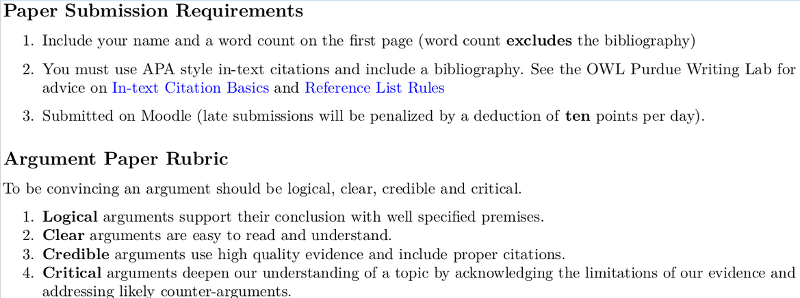
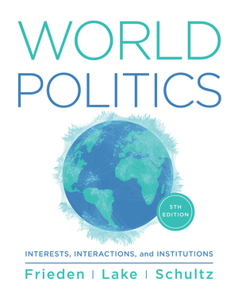
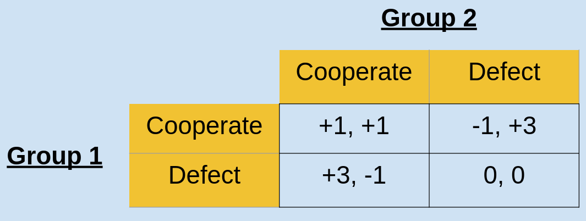

---
output:
  xaringan::moon_reader:
    css: ["default", "extra.css"]
    lib_dir: libs
    seal: false
    nature:
      highlightStyle: github
      highlightLines: true
      countIncrementalSlides: false
      ratio: '16:9'
---

```{r, echo = FALSE, warning = FALSE, message = FALSE}
##xaringan::inf_mr()
## For offline work: https://bookdown.org/yihui/rmarkdown/some-tips.html#working-offline
## Images not appearing? Put images folder inside the libs folder as that is the main data directory

library(tidyverse)
library(readxl)
library(stargazer)
##library(kableExtra)
##library(modelr)

knitr::opts_chunk$set(echo = FALSE,
                      eval = TRUE,
                      error = FALSE,
                      message = FALSE,
                      warning = FALSE,
                      comment = NA)
```

class: slideblue

.size80[**Today's Agenda**]

<br>

.size50[

Welcome to the prisoner's dilemma

]

<br>

.center[.size40[
  Justin Leinaweaver (Spring 2022)
]]

???

## Prep for class (Regular term)
1. Reserve an extra, nearby classroom
2. Set up the other room: Chalk and game board


---

class: middle, slideblue

.size60[**So far in this class we've...**]

.size40[
+ Used case studies to define international political events,

+ Discussed the "science" of political science and the importance of theory (models),

+ Practiced critically engaging with arguments in terms of their logic, clarity and use of empirical evidence.
]

???

That's an impressive amount of stuff!

ANY QUESTIONS ON ALL OF THAT?


---

class: middle, slideblue

.size60[.center[**Who or what is currently the biggest international threat to the United States?**]]

```{r, fig.align='center', out.width='100%'}

```

???

Don't forget, your first argument paper is due at the end of the week.

We'll have a writing workshop in class on Friday so make sure to bring a rough draft of your paper to class.


---

class: slideblue

.size50[**Frieden, Lake and Schultz (2016)**]

.pull-left[
<br>
<br>
.size50[
+ **Interests**

+ **Interactions**

+ **Institutions**
]]

.pull-right[

```{r, fig.align='right', out.width='75%'}

```
]

???

Today we add a new set of tools to your arsenal.

What the Frieden, Lake and Schultz book refers to as interests, interactions and institutions.

Rather than start with the theory, I prefer to start with practice.

So, let's play a game for bonus points!

<br>

The Game:

I'll split the class into two groups.


---

class: middle, slideblue

.size70[**A Prisoner's Dilemma**]

<br>

.size50[
+ Each round your group must choose to cooperate or defect.

+ Your reward depends on the choice made by the other group.
]

???

Each round your group must decide whether or not to cooperate with the other group.

Depending on how each group chooses, points are added or subtracted from your total

At end, all positive points earned by your group will be added to your final grade as EC.


---

class: middle, slideblue

.size50[**A Prisoner's Dilemma**]

.size30[
+ Each round your group must choose to cooperate or defect.
+ Your reward depends on the choice made by the other group.
]

```{r, fig.align='right', out.width='95%'}

```

???

Here's what I mean by saying your reward depends on the choice of the other team.

ANY QUESTIONS ABOUT HOW THE GAME WORKS?

<br>

Think about the reading you did for today and tell me:

1. WHO ARE THE INTERESTS INVOLVED IN THIS GAME?
(1. Each individual student, and)
(2. The team as a collective decision maker)

<br>

2. WHAT IS IT THAT EACH OF YOU WANT FROM THIS GAME?
(- Maximize your bonus points?)

* Don't volunteer the following, might skew play? *
(- Ensure that your group thinks well of you?)
(- Ensure the other group thinks well of you?)
(- Ensure an equitable distribution of bonus points across the class?)

<br>

3. WHY CAN'T YOU GET WHAT YOU WANT?
(No idea what the other team will do)

<br>

* Split class in half *

* Have everyone gather their stuff and head to their room *

From this moment, no communication between the groups!

No computers, no phones.

<br>

IN 5 MINUTES YOU WILL NEED TO GIVE ME YOUR DECISION FOR ROUND 1.

Group 1 stay here, group 2 across the hall.

<br>

For today:

6 rounds (x4-5 mins)
each group send one sentence message to other group
one final round (5 mins)

<br>

* After final round, all back to main room *


---

class: middle, slidegreen

.size60[**For Wednesday**]

.size40[
Frieden, Lake & Schultz (2016). "Understanding Interests, Interactions and Institutions." (**ONLY p57-68**)]

???

For Friday, you have a reading assigned and I want us to start class with your answers to the following two questions:

--

.size40[
1) What did I learn about myself from the game?
]

???

WHAT DID I LEARN ABOUT MYSELF FROM THE GAME?

This is not time for heartfelt revelations.

This is about how you personally thought through the game.

- Arguments you found effective? Those that were ineffective.

- What was your first assumption? Did it change as the game went on?

- How did you deal with the uncertainty?

- How did you deal with your group?


--

.size40[
2) What did I learn about my classmates from the game?
]

???

WHAT DID I LEARN ABOUT MY CLASSMATES FROM THE GAME?

NOT about hurt feelings and betrayal.

Dominant strategy in this game is defect.