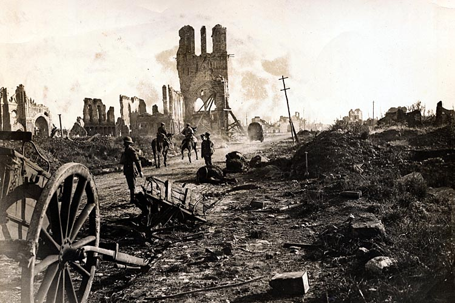

## Today's Agenda {background-image="Images/background-worldmap4.png" .center}

```{r}
# background-size="1920px 1080px"
library(tidyverse)
library(readxl)
```

<br>

::: {.r-fit-text}

**II. Why Are There Wars?**

- The offensive realist answer (Mearsheimer 2001)

:::

<br>

::: r-stack
Justin Leinaweaver (Fall 2026)
:::

::: notes
Prep for Class

1. Fix end slide if next class is liberalism or writing workshop

2. Markers x 4

3. *Save current events talk for recapping neorealism*

<br>

**SLIDE**: Section 2 of the class

:::


## Section 2: Why Are There Wars? {background-image="Images/background-worldmap4.png" .center}

```{r, fig.align='center'}

```

::: notes

Last class we began exploring the next section of our class: Why Are There Wars?

<br>

**Refresh my memory, why is this a puzzling question?**

<br>

**SLIDE**: Section 2 of the class

:::


## Section 2: Why Are There Wars? {background-image="Images/background-worldmap4.png" .center}

<br>

- **Neorealism**

- Offensive Realism

- Liberal Institutionalism

- Economic Liberalism

- Bargaining Model of War

::: notes

So, war is a puzzle that needs to be explained

- This list represents the competing theories of international relations that we are going to explore to explain this puzzle

<br>

**Remind me, what does it mean to say that scientific models are like maps?**

- **What does that mean is true for all of these theories?**

<br>

So, all of these models are simplifications of reality that are neither true nor false

- HOWEVER, we hope that they are useful for explaining and predicting international political events

<br>

In order to help you come to understand these theories we will be breaking them down into three key components

- **What are those three components or characteristics of an IR theory?**

- (interests, institutions and interactions)

<br>

Good, let's now use those three components to analyze neorealism

<br>

**What does it mean to identify the "interests" in a theory?**

- (The actors making the key decisions and their preferences)

<br>

**And, according to neorealism, who are the interests we should focus on to explain international political events?**

- (**SLIDE**)

:::


## Neorealism (Waltz 1988) {background-image="Images/background-worldmap4.png" .center}

<br>

**Interests**

- Unitary states want security, not power

::: {.fragment}

**Institutions**

- International anarchy

:::

::: {.fragment}

**Interactions**

- You must fend for yourself (threats are everywhere)
- Security dilemmas dominate

:::

::: notes

Clarifying questions

- **What does "unitary" mean?**

- **Why security and not power?**

<br>

**Ok, second component, what does it mean to identify the "institutions" in a theory?**

- (The rules of the game)

<br>

**And, what are the key institutions in neorealism?**

- (**REVEAL**)

- **What does anarchy mean in this context?**

- (No supranational authority, e.g. a power above states)

<br>

**Finally, what does it mean to identify the "interactions" in a theory?**

- (“The ways in which the choices of two or more actors combine to produce political outcomes” (51).)

<br>

**And, what are the key interactions in neorealism?**

- (**REVEAL**)

- **What is the dilemma in a security dilemma?**

- (No such thing as purely defensive actions; if you get more secure, I get less secure!)

<br>

Excellent, put all this together for me.

- **What is an international political event that this model explains really well?**

<br>

**And what is an international political event that this model does NOT explain well?**

<br>

**Overall, what are the strengths and weaknesses of this as our model of international politics?**

<br>

**SLIDE**: Today we shift to a competing model called Offensive Realism
:::


## Offensive Realism (Mearsheimer 2001) {background-image="Images/05_2-putin_with_gun_v2.png" .center}

<br>

::: {.r-fit-text}

Let's diagram the model!

+ Who are the key interests?

+ What are the key institutions?

+ What are the primary interactions that matter?

:::

::: notes

On your own, 5 mins, diagram offensive realism as an answer to these three questions

- Force yourself to write this down!

- It's way harder, and much more productive, when you have to put pencil to paper

- Go!

<br>

Ok, consolidate diagrams with the person next to you

- Get ready to report back your diagrams

<br>

**Ok, pairs, who are the interests in offensive realism?**

- (**SLIDE**)

:::


## Offensive Realism (Mearsheimer 2001) {background-image="Images/background-worldmap4.png" .center}

**Interests**

- Great powers seeking hegemony

**Institutions**

- ?

**Interactions**

- ?

::: notes

**Clarify this for me, how is this first assumption different from neorealism?**

- (Not all states matter for explaining international political events)

- (Not about security, but hegemony, e.g. the pursuit of regional dominance)

<br>

So, Mearsheimer looked at neorealism and thought, world politics is driven by the most powerful states pursuing power, not all states worried about survival.

<br>

**Ok, pairs, who are the institutions in offensive realism?**

- (**SLIDE**)

:::


## Offensive Realism (Mearsheimer 2001) {background-image="Images/background-worldmap4.png" .center}

**Interests**

- Great powers seeking hegemony

**Institutions**

- International anarchy

**Interactions**

- ?

::: notes

The same!

- This is probably what most closely unites the two theories as "realist"

<br>

**Ok, pairs, who are the interactions in offensive realism?**

- (**SLIDE**)

:::


## Offensive Realism (Mearsheimer 2001) {background-image="Images/background-worldmap4.png" .center}

**Interests**

- Great powers seeking hegemony

**Institutions**

- International anarchy

**Interactions**

- Great powers have offensive military capacity
- Attack may come at any time (uncertain intentions)
- Weakness invites attack (rational opponents)

::: notes

So, for Mearsheimer world politics are not a security dilemma, they are driven by powerful states constantly seeking advantage over their neighbors!

<br>

Before we dig into the theory, let's explore the idea of "greatness" here

- *Split class into four groups (maximize board space)*

- Go sit with your group!

- **SLIDE**
:::


## Who are the great powers? {background-image="Images/05_2-justice-league2_v2.png" .center}

<br>

::: {.r-fit-text}

On the Board:

1. Make a list of the characteristics of a "great" power

2. Give us ten countries that pass your test

::: {.fragment}
3. Rank the ten!
:::
:::

::: notes

Groups I want you to put two things on the board:

1. Create a list of criteria that make a country "great", and

2. Name 10 countries that meet your definition of "great"

<br>

*After working for a while*

- **REVEAL**: Rank them!

<br>

**Questions on the task?**

- *PRESENT and DISCUSS each*

:::


## Criteria of Great Powers {background-image="Images/05_2-justice-league2_v2.png" .center}

<br>

::: {.r-fit-text}

Waltz, K. (1979). *Theory of International Politics*. McGraw-Hill.

- **Size of population & territory**

- **Resource endowment**

- **Economic capability**

- **Military strength**

- **Political stability and competence**

:::

::: notes

Here is Kenneth Waltz’s criteria for qualifying as a "great power."

- **Whose list is better, his or ours? Why?**

<br>

**Can everybody see how this is a huge problem for this theory?**

- (No single definition of “great” or “powerful” will be appropriate in all contexts.)

<br>

**Given that defining a "great power" is so problematic, why in the world might someone prefer offensive to neorealism?**

<br>

1) We prefer simple models to more complex ones

- Fewer moving parts means easier to apply.

- Need less information / time to make predictions

- Less room for measurement error to mess up how your model works

<br>

2) While "great" is debatable, most definitions identify the same countries

- If you expand the list enough it gets hazy, but identifying the absolutely most powerful states isn't that hard to do.

<br>

3) Offensive realism allows us to make different predictions than the others

- **SLIDE**: Let's talk about how!

:::


## {background-image="Images/05-2-lex_luthor.jpg"}

<p style="color: white;">**Offensive Realism**</p>


::: notes

Offensive realism covers essentially the same ground as neorealism.

- Makes sense given the shared assumptions about unitary states and anarchy.

- However, they disagree fundamentally about who matters and what they want

<br>

**So, in what specific ways would offensive realism make different predictions from Neorealism?**

<br>

OR emphasizes "power maximization" as an expectation rather than just stopping with the security dilemma.

- OR's argue "power maximization" is the logical conclusion from their argument

- It means that the ultimate goal of every great power is hegemony

- Mearsheimer defines hegemony as a state of total domination
    
<br>

**Why does Mearsheimer argue great powers MUST pursue hegemony? Why not stop when you feel safe?**

1. (Hard to assess relative power.)

    - I can’t tell precisely by how much I am stronger or weaker than you.

2. (Even harder to project into the future.)

    - Across time I can’t know how our powers’ will change.

<br>

**Does that make sense?**

<br>

And I just want to show you, Mearsheimer understands the implications of his theory.
:::


## {background-image="Images/05_2-mearsheimer-quote.jpg" background-size='96%'}

::: notes

This dude is hard core.
:::


## Reminders {background-image="Images/background-worldmap4.png" .center}

<br>

Paper 1 is due today (before midnight!)

<br>

Monday we analyze liberal institutionalism

- Readings on Canvas and a reflection due before class

::: notes

**TIME REMAINING: Questions on the paper? Writing workshop time**

<br>

Canvas: The "Liberal" Answer

FLS ch2 introduces you to how institutions can be used to help states overcome serious problems at the international level and the Kant excerpt presents an argument in favor of a series of specific institutions that he believes will collectively end all wars. Your pre-class assignment is to connect the dots between these two readings. 

1. Connect EACH of Kant's "Definitive Articles for Perpetual Peace" to the mechanisms in the FLS chapter. In other words, how does Kant's "First" definitive article connect to a specific mechanism FLS argues promotes cooperation? And the "Second"? And the "Third"?
2. Generally speaking, do you believe Kant's proposal, or any other international rules, could succeed in preventing most future wars? 


:::


##

Slides for different number of classes this week


## Assignment for Next Class {background-image="Images/background-worldmap4.png" .center}

<br>

::: {.r-fit-text}
**Writing Workshop**
:::

::: notes

Friday we will have a writing workshop.

- Bring in your drafts to get feedback from each other and to work!

:::
