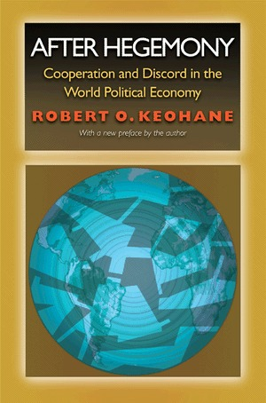

## Today's Agenda {background-image="Images/background-worldmap4.png" .center}

```{r}
# background-size="1920px 1080px"
library(tidyverse)
library(readxl)
```

<br>

::: {.r-fit-text}

**II. Why Are There Wars?**

- The liberal institutionalist answer

:::

<br>

::: r-stack
Justin Leinaweaver (Spring 2025)
:::

::: notes
Prep for Class

1. Review Canvas submissions

2. Timings (with wiggle room)
    - 5 mins: set-up
    - 30 mins: Evaluate Kant's definitive articles
    - 10 mins: Use FLS to map out Keohane's model

3. Readings
    - Kant on perpetual peace
    - FLS ch2 on institutions
    
<br>

Currently omitting the Doyle reading which offers the counter-arguments to Kant. May want to bring this back in.

<br>

**DISCUSS: Name me an international political event that has happened since we last met as a class.**
:::


## Section 2: Why Are There Wars? {background-image="Images/background-worldmap4.png" .center}

<br>

- Neorealism

- Offensive Realism

- Liberal Institutionalism

- Economic Liberalism

- Bargaining Model of War

::: notes

Last week we started exploring the established IR answer to the puzzling question, why are there wars?

### What is the Neorealist answer?
- (A: Anarchy -> Fear)
- (Neorealism: States want to survive, war comes from uncertainty and the security dilemma.)

<br>

### What is the Offensive Realist answer?
- (A: Anarchy -> Great powers must pursue regional hegemony)
- (Offensive realism: Powerful states want hegemony and war comes from the pursuit of it!)

<br>

This week we're going to explore two models that fit under the broad label of liberalism.

- This isn't liberal like the term is used in American politics and it's not liberal like economists use it.

- I don't know why this word is used so many different ways, but it certainly keeps us on our toes.
:::


## {background-image="Images/08-3-peace_dove_mural.jpg"}

<br>

<br>

<br>

<br>

<br>

<br>

<br>

<br>

<br>

::: {.r-fit-text}
<p style="color: white;">**Liberal Institutionalism**</p>
:::

::: notes

Today we explore one of the biggest implications of many liberal models of international relations.

- The existence, or not, of a democratic peace.

<br>

The fundamental idea here is that the spread of democratic institutions and economic exchange leads us to a more peaceful world.

- Interestingly, this is an argument with very, very old roots.

- Today I want us to explore the roots of this idea and then use the FLS chapter to map out the model itself

<br>

Let's start with the excerpt from Immanuel Kant.

### What is Kant's goal in this article?
- (Help the world achieve perpetual peace)

<br>

### And what does "perpetual" peace mean?
- (Never ending)
:::


## Kant (1798): Perpetual Peace {background-image="Images/background-worldmap4.png" .center .smaller}

<br>

**The First Definitive Article for Perpetual Peace**

- "The Civil Constitution of Every State Should Be Republican"

**The Second Definitive Article for Perpetual Peace**

- "The Law of Nations Shall be Founded on a Federation of Free States"

**The Third Definitive Article for Perpetual Peace**

- "The Law of World Citizenship Shall Be Limited to Conditions of Universal Hospitality"

::: notes

Kant argues that adopting these three principles will eventually lead us to a world of perpetual peace.

- I think we'd all agree that everlasting peace is a nice goal.

<br>

The question is, how close does Kant get us to achieving that goal?

- Let's dig into both sides on each of these.

<br>

*Split class into three groups and assign one article to each*

- Go sit with your groups and claim some space on the board!
:::


## Kant's (1798) path to perpetual peace {background-image="Images/background-worldmap4.png" .center}

<br>

### Would the world be more peaceful (fewer wars) if every country adopted this article?

1. What does this article require us to do?

2. Why might it work?

3. Why might it fail?

::: notes

*old prompt: Would the global adoption of this article advance the cause of global peace?*

<br>

Groups, you have 15 minutes to prepare an answer to this question: 

- Would the global adoption of this article advance the cause of global peace?

- You have to work directly on the board to make two lists: Pros vs Cons

<br>

### Questions?

- Get to work!

<br>

*Make sure they work directly on the board so you can push them*

*If one group finishes too quick, send them to help another group*

:::


## {background-image="Images/background-worldmap4.png" .center}

**The First Definitive Article for Perpetual Peace**

- "The Civil Constitution of Every State Should Be Republican"

<br>

### Would the world be more peaceful (fewer wars) if every country adopted this article?

1. What does this article require us to do?

2. Why might it work?

3. Why might it fail?

::: notes

Ok, Group 1, you're up!

- Start us off with the broad strokes before we get into your analyses.

### Define the article for us. What does a "Republican" constitution require?

(**SLIDE**: Illustrate government in two dimensions)

:::


## {background-image="Images/background-worldmap4.png" .center}

```{r, fig.retina=3, fig.align='center', fig.asp=.7, fig.width=6}
d1 <- tibble(
  x1 = c(-1, -1, 1, 1),
  y1 = c(-1, 1, -1, 1)
)

d1 |>
  ggplot(aes(x = x1, y = y1)) +
  geom_point(color = "white") +
  theme_void() +
  scale_x_continuous(limits = c(-2,2)) +
  scale_y_continuous(limits = c(-2,2)) +
  #geom_vline(xintercept = 0) +
  geom_hline(yintercept = 0) +
  annotate("text", x = c(-1.85, 0, 1.85), y = -.25, label = c("One\nSovereign", "A few are\nSovereign", "All are\nSovereign")) +
  labs(title = "Typology of Governments: Dimension 1")
```

::: notes

Let's start with the first dimension

- Per Kant, all governments in the world can be arrayed along this dimension

- Dimension 1: Who holds sovereign power?

<br>

On the extreme left are systems where all supreme authority is invested in one person

- e.g. dictatorships

<br>

The middle are the systems where all supreme authority is invested in a few or to the benefit of only a few

- e.g. aristocracies and other forms of oligarchy

<br>

On the other extreme is a system in which supreme authority belongs to everyone

- e.g. a democracy!

<br>

**Where would you put the US on this dimension? Why?**

<br>

**SLIDE**: Dimension 2

:::


## {background-image="Images/background-worldmap4.png" .center}

```{r, fig.retina=3, fig.align='center', fig.asp=.7, fig.width=6}
d1 <- tibble(
  x1 = c(-1, -1, 1, 1),
  y1 = c(-1, 1, -1, 1)
)

d1 |>
  ggplot(aes(x = x1, y = y1)) +
  geom_point(color = "white") +
  theme_void() +
  scale_x_continuous(limits = c(-2,2)) +
  scale_y_continuous(limits = c(-2,2)) +
  geom_vline(xintercept = 0) +
  geom_hline(yintercept = 0) +
  annotate("text", x = c(-1.85, 1.85), y = -.25, label = c("One\nSovereign", "All are\nSovereign")) +
  annotate("text", x = .75, y = c(-1.8, 1.8), label = c("Gov't makes and\nenforces laws", "Legislature makes laws\nExecutive enforces laws")) +
  labs(title = "Typology of Governments: Dimension 2")
```

::: notes

Dimension 2: What is the form of government? 

- aka how is power arranged in the government?

<br>

On one end the government is empowered to make AND enforce all of the rules in society

- e.g. despotism

<br>

On the other end, the institutions that make the laws are separated from those that enforce the laws

- e.g. republicanism

<br>

**Everybody clear on this typology?**

- **Where would you put the US on this dimension? Why?**

<br>

**SLIDE**: Important observation time!

:::


## {background-image="Images/background-worldmap4.png" .center}

```{r, fig.retina=3, fig.align='center', fig.asp=.7, fig.width=6}
d1 <- tibble(
  x1 = c(-1, -1, 1, 1),
  y1 = c(-1, 1, -1, 1)
)

d1 |>
  ggplot(aes(x = x1, y = y1)) +
  geom_point(color = "white") +
  theme_void() +
  scale_x_continuous(limits = c(-2,2)) +
  scale_y_continuous(limits = c(-2,2)) +
  geom_vline(xintercept = 0) +
  geom_hline(yintercept = 0) +
  annotate("text", x = c(-1.85, 1.85), y = -.25, label = c("Dictatorship", "Democracy")) +
  annotate("text", x = .35, y = c(-1.8, 1.8), label = c("Despotic", "Republic")) +
  labs(title = "Kant's Typology of Governmental Systems")
```

::: notes

**Has anyone heard the argument that America is a republic and not a democracy?**

- **How does this typology help us think about that claim?**

<br>

It's an argument built on EITHER a fundamental misunderstanding of government typologies OR an intentionally misleading argument

1. Democracy and republic are not the opposite ends of a spectrum, they are two different ways of describing the variation in a system

2. IFF we take the argument at face value, then an argument that we are a republic but not a democracy is an argument that we were designed as a dictatorship which is just stupid.

<br>

**Everybody clear on this?**

<br>

**SLIDE**: Back to the Kant!

:::


## {background-image="Images/background-worldmap4.png" .center}

**The First Definitive Article for Perpetual Peace**

- "The Civil Constitution of Every State Should Be Republican"

<br>

### Would the world be more peaceful (fewer wars) if every country adopted this article?

1. What does this article require us to do?

2. Why might it work?

3. Why might it fail?

::: notes

**What are the pros and cons of adopting this article to achieve world peace?**

<br>

#### (PRO:)
1. Organized well to meet threats; unity; 
2. Separation of powers tames the ambitions of selfish and aggressive individuals.; 
3. Consent of the people to war is hard to win because they themselves must pay the costs of war themselves.; 
4. Prevents despotism
    - **Q: What is despotism and why do we want to avoid it?** ("...the exercise of absolute power, especially in a cruel and oppressive way.")
    - **Q: How is a direct democracy despotic like a dictatorship?**  (Majority holds all of the power (exec and leg), can tyrannize over any minority)
    - **Q: Do we buy this? Is direct democracy likely to become despotic?**
5. (Doyle's idea) Regular rotation of office prevents personal animosities between heads of state from escalating across time.

#### (Con:)
1. At best, creates "caution" not "peace."; 
2. "organized well" can lead to constant preparation for war that can enhance military institutions to the point they take over a society
3. Indistinct argument; the logic is very general; 
4. Contradictory evidence; Some security obsessed states adopt liberal 
:::


## {background-image="Images/background-worldmap4.png" .center}

**The Second Definitive Article for Perpetual Peace**

- "The Law of Nations Shall be Founded on a Federation of Free States"

<br>

### Would the world be more peaceful (fewer wars) if every country adopted this article?

1. What does this article require us to do?

2. Why might it work?

3. Why might it fail?

::: notes

Ok, Group 2, you're up!

- Start us off with the broad strokes before we get into your analyses.

### What is a "Federation of Free States"? What does that require?

<br>

#### (PRO:)
1. Cooperation begets cooperation;
2. "League" not a "treaty" ends all wars not just one without imposing new civil laws on the powers of a state, just maintains peace between them
3. NOT a world state, that is tyranny
4. Demonstrated success will lead other states to join, widening the league
5. Encourage diplomacy

#### (Con:)
1. Liberalism is not inherently peace-loving; free states will not necessarily be restrained or act in pursuit of peace
2. Liberal states may, in fact, be more aggressive toward nonliberal states. 
:::


## {background-image="Images/background-worldmap4.png" .center}

**The Third Definitive Article for Perpetual Peace**

- "The Law of World Citizenship Shall Be Limited to Conditions of Universal Hospitality"

<br>

### Would the world be more peaceful (fewer wars) if every country adopted this article?

1. What does this article require us to do?

2. Why might it work?

3. Why might it fail?

::: notes

Ok, Group 3, you're up!

- Start us off with the broad strokes before we get into your analyses.

### What is "Universal Hospitality"? What does that require?

<br>

#### (PRO:)
1. More interactions, more communication should equal greater levels of peacefulness and comity.
2. NOT a right to settle or plunder, more about allowing voluntary exchanges of goods and ideas

#### (Con:)
1. How does universal hospitality not create powerful identity crises?
2. Voiceless minority in each country (no say in government as a long-term visitor) is approaching despotism for that government, right?

<br>

Generally speaking, Doyle seems enthusiastic when reframing the third article to be more about cosmopolitan law.

### What is cosmpolitan law and why is he enthusiastic about its capacity to foster peace?

(Every state embracing a "spirit of commerce" adds material incentives to the need to avoid war.)

- Trade means the greatest benefit comes from working together
- States no longer have to meddle in production and distribution questions, leave it to the businesses!
:::


## Would this work? Why or why not? {background-image="Images/background-worldmap4.png" .center .smaller}

<br>

**The First Definitive Article for Perpetual Peace**

- "The Civil Constitution of Every State Should Be Republican"

**The Second Definitive Article for Perpetual Peace**

- "The Law of Nations Shall be Founded on a Federation of Free States"

**The Third Definitive Article for Perpetual Peace**

- "The Law of World Citizenship Shall Be Limited to Conditions of Universal Hospitality"

::: notes
**All in all, which side do you find more convincing? Why?**

<br>

### What are the strongest part's of Kant's argument?

#### - Which would be the easiest one to implement? Why?

<br>

### What are the weakest parts?

#### - Which would be the hardest to implement? Why?

<br>

*Depending on Time Remaining*
- Next slide are the six preliminary articles from Kant
- **After that diagram the model (skip to this if time is short!)**
:::


## Kant's Preliminary Articles {background-image="Images/background-worldmap4.png" .center .smaller}

1. No secret treaty of peace shall be held valid in which there is tacitly reserved matter for a future war

2. No independent states, large or small, shall come under the dominion of another state by inheritance, exchange, purchase, or donation

3. Standing armies shall in time be totally abolished

4. National debts shall not be contracted with a view to the external friction of states

5. No state shall by force interfere with the constitution or government of another state

6. No state shall, during war, permit such acts of hostility which would make mutual confidence in the subsequent peace impossible: such are the employment of assassins (percussores), poisoners (venefici), breach of capitulation, and incitement to treason (perduellio) in the opposing state

::: notes

So, here's the deal, in Kant's full essay he proposes six preliminary articles that must be adopted in order for his main three articles to achieve peace.

### Do you think adding these preliminary articles make the plan stronger or weaker? Why?

<br>

### Which would be the easiest ones to implement? Why?

<br>

### Which would be the hardest to implement? Why?

<br>

**SLIDE**: Let's diagram the model!

<br>

*Notes on Each*
1. No reservations or agreements to decide contentious issues later. Settle everything now.
2. A state is not property, it is a society of men who no one outside their state has a right to command or dispose of.
3. Also applies to bulding up of massive treasuries, building up these resources is a threat to others.
4. Trade built on credit systems (blames England explicitly) leads to amassing treasure and seeking war
5. However, you can jump in and pick sides in a civil war. For some reason that's not a problem.
6. ?
:::


## {background-image="Images/background-worldmap4.png"}

::: {.r-fit-text}
**Liberal Institutionalism (Keohane 1984)**
:::

{.absolute left=75 width=350}

{.absolute right=75 width=350}

::: notes

Ok, let's turn to the excerpt from the Frieden, Lake and Schultz book chapter for today

- This excerpt lays out all the ways that institutions can be important in explaining international political events

<br>

Most of these big ideas come from a very important book by Robert Keohane (1984)

- For your notes, use Keohane as the citation for this model

:::


## {background-image="Images/background-worldmap4.png" .center}

::: {.r-fit-text}
**Liberal Institutionalism (Keohane 1984)**
:::

**Interests**

- ?

**Institutions**

- ?

**Interactions**

- ?

::: notes

Ok, based on everything we've done today in exploring Kant and your reading of FLS, I want you to help me diagram this theory in terms of its interests, institutions and interactions.

<br>

### Who are the key interests making decisions in this model of international politics and what do they want?
- (**SLIDE**)
:::


## {background-image="Images/background-worldmap4.png" .center}

::: {.r-fit-text}
**Liberal Institutionalism (Keohane 1984)**
:::

**Interests**

- Unitary, rational states pursuing absolute (not relative) gains

**Institutions**

- ?

**Interactions**

- ?

::: notes

Interests: 
- Accept the Realist structure (unitary states) but with a tweak to the interests.

- This is what, I suspect, Kant hoped for with the adoption of Republican Constitutions: Systems that prioritize absolute, not relative, gains.

<br>

### And what are the key rules of the game these states are operating within?

- (**SLIDE**)
:::


## {background-image="Images/background-worldmap4.png" .center}

::: {.r-fit-text}
**Liberal Institutionalism (Keohane 1984)**
:::

**Interests**

- Unitary, rational states pursuing absolute (not relative) gains

**Institutions**

- International anarchy PLUS international institutions (e.g. laws and organizations)

**Interactions**

- ?

::: notes

Institutions: 
- Accept the Realist baseline (anarchy), BUT

- Argue that states have worked hard to infringe on the anarchy by creating international institutions (e.g. the UN, ICJ, ICC, IMF, World Bank, and on and on...)

- This is the evolution of Kant's desire for a "federation of free states". A layer on top of anarchy.

<br>

### And what are the key interactions that alter state decision-making?

- (**SLIDE**)
:::


## {background-image="Images/background-worldmap4.png" .center}

::: {.r-fit-text}
**Liberal Institutionalism (Keohane 1984)**
:::

**Interests**

- Unitary, rational states pursuing absolute (not relative) gains

**Institutions**

- International anarchy PLUS international institutions (e.g. laws and organizations)

**Interactions**

- International institutions can help to overcome cooperation dilemmas, reduce uncertainty, distribute benefits

::: notes

Interactions: 
- Institutional rules change the dynamics of decision-making by states in important ways (see Keohane)
    - Reducing transaction costs
    - Providing information
    - Making commitments more credible
    - Establishing focal points for coordination
    - Facilitating the principle of reciprocity
    - Extending the shadow of the future
    - Enabling interlinkages of issues, which raises the cost of noncompliance

- The Federation and the principal of universal hospitality lead to a place wherein our institutions can HOPEFULLY overcome anarchy's impulse to war.

<br>

### Questions on this model?

<br>

### Questions on how this model answers our question about "why wars"?

- Same general sources as Realists, but war is also a failure of the institutions we have created!
:::


## Assignment for Next Class {background-image="Images/background-blue_triangles.jpg" .center}

<br>

::: {.r-fit-text}

The Economic Liberal answer

1. Nye (2007)

2. Rosecrance (1986)

:::

::: notes
...
:::