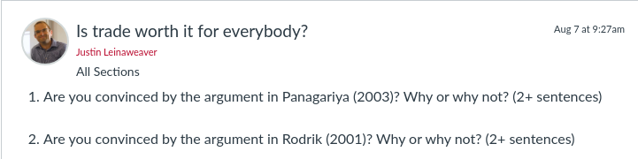

## Today's Agenda {background-image="libs/Images/background-worldmap4.png" .center}

```{r}
# background-size="1920px 1080px"
library(tidyverse)
library(readxl)
```

<br>

<br>

**II. Why Are There Wars?**

- The Economic Liberal Answer

<br>

::: r-stack
Justin Leinaweaver (Spring 2024)
:::

::: notes
Prep for Class

1. Check Canvas participation

<br>

### DISCUSS: Name me an international political event that has happened since we last met as a class.

:::


## {background-image="libs/Images/08-3-peace_dove_mural.jpg"}

<br>

<br>

<br>

<br>

<br>

<br>

<br>

<br>

<br>

::: {.r-fit-text}
<p style="color: white;">**Democratic Peace Theory**</p>
:::

::: notes

Last class we explored the roots of democratic peace theory.

<br>

### What are the key interests, institutions and interactions in this model of international politics? 

- (**SLIDE**)
:::


## Democratic Peace Theory {background-image="libs/Images/background-worldmap4.png" .center .smaller}

**(similar to Liberal Institutionalism)**

<br>

**Interests**

- Unitary, rational states pursuing absolute (not relative) gains

**Institutions**

- International anarchy PLUS international institutions (e.g. laws and organizations)

**Interactions**

- International institutions can help to overcome cooperation dilemmas, reduce uncertainty, distribute benefits

::: notes

Let's give this theory a test run.

### Name a recent international political event and use this theory to explain it.

- *Force this discussion / exploration*

<br>

Liberalism, in broad strokes, is an argument that even though **it'll be REALLY hard, it IS possible for countries and people to cooperate.**

- This runs counter to the arguments of realists who argue that meaningful cooperation is basically impossible.

- This maps nicely onto the development of IR as a subfield of Poli Sci.
    - WW1 and WW2 devastate the world, hence realism
    - Post-war reconstruction and institution building not quite as terrifying as feared.
    - The question was, why not?

<br>

The thing is, various scholars have advanced different mechanisms to explain how states can achieve cooperation.

- Last class we talked international organizations

- Today we talk trade!

<br>

#### Notes

According to Robert Keohane and other liberal institutionalists, institutions facilitate cooperation by:
- Reducing transaction costs
- Providing information
- Making commitments more credible
- Establishing focal points for coordination
- Facilitating the principle of reciprocity
- Extending the shadow of the future
- Enabling interlinkages of issues, which raises the cost of noncompliance

:::


## Economic Liberalism {background-image="libs/Images/background-worldmap4.png" .center .smaller}

<br>

**Interests**

- ?

**Institutions**

- ?

**Interactions**

- ?

Therefore, increasing trade should reduce the occurrence of war.

::: notes

To start, everybody focus on the Nye reading to diagram this argument.

<br>

Take 5 minutes on your own.

- Remember, our models are built on interests, institutions and interactions.

- Focus on clarifying those three pieces of the model.

<br>

Now combine diagrams with the person next to you (small groups).

- Consolidate to a single argument.

<br>

*ON BOARD*

### Ok, give me premises, let's diagram this version of the argument.

##### (Interests)
- States want to grow

##### (Institutions)
- States may choose to start wars or to seek trade (international anarchy). International anarchy means it's basically up to them.

##### (Interactions)
- War is risky (you may lose)
- The returns to trade grow over time
- Increasing trade transforms the state's "social structure"
:::


## Economic Liberalism {background-image="libs/Images/background-worldmap4.png" .center .smaller}

<br>

**Interests**

- States want growth

**Institutions**

- States may choose to start wars or seek trade (anarchy)

**Interactions**

- War is risky
- The returns to trade grow over time
- Increasing trade transforms the state's "social structure"

Therefore, increasing trade should reduce the occurrence of war.

::: notes

My version of the diagram.

- Therefore, increasing trade should reduce the likelihood of war.

- Very much still in line with the realists view of institutions, right?

<br>

### Is this a logical argument? Why or why not?

<br>

Let's talk about whether or not this is convincing.

### What are the strongest and weakest parts of this model?

<br>

### What evidence could I show you to convince you of each premise?

(Fourth premise is too vague to be evaluated with evidence.)
:::


## Economic Liberalism {background-image="libs/Images/background-worldmap4.png" .center .smaller}

<br>

**Interests**

- States want growth

**Institutions**

- States may choose to start wars or seek trade (anarchy)

**Interactions**

- War is risky
- The returns to trade grow over time
- **...?**

Therefore, increasing trade should reduce the occurrence of war.

::: notes

We need more detail about the mechanism itself in order to be convinced.

### With the person next to you, use the Rosecrance excerpt to modify and clarify this model of international politics.

- Focus on his description of "the trading world."

<br>

### Ok, give me options?

*DISCUSS EXAMPLES*
:::


## Economic Liberalism {background-image="libs/Images/background-worldmap4.png" .center .smaller}

<br>

**Interests**

- States want growth

**Institutions**

- States may choose to start wars or seek trade (anarchy)

**Interactions**

- War is risky **and disrupts trade**
- The returns to trade grow over time
- **Specialized economies are dependent on trade for growth**

Therefore, increasing trade should reduce the occurrence of war.

::: notes

Here is one version.

* Add: War disrupts trade AND Specialized economies are dependent on trade for growth *

<br>

### What is economic specialization?

- (The idea is that the world economy grows best when everyone focuses on doing the things they are best at.)

- You then buy the other stuff you need from the rest of the world.

<br>

**SLIDE**: To illustrate
:::


## {background-image="libs/Images/11_1-vineyard.jpg"}

::: notes

Let's say you own a vineyard in France.

- You and your family have hundreds of years of experience making the best wines in the world

- You've developed extensive expertise in wine-making and your facilities are perfectly tailored to make wine

<br>

One day somebody comes to you and points out that car companies make bigger profits than vineyards.

<br>

### What should you do? Should you seek to diversify your investments and and also start making cars?

+ (**SLIDE**: Sweet jesus, no)
:::


## {background-image="libs/Images/08-1-car_from_scratch.jpeg"}

::: notes

Let's say you clear out a few acres and decide to start building your own cars.

- You are now producing less wine and at a lower quality, PLUS

- You are dumping money into developing the infrastructure you need to make cars.

<br>

Even if you were to get REALLY good at making cars, this split focus will never maximize your profits.
:::


## {background-image="libs/Images/11_1-honda.jpg"}

::: notes

THIS is your competition.

- No amount of part-time car building will be able to compete with this level of efficiency, expertise and innovation.

- If you were to try and also make cars to compete with Honda your wine would suffer and you'd never get good enough at making cars to succeed.

<br>

Now think about this at the level of the national economy.

<br>

At that level EVERYONE has been made worse off by your attempt to diversify your holdings.

- You are producing less quality goods,

- You are producing less of those goods, and

- These reduced revenues will translate into smaller taxes paid and fewer people employed.

<br>

### Does that make sense?
:::


## Economic Liberalism {background-image="libs/Images/background-worldmap4.png" .center .smaller}

<br>

**Interests**

- States want growth

**Institutions**

- States may choose to start wars or seek trade (anarchy)

**Interactions**

- War is risky and disrupts trade
- The returns to trade grow over time
- Specialized economies are dependent on trade for growth

Therefore, increasing trade should reduce the occurrence of war.

::: notes
**What is the advantage of this version of the argument over the earlier version proposed by Nye?**
- (We can test it much more easily!)

<br>

### What evidence could we look for to evaluate the specialization assumption?
- (Examine countries over time, have those who increased their trade also reduced the number of areas they work in?)

<br>

### What evidence could we look for to evaluate the 'war disrupts trade' premise?
- (Cases where war breaks out between two states and trade continues at same level as before.)
:::


## Democratic Peace Theory {background-image="libs/Images/background-worldmap4.png" .center .smaller}

**(similar to Liberal Institutionalism)**

<br>

**Interests**

- Unitary, rational states pursuing absolute (not relative) gains

**Institutions**

- International anarchy PLUS international institutions (e.g. laws and organizations)

**Interactions**

- International institutions can help to overcome cooperation dilemmas, reduce uncertainty, distribute benefits

::: notes
**So, why is Economic Liberalism similar to Democratic Peace Theory?**

- **What are the commmon "liberal" elements of these two models?**

- (The realists can be right about all the basics (anarchy, uncertainty and fear), but their model is missing trade)

- (In a world of trade, conflict is not inevitable!)
    - The desire for growth by fearful states leads to trade
    - Trade leads to specialization and interdependence.
    - Therefore, trade raises the costs of war

Therefore, simply adding trade to the model makes conflict less likely even in an anarchic world.

<br>

### Make sense?

<br>

Now, Rosecrance tells us not to get ahead of ourselves with this.

- According to Rosecrance, there are at least two conditions under which trade leads to war.

<br>

### What is the first condition?

(**SLIDE**)
:::


## {background-image="libs/Images/11_1-usa_protectionism.png"}

::: notes

1. Where states are self-sufficient they will not be transformed by trade and therefore might still view war as a means to grow economically.

<br>

### If this is true, what does that tell us about the impact of "buy american" promotions?

Likely created by well-intentioned people trying to protect jobs.
- But does it also make for states that are more likely to go to war?

Unlikely a problem for US because we still trade a TON with the world.

<br>

### Does this mean we should oppose "buy american" promotions? Why or why not?

<br>

### What is the second case in which trade does not lead to peace?
(2. Where resources are limited and rules do not exist, conflict over those resources is still likely.)
:::


## {background-image="libs/Images/11_1-cartoon.png"}

::: notes

### How does a melting ice cap in the Arctic make for a dangerous world according to Rosecrance?

As the ice melts it is getting MUCH easier for states to see the Arctic seabed as a profitable resource.
- According to economic liberal theory, the arctic may be a profound source of international instability given that no one "officially" owns it.

<br>

### Everybody clear on these two exceptions?
:::


## Economic Liberalism {background-image="libs/Images/background-worldmap4.png" .center .smaller}

<br>

**Interests**

- States want growth

**Institutions**

- States may choose to start wars or seek trade (anarchy)

**Interactions**

- War is risky and disrupts trade
- The returns to trade grow over time
- Specialized economies are dependent on trade for growth

Therefore, increasing trade should reduce the occurrence of war

::: notes
**Ok, at this point, how convincing do you find this model of international politics?**

<br>

### Is this a more useful model than neorealism or offensive realism? Why or why not?
:::


## {background-image="libs/Images/08-1-trade_protest.jpg"}

::: notes

Next class we shift our exploration of trade onto the costs.

<br>

The Question: Are the economic benefits of trade worth the costs? 

- In other words, if trade brings peace BUT increases inequality and exploitation is it still worth it?
:::


## Assignment for Next Class {background-image="libs/Images/background-blue_triangles.jpg" .center}

<br>

```{r, echo = FALSE, fig.align = 'center', out.width = '100%'}

```

::: notes
**Questions on the assignment?**
:::

