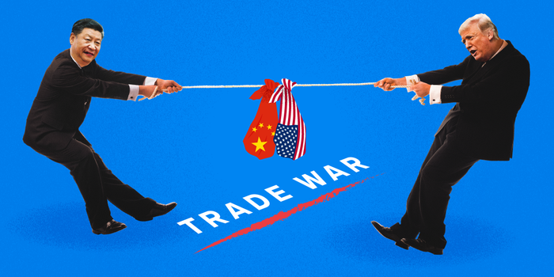
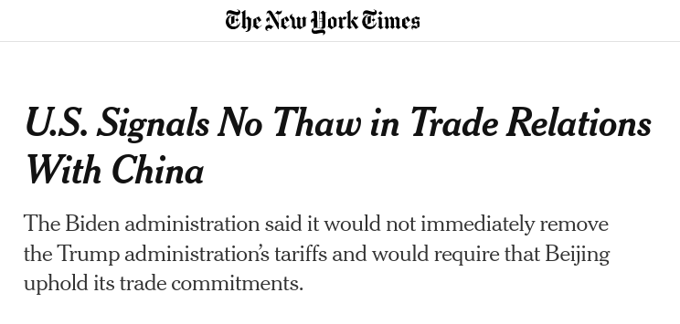

## Today's Agenda {background-image="Images/background-worldmap4.png" .center}

```{r}
# background-size="1920px 1080px"
library(tidyverse)
library(readxl)
```

<br>

<br>

**II. Why Are There Wars?**

- Is peace worth the Economic Liberal price?

<br>

::: r-stack
Justin Leinaweaver (Fall 2024)
:::

::: notes
Prep for Class

1. Check Canvas submissions

<br>

### DISCUSS: Name me an international political event that has happened since we last met as a class.

<br>

### How could we explain that event using our theories of international relations?

### - Neorealism, offensive realism, democratic peace theory or economic liberalism?

<br>

Last class we started digging into our next answer to the question, why do wars happen?

### What is the answer according to Economic Liberals?

- (**SLIDE**)

<br>

**Optional R&R announcement**

I think I'll have all the papers graded by this afternoon and so hope to have them released to you today.

- **SLIDE**: With that in mind, let's talk next steps!
:::


## {background-image="Images/05_2-Peer_Review.png"}

::: notes

Congratulations all, you've completed the first step in building a convincing, academic argument.

- You constructed a logical argument, supported it with evidence and worked to address expected critiques of it.

<br>

My job as the peer reviewer is to push back on all of it to help you make the strongest version of your argument possible.

<br>

Your next job is to reflect on that feedback and then to revise the paper to make it stronger.
:::


## Revise and Resubmit Paper 1 {background-image="Images/background-worldmap4.png" .center}

**(Due Mar 1st)**

<br>

**Submit to Canvas** a revision of your first draft that:

1. Addresses **ALL** of the feedback, AND

2. Highlights **ALL** of your changes.

::: notes

Arguably, THIS is the more important step in the process.

- Learning to take on board feedback and strengthen your arguments will be key to developing your skills in making convincing, high quality arguments.

<br>

Revisions will be accepted for two weeks.

### Questions on the revision process?
:::


## Economic Liberalism {background-image="Images/background-worldmap4.png" .center .smaller}

<br>

**Interests**

- States want growth

**Institutions**

- States may choose to start wars or seek trade (anarchy)

**Interactions**

- War is risky and disrupts trade
- The returns to trade grow over time
- Specialized economies are dependent on trade for growth

Therefore, increasing trade should reduce the occurrence of war

::: notes

Trade -> specialization -> peace

<br>

### Remind me, what is specialization?
- (The idea is that the world economy grows best when everyone focuses on doing the things they are best at.)
    - You then buy the other stuff you need from the rest of the world.

<br>

### And why does specialization lead to interdependence?
- (If you grow to depend on other states to provide you with what they do best so you can focus on your what you do best then you'd be crazy to start a war that disrupts the flow of trade.)

<br>

### In what kinds of cases does Rosecrance note that Economic Liberalism fail to promote peace?
1. Where states are self-sufficient they will not be transformed by trade and therefore might still view war as a means to grow economically.
2. Where resources are limited and rules do not exist, conflict over those resources is still likely.
:::


## {background-image="Images/11_2-Example-US_China_Trade.png"}

::: notes

Let's use this model to help us analyze the US position as a trading partner to the world.

- Here we see the top 15 trade partners of the US in 2011.

<br>

### What do we learn from this about the US position in the world?

<br>

### What does Economic Liberalism tell us to expect based on this data? What kinds of behavior should we see from the US and from its trade partners?

<br>

Now, zoom in on China.

<br>

### What is the benefit to us of all these imports coming in from China?

- (Cheap stuff for consumers means quality of life increasing!)
    - Prices fall
    - You get more stuff for your spending

<br>

### And what does economic liberalism tell us to expect about this deep trade relationship between the US and China?
:::


## {background-image="Images/background-worldmap4.png" .center}

:::: {.columns}
::: {.column width="50%"}

<br>

<br>

```{r, fig.align='left'}

```
:::

::: {.column width="50%"}
```{r, fig.align='right'}
knitr::include_graphics("Images/11_2-Example-US_China3.jpg")
```
:::
::::

::: notes

So, of course, Donald Trump launched a trade war with China.

<br>

Here we see the series of tit-for-tat escalations in terms of tariffs applied by each country on goods from the other.

- Each set of tariffs harms the flow of goods across the world, e.g. disrupts trade.

<br>

### How does economic liberalism help us think about this trade war?

#### - Why did it happen? Why did Trump start this "trade war"?
(Protectionism!)

<br>

### How do we know if we are "winning"?
(Manufacturing comes back to the US!)

<br>

### Are we winning?
:::


## The Effect? {background-image="Images/background-worldmap4.png" .center}

"The trade war caused **economic pain on both sides** and led to diversion of trade flows away from both China and the United States. As described by Heather Long at the Washington Post, '**U.S. economic growth slowed, business investment froze, and companies didn't hire as many people**. Across the nation, a lot of farmers went bankrupt, and the manufacturing and freight transportation sectors have hit lows not seen since the last recession. **Trump's actions amounted to one of the largest tax increases in years**'" (Hass and Denmark 2020).

::: notes

Nope. Mostly just increasing suffering on all sides!

- Prices have gone up,
- Other countries are diverting trade away from both of us,
- Taiwan, Mexico and Vietnam and other SE asian nations have done great (trade diversion)!
- etc.

<br>

### What does Economic Liberalism tell us comes after all this?
#### - What are the risks of it continuing?

<br>

### And where is the Biden admin on this?
:::


## {background-image="Images/background-worldmap4.png"}

{.absolute left=200 top=0 width="70%"}

{.absolute left=200 bottom=0 width="70%"}

::: notes

The Biden administration is sending signals that they will continue the policy for the time being.

<br>

### What is going on here? If the US is suffering, why keep this going?

- From a Realist's perspective, the trade war MIGHT make sense
    - Some economic harm to consumers in exchange for slowing China's economic growth (e.g. power).
    
- If the Biden admin believes China is a growing threat then some costs are worth paying to try and slow their growth.

<br>

### Bottom line, what do we think, is the trade war with China worth the risks and the costs? Why or why not?

*DISCUSS*

<br>

**Notes**

From an Economic Liberal perspective this trade war gives us:
- Slower economic growth,
- higher taxes for consumers, and
- fewer houses and jobs for all of us.

Why? Specialization!
- We must now begin investing in production of goods we are less efficient at producing in order to replace buying them from abroad. Resources spent on this are by definition less efficient.

- We are trading economic growth for self-sufficiency (and a more conflict prone world according to econ lib).

- The key framing of trade by economic liberalism is one of expanding the proverbial pie.

- Engaging in trade is not being exploited.
    - You get something for your money.

- The current US trade deficit is big because US consumers like to buy cheap stuff from China.
    - The deficit does NOT mean China is stealing from us.

- AND, the more we depend on other countries for stuff, the safer the world becomes!
:::


## {background-image="Images/background-watercolor_v2.png" .center}

<br>

**Is peace worth the price of international trade for the developing world?**

<br>


**Panagariya (2003)**

vs

**Rodrik (2001)**

::: notes

Today we're going to examine another important debate about trade.

<br>

Even if trade makes the world more peaceful, is it worth it for the developing world?

- In other words, is increasing your exposure to international trade a good idea for developing states?

<br>

### What is the conclusion of Panagariya's argument?
:::


## {background-image="Images/background-watercolor_v2.png" .center}

<br>

**Is peace worth the price of international trade for the developing world?**

<br>


**Panagariya (2003)**

- Therefore, trade benefits outweigh the costs for developing states.

**Rodrik (2001)**

- ?

::: notes
**And what is the conclusion of Rodrik's argument?**
:::


## {background-image="Images/background-watercolor_v2.png" .center}

<br>

**Is peace worth the price of international trade for the developing world?**

<br>

**Panagariya (2003)**

- Therefore, trade benefits outweigh the costs for developing states.

**Rodrik (2001)**

- Therefore, developing countries should focus on growth through domestic investing and institutions, not trade.


## Panagariya (2003) {background-image="Images/background-watercolor_v2.png" .center}

<br>

- ???

- ???

- ???

- ...

Therefore, trade benefits outweigh the costs for developing states.

::: notes

Let's start with Panagariya (2003).

<br>

Everybody take five minutes to diagram this argument.

- Pull out the key premises in this argument.

<br>

Now combine diagrams with the person next to you (small groups).

- Consolidate to a single argument.

<br>

*ON BOARD*

### Ok, give me premises, let's diagram this version of the argument.
:::


## Panagariya (2003) {background-image="Images/background-watercolor_v2.png" .center}

- Rich countries generally more open than poor ones

- Trade openness promotes growth (efficiency and technology)

- Growth creates jobs, increases government's fiscal resources, raises incomes

- Efficiency can promote environmental objectives (w/ pollution taxes)

Therefore, trade benefits outweigh the costs for developing states.

::: notes
**Is this a logical argument? Why or why not?**

<br>

**Has Panagariya made a convincing argument? Why or why not?**
:::


## Rodrik (2001) {background-image="Images/background-watercolor_v2.png" .center}

<br>

- ???

- ???

- ???

- ...

Therefore, developing countries should focus on growth through domestic investing and institutions, not trade.

::: notes

Let's shift to Rodrik (2001)

<br>

Everybody take some time to diagram this argument.

- Pull out the key premises in this argument.

<br>

Now combine diagrams with the person next to you (small groups).

- Consolidate to a single argument.

<br>

*ON BOARD*

- Ok, give me premises, let's diagram this version of the argument.
:::


## Rodrik (2001) {background-image="Images/background-watercolor_v2.png" .center}

- Lowering barriers to trade does NOT guarantee growth

- Trade success diverts money away from domestic needs

- Trade "rules" benefit powerful states and undermine democratic institutions

- Availability of foreign capital can encourage bad policies

- Slow and steady domestic growth allows successful engagement with trade, not vice-versa

Therefore, developing countries should focus on growth through domestic investing and institutions, not trade.

::: notes
**Is this a logical argument? Why or why not?**

<br>

### What evidence does Rodrik provide to support each premise?

1. Empirical data does NOT show openness leads to growth; confounding variables are the culprit e.g. ineffective institutions, geography, inappropriate macroeconomic policies

2. Requires (tax reform, social safety nets, administrative reform, labor market reform, training programs), Diverts from (education, health, industrial capacity and social cohesion)

3. Many of trade's success stories were based on asian states (South Korea, China, India, Taiwan) liberalizing slowly, without requiring a complete re-structuring of their institutions.

4. Not about increasing efficiency
:::


## {background-image="Images/background-watercolor_v2.png" .center}

<br>

**Is peace worth the price of international trade for the developing world?**

<br>

**Panagariya (2003)**

- Therefore, trade benefits outweigh the costs for developing states.

**Rodrik (2001)**

- Therefore, developing countries should focus on growth through domestic investing and institutions, not trade.

::: notes

Ultimately, my interest is not in deciding that one or the other of these arguments is "right."

- Both are describing empirically sound mechanisms related to international trade.

<br>

### The question for us to grapple with is: If these are the costs of trade, is peace (fewer wars) worth it? Why or why not?

- *Force this discussion*

<br>

If class seems totally sold on Rodrik:

#### 1. Are we biased to be convinced by single examples that disprove generalizations, rather than seeking the preponderance of the evidence?

<br>

#### 2. Panagariya ain't alone. Remember, Rodrik's plan might not be feasible if state is failed, corrupt or otherwise lacks the capacity to grow domestically in this way. In such a case, maybe opening to trade is better than nothing?
:::


## Assignment for Next Class {background-image="Images/background-blue_triangles.jpg" .center}

<br>

No readings assigned

