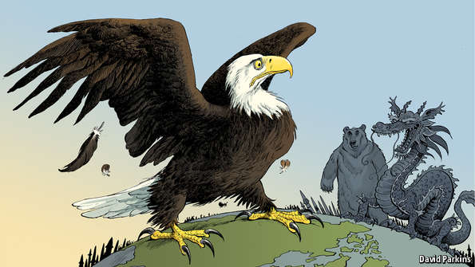
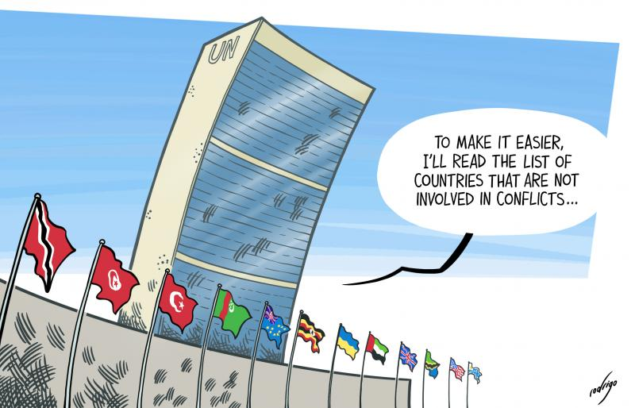
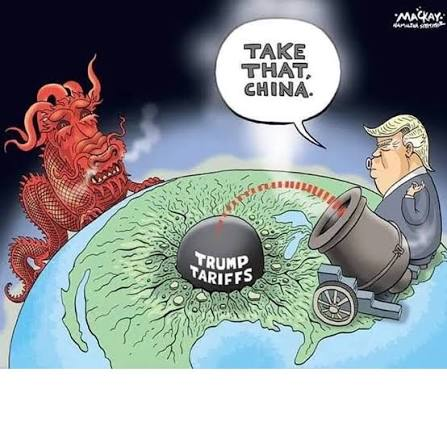

## Today's Agenda {background-image="Images/background-worldmap4.png" .center}

```{r}
# background-size="1920px 1080px"
library(tidyverse)
library(readxl)
```

<br>

**II. Why Are There Wars?**

- Is peace worth the costs of embracing the logic of economic liberalism?

<br>

::: r-stack
Justin Leinaweaver (Fall 2026)
:::

::: notes
Prep for Class

1. Check Canvas submissions

2. Markers x 4

3. **Save time for END of class to discuss revise and resubmit plan for paper 1**

<br>

In Section 2 of our class we have been exploring the development of international relations theories all focused on answering this question

- **SLIDE**: Why are there wars?

:::


## Section 2: Why are there wars? {background-image="Images/background-worldmap4.png" .center}

- **Neorealism**

{style="display: block; margin: 0 auto"}

::: notes

**What is the neorealist answer to the question?**

- (Unitary states pursuing their own security in an anarchic world leads to security dilemma and fear that, in turn, lead to wars)

<br>

**What is an example from current events that this theory explains really well?**

<br>

**SLIDE**: Offensive realism

:::


## Section 2: Why are there wars? {background-image="Images/background-worldmap4.png" .center}

- **Offensive realism**

{style="display: block; margin: 0 auto"}

::: notes

**What is the offensive realist answer to the question?**

- (Why wars? Great powers living in an anarchic world are compelled to pursue hegemony and the pursuit of domination invites violence!)

<br>

**What is an example from current events that this theory explains really well?**

<br>

**SLIDE**: Liberal institutionalism

:::


## Section 2: Why are there wars? {background-image="Images/background-worldmap4.png" .center}

- **Liberal institutionalism**

{style="display: block; margin: 0 auto"}


::: notes

**What is the liberal institutionalist answer to the question?**

- (Why wars? States pursuing absolute gains in an anarchic world will try to create institutions to overcome cooperation dilemmas, but sometimes they will fail)

<br>

**What is an example from current events that this theory explains really well?**

<br>

**SLIDE**: And then last class we introduced economic liberalism

:::


## Section 2: Why are there wars? {background-image="Images/background-worldmap4.png" .center}

- **Economic liberalism**

{style="display: block; margin: 0 auto"}


::: notes

**What is the economic liberal answer to the question?**

- (Why wars? States pursuing growth should prioritize trade over war because the gains from trade grow with specialization and war is risky)

- HOWEVER, war is still likely if:

1. Where states are self-sufficient they will not be transformed by trade and therefore might still view war as a means to grow economically.

2. Where resources are limited and rules do not exist, conflict over those resources is still likely

<br>

**What is an example from current events that this theory explains really well?**

<br>

**SLIDE**: In sum

:::


## Section 2: Why Are There Wars? {background-image="Images/background-worldmap4.png" .center}

<br>

- Neorealism

- Offensive Realism

- Liberal Institutionalism

- Economic Liberalism

- Bargaining Model of War

::: notes

**Ok, how is everybody doing with these first four international relations theories?**

- **Any questions?**

<br>

Next week we will focus on the last model on this list, the bargaining model of war

<br>

**SLIDE**: For today, I want us to explore the pain points in economic liberalism a bit more

:::


## {background-image="Images/background-worldmap4.png" .center}

<br>

**Is peace worth the price of international trade for the developing world?**

<br>


**Panagariya (2003)**

vs

**Rodrik (2001)**

::: notes

Today we're going to examine another important debate about trade.

<br>

Even if trade makes the world more peaceful, is it worth it for the developing world?

- In other words, is increasing your exposure to international trade a good idea for developing states?

<br>

**What is the conclusion of Panagariya's argument?**

- (**SLIDE**)

:::


## {background-image="Images/background-worldmap4.png" .center}

<br>

**Is peace worth the price of international trade for the developing world?**

<br>


**Panagariya (2003)**

- Therefore, trade benefits outweigh the costs for developing states.

**Rodrik (2001)**

- ?

::: notes
**And what is the conclusion of Rodrik's argument?**
:::


## {background-image="Images/background-worldmap4.png" .center}

<br>

**Is peace worth the price of international trade for the developing world?**

<br>

**Panagariya (2003)**

- Therefore, trade benefits outweigh the costs for developing states.

**Rodrik (2001)**

- Therefore, developing countries should focus on growth through domestic investing and institutions, not trade.

::: notes

*Split class in groups of 4 to maximize board space*

- Go sit with your group!

<br>

**SLIDE**: We start with Panagariya!

:::


## Panagariya (2003) {background-image="Images/background-worldmap4.png" .center}

<br>

- ???

- ???

- ???

- ...

Therefore, trade benefits outweigh the costs for developing states.

::: notes

Before class everybody submitted their analyses to Canvas, so let's get them on the boards!

- Groups, you have five minutes to get this argument diagram on the board

- Go!

<br>

*PRESENT and DISCUSS each*

<br>

**SLIDE**: Your version

<br>

*NOTE: Half class version loses too many students to free-riding*

Panagariya (2003)

- Rich countries generally more open than poor ones

- Trade openness promotes growth (efficiency and technology)

- Growth creates jobs, increases government's fiscal resources, raises incomes

- Efficiency can promote environmental objectives (w/ pollution taxes)

- Therefore, trade benefits outweigh the costs for developing states.

:::


## Panagariya (2003) {background-image="Images/background-worldmap4.png" .center}

- Rich countries generally more open than poor ones

- Trade openness promotes growth (efficiency and technology)

- Growth creates jobs, increases government's fiscal resources, raises incomes

- Efficiency can promote environmental objectives (w/ pollution taxes)

Therefore, trade benefits outweigh the costs for developing states.

::: notes
**Is this a logical argument?**

<br>

**What are the strongest and weakest parts of Panagariya's argument?**

<br>

**SLIDE**: Rodrik time!

:::


## Rodrik (2001) {background-image="Images/background-worldmap4.png" .center}

<br>

- ???

- ???

- ???

- ...

Therefore, developing countries should focus on growth through domestic investing and institutions, not trade.

::: notes

Before class everybody submitted their analyses to Canvas, so let's get them on the boards!

- Groups, you have five minutes to get this argument diagram on the board

- Go!

<br>

*PRESENT and DISCUSS each*

<br>

**SLIDE**: Your version

<br>

Rodrik (2001)

- Lowering barriers to trade does NOT guarantee growth

- Trade success diverts money away from domestic needs

- Trade "rules" benefit powerful states and undermine democratic institutions

- Availability of foreign capital can encourage bad policies

- Slow and steady domestic growth allows successful engagement with trade, not vice-versa

- Therefore, developing countries should focus on growth through domestic investing and institutions, not trade.

:::


## Rodrik (2001) {background-image="Images/background-worldmap4.png" .center}

- Lowering barriers to trade does NOT guarantee growth

- Trade success diverts money away from domestic needs

- Trade "rules" benefit powerful states and undermine democratic institutions

- Availability of foreign capital can encourage bad policies

- Slow and steady domestic growth allows successful engagement with trade, not vice-versa

Therefore, developing countries should focus on growth through domestic investing and institutions, not trade.

::: notes
**Is this a logical argument? Why or why not?**

<br>

**What are the strongest and weakest parts of Panagariya's argument?**

1. Empirical data does NOT show openness leads to growth; confounding variables are the culprit e.g. ineffective institutions, geography, inappropriate macroeconomic policies

2. Requires (tax reform, social safety nets, administrative reform, labor market reform, training programs), Diverts from (education, health, industrial capacity and social cohesion)

3. Many of trade's success stories were based on asian states (South Korea, China, India, Taiwan) liberalizing slowly, without requiring a complete re-structuring of their institutions.

4. Not about increasing efficiency

<br>

**SLIDE**: Bottom line
:::


## {background-image="Images/background-worldmap4.png" .center}

<br>

**Is peace worth the price of international trade for the developing world?**

<br>

**Panagariya (2003)**

- Therefore, trade benefits outweigh the costs for developing states.

**Rodrik (2001)**

- Therefore, developing countries should focus on growth through domestic investing and institutions, not trade.

::: notes

Ultimately, my interest is not in deciding that one or the other of these arguments is "right."

- Both are describing empirically sound mechanisms related to international trade.

<br>

**The question for us to grapple with is: If these are the costs of trade, is peace (fewer wars) worth it? Why or why not?**

- *Force this discussion*

<br>

If class seems totally sold on Rodrik:

1. **Are we biased to be convinced by single examples that disprove generalizations, rather than seeking the preponderance of the evidence?**

<br>

2. **Panagariya ain't alone. Remember, Rodrik's plan might not be feasible if state is failed, corrupt or otherwise lacks the capacity to grow domestically in this way. In such a case, maybe opening to trade is better than nothing?**

<br>

**SLIDE**: Before we wrap today let's talk about the first paper

:::


## {background-image="Images/05_2-Peer_Review.png"}

::: notes

**Optional R&R announcement**

<br>

Congratulations all, you've completed the first step in building a convincing, academic argument.

- You constructed a logical argument, supported it with evidence and worked to address expected critiques of it.

<br>

My job as the peer reviewer is to push back on all of it to help you make the strongest version of your argument possible.

<br>

Your next job is to reflect on that feedback and then to revise the paper to make it stronger.

<br>

**SLIDE**: Next steps
:::


## {background-image="Images/background-worldmap4.png" .center}

::: {.r-fit-text}
**Revise & Resubmit Paper 1 (Due Sep 25th)**
:::

<br>

::: {.r-fit-text}

**Submit to Canvas** a revision of your first draft that:

1. Addresses **ALL** of the feedback, AND

2. Highlights **ALL** of your changes.

:::

::: notes

Arguably, THIS is the more important step in the process.

- Learning to take on board feedback and strengthen your arguments will be key to developing your skills in making convincing, high quality arguments.

<br>

Revisions are due next week

- Strike while the content is still fresh in your mind!

<br>

**Questions on the revision process?**

- Let's get to work!

:::


## Assignment for Next Class {background-image="Images/background-worldmap4.png" .center}

<br>

::: {.r-fit-text}

Get to work on those paper revisions!

:::
