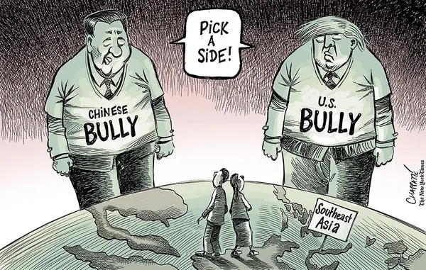
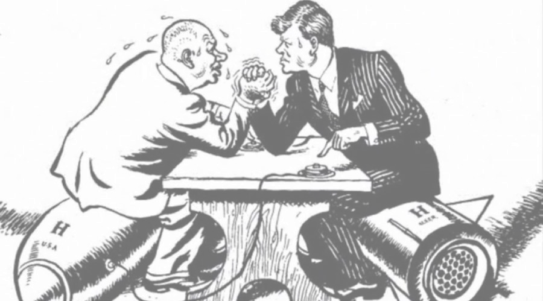

## Today's Agenda {background-image="Images/background-worldmap4.png" .center}

```{r}
# background-size="1920px 1080px"
library(tidyverse)
library(readxl)
```

<br>

::: {.r-fit-text}

**II. Why Are There Wars?**

- Simulating the bargaining model of war

:::

<br>

::: r-stack
Justin Leinaweaver (Fall 2026)
:::

::: notes
Prep for Class

1. Cards for bargaining game:

    - Print and cut out cards in Google Drive, OR

    - Sets of cards from multiple decks (Ace to 9)

2. Bring pennies or use paper to track scores

    - 10 per student

3. Open Wednesday slides in rmarkdown for tracking results

4. Make sure to save time for one practice round for ALL students

:::


## Why do wars happen? {background-image="Images/06_1-WW1-2_v2.png"}

::: notes

As we discussed a few weeks ago, international war is a puzzling event.

- HUGELY costly and the gains are deeply uncertain.

<br>

Let's run through the competing answers to this puzzle again!
:::


## The Neorealist Answer {background-image="Images/06_1-neorealist_world_v2.png"}

::: notes
**What is the Neorealist answer?**

- (A: Anarchy -> Fear)

- (Neorealism: States want to survive, war comes from uncertainty and the security dilemma.)
:::


## The Offensive Realist Answer {background-image="Images/background-worldmap4.png"}

```{r, fig.align='center'}

```

::: notes
**What is the Offensive Realist answer?**

- (A: Anarchy -> Great powers must pursue regional hegemony)

- (Offensive realism: Powerful states want hegemony and war comes from the pursuit of it!)
:::


## The Liberal Institutionalist Answer {background-image="Images/06_1-ICC_v2.png"}

::: notes
**What is the liberal institutionalist answer to the question?**

- (Why wars? States pursuing absolute gains in an anarchic world will try to create institutions to overcome cooperation dilemmas, but sometimes they will fail)

:::


## The Economic Liberal Answer {background-image="Images/06_1-global_rules.jpg"}

::: notes

**What is the Economic Liberal answer?**

- (Trade -> specialization -> peace)

1) Where states are self-sufficient they will not be transformed by trade and therefore might still view war as a means to grow economically.

2) Where resources are limited and rules do not exist, conflict over those resources is still likely.
:::


## The Bargaining Model of War {background-image="Images/background-worldmap4.png"}

```{r, fig.align='center'}

```

::: notes

This week we jump forward in IR theory by a few decades!

<br>

James Fearon in 1995 published an article titled, "Rationalist Explanations for War."

- In it he offers a really interesting model of war as a bargaining process.

- Two sides with opposing goals each trying to get what they want without having to pay too high a cost to get it.

<br>

My plan for today is that each of you experience the dynamics of the model before we analyze it on Wednesday.
:::


## Simulating the Bargaining Model {background-image="Images/background-triangles_grey_v2.png" .center}

<br>

::: {.r-fit-text}

- Two players fight each other five times

- Your "strength" depends on your cards

- Your "resources" are measured in pennies

- Objective: Have the most pennies at end of round 5

:::

::: notes

*Review details on slide*

Everyone starts the game with 10 pennies and playing cards.

<br>

Ok, how do we play?

- **SLIDE**: Let's step through one round of the game
:::


## {background-image="Images/background-triangles_grey_v2.png"}

```{r, fig.align='center', fig.asp=0.618, fig.width=6}
d <- tibble(
    x = 1:10,
    y = 1:10
)

d |> ggplot(aes(x = x, y = y)) +
         geom_blank() +
         coord_cartesian(xlim = c(0,10), ylim = c(0,10)) +
         theme_void() +
         scale_x_continuous(breaks = 0:10) +
         scale_y_continuous(breaks = 0:10) +
         annotate("text", x = 1, y = 9.5, label = "The Penny War", size=5) +
         annotate("text", x = 5, y = 9.5, label = "Ante up:\nBoth pay 1 penny and\ndraw 3 cards", size=4.5)
```

::: notes

**1. Ante up.**

- Both players ante up 1 "penny" into the pot, and draw three cards from their deck.

- The penny you pay to start represents the cost of running your country

<br>

At this point decide who gets to be player 1

- In future rounds you will alternate as P1
:::


## {background-image="Images/background-triangles_grey_v2.png"}

```{r, fig.align='center', fig.asp=0.618, fig.width=6}
d |> ggplot(aes(x = x, y = y)) +
         geom_blank() +
         coord_cartesian(xlim = c(0,10), ylim = c(0,10)) +
         theme_void() +
         scale_x_continuous(breaks = 0:10) +
         scale_y_continuous(breaks = 0:10) +
         annotate("text", x = 1, y = 9.5, label = "The Penny War", size=5) +
         annotate("text", x = 5, y = 9.5, label = "Ante up:\nBoth pay 1 penny and\ndraw 3 cards", size=4.5) +
         annotate("text", x = 0.5, y = 6, label = "P1's Choice:", color = "blue4", size=4.5) +
         annotate("text", x = 2.5, y = 6, label = "Give up\n(P2 wins)", color = "blue4", size=4.5) +
         annotate("text", x = 7.5, y = 6, label = "Declare war", color = "blue4", size=4.5) +
         annotate("segment", x = 5, xend = 3.5, y = 8, yend = 6.5, arrow = arrow(length = unit(.1, "in")))  +
         annotate("segment", x = 5, xend = 6.5, y = 8, yend = 6.5, arrow = arrow(length = unit(.1, "in")))
```

::: notes

**2. P1 Choice: Give up or fight!**

<br>

If P1 decides not to fight, the round ends and P2 gets all the pennies in the pot

<br>

If P1 decides to fight, then they declare war!

<br>

HOWEVER, declaring war is not the same thing as being in a war!

- P2 has a choice to make
:::


## {background-image="Images/background-triangles_grey_v2.png"}

```{r, fig.align='center', fig.asp=0.618, fig.width=6}
d |> ggplot(aes(x = x, y = y)) +
         geom_blank() +
         coord_cartesian(xlim = c(0,10), ylim = c(0,10)) +
         theme_void() +
         scale_x_continuous(breaks = 0:10) +
         scale_y_continuous(breaks = 0:10) +
         annotate("text", x = 1, y = 9.5, label = "The Penny War", size=5) +
         annotate("text", x = 5, y = 9.5, label = "Ante up:\nBoth pay 1 penny and\ndraw 3 cards", size=4.5) +
         annotate("text", x = 0.5, y = 6, label = "P1's Choice:", color = "blue4", size=4.5) +
         annotate("text", x = 2.5, y = 6, label = "Give up\n(P2 wins)", color = "blue4", size=4.5) +
         annotate("text", x = 7.5, y = 6, label = "Declare war", color = "blue4", size=4.5) +
         annotate("segment", x = 5, xend = 3.5, y = 8, yend = 6.5, arrow = arrow(length = unit(.1, "in")))  +
         annotate("segment", x = 5, xend = 6.5, y = 8, yend = 6.5, arrow = arrow(length = unit(.1, "in"))) +
         annotate("text", x = 4, y = 3, label = "P2's Choice:", color = "green4", size=4.5) +
         annotate("text", x = 6, y = 3, label = "Give up\n(P1 wins)", color = "green4", size=4.5) +
         annotate("text", x = 9, y = 3, label = "Declare war", color = "green4", size=4.5) +
         annotate("segment", x = 7.5, xend = 6.5, y = 5.5, yend = 3.75, arrow = arrow(length = unit(.1, "in")))  +
         annotate("segment", x = 7.5, xend = 8.5, y = 5.5, yend = 3.75, arrow = arrow(length = unit(.1, "in")))
```

::: notes

**3. Choice shifts to P2: Give up or fight!**

<br>

Player 2, your opponent has just declared war on you

<br>

If you don't want to fight, you can give up and they win the pennies

- That would end the round with nobody actually going to war

<br>

If you DO want to fight, then player 2 may also declare war!

:::


## {background-image="Images/background-triangles_grey_v2.png"}

```{r, fig.align='center', fig.asp=0.618, fig.width=6}
d |> ggplot(aes(x = x, y = y)) +
         geom_blank() +
         coord_cartesian(xlim = c(0,10), ylim = c(0,10)) +
         theme_void() +
         scale_x_continuous(breaks = 0:10) +
         scale_y_continuous(breaks = 0:10) +
         annotate("text", x = 1, y = 9.5, label = "The Penny War", size=5) +
         annotate("text", x = 5, y = 9.5, label = "Ante up:\nBoth pay 1 penny and\ndraw 3 cards", size=4.5) +
         annotate("text", x = 0.5, y = 6, label = "P1's Choice:", color = "blue4", size=4.5) +
         annotate("text", x = 2.5, y = 6, label = "Give up\n(P2 wins)", color = "blue4", size=4.5) +
         annotate("text", x = 7.5, y = 6, label = "Declare war", color = "blue4", size=4.5) +
         annotate("segment", x = 5, xend = 3.5, y = 8, yend = 6.5, arrow = arrow(length = unit(.1, "in")))  +
         annotate("segment", x = 5, xend = 6.5, y = 8, yend = 6.5, arrow = arrow(length = unit(.1, "in"))) +
         annotate("text", x = 4, y = 3, label = "P2's Choice:", color = "green4", size=4.5) +
         annotate("text", x = 6, y = 3, label = "Give up\n(P1 wins)", color = "green4", size=4.5) +
         annotate("text", x = 9, y = 3, label = "Declare war", color = "green4", size=4.5) +
         annotate("segment", x = 7.5, xend = 6.5, y = 5.5, yend = 3.75, arrow = arrow(length = unit(.1, "in")))  +
         annotate("segment", x = 7.5, xend = 8.5, y = 5.5, yend = 3.75, arrow = arrow(length = unit(.1, "in"))) +
         annotate("text", x = 5, y = 1, label = "ONLY if BOTH sides declare war does a war happen", size = 5.25, color = "red1")

# "If BOTH sides declare war, then pay 1 more penny and\n the strongest hand wins"
# "ONLY if BOTH sides declare war does a war happen\n War: Pay 1 MORE penny and the strongest hand wins"
```

::: notes
**4. War**

Let me be VERY clear here.

- ONLY if BOTH players declare war does a war actually happen

- Both players have the option to avoid war if they do not want to fight

<br>

**Does that make sense?**

:::


## {background-image="Images/background-triangles_grey_v2.png"}

```{r, fig.align='center', fig.asp=0.618, fig.width=6}
d |> ggplot(aes(x = x, y = y)) +
         geom_blank() +
         coord_cartesian(xlim = c(0,10), ylim = c(0,10)) +
         theme_void() +
         scale_x_continuous(breaks = 0:10) +
         scale_y_continuous(breaks = 0:10) +
         annotate("text", x = 1, y = 9.5, label = "The Penny War", size=5) +
         annotate("text", x = 5, y = 9.5, label = "Ante up:\nBoth pay 1 penny and\ndraw 3 cards", size=4.5) +
         annotate("text", x = 0.5, y = 6, label = "P1's Choice:", color = "blue4", size=4.5) +
         annotate("text", x = 2.5, y = 6, label = "Give up\n(P2 wins)", color = "blue4", size=4.5) +
         annotate("text", x = 7.5, y = 6, label = "Declare war", color = "blue4", size=4.5) +
         annotate("segment", x = 5, xend = 3.5, y = 8, yend = 6.5, arrow = arrow(length = unit(.1, "in")))  +
         annotate("segment", x = 5, xend = 6.5, y = 8, yend = 6.5, arrow = arrow(length = unit(.1, "in"))) +
         annotate("text", x = 4, y = 3, label = "P2's Choice:", color = "green4", size=4.5) +
         annotate("text", x = 6, y = 3, label = "Give up\n(P1 wins)", color = "green4", size=4.5) +
         annotate("text", x = 9, y = 3, label = "Declare war", color = "green4", size=4.5) +
         annotate("segment", x = 7.5, xend = 6.5, y = 5.5, yend = 3.75, arrow = arrow(length = unit(.1, "in")))  +
         annotate("segment", x = 7.5, xend = 8.5, y = 5.5, yend = 3.75, arrow = arrow(length = unit(.1, "in"))) +
         annotate("text", x = 5, y = 1, label = "ONLY if BOTH sides declare war does a war happen\n War costs EACH player 1 MORE penny", size = 5.25, color = "red1")

# "If BOTH sides declare war, then pay 1 more penny and\n the strongest hand wins"
# "ONLY if BOTH sides declare war does a war happen\n War: Pay 1 MORE penny and the strongest hand wins"
```

::: notes

If both players declare war then you have to pay for the tanks and losses to your economy!

- Each player must pay one more penny

<br>

**Quick check, how big is the pot of pennies you can win if NO war happens?**

- (The original two pennies from the start of the game)

<br>

**And how big is the pot of pennies you can win if a war happens?**

- (Four pennies)

<br>

The winner of the war is the player with the stronger hand of cards

- Show your cards to the other player, stronger side wins

<br>

**If both sides have the same card strength then NOBODY wins and the pennies are lost forever**

<br>

**Questions on the game?**

:::


## {background-image="Images/background-triangles_grey_v2.png"}

```{r, fig.align='center', fig.asp=0.618, fig.width=6}
d |> ggplot(aes(x = x, y = y)) +
         geom_blank() +
         coord_cartesian(xlim = c(0,10), ylim = c(0,10)) +
         theme_void() +
         scale_x_continuous(breaks = 0:10) +
         scale_y_continuous(breaks = 0:10) +
         annotate("text", x = 1, y = 9.5, label = "The Penny War", size=5) +
         annotate("text", x = 5, y = 9.5, label = "Ante up:\nBoth pay 1 penny and\ndraw 3 cards", size=4.5) +
         annotate("text", x = 0.5, y = 6, label = "P1's Choice:", color = "blue4", size=4.5) +
         annotate("text", x = 2.5, y = 6, label = "Give up\n(P2 wins)", color = "blue4", size=4.5) +
         annotate("text", x = 7.5, y = 6, label = "Declare war", color = "blue4", size=4.5) +
         annotate("segment", x = 5, xend = 3.5, y = 8, yend = 6.5, arrow = arrow(length = unit(.1, "in")))  +
         annotate("segment", x = 5, xend = 6.5, y = 8, yend = 6.5, arrow = arrow(length = unit(.1, "in"))) +
         annotate("text", x = 4, y = 3, label = "P2's Choice:", color = "green4", size=4.5) +
         annotate("text", x = 6, y = 3, label = "Give up\n(P1 wins)", color = "green4", size=4.5) +
         annotate("text", x = 9, y = 3, label = "Declare war", color = "green4", size=4.5) +
         annotate("segment", x = 7.5, xend = 6.5, y = 5.5, yend = 3.75, arrow = arrow(length = unit(.1, "in")))  +
         annotate("segment", x = 7.5, xend = 8.5, y = 5.5, yend = 3.75, arrow = arrow(length = unit(.1, "in"))) +
         annotate("text", x = 5, y = 1, label = "ONLY if BOTH sides declare war does a war happen\n War costs EACH player 1 MORE penny", size = 5.25, color = "red1")
```

::: notes

**Let's practice this once real quick, everybody pair off!**

<br>

Shuffle your cards, pay the ante and THEN draw three

**Does everybody now have 9 pennies and three randomly chosen cards in their hands?**

<br>

*Make everybody on your left of each pair P1*

**What's the strongest hand you can have in this game?**

- `r 10+9+8`

**And the weakest?**

- `r 1+2+3`

<br>

Alright, P1s you all decide your hand is strong so you declare war!

- Declaring war doesn't cost you a penny, only going to war does!

- Decision shifts to P2

<br>

P2s, you look at your hand and decide its pretty darn strong too!

- You declare war right back!

<br>

Both sides pay the costs of war!

<br>

**Is everybody now holding three cards and only 8 pennies?**

<br>

**Ok, who wins the pot?**

<br>

**Everybody clear on how to play the game?**

<br>

**SLIDE**: Important note

:::


## {background-image="Images/background-triangles_grey_v2.png" .center}

::: {.r-fit-text}
**The Bargaining Model of War**

::: {.incremental}
1. Actors are rational and strategic

2. There are costs to fighting a war

3. There are benefits for winning a war

4. Winning is more likely if you are strong

5. Winning is more likely if your opponent is weak
:::
:::
::: notes

Let me be super clear here.

- This simulation is meant to help us unpack the bargaining model of war

- And to do that we will adopt these five assumptions

- **REVEAL x 5**

<br>

**Is everybody clear on these assumptions you are agreeing to test?**

<br>

- **Are you taking the simulation seriously if you go to war every time, no matter what cards you are holding?**

- **Are you taking the simulation seriously if you NEVER go to war no matter what cards you are holding?**

<br>

Your goal in this game is to have the most pennies at the end of five rounds.

- Please be strategic and try to maximize your pennies

<br>

**Questions on the game?**

- **SLIDE**: Let's play
:::


## {background-image="Images/background-triangles_grey_v2.png" .center}

1. Play **FIVE** rounds (alternating P1)

2. **RECORD**: Out of FIVE rounds, how many wars did you fight?

```{r, fig.align='center', fig.asp=0.618, fig.width=6}
d |> ggplot(aes(x = x, y = y)) +
         geom_blank() +
         coord_cartesian(xlim = c(0,10), ylim = c(0,10)) +
         theme_void() +
         scale_x_continuous(breaks = 0:10) +
         scale_y_continuous(breaks = 0:10) +
         annotate("text", x = 1, y = 9.5, label = "The Penny War", size=5) +
         annotate("text", x = 5, y = 9.5, label = "Ante up:\nBoth pay 1 penny and\ndraw 3 cards", size=4.5) +
         annotate("text", x = 0.5, y = 6, label = "P1's Choice:", color = "blue4", size=4.5) +
         annotate("text", x = 2.5, y = 6, label = "Give up\n(P2 wins)", color = "blue4", size=4.5) +
         annotate("text", x = 7.5, y = 6, label = "Declare war", color = "blue4", size=4.5) +
         annotate("segment", x = 5, xend = 3.5, y = 8, yend = 6.5, arrow = arrow(length = unit(.1, "in")))  +
         annotate("segment", x = 5, xend = 6.5, y = 8, yend = 6.5, arrow = arrow(length = unit(.1, "in"))) +
         annotate("text", x = 4, y = 3, label = "P2's Choice:", color = "green4", size=4.5) +
         annotate("text", x = 6, y = 3, label = "Give up\n(P1 wins)", color = "green4", size=4.5) +
         annotate("text", x = 9, y = 3, label = "Declare war", color = "green4", size=4.5) +
         annotate("segment", x = 7.5, xend = 6.5, y = 5.5, yend = 3.75, arrow = arrow(length = unit(.1, "in")))  +
         annotate("segment", x = 7.5, xend = 8.5, y = 5.5, yend = 3.75, arrow = arrow(length = unit(.1, "in"))) +
         annotate("text", x = 5, y = 1, label = "ONLY if BOTH sides declare war does a war happen\n War costs EACH player 1 MORE penny", size = 5.25, color = "red1")
```

::: notes

Ok, let's test this model

1. Find an opponent

2. Decide who will be player 1 in the first round

3. Play FIVE rounds

4. RECORD: How many wars did you fight?

<br>

SUPER IMPORTANT: The ONLY data we need from each pair is how many wars you fought

- The bargaining model of war is mean to help us explain war, NOT who wins a war

- **Make sense?**

- Let me know if you have questions, and go!

<br>

Each pair tell us, how many wars did you fight.

- *YOU RECORD ON NOTES, not the board yet: sum of all wars in class that round*

:::


## {background-image="Images/background-triangles_grey_v2.png" .center}

1. Play **FIVE** rounds against a **NEW** opponent

2. Keep **ONE** card face up each round (random)

3. **RECORD**: Out of FIVE rounds, how many wars did you fight?

```{r, fig.align='center', fig.asp=0.618, fig.width=6}
d |> ggplot(aes(x = x, y = y)) +
         geom_blank() +
         coord_cartesian(xlim = c(0,10), ylim = c(0,10)) +
         theme_void() +
         scale_x_continuous(breaks = 0:10) +
         scale_y_continuous(breaks = 0:10) +
         annotate("text", x = 1, y = 9.5, label = "The Penny War", size=5) +
         annotate("text", x = 5, y = 9.5, label = "Ante up:\nBoth pay 1 penny and\ndraw 3 cards", size=4.5) +
         annotate("text", x = 0.5, y = 6, label = "P1's Choice:", color = "blue4", size=4.5) +
         annotate("text", x = 2.5, y = 6, label = "Give up\n(P2 wins)", color = "blue4", size=4.5) +
         annotate("text", x = 7.5, y = 6, label = "Declare war", color = "blue4", size=4.5) +
         annotate("segment", x = 5, xend = 3.5, y = 8, yend = 6.5, arrow = arrow(length = unit(.1, "in")))  +
         annotate("segment", x = 5, xend = 6.5, y = 8, yend = 6.5, arrow = arrow(length = unit(.1, "in"))) +
         annotate("text", x = 4, y = 3, label = "P2's Choice:", color = "green4", size=4.5) +
         annotate("text", x = 6, y = 3, label = "Give up\n(P1 wins)", color = "green4", size=4.5) +
         annotate("text", x = 9, y = 3, label = "Declare war", color = "green4", size=4.5) +
         annotate("segment", x = 7.5, xend = 6.5, y = 5.5, yend = 3.75, arrow = arrow(length = unit(.1, "in")))  +
         annotate("segment", x = 7.5, xend = 8.5, y = 5.5, yend = 3.75, arrow = arrow(length = unit(.1, "in"))) +
         annotate("text", x = 5, y = 1, label = "ONLY if BOTH sides declare war does a war happen\n War costs EACH player 1 MORE penny", size = 5.25, color = "red1")
```

::: notes

Version 2

<br>

Ok, let's change it up this time.

- Everybody make sure they have ten pennies

- Change partners and get ready to play again.

- THIS TIME, Keep ONE card face up each round.

- Start of game: Pay the ante, draw your cards and randomly reveal one of them to your opponent.

<br>

**Everybody clear on the rule change?**

- Go!

<br>

Each pair tell us, how many wars did you fight.

- *YOU RECORD ON NOTES, not the board yet: sum of all wars in class that round*

:::


## {background-image="Images/background-triangles_grey_v2.png" .center}

1. Play **FIVE** rounds against a **NEW** opponent

2. Keep **TWO** cards face up each round (random)

3. **RECORD**: Out of FIVE rounds, how many wars did you fight?

```{r, fig.align='center', fig.asp=0.618, fig.width=6}
d |> ggplot(aes(x = x, y = y)) +
         geom_blank() +
         coord_cartesian(xlim = c(0,10), ylim = c(0,10)) +
         theme_void() +
         scale_x_continuous(breaks = 0:10) +
         scale_y_continuous(breaks = 0:10) +
         annotate("text", x = 1, y = 9.5, label = "The Penny War", size=5) +
         annotate("text", x = 5, y = 9.5, label = "Ante up:\nBoth pay 1 penny and\ndraw 3 cards", size=4.5) +
         annotate("text", x = 0.5, y = 6, label = "P1's Choice:", color = "blue4", size=4.5) +
         annotate("text", x = 2.5, y = 6, label = "Give up\n(P2 wins)", color = "blue4", size=4.5) +
         annotate("text", x = 7.5, y = 6, label = "Declare war", color = "blue4", size=4.5) +
         annotate("segment", x = 5, xend = 3.5, y = 8, yend = 6.5, arrow = arrow(length = unit(.1, "in")))  +
         annotate("segment", x = 5, xend = 6.5, y = 8, yend = 6.5, arrow = arrow(length = unit(.1, "in"))) +
         annotate("text", x = 4, y = 3, label = "P2's Choice:", color = "green4", size=4.5) +
         annotate("text", x = 6, y = 3, label = "Give up\n(P1 wins)", color = "green4", size=4.5) +
         annotate("text", x = 9, y = 3, label = "Declare war", color = "green4", size=4.5) +
         annotate("segment", x = 7.5, xend = 6.5, y = 5.5, yend = 3.75, arrow = arrow(length = unit(.1, "in")))  +
         annotate("segment", x = 7.5, xend = 8.5, y = 5.5, yend = 3.75, arrow = arrow(length = unit(.1, "in"))) +
         annotate("text", x = 5, y = 1, label = "ONLY if BOTH sides declare war does a war happen\n War costs EACH player 1 MORE penny", size = 5.25, color = "red1")
```

::: notes

Version 3

Do it again BUT this time you have to keep TWO of your cards face up the whole time.

- **Everybody clear on the rule change?**

- Go!

<br>

Each pair tell us, how many wars did you fight.

- *YOU RECORD ON NOTES, not the board yet: sum of all wars in class that round*

:::


## {background-image="Images/background-triangles_grey_v2.png" .center}

1. Play **FIVE** rounds against a **NEW** opponent

2. Keep **ALL THREE** cards face up each round

3. **RECORD**: Out of FIVE rounds, how many wars did you fight?

```{r, fig.align='center', fig.asp=0.618, fig.width=6}
d |> ggplot(aes(x = x, y = y)) +
         geom_blank() +
         coord_cartesian(xlim = c(0,10), ylim = c(0,10)) +
         theme_void() +
         scale_x_continuous(breaks = 0:10) +
         scale_y_continuous(breaks = 0:10) +
         annotate("text", x = 1, y = 9.5, label = "The Penny War", size=5) +
         annotate("text", x = 5, y = 9.5, label = "Ante up:\nBoth pay 1 penny and\ndraw 3 cards", size=4.5) +
         annotate("text", x = 0.5, y = 6, label = "P1's Choice:", color = "blue4", size=4.5) +
         annotate("text", x = 2.5, y = 6, label = "Give up\n(P2 wins)", color = "blue4", size=4.5) +
         annotate("text", x = 7.5, y = 6, label = "Declare war", color = "blue4", size=4.5) +
         annotate("segment", x = 5, xend = 3.5, y = 8, yend = 6.5, arrow = arrow(length = unit(.1, "in")))  +
         annotate("segment", x = 5, xend = 6.5, y = 8, yend = 6.5, arrow = arrow(length = unit(.1, "in"))) +
         annotate("text", x = 4, y = 3, label = "P2's Choice:", color = "green4", size=4.5) +
         annotate("text", x = 6, y = 3, label = "Give up\n(P1 wins)", color = "green4", size=4.5) +
         annotate("text", x = 9, y = 3, label = "Declare war", color = "green4", size=4.5) +
         annotate("segment", x = 7.5, xend = 6.5, y = 5.5, yend = 3.75, arrow = arrow(length = unit(.1, "in")))  +
         annotate("segment", x = 7.5, xend = 8.5, y = 5.5, yend = 3.75, arrow = arrow(length = unit(.1, "in"))) +
         annotate("text", x = 5, y = 1, label = "ONLY if BOTH sides declare war does a war happen\n War costs EACH player 1 MORE penny", size = 5.25, color = "red1")
```

::: notes

Version 4

Do it again BUT this time you have to keep ALL of your cards face up the whole time.

- **Everybody clear on the rule change?**

- Go!

<br>

Each pair tell us, how many wars did you fight.

- *YOU RECORD ON NOTES, not the board yet: sum of all wars in class that round*

<br>

**ON BOARD: Total wars per round**
:::


## The Bargaining Model of War {background-image="Images/background-worldmap4.png"}

```{r, fig.align='center'}

```

::: notes

Alright, let's talk about what just happened.

<br>

**Talk to me about how you played.**

- **Why did you play the way you did?**

<br>

**Anybody try bluffing? Why or why not?**

<br> 

**Did anybody go to war with a weak hand? Why?**

<br>

**In what ways is this a useful model of war?**

<br>

**In what ways do you think it is a problematic model of war?**

<br>

**SLIDE**: For next class
:::


## Assignment for Next Class {background-image="Images/background-worldmap4.png" .center}

<br>

1. Read Fearon (1995)

2. **Before class** submit to our Canvas discussion board: 

    - Who do you think are the key interests, and what are the key institutions and interactions in Fearon's Bargaining Model of War?

    - Were there any specific parts of Fearon's article that you found confusing?


::: notes
**Questions on the assignment?**
:::


