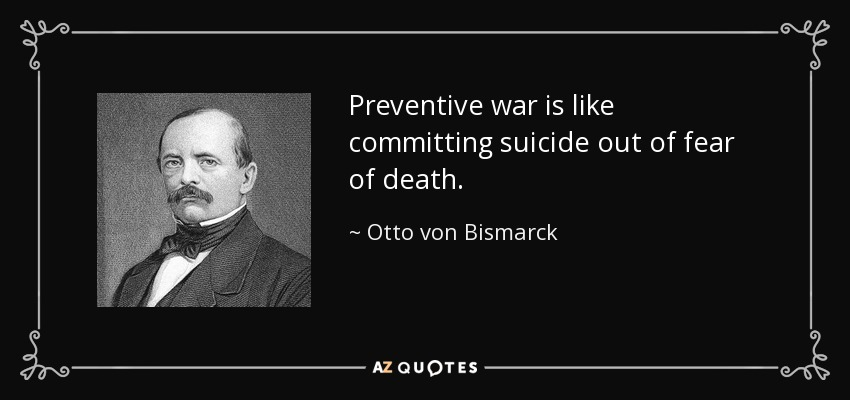

## Today's Agenda {background-image="Images/background-worldmap4.png" .center}

```{r}
# background-size="1920px 1080px"
library(tidyverse)
library(readxl)
```

<br>

::: {.r-fit-text}

**II. Why Are There Wars?**

- What should the US do about North Korea?

:::

<br>

::: r-stack
Justin Leinaweaver (Fall 2025)
:::

::: notes
Prep for Class

1. Review the Canvas submissions

2. Two options for today
    - First set of slides: set up to step through each argument one at a time
    
    - Second set of slides: You can also just split the class into groups and dive straight into the arguments

<br>

### DISCUSS: Name me an international political event that has happened since we last met as a class.
:::


## {background-image="Images/05_3-Korean_Nukes_v2.png"}

<br>

<br>

<br>

<br>

<br>

<br>

<br>

<br>

<br>

::: {.r-fit-text}
**The Threat from DPRK**
:::

::: notes

Today I'd like us to examine this very scary and very important debate about what should be done as North Korea expands its nuclear arsenal and continues to provoke the world with missile tests.

- I think this also gives us a good opportunity to put the theories we've been exploring to the test.

<br>

### Generally speaking, and before we dig in, which argument did you find more convincing? Why?

<br>

### - In super short, what is Bolton's thesis?
- (We should bomb NK)

### - And what position do Sagan and Weiner take?
- (That would be a terrible idea)
:::


## {background-image="Images/05_3-Bolton_and_Trump.webp"}

<br>

<br>

<br>

<br>

<br>

<br>

<br>

<br>

<br>

::: {.r-fit-text}
<p style="color: white;">Argument 1: Bolton (2018)</p>
:::

::: notes

Let's start with former national security advisor John Bolton's argument.

<br>

Everybody take 5 minutes on your own to reflect on Bolton's (2018) argument.

- I want you to write down the three most important premises in his argument.

- What are the biggest reasons he reaches the conclusion that he does?

<br>

Ok, make small groups (3-4) and consolidate to one argument diagram. 
<br>

### Alright, what do we have?

*ON 1/2 THE BOARD*

Bolton premises (my skim)

- Only "months" left to act to prevent DPRK acquiring the means to hit the US with a nuke.
- Threat is imminent
- Nukes change our understanding of "necessity"
- Historical analogy: Technology forced expansion of territorial waters (FDR then Reagan) shows reality must change our understanding of self-defense and necessity
- Caroline criteria in international law are a custom and customs should evolve to match state practices
Therefore, we should attack DPRK's nuclear infrastructure.

From wikipedia: The Caroline test is a 19th-century formulation of customary international law, reaffirmed by the Nuremberg Tribunal after World War II, which said that the necessity for preemptive self-defense must be "instant, overwhelming, and leaving no choice of means, and no moment for deliberation." The test takes its name from the Caroline affair.
:::


## Section 2: Why Are There Wars? {background-image="Images/background-worldmap4.png" .center}

<br>

- Neorealism

- Offensive Realism

- Liberal Institutionalism

- Economic Liberalism

- Bargaining Model of War

::: notes
**Where would you place Bolton's argument in the models we've examined so far? Why?**
:::


## Argument 2: Sagan and Weiner (2018) {background-image="Images/background-worldmap4.png" .center}

```{r, fig.align='center'}

```

::: notes

Let's now jump to the other argument.

Everybody take 5 minutes on your own to reflect on Sagan and Weiner's (2018) counter-argument.

- I want you to write down the three most important premises in the argument.

- What are the biggest reasons they reach the conclusion that they do?

<br>

Ok, make small groups (3-4) and consolidate to one argument diagram. 
<br>

### Alright, what do we have?

*ON 1/2 THE BOARD*

Sagan and Weiner premises

- Bolton's logic is flawed and dangerous
- The definition of pre-emption is clear and this ain't it
- This would be a preventive war and those are illegal acts of aggression
- Korean war armistice does not justify new attacks
- President doesn't have the authority to start a war
- Israeli example "illegal but legitimate" doesn't apply here because nuclear retaliation was off the table
- It is too late for this attack to not provoke an "unacceptable retaliation"

Therefore, the US should NOT strike DPRK first.
:::


## Section 2: Why Are There Wars? {background-image="Images/background-worldmap4.png" .center}

<br>

- Neorealism

- Offensive Realism

- Liberal Institutionalism

- Economic Liberalism

- Bargaining Model of War

::: notes
**Where would you place Sagan and Weiner's (2018) argument in the models we've examined so far? Why?**
:::


## {background-image="Images/05_3-Korean_Nukes_v2.png"}

<br>

<br>

<br>

<br>

<br>

<br>

<br>

<br>

<br>

::: {.r-fit-text}
**Bolton vs Sagan and Weiner**
:::

::: notes
**Is this a debate we can easily solve? Why or why not?**

<br>

### Anybody heard from Kim Jong-un recently?

- **SLIDE**
:::


## {background-image="Images/05_3-DPRK_News.png" .center background-size='73%'}

::: notes
**What are the prescriptions for this problem from the perspective of each model?**

<br>

### - Neorealism?
- (Security dilemmas only end one way...)

### - Offensive Realism?
- (Defense of hegemony demands the US act...)

### - Democratic Peace Theory?
- (Peace treaty and try to engage with NK?)

### - Economic Liberalism?
- (Draw them into the international trade system? e.g. no more sanctions!)

### - Bargaining Model of War?
### - Is there a negotiated outcome possible per the bargaining model?

<br>

### So, where do we end up? Is the threat serious enough for us to break international law?

### - Did anybody change their mind?
:::


## Assignment for Next Class {background-image="Images/background-worldmap4.png" .center}

<br>

1. Hultman, Kathman & Shannon (2016) on United Nations Peacekeeping (p231-238)

2. **Before class** submit to our Canvas discussion board: 
    - What is the research question in this paper?
    
    - What is their proposed answer to the question?

::: notes
Next class we dig into a research paper that explores the effect of the United Nations on war.

- Your job is to read the set-up of the paper (231-238) so we can explore the model they propose to test.

<br>

### Questions on the assignment?
:::