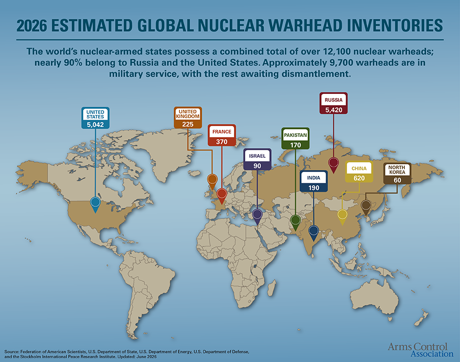
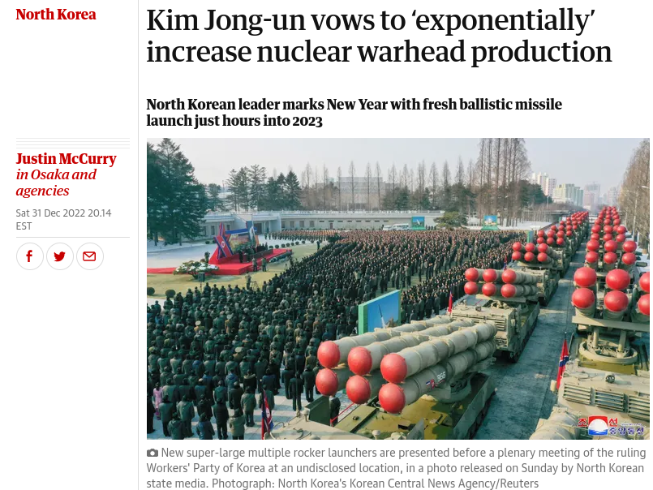
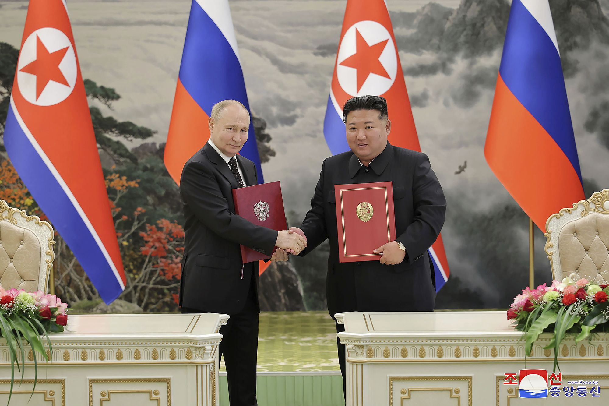
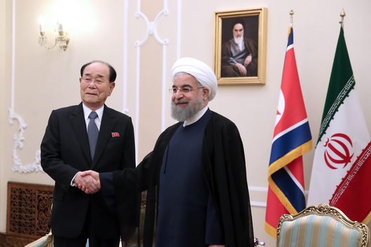
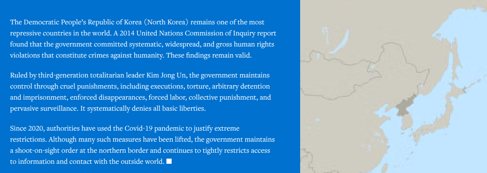

## Today's Agenda {background-image="Images/background-worldmap4.png" .center}

```{r}
# background-size="1920px 1080px"
library(tidyverse)
library(readxl)
```

<br>

::: {.r-fit-text}

**II. Why Are There Wars?**

- What should we do about the DPRK?

:::

<br>

::: r-stack
Justin Leinaweaver (Fall 2026)
:::

::: notes
Prep for Class

1. Review the Canvas submissions

2. NEW VERSION (FA 26): Groups assigned to theories and each pitches us on what to do about DPRK

<br>

**SLIDE**: The problem

:::


## {background-image="Images/05_3-Korean_Nukes_v2.png"}

<br>

<br>

<br>

<br>

<br>

<br>

<br>

<br>

<br>

::: {.r-fit-text}
**The DPRK as a Global Challenge**
:::

::: notes

Today I want us to explore and discuss the challenge presented to the global order by the Democratic People's Republic of Korea

- aka North Korea

<br>

Before class I had you read, diagram and analyze two sides in the ongoing debate about what is to be done

<br>

On the one side you have John Bolton with a long career in the US civil service

- He has long been a hawkish voice advocating for the use of aggressive American power to reshape the world

<br>

On the other side you have Scott Sagan and Allen Weiner, two professors at Stanford

- Their perspective appears far more rooted in international law and collective action concerns than extending American power

<br>

Why is there debate ongoing and why am I describing North Korea as a challenge for the world?

- **SLIDE**: 1) They have nukes!

:::


## The DPRK as a Global Challenge {background-image="Images/background-worldmap4.png" .center}

{style="display: block; margin: 0 auto"}

::: notes

Ok, talk to me about the state of nuclear proliferation in the world

- **Good news and bad news on this map?**

- **Which of these countries "should" have nukes and which ones should not? Why?**

<br>

**SLIDE**: Problem 2

:::


## The DPRK as a Global Challenge {background-image="Images/background-worldmap4.png" .center}

{style="display: block; margin: 0 auto"}

::: notes

Kim Jong Un has declared his aim to EXPONENTIALLY increase his nuclear arsenal, AND has been actively developing his ballistic missile technology

<br>

**Why is the expansion of his nuclear arsenal a problem?**

- **Does it matter if they go from 60 to 120?**

- (Risk of accident increases)

- (Risk of theft increases)

- (Risk he might sell the extras for cash increases)

- (Greater likelihood of use?)

<br>

**And why does his pursuit of ballistic missiles worry us?**

- (So he can attach nukes to them and threaten EVERYBODY!)

- Current NK missiles can't cover the whole earth (yet)

<br>

**SLIDE**: Problem 3

:::


## The DPRK as a Global Challenge {background-image="Images/background-worldmap4.png" .center}

{style="display: block; margin: 0 auto"}

::: notes

**What have these two countries been exchanging lately?**

<br>

DPRK is sending:

- Ground troops willing to die on the battlefields of Ukraine (14-15k?)

- Millions of artillery and mortar rounds, ballistic missiles (such as KN-23/24), long-range artillery, and rocket systems (Per Chatham House)

- Tens of thousands of North Korean workers have received education and employment visas to help fill severe labor shortages in Russia, including rebuilding efforts in regions like Kursk (per US Congressional Research Service)

<br>

Russia provides:

- Oil, cash, food and raw materials

- Moscow is transferring advanced military technology and strategic defense support to modernize Pyongyang's capabilities (per the Korean intelligence agencies)

- Expanding rail lines between the countries to deepen trade further

<br>

So, two states the world is trying to convince to behave better have found and deepened a friendship allowing them to endure economic sanctions and war together.

<br>

**SLIDE**: DPRK is making these kinds of connections with all our favorite countries

:::


## The DPRK as a Global Challenge {background-image="Images/background-worldmap4.png" .center}

<br>

{style="display: block; margin: 0 auto"}

::: notes

At the same time, Pyongyang continues to align itself with the Islamic Republic of Iran as it attacks its neighbors

- The DPRK has long provided missile technology and political backing to the IRGC as it terrorizes its own people and, indeed, the world. (per UN Watch)

- In exchange, Iran sends cash, oil, missile and drone technology, etc

<br>

**SLIDE**: And more...

:::


## The DPRK as a Global Challenge {background-image="Images/background-worldmap4.png" .center}

{style="display: block; margin: 0 auto"}

::: notes

And none of that is even touching on the brutal experience of living in North Korea.

- Per Human Rights Watch... *read slide*

<br>

So, North Korea is a BIG problem for the US and for the wider world

- The questions for us are: 1) how did we get here, and 2) what do we do about it?

<br>

*Split class into FIVE groups*

- Go sit with your group!

<br>

**SLIDE**: the task

:::


## The DPRK as a Global Challenge {background-image="Images/background-worldmap4.png" .center}

:::: {.columns}
::: {.column width="50%"}
**Groups**

1. Neorealism

2. Offensive Realism

3. Liberal Institutionalism

4. Economic Liberalism

5. Bargaining Model of War
:::

::: {.column width="50%"}

<br>

**Questions**

1. How did we get to this point?

2. What should the US do about it?

:::
::::

::: notes

*Assign groups to theories*

<br>

Groups, in 10 minutes you are going to pitch us on what we should do about the problem of North Korea

- I want your strongest argument, rooted in your assigned theory

<br>

Words of warning!

- Your aim is to CONVINCE the other groups that your approach is the most useful in this case!

- That means you are NOT preaching to the choir

- You have to reach out to the other groups while appropriately applying your theory

<br>

**Questions?**

- Go!

<br>

*PRESENT and DISCUSS each*

<br>

**SLIDE**: Where do we end up?

<br>

*Bolton premises (my skim)*

- Only "months" left to act to prevent DPRK acquiring the means to hit the US with a nuke.
- Threat is imminent
- Nukes change our understanding of "necessity"
- Historical analogy: Technology forced expansion of territorial waters (FDR then Reagan) shows reality must change our understanding of self-defense and necessity
- Caroline criteria in international law are a custom and customs should evolve to match state practices
Therefore, we should attack DPRK's nuclear infrastructure.

From wikipedia: The Caroline test is a 19th-century formulation of customary international law, reaffirmed by the Nuremberg Tribunal after World War II, which said that the necessity for preemptive self-defense must be "instant, overwhelming, and leaving no choice of means, and no moment for deliberation." The test takes its name from the Caroline affair.

*Sagan and Wiener premises*

- Bolton's logic is flawed and dangerous
- The definition of pre-emption is clear and this ain't it
- This would be a preventive war and those are illegal acts of aggression
- Korean war armistice does not justify new attacks
- President doesn't have the authority to start a war
- Israeli example "illegal but legitimate" doesn't apply here because nuclear retaliation was off the table
- It is too late for this attack to not provoke an "unacceptable retaliation"

Therefore, the US should NOT strike DPRK first.

:::


## {background-image="Images/05_3-Korean_Nukes_v2.png"}

<br>

<br>

<br>

<br>

<br>

<br>

<br>

<br>

<br>

::: {.r-fit-text}
**The DPRK as a Global Challenge**
:::

::: notes

**So, where do we end up?**

<br>

**Did anybody have their minds changed by the arguments they heard? Why or why not?**

<br>

**SLIDE**: For next class

:::


## Assignment for Next Class {background-image="Images/background-worldmap4.png" .center}

<br>

1. Hultman, Kathman & Shannon (2016) on United Nations Peacekeeping (p231-238)

2. **Before class** submit to our Canvas discussion board: 
    - What is the research question in this paper?
    
    - Diagram the model

::: notes

Next class we dig into a research paper that explores the effect of the United Nations on war.

- Your job is to read the set-up of the paper (231-238) so we can explore the model they propose to test.

<br>

**Questions on the assignment?**
:::