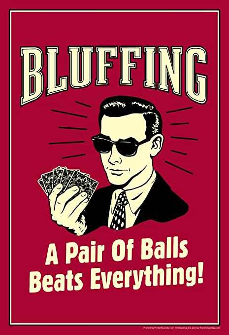
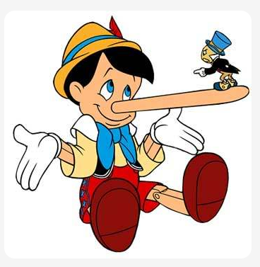
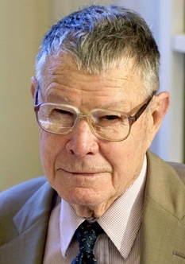

---
output:
  xaringan::moon_reader:
    css: ["default", "extra.css"]
    lib_dir: libs
    seal: false
    nature:
      highlightStyle: github
      highlightLines: true
      countIncrementalSlides: false
      ratio: '16:9'
---

```{r, echo = FALSE, warning = FALSE, message = FALSE}
##xaringan::inf_mr()
## For offline work: https://bookdown.org/yihui/rmarkdown/some-tips.html#working-offline
## Images not appearing? Put images folder inside the libs folder as that is the main data directory

library(tidyverse)
library(readxl)
library(stargazer)
##library(kableExtra)
##library(modelr)

knitr::opts_chunk$set(echo = FALSE,
                      eval = TRUE,
                      error = FALSE,
                      message = FALSE,
                      warning = FALSE,
                      comment = NA)
```

class: slideblue

.size70[**Today's Agenda**]

<br>

.size50[.center[

Explore the tactic of bluffing in international politics.

]]

<br>
<br>
<br>

.center[.size40[
  Justin Leinaweaver (Spring 2022)
]]

???

## Prep for Class
1. ...


---

class: middle, slidegreen

.size40[.center[
**Come to class ready to make an argument about when bluffing is, and when it isn’t, a smart tactic for getting what you want from international politics.**
]]

.size35[
1. Kenealy, A. (2016). The Art of the Bluff: How Presidents Can Leverage Deception. *Lawfare*. 

2. Friedman, U. (2018). Trump Tweets Threats at Iran, as He Did to North Korea. *The Atlantic*. 

3. Rogin, J. (2020). America’s Enemies Are Calling Trump’s Bluffs. *The Washington Post*.
]

???

For today I asked you to come to class ready to make an argument about bluffing in international politics.

FIRST, CAN WE DEFINE THE CONCEPT?
- ACCORDING TO THESE READINGS, WHAT IS BLUFFING IN FOREIGN POLICY?

(* ON BOARD *)

<br>

HOW EASY OR DIFFICULT IS IT TO IDENTIFY BLUFFING IN FOREIGN POLICY? WHY?

- HOW CAN WE DISTINGUISH IT FROM CHANGING YOUR MIND OR CHANGING CIRCUMSTANCES?


---

.size45[.center[**Bluffing as a Tactic During Bargaining**]]

.pull-left[

```{r, fig.retina=3, fig.align='left', out.width='70%'}

```

]

.pull-right[

```{r, fig.retina=3, fig.align='right', out.width='100%'}

```

]

???

Let's now map out the pros and cons of bluffing as a tactic in international politics.

SLIDE

* ON BOARD *

On one side, list the characteristics of a situation where bluffing is a smart tactic.

On the other, list the characteristics of a situation where bluffing is a bad tactic.

* Build lists as a group *

<br>

Before we shift our focus more fully to current events I want to introduce one other set of ideas that tie nicely into the bargaining model.

WHEN I SAY THE WORD "DIPLOMACY," WHAT DO YOU THINK OF?

- WHAT DOES IT MEAN TO BEHAVE "DIPLOMATICALLY"?

(SLIDE)


---

background-image: url('libs/Images/06_3-diplomacy_cartoon.png')
background-size: 75%
background-position: center

???

Cartoon diplomacy.


---

.pull-left[

```{r, fig.retina=3, fig.align='left', out.width='85%'}

```

]

.pull-right[
<br>

.size50[
+ Economist

+ Nobel Prize winner

+ Research on bargaining and negotiations
]]

???

Thomas Schelling is a HUGE name in IR and economics.

Did a ton of work during the Cold War gaming out how nuclear weapons were changing international diplomacy and negotiations.

Won a Nobel Prize for his work which ain't too shabby.

Going to grad school in the social sciences? You will definitely encounter his work.


---

background-image: url('libs/Images/06_3-diplomacy1.png')
background-size: 50%
background-position: center

???

Most relevant for us, Schelling's work definitely informed Fearon's development of the bargaining model.

Schelling defines "diplomacy" as bargaining where two sides agree a deal in which they both lose something to avoid a much worse outcome.

For Schelling, this means that bargaining is not about learning to act "diplomatically."

It's about getting some BUT NOT ALL of what you want in order to avoid the stuff you really don't want.

This means that Schelling defines bargaining as a process in which BOTH sides lose something.

DO WE THINK THAT'S A PROBLEMATIC WAY TO DEFINE BARGAINING? WHY OR WHY NOT?

<br>

Ok, so how does that help us think about the bargaining model?


---

background-image: url('libs/Images/06_3-diplomacy2.png')
background-size: 65%
background-position: center

???

Specifically, this formulation means that bargaining power comes from the "power to hurt."

"The power to hurt" means the threat of pain, shock, loss and grief, privation and horror to motivate others to do what we want.

For Schelling, true bargaining power is all about the threat NOT the action.

Brute force is about taking what you want, but:
- it is always costly to you (blood and treasure required) AND
- it often encourages a united opposition.

Your aim should be coercion
- The threat of damage that makes others comply with your demands.
- It is the threat of violence or pain that changes behavior.

EVERYBODY CLEAR ON THE DISTINCTION AND WHY THREAT IS A MORE POWERFUL TOOL?

<br>

IN THESE TERMS, HOW DO WE GAIN THE UPPER HAND IN A BARGAIN?

(SLIDE)

---

background-image: url('libs/Images/06_3-Ron_Burgundy.jpg')
background-size: 75%
background-position: center

???

1. Know what your adversary treasures and what scares them.


---

background-image: url('libs/Images/06_3-anchorman.gif')
background-size: 100%
background-position: center

???

2. Communicate what they must do to avoid this "hurt."

In other words, you make clear that the "hurt" is contingent on their behavior.


---

background-image: url('libs/Images/06_3-endurance.png')
background-size: 100%
background-position: center

???

For Schelling, war is not a contest of strength.

SLIDE

It is a competition of endurance.
- Whoever can suffer the most wins.

It means we should think of war as a bargaining process.
- Two sides, each demanding a change in the behavior of the other.
- The threat of violence as the important currency.

The winner is the one most able to threaten "hurt" on the other and most willing to accept "hurt" from the other.

<br>

WHAT ARE THE STRENGTHS AND WEAKNESSES OF THIS APPROACH TO UNDERSTANDING DIPLOMACY?

IS THIS A USEFUL WAY TO THINK ABOUT WAR? WHY OR WHY NOT?

- Too cynical?
- Assumes actual violence underpins every negotiation?


---

background-image: url('libs/Images/06_2-Fearon_Figure1.png')
background-size: 100%
background-position: center

???

HOW DOES SCHELLING'S WORK ON DIPLOMACY HELP US THINK ABOUT FEARON'S BARGAINING GAME?
- WHAT IS SCHELLING TRYING TO HELP US THINK ABOUT?

(Schelling wants us to think about how states can try to shift the win-set of their opponent.)

- Threats of violence, targeted smartly, have the capability to move the bargaining process in your favor!

DOES THAT MAKE SENSE?


---

background-image: url('libs/Images/06_3-trump_cartoon.png')
background-size: 78%
background-position: center

???

GIVEN ALL OF THIS, WHERE DO WE STAND ON PRESIDENT TRUMP'S USE OF THREATS AND BLUFFING TO ACHIEVE WHAT HE WANTS FROM INTERNATIONAL POLITICS?


- ARE WE CONVINCED TRUMP USED BLUFFING AS A TACTIC? WHY OR WHY NOT? 


- WOULD YOU SAY TRUMP WAS GOOD AT BLUFFING? WHY OR WHY NOT?


---

background-image: url('libs/Images/06_3-Biden_cartoon.png')
background-size: 70%
background-position: center

???

IN WHAT WAYS DO WE THINK TRUMP'S BLUFFING IMPACTS THE WORLD THAT JOE BIDEN MUST NOW NAVIGATE? 


