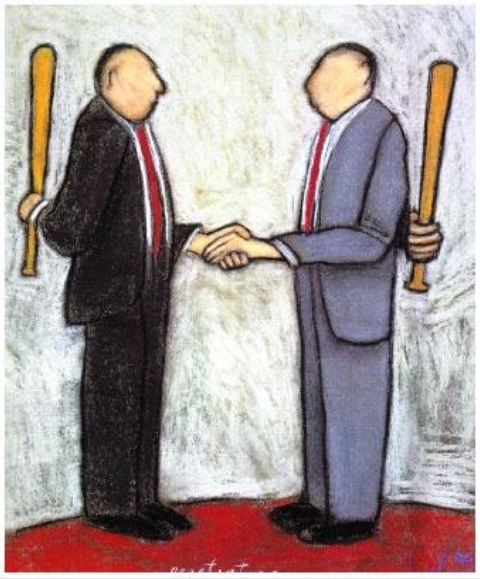
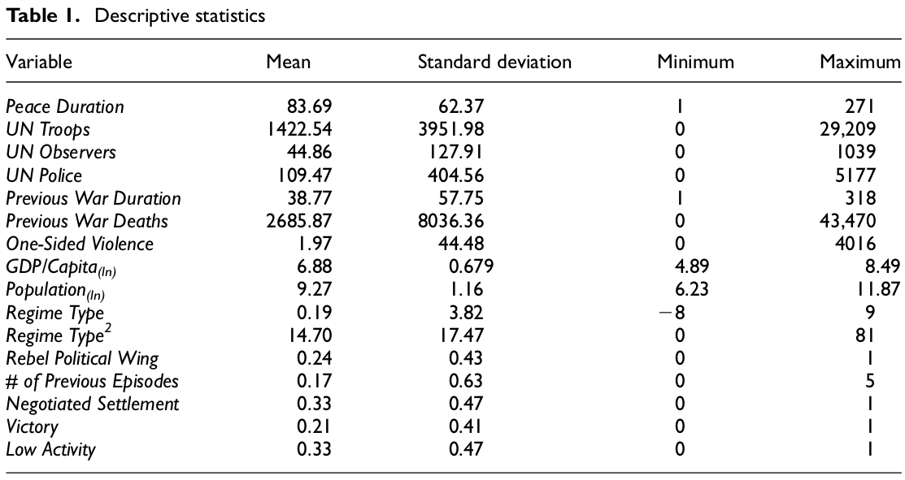
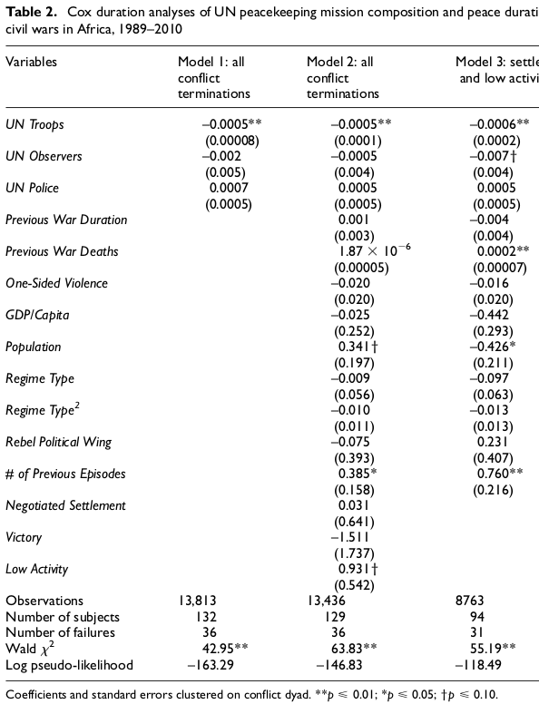

## Today's Agenda {background-image="Images/background-worldmap4.png" .center}

```{r}
# background-size="1920px 1080px"
library(tidyverse)
library(readxl)
```

<br>

<br>

Hultman, Kathman & Shannon (2016). United Nations Peacekeeping Dynamics and the Duration of Post-Civil Conflict Peace.

- Critically analyze the conclusions

<br>

::: r-stack
Justin Leinaweaver (Spring 2025)
:::

::: notes
Prep for Class

1. ...

<br>

*FALL 24*

**Make an argument: Iran bombing Israel yesterday is best explained using neorealism**

<br>

**Make an argument: Iran bombing Israel yesterday is best explained using offensive realism**

<br>

**Make an argument: Iran bombing Israel yesterday is best explained using economic liberalism**

<br>

**Make an argument: Iran bombing Israel yesterday is best explained using liberal institutionalism**

<br>

**Bottom line, which is the most useful model for this event? Why?**


<br>

### DISCUSS: Name me an international political event that has happened since we last met as a class.


:::


## {background-image="Images/07_2-HKS-page1.png" .center  background-size='88%'}

::: notes

Today we continue working on our analyses of the Hultman, L., Kathman, J. & Shannon, M. (2016) paper.

<br>

### Remind me, what is the big research question here?
- (Does UN intervention in post-conflict zones promote peace?)

- (How effective is the UN in promoting peace after civil wars?)

- (Does it matter how many or what kinds of troops are needed to promote peace after civil wars?)
:::


## Hultman, Kathman & Shannon (2016) {background-image="Images/background-worldmap4.png" .center}

<br>

**Diagram the Model**

- Who are the key **Interests**?

- What are the key **Institutions**?

- What are the key **Interactions**?

::: notes

OK, map out the model for me.

### What are the key interests, institutions and interactions in this model?

INTERESTS

- Combatants who want peace
- UN wants stabilization of a post-conflict area

INSTITUTIONS

- Anarchy of post-civil war conflict, no information, no trust

INTERACTIONS

- Combatants face commitment and information problems
- UN uses the number, timing and type of PKOs to promote a durable peace.
:::


## {background-image="Images/background-worldmap4.png" .center}

**Is this paper a "good" test of the bargaining model of war?**

{style="display: block; margin: 0 auto"}

::: notes
**In what specific ways is this paper a "good" test of the Bargaining Model of War?**

<br>

**How does it connect UN troops to the costs, risks and inefficiency of war?**

<br>

For today I asked you to come to class ready to evaluate the analyses in this paper.

- **How did that go?**

- **What parts of the analysis were hardest to understand?**

<br>

I think the easiest way to start this process is by identifying the final conclusions of the paper.

<br>

Everybody go to the "Discussion and conclusion" section on p245.

### What are the final conclusions made by the authors at the end of the paper?

- (**SLIDE**)
:::


## Conclusion: The UN succeeds when... {background-image="Images/07_2-UN_Flag2.png" .center}

<br>

::: {.r-fit-text}

1. UN peacekeeping troops prolong peace

2. UN observers / police do not

:::

::: notes

The wordier versions from the text:

1. Successful UN peacekeeping missions address "the security challenges to former belligerents" by providing "a greater number of troops" on the ground (246).

2. "...increasing the deployment of observer and police personnel is not likely to yield positive outcomes" (246).


<br>

Assume for the moment these conclusions are "correct."

### Do these two conclusions mean the bargaining model is or is not useful as a tool for explaining why wars start?

<br>

### How do we understand the effectiveness of troops against the ineffectiveness of observers? Doesn't that mean the model is unhelpful?

- (Maybe this is the difference between bluffing with "observers" and signaling a serious international commitment with troops willing to use violence?)

<br>

Our goal for today is to evaluate our level of confidence in these two conclusions.

- Do we walk away from this paper thinking the UN is or is not effective at prolonging peace after civil wars?

<br>

### Everybody clear on the goal?

:::


## {background-image="Images/07_2-UN_Flag2.png" .center}

::: {.r-fit-text}

**Are we convinced by the conclusions?**

1. UN peacekeeping troops prolong peace

2. UN observers / police do not

:::

<br>

::: {.fragment}

**Evaluate the Case Selection**

1. What cases in the world are they analyzing?

2. Are we confident these are the "right" cases for answering this research question? Why or why not?

:::

::: notes

Everybody take a look at the research design on p238

- Talk to the people around you and get ready to answer two questions for me

- REVEAL

<br>

**Ok, what cases are they studying and do those cases boost or reduce your confidence in the conclusions?**

- (Only African civil wars)

- (1989 - 2010 (post cold war))

- (Lots of variation in types of war and types of intervention)

- (End of cold war should remove barrier to UNSC acting in these cases)

:::


## {background-image="Images/07_2-UN_Flag2.png" .center}

**Are we convinced by the conclusions?**

1. UN peacekeeping troops prolong peace

2. UN observers / police do not

{style="display: block; margin: 0 auto"}

::: notes

Now let's talk about the data

- e.g. the specific empirical measures of the world these researchers are using to test their model

<br>

The descriptive statistics table in most quantitative research papers are SUPER useful for this discussion.

- **First, talk to the people around you, make sure you're all clear on what each variable measures**

<br>

Let's make sure you're clear

- **Which variable represents the outcome variable for this study? e.g. the thing they are trying to explain**

- **Which variables represent the primary predictors? e.g. the things causing this outcome?**

<br>

Good!

- The rest of these are what we call "control" variables

- e.g. Other things we think are important for explaining the outbreak of war

<br>

**In terms of us being convinced by the conclusions, is this a good list of variables to study? Why or why not?**

:::


## {background-image="Images/07_2-UN_Flag2.png" .center}

**Are we convinced by the conclusions?**

1. UN peacekeeping troops prolong peace

2. UN observers / police do not

{style="display: block; margin: 0 auto"}

::: notes

Now let's use the table to learn about the world of the study

- **Explain to me what each column represents**
    
    - (Mean: The average)
    - (SD: The spread of data around the average)
    - (Min: The smallest value)
    - (Max: The largest value)

<br>

Now, talk to the people around you and focus just on the primary four variables (peace, UN troops, observers and police)

- Get ready to report back what we learn from these descriptive statistics about each measure in the dataset

<br>

**Ok, what did we learn?**

<br>

**What do we learn about post-conflict peace from these descriptive stats?**

- (On average, peace lasts almost 7 years after war)
- BUT shortest was only 1 month!
- Longest was 22 years!
- So, the purpose of the research is to see if we can explain why some states prolong peace and others do not.
- AND could the UN be the difference?

<br>

**What do we learn about how the UN sends troops, observers and police into post conflict zones?**

- Troop missions WAY bigger than the other two
- Troops > Police > Observers
- avg troops deployed 1,400 vs only 44 police! Of course the effect of police is smaller/unable to be measured?!?

<br>

**In terms of us being convinced by the conclusions, does this data represent a good test of this model? Why or why not?**

:::


## {background-image="Images/07_2-UN_Flag2.png" .center}

**Are we convinced by the conclusions?**

1. UN peacekeeping troops prolong peace

2. UN observers / police do not

{style="display: block; margin: 0 auto"}

::: notes

**Do any of the stats on the control variables catch your eye as interesting?**

<br>

Regime type measure from Polity runs from -10 (full dictatorship) to +10 (full democracy)

- **What do we learn about post-conflict states from this variable?**

- (Run the full gamut BUT avg near 0, anocracy)

- Makes sense that conflict zones lack sufficient control for either dictators or democracies to thrive

<br>

**What proportion of the conflicts ended in a negotiation and what proportion in a victory?**

- (33% negotiation, 21% victory)

- Makes sense for places that need UN missions, no?

<br>

GDP per capita, e.g. average economic size or wealth of a country, is included here in the log scale.

- The average GDP pc is only $972 (min $133, max $4,865)

- **What does that tell us about economic wealth in post-conflict zones?**

<br>

Population is also in the log scale

- The average population is only 10,614 (min 507, max 142,94)

- I don't understand what country in the sample has a population of 500...

- **What does that tell us about the size of post-conflict zones?**

<br>

### Questions about any of the other variables?
:::


## {background-image="Images/background-worldmap4.png" .center}

:::: {.columns}
::: {.column width="50%"}
**Analyses**

**High, Low or No Confidence?**
:::
::::



::: notes

Here are the main regression results from their analyses.

### Does anybody have prior experience reading or working with regression results?

### Based only on the writing in the paper, do the authors do a good job helping you understand what we learn from this? Why or why not?

<br>

This is not a stats class and I really don't want this to stress you out at all.

- A regression is simply a tool for evaluating relationships in numerical data.

- The power of a regression approach comes from being able to examine our key hypotheses while adjusting for other things you think are important in the world of your model.

<br>

The first thing to note here is that the table includes three models or separate tests of the hypotheses.

- Each column represents a separate test.

- Models 1 and 2 look at all of the cases.

- Model 3 looks at a specific subset of cases where you might expect peace to be more likely (the easy cases for the UN)

The rows represent the different variables they may include when testing their model.
:::


## {background-image="Images/07_3-table2-1.png"  background-size='95%'}

::: notes

These authors are essentially focused on the first three rows here.

- They want to see what happens to the risk of conflict when you increase UN troops, observers or police.

- The extra rows allow them to check on the effects after adjusting them for other possibly important dynamics (e.g. population size, GDP per capita and the kind of government in place.)

<br>

So, in Model 1 the regression estimates that adding 1 additional UN troop into a post-conflict zone is associated with an average reduction in the risk of war by .0005.

- That's super tiny but makes sense given you're only talking about one trooper.

- However, adding troops in the thousands can start to add up!

<br>

### Does everybody understand the structure of the table?

- Columns are models, rows are the variables

- Where the rows and columns intersect are the estimated effect sizes
:::


## {background-image="Images/07_3-table2-2.png"  background-size='95%'}

::: notes

Interpreting the estimated coefficients can be complicated so I will ask you to think about these four things and not to try to get too in the weeds on this.

1. Direction of Effect
    - Is the effect positive or negative?
    - e.g. Does adding troops raise or lower the risks of war?
2. Size of Effect
    - How many troops do we have to add to impact the likelihood of war?
    - This can be very hard to interpret
3. Significance of Effect
    - Are the coefficients significant? e.g. look for stars!
    - In short, does the regression model fit the data well? 
4. Robustness of Effect
    - For each main variable do the coefficients "point" in the same direction, with the same approximate size and are they all significant across all of the models?
    
### Questions on these four?

<br>

### So, how do these results look according to the four criteria?

- Hypothesis 1: Adding troops reduces the risk of violence on average, BUT the effect looks small.

- Hypothesis 2: Adding observers appears to reduce the risk of violence on average BUT not significant in the models.

- Hypothesis 2: Adding police makes violence more likely on average BUT but also not significant.

<br>

Long story short, the regression analysis in this paper allows the researchers to simultaneously examine 13k cases of UN interventions!

- This means they are trying to evaluate the usefulness of their model using a TON of data!

- Regression is a very powerful tool!
:::


## {background-image="Images/07_3-Figure2.png"  background-size='75%'}

::: notes

Good research papers will always include some attempt to visualize the regression results in a much more understandable way.
- These authors do that with Figure 2.

### How do we interpret the lines on Figure 2?
(described p241)

- y-axis is the risk of violence (higher is bad)

- x-axis is the amount of time since the intervention (time moves to the right)

- The lines represent different hypothetical interventions: 0 troops, 1500 troops and 3000 troops

<br>

### What do we learn from this figure?

- The risk of violence decreases over time REGARDLESS of intervention!
    - e.g. the longer the peace time lasts, the less risk of future violence

- The risk of violence is highest immediately after the conflict stops

- With enough troops in place we can achieve the kinds of low risk that typically takes YEARS to achieve (60 months or 5 years) right away.

<br>

### Is this a useful way to present the analyses? Why or why not?

#### - Do they help you understand the results better?

:::


## Conclusion: The UN succeeds when... {background-image="Images/07_2-UN_Flag2.png" .center}

<br>

::: {.r-fit-text}

1. UN peacekeeping troops prolong peace

2. UN observers / police do not

:::

::: notes
**So, bottom line, how confident are you in these conclusions?**

<br>

### 1. Do you walk away believing that UN troops can be good peacekeepers? Why or why not?

<br>

### 2. Do you walk away more convinced that the bargaining model of war is useful? Why or why not?

<br>

### 3. How does our exploration of this article help you think about the debates we started the week with?

#### - Should the US defund the UN?

#### - Is the UN too weak to be useful?

#### - Is the UN too powerful to be trusted?
:::


## Assignment for Next Class {background-image="Images/background-blue_triangles.jpg" .center}

<br>

Review your notes for all of the models we've explored in class

- Models: Neorealism, Offensive Realism, Liberal Institutionalism, Economic Liberalism, and the Bargaining Model of War

::: notes

Friday we start working on your second paper.

- To get ready for that I want each of you to organize and review your notes on these IR models

- You should be able to diagram the key elements of each, AND

- Explain how you would use each of them to explain international political events

<br>

### Questions on the assignment?
:::


