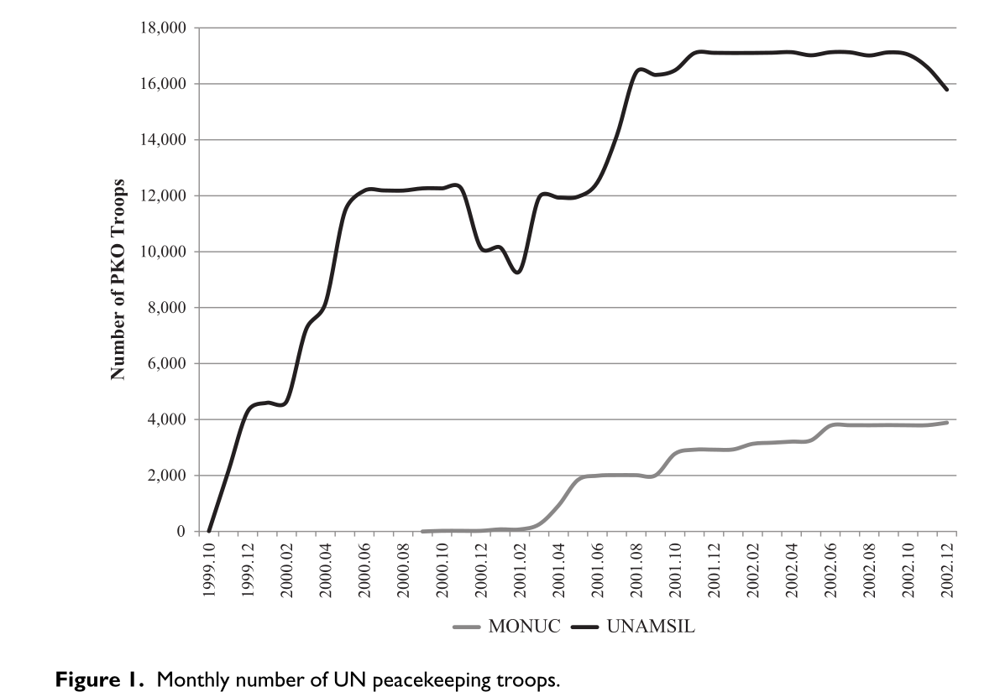
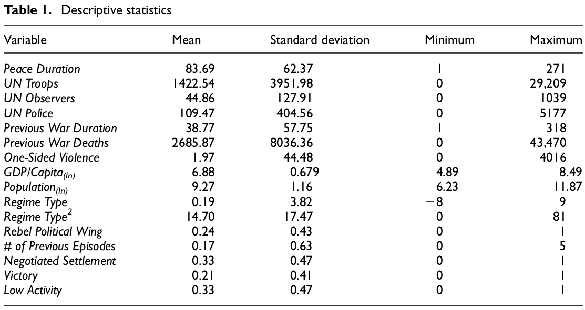
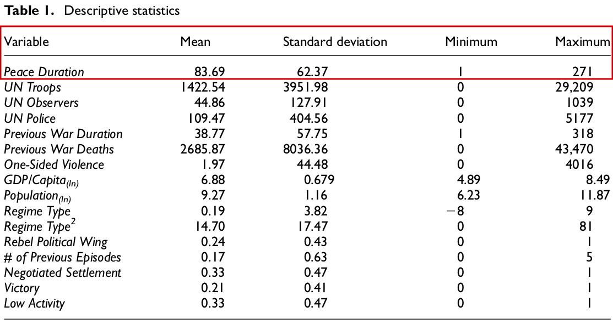
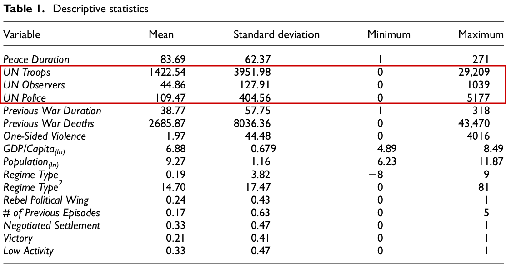
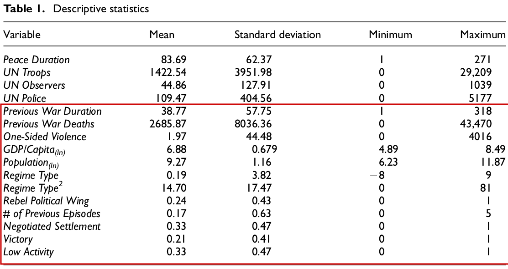
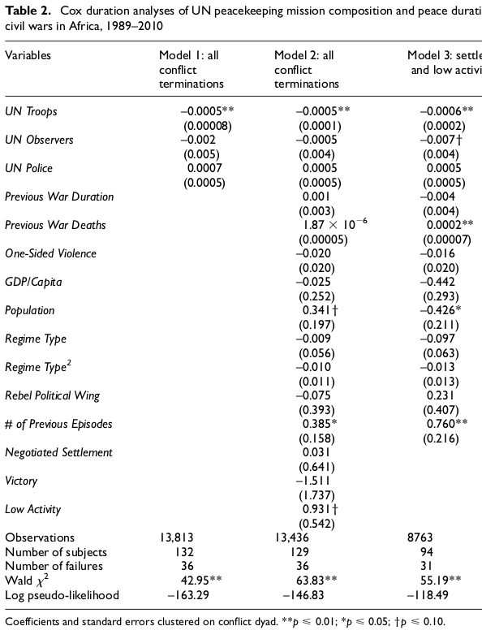
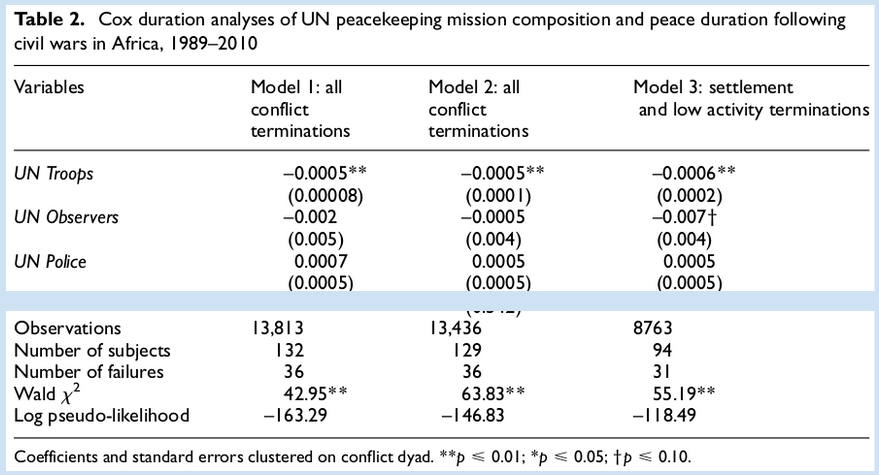
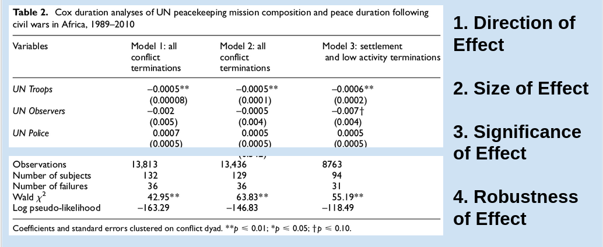
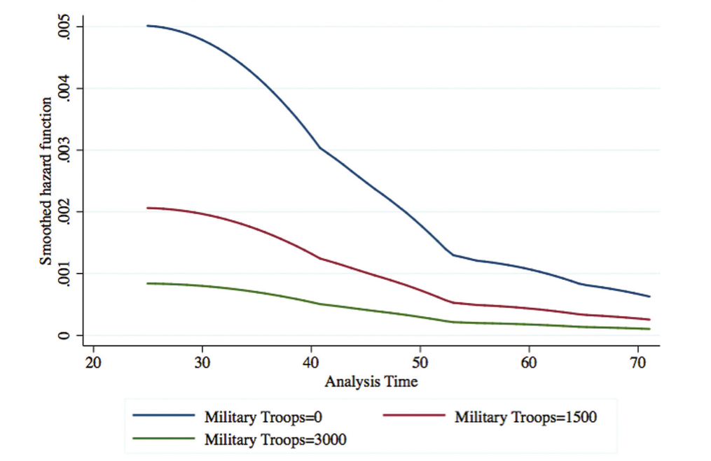

## Today's Agenda {background-image="Images/background-worldmap4.png" .center}

```{r}
# background-size="1920px 1080px"
library(tidyverse)
library(readxl)
```

<br>

<br>

Hultman, Kathman & Shannon (2016). United Nations Peacekeeping Dynamics and the Duration of Post-Civil Conflict Peace.

- Critically analyze the conclusions

<br>

::: r-stack
Justin Leinaweaver (Fall 2026)
:::

::: notes
Prep for Class

1. Review the Canvas submissions

2. Bring the box of markers to class

<br>

**SLIDE**: Section 2 of our class has focused on introducing you to different answers to the question...

:::


## Section 2: Why Are There Wars? {background-image="Images/background-worldmap4.png" .center}

<br>

- Neorealism

- Offensive Realism

- Liberal Institutionalism

- Economic Liberalism

- Bargaining Model of War


::: notes

Why are there wars?

- **One more time, why is war a puzzle to be explained?**

- (Wars are risky, costly and inefficient)

<br>

Each of these theories represents a different set of assumptions that helps us explain war AND other international political events

<br>

**SLIDE**: This week we've been exploring an academic research paper that aims to use data and theory in order to deepen our understanding of war

:::


## {background-image="Images/07_2-HKS-page1.png" .center  background-size='88%'}

::: notes

Last class we began to unpack this research paper

- We discussed the framing of the paper,

- We identified the theory in the paper, and

- We discussed the implications of that theory on the real world

<br>

**Remind me, what is Hultman, Kathman & Shannon's (2016) research question?**

- (Does UN intervention in post-conflict zones promote peace?)

- (How effective is the UN in promoting peace after civil wars?)

- (Does it matter how many or what kinds of troops are needed to promote peace after civil wars?)

<br>

**SLIDE**: Let's connect some dots!

:::


## {background-image="Images/background-worldmap4.png" .center}

**Does UN intervention in post-conflict zones promote peace?**

<br>

**IR Theories**

- Neorealism

- Offensive Realism

- Liberal Institutionalism

- Economic Liberalism

- Bargaining Model of War

::: notes

**What is the neorealist's answer to this question?**

- **According to neorealists, what could be done to promote lasting peace after civil war?**

<br>

**What is the offensive realist's answer to this question?**

- **According to offensive realists, what could be done to promote lasting peace after civil war?**

<br>

**What is the liberal institutionalist's answer to this question?**

- **According to liberal institutionalists, what could be done to promote lasting peace after civil war?**

<br>

**What is the economic liberal's answer to this question?**

- **According to economic liberals, what could be done to promote lasting peace after civil war?**

<br>

For the bargaining model's answer and prescriptions, let's talk about the model in this paper!

- **SLIDE**

:::


## Hultman, Kathman & Shannon (2016) {background-image="Images/background-worldmap4.png" .center}

<br>

**Interests**

::: {.fragment}

- The UN &#8594; peace and stability

- The combatants &#8594; peace and stability

:::

::: notes

OK, recap the model for me.

- **Who are the key interests?**

- **In other words, whose decisions are we trying to explain?**

<br>

(**REVEAL**)

<br>

**What is the decision facing the combatants in these situations?**

- (Go back to war or not)

<br>

**What is the decision facing the UN in these situations?**

- (Per this model, three decisions:)

- (1. Should we send PKOs?)

- (2. What kind of PKOs?)

- (3. How many PKOs?)

<br>

**SLIDE**: Institutions

:::


## Hultman, Kathman & Shannon (2016) {background-image="Images/background-worldmap4.png" .center}

<br>

**Interests**

- The UN &#8594; peace and stability
- The combatants &#8594; peace and stability

**Institutions**

::: {.fragment}

- Domestic Level: Anarchy (recently stopped civil war)

- International Level: Anarchy + UN Charter

:::

::: notes

**What are the institutions in this model? e.g. the key rules of the system these actors operate within**

<br>

(**REVEAL**)

<br>

At the domestic level, a civil war means there is conflict over the basic rules of society

<br>

At the international level is a mix of anarchy with an overlay of some international rules

- e.g. the ability to send PKOs into post-civil war states

<br>

So, the combatants want peace but live in a system with no agreed upon and trusted rules

- **SLIDE**: Which takes us to the interactions in the model

:::


## Hultman, Kathman & Shannon (2016) {background-image="Images/background-worldmap4.png" .center .smaller}

<br>

**Interests**

- The UN &#8594; peace and stability
- The combatants &#8594; peace and stability

**Institutions**

- Domestic Level: Anarchy (recently stopped civil war)
- International Level: Anarchy + UN Charter

**Interactions**

::: {.fragment}

- Combatants cannot trust the commitments made by the other side
- Combatants lack information on what the other side is actually doing
- PKOs can promote peace by monitoring behavior, enforcing commitments and providing information 

:::

::: notes

**What are the interactions in this model?**

- **In other words, what are the obstacles to peace and how can PKOs address them?**

- (**REVEAL**)

<br>

**According to the bargaining model of war, why is a lack of trust a problem?**

- (In almost all disputes between two sides there should be a negotiated outcome that is preferred to war, BUT...)

- ALL negotiated outcomes depend on being able to trust the commitments made by the other side)

- (If I cannot trust your word, then I can't put my guns down for fear of being attacked)

<br>

**According to the bargaining model of war, why is a lack of information a problem?**

- (In almost all disputes between two sides there should be a negotiated outcome that is preferred to war, BUT...)

- (Uncertainty 1: I can't be sure you actually want the fighting to stop)

- (Uncertainty 2: I can't be sure you've actually put your guns down permanently rather than temporarily)

<br>

SO, the UN sends in PKOs and THEY address the REAL causes of conflict: trust and uncertainty!

- **Does this model make sense?**

- **Is everybody clear how this is a representation of the bargaining model of war applied to a very specific situation?**

<br>

**SLIDE**: For today I asked you to come to class ready to evaluate the analyses in this paper.

:::


## Hultman, Kathman & Shannon (2016) {background-image="Images/background-worldmap4.png" .center}

<br>

**Analyzing the Research Design (p238-240)**

1. What is **ONE** choice in the research design that makes you confident in the conclusions of the paper?

2. What is **ONE** choice in the research design that takes away some of your confidence in the conclusions of the paper?

::: notes

*ON BOARD: Strengths vs Weaknesses*

<br>

Everybody grab a marker from the box and put the strength and weakness you submitted to Canvas before class on the board

- Go!

<br>

*PRESENT and DISCUSS each*

<br>

Let's now step through the analyses in the paper to go deeper on these points

<br>

I think the easiest way to start this process is by identifying the final conclusions of the paper.

- Everybody go to the "Discussion and conclusion" section on p245.

- **What are the final conclusions made by the authors at the end of the paper?**

- (**SLIDE**)

:::


## {background-image="Images/background-worldmap4.png" .center}

**Does UN intervention in post-conflict zones promote peace?**

<br>

**Conclusions**

1. Sending more UN peacekeeping troops into a post-conflict zone prolongs peace

2. Sending more UN observers and military police into a post-conflict zone does not prolong peace


::: notes

The wordier versions from the text:

1. Successful UN peacekeeping missions address "the security challenges to former belligerents" by providing "a greater number of troops" on the ground (246).

2. "...increasing the deployment of observer and police personnel is not likely to yield positive outcomes" (246).

<br>

Our goal for today is to evaluate our level of confidence in these two conclusions.

- Do we walk away from this paper thinking the UN is or is not effective at prolonging peace after civil wars?

<br>

**Everybody clear on the goal?**

<br>

**SLIDE**: Let's start with the case selection

:::


## {background-image="Images/background-worldmap4.png" .center}

**Does UN intervention in post-conflict zones promote peace?**

<br>

**Evaluate the Case Selection**

1. What cases are they analyzing?

2. Are these the "right" cases for answering the research question?

::: notes

Everybody take a look at the research design on p238

- Talk to the people around you and get ready to answer two questions for me

- REVEAL

<br>

**Ok, what cases are they studying and do those cases boost or reduce your confidence in the conclusions?**

- (Only African civil wars)

- (1989 - 2010 (post cold war))

- (Lots of variation in types of war and types of intervention)

- (End of cold war should remove barrier to UNSC acting in these cases)

<br>

**SLIDE**: Now we need to talk about the data

:::


## {background-image="Images/background-worldmap4.png" .center}

**Does UN intervention in post-conflict zones promote peace?**

<br>

{style="display: block; margin: 0 auto"}

::: notes

Everybody turn to p235 and look at Figure 1

- **What does this show and why is it in the paper?**

<br>

There is SIGNIFICANT variation in UN PKO forces

- UNAMSIL: Very large forces rapidly sent into Sierra Leone and then reinforcements sent the next year

- MONUC: Much smaller force sent much more slowly into the Democratic Republic of the Congo

<br>

The researchers are warning us that the PKOs ability to provide trust and overcome uncertainty likely tied to the size of the forces being sent

- **Make sense?**

<br>

**SLIDE**: Data is awesome so let's do more!

<br>

"Consider Figure 1, which plots the deployment of armed PKO troops to two missions in Africa from late 1999 through 2002. The UN mission in Sierra Leone (UNAMSIL) dramatically escalated its troop commitment in early 2000 and again in mid-2001. By comparison, the UN mission to the Democratic Republic of the Congo (MONUC) made a much smaller and more incremental troop increase over the course of its deployment. Dichotomous indicators of a mission’s presence or absence in the conflict state only indicate that UNAMSIL was present across the entire time period, whereas MONUC did not arrive until late 1999 and remained until 2002. If the simple presence or absence of a mission is enough for the UN to be effective, then these two missions are indistinguishable and should have an equal chance of success. Yet, evidence suggests that the escalation of troops to Sierra Leone resulted in a great deal of progress, helping end the bloody conflict and secure the peace that followed (Findlay, 2002). MONUC on the other hand saw substantially less success, at least in the early stages of its deployment. Empirical models that employ categorical indicators of peace-keeping do not capture these critical differences between missions like UNAMSIL and MONUC. Therefore such models cannot assess the consequence of these differences for the stability of post-conflict peace" (235).

:::


## {background-image="Images/background-worldmap4.png" .center}

**Does UN intervention in post-conflict zones promote peace?**

<br>

{style="display: block; margin: 0 auto"}

::: notes

Now let's talk about the data

- e.g. the specific empirical measures of the world these researchers are using to test their model

<br>

The descriptive statistics table in most quantitative research papers are SUPER useful for this discussion.

- *Step through the descriptive stats with them: e.g. what is a mean?*

<br>

**SLIDE**: Let's start by focusing just on row 1 of the table

:::


## {background-image="Images/background-worldmap4.png" .center}

**Does UN intervention in post-conflict zones promote peace?**

<br>

{style="display: block; margin: 0 auto"}

::: notes

**Is peace duration the outcome or the predictor in the research question?**

<br>

*Step through what we can learn from focusing on row 1, the DV, peace duration only*

- (On average, peace lasts almost 7 years after war)

- BUT shortest was only 1 month!

- Longest was 22 years!

<br>

**So, how much variation in outcomes is there to explain in this dataset?**

- (A ton!)

- The purpose of the research is to see if we can explain why some states prolong peace and others do not.

- AND could the UN be the difference?

<br>

**SLIDE**: Now focus on the next three rows

:::


## {background-image="Images/background-worldmap4.png" .center}

**Does UN intervention in post-conflict zones promote peace?**

<br>

{style="display: block; margin: 0 auto"}

::: notes

PAIRS, focus just on the three key predictor variables

- Analyze them using these descriptive stats and report back

<br>

**What do we learn from these?**

- Troop missions WAY bigger than the other two
    
- Troops > Police > Observers
    
- avg troops deployed 1,400 vs only 44 police! Of course the effect of police is smaller/unable to be measured?!?

<br>

**How does this help us think about the conclusions in the paper?**

- **In other words, do these descriptive stats help us understand why troops matter and UN police and observers don't?**

<br>

**SLIDE**: Now focus on the control variables

:::


## {background-image="Images/background-worldmap4.png" .center}

**Does UN intervention in post-conflict zones promote peace?**

<br>

{style="display: block; margin: 0 auto"}

::: notes

The control variables represent the other important features of these states and conflict that the researchers think are relevant

- By adjusting your analysis for these variables you hope to clarify the main results

- e.g. you "control" for these variables to strengthen your finding

<br>

Regime type measure from Polity runs from -10 (full dictatorship) to +10 (full democracy)

- **What do we learn about post-conflict states from this variable?**

- (Run the full gamut BUT avg near 0, anocracy)

- Makes sense that conflict zones lack sufficient control for either dictators or democracies to thrive

<br>

**What proportion of the conflicts ended in a negotiation and what proportion in a victory?**

- (33% negotiation, 21% victory)

- Makes sense for places that need UN missions, no?

<br>

GDP per capita, e.g. average economic size or wealth of a country, is included here in the log scale.

- The average GDP pc is only $972 (min $133, max $4,865)

- **What does that tell us about economic wealth in post-conflict zones?**

<br>

Population is also in the log scale

- The average population is only 10,614 (min 507, max 142,94)

- I don't understand what country in the sample has a population of 500...

- **What does that tell us about the size of post-conflict zones?**

<br>

**SLIDE**: Regression time
:::


## {background-image="Images/background-worldmap4.png" .center}

**Does UN intervention in post-conflict zones promote peace?**

{style="display: block; margin: 0 auto"}

::: notes

Table 2 represents the main regression results from the paper.

- **Does anybody have prior experience reading or working with regression results?**

<br>

**Based only on the writing in the paper, do the authors do a good job helping you understand what we learn from this? Why or why not?**

<br>

This is not a stats class and I really don't want this to stress you out at all.

- A regression is simply a tool for evaluating relationships in numerical data.

- The power of a regression approach comes from being able to examine our key hypotheses while adjusting for other things you think are important in the world of your model.

<br>

The first thing to note here is that the table includes three models or separate tests of the hypotheses.

- Each column represents a separate test.

- Models 1 and 2 look at all of the cases.

- Model 3 looks at a specific subset of cases where you might expect peace to be more likely (the easy cases for the UN)

- You can also see that each model is adjusted for the control variables we just discussed

<br>

**SLIDE**: Focus in on just the predictors in the model

:::


## {background-image="Images/background-worldmap4.png" .center}

**Does UN intervention in post-conflict zones promote peace?**

<br>

{style="display: block; margin: 0 auto"}

::: notes

These authors are essentially focused on the first three rows here.

- They want to see what happens to the risk of conflict when you increase UN troops, observers or police.

- The extra rows allow them to check on the effects after adjusting them for other possibly important dynamics (e.g. population size, GDP per capita and the kind of government in place.)

<br>

So, in Model 1 the regression estimates that adding 1 additional UN troop into a post-conflict zone is associated with an average reduction in the risk of war by .0005.

- That's super tiny but makes sense given you're only talking about one trooper.

- However, adding troops in the thousands can start to add up!

<br>

**Does everybody understand the structure of the table?**

- Columns are models, rows are the variables

- Where the rows and columns intersect are the estimated effect sizes
:::


## {background-image="Images/background-worldmap4.png" .center}

**Does UN intervention in post-conflict zones promote peace?**

<br>

{style="display: block; margin: 0 auto"}

::: notes

Interpreting the estimated coefficients can be complicated so I will ask you to think about these four things and not to try to get too in the weeds on this.

1. Direction of Effect

    - Is the effect positive or negative?
    - e.g. Does adding troops raise or lower the risks of war?

2. Size of Effect

    - How many troops do we have to add to impact the likelihood of war?
    - This can be very hard to interpret

3. Significance of Effect

    - Are the coefficients significant? e.g. look for stars!
    - In short, does the regression model fit the data well? 

4. Robustness of Effect

    - For each main variable do the coefficients "point" in the same direction, with the same approximate size and are they all significant across all of the models?

<br>

**Questions on these four?**

<br>

**So, how do these results look according to the four criteria?**

- Hypothesis 1: Adding troops reduces the risk of violence on average, BUT the effect looks small.

- Hypothesis 2: Adding observers appears to reduce the risk of violence on average BUT not significant in the models.

- Hypothesis 2: Adding police makes violence more likely on average BUT but also not significant.

<br>

Long story short, the regression analysis in this paper allows the researchers to simultaneously examine 13k cases of UN interventions!

- This means they are trying to evaluate the usefulness of their model using a TON of data!

- Regression is a very powerful tool!

<br>

**SLIDE**: Marginal effects plots
:::


## {background-image="Images/background-worldmap4.png" .center}

**Does UN intervention in post-conflict zones promote peace?**

{style="display: block; margin: 0 auto"}

::: notes

Good research papers will always include some attempt to visualize the regression results in a much more understandable way.
- These authors do that with Figure 2.

**How do we interpret the lines on Figure 2?**

- (described p241)

- y-axis is the risk of violence (higher is bad)

- x-axis is the amount of time since the intervention (time moves to the right)

- The lines represent different hypothetical interventions: 0 troops, 1500 troops and 3000 troops

<br>

**What do we learn from this figure?**

- The risk of violence decreases over time REGARDLESS of intervention!
    - e.g. the longer the peace time lasts, the less risk of future violence

- The risk of violence is highest immediately after the conflict stops

- With enough troops in place we can achieve the kinds of low risk that typically takes YEARS to achieve (60 months or 5 years) right away.

<br>

**Does this help you understand the results better?**

<br>

**SLIDE**: Conclusions

:::


## {background-image="Images/background-worldmap4.png" .center}

**Does UN intervention in post-conflict zones promote peace?**

<br>

**Conclusions**

1. Sending more UN peacekeeping troops into a post-conflict zone prolongs peace

2. Sending more UN observers and military police into a post-conflict zone does not prolong peace

::: notes

**So, bottom line, how confident are you in these conclusions?**

- **Do you walk away believing that UN troops can be good peacekeepers? Why or why not?**

<br>

**Does the evidence in this paper suggest the UN does or does not matter in international politics?**

<br>

**Does this research paper demonstrate that the bargaining model of war is more useful than the other IR theories in this case? Why or why not?**

<br>

**SLIDE**: Next class

:::


## Assignment for Next Class {background-image="Images/background-worldmap4.png" .center}

<br>

Review your notes for all of the models we've explored in class

- Models: Neorealism, Offensive Realism, Liberal Institutionalism, Economic Liberalism, and the Bargaining Model of War

::: notes

Friday we start working on your second paper.

- To get ready for that I want each of you to organize and review your notes on these IR models

- You should be able to diagram the key elements of each, AND

- Explain how you would use each of them to explain international political events

<br>

**Questions on the assignment?**
:::


