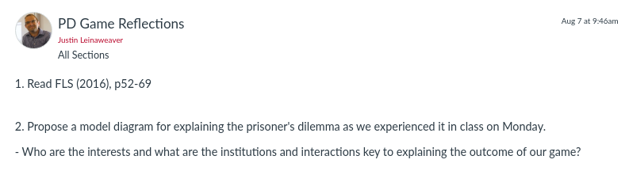

---
output:
  xaringan::moon_reader:
    css: ["default", "extra.css"]
    lib_dir: libs
    seal: false
    nature:
      highlightStyle: github
      highlightLines: true
      countIncrementalSlides: false
      ratio: '16:9'
---

```{r, echo = FALSE, warning = FALSE, message = FALSE}
##xaringan::inf_mr()
## For offline work: https://bookdown.org/yihui/rmarkdown/some-tips.html#working-offline
## Images not appearing? Put images folder inside the libs folder as that is the main data directory

library(tidyverse)
library(readxl)
library(stargazer)
##library(kableExtra)
##library(modelr)

knitr::opts_chunk$set(echo = FALSE,
                      eval = TRUE,
                      error = FALSE,
                      message = FALSE,
                      warning = FALSE,
                      comment = NA)
```

background-image: url('libs/Images/background-worldmap3.png')
background-size: 105%
background-class: top
class: middle

.center[.size50[**III. Why is it so Hard to Cooperate with Other Countries?**]]

<br>

.size50[
**Today's Agenda**

- Welcome to the Prisoner's Dilemma
]

<br>

.center[.size40[
  Justin Leinaweaver (Spring 2024)
]]

???

## Prep for class (Regular term)
1. Reserve an extra, nearby classroom
    - SP23: OBT 307, 309, 311 and 313 
    
2. Set up the other rooms with game board and tracking

3. Make sure to record per round choices on table in next class slides


---

background-image: url('libs/Images/background-cloth_v2.png')
background-size: 100%
background-position: center
class: middle

.size55[**So far in this class we've...**]

.size35[
+ Used simulations and real-world cases to define international political events,
]

--

.size35[
+ Discussed the "science" of political science and the importance of theory (models),
]

--

.size35[
+ Practiced critically engaging with arguments in terms of their logic, clarity and use of empirical evidence,
]

--

.size35[
+ Utilized IR models to answer the question, why do wars happen?
]

???

That's an impressive amount of stuff!

### Any questions on all of that?


---

background-image: url('libs/Images/background-blue_triangles2.png')
background-size: 100%
background-position: center
class: middle

.size50[.center[Make an argument that one of the IR theories we've studied in class so far this term **"best"** explains the event you explored in Paper 1.]]

<br>

```{r, fig.align='center', out.width='100%'}
knitr::include_graphics("libs/Images/03_1-syllabus.png")
```

???

Don't forget, your outline of the second paper is due at the end of the week.

<br>

### Questions on the assignment?


---

background-image: url('libs/Images/background-blue_triangles.jpg')
background-size: 100%
background-class: center
class: middle

.size60[**Semester Outline**]

.size40[
Section 1: Arguments, Evidence and International Relations

Section 2: Why Are There Wars?

**Section 3: Why is it so Hard to Cooperate With Other Countries?**

Section 4: What is the Future of Transnational Politics and IR?
]

???

Today we start on Section 3 of the class.

<br>

Rather than start with the theory of this topic, I prefer to start with practice.

+ So, let's play a game!

<br>

**SLIDE**: In a moment I'll split the class into two groups.


---

background-image: url('libs/Images/background-cloth_v2.png')
background-size: 100%
background-position: center
class: middle

.size70[**A Prisoner's Dilemma**]

<br>

.size50[
+ Each round your group must choose to cooperate or defect.

+ Your reward depends on the choice made by the other group.
]

???

What do I mean by "reward"?

- Depending on how each group chooses, points are added or subtracted from your total

- At end, all positive points earned by your group will be added to your next paper as EC.


---

background-image: url('libs/Images/background-cloth_v2.png')
background-size: 100%
background-position: center
class: middle

.size50[**A Prisoner's Dilemma**]

.size30[
+ Each round your group must choose to cooperate or defect.
+ Your reward depends on the choice made by the other group.
]

```{r, fig.align='right', out.width='95%'}
knitr::include_graphics("libs/Images/04_1-PD_Table.png")
```

???

Here's what I mean by saying your reward depends on the choice of the other team.

*Walk them through how to read the table*

### Any questions about how the game works?


---

background-image: url('libs/Images/background-cloth_v2.png')
background-size: 100%
background-position: center
class: middle

.size50[**A Prisoner's Dilemma**]

.size30[
+ Each round your group must choose to cooperate or defect.
+ Your reward depends on the choice made by the other group.
]

```{r, fig.align='right', out.width='95%'}
knitr::include_graphics("libs/Images/04_1-PD_Table.png")
```

???

*Split class in half*

*Have everyone gather their stuff and head to their room*

From this moment, no communication between the groups!

No computers, no phones.

<br>

### In 5 minutes you will need to give me your decision for round 1.

Group 1 stay here, group 2 across the hall.

<br>

*Gameplay notes for you:*

- 6 rounds (x4-5 mins)
- each group send one sentence message to other group
- one final round (5 mins)
- *After final round, all back to main room*


---

background-image: url('libs/Images/background-blue_triangles2.png')
background-size: 100%
background-position: center
class: middle

.size60[.content-box-purple[**Assignment for Next Class**]]

<br>

```{r, fig.align='center', out.width='100%'}

```


???

### Questions on the assignment?