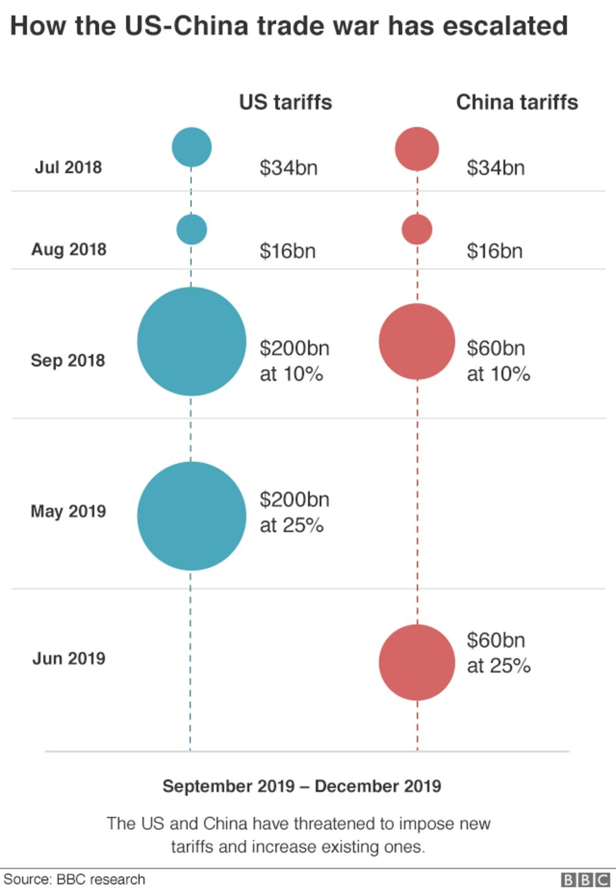
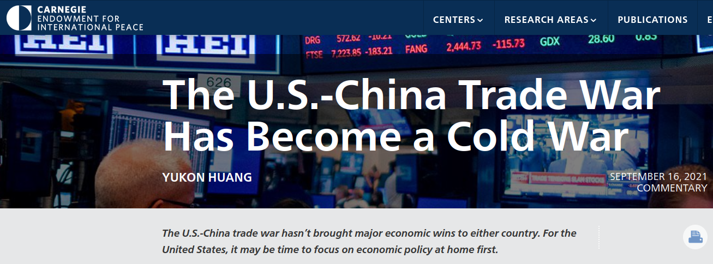

---
output:
  xaringan::moon_reader:
    css: ["default", "extra.css"]
    lib_dir: libs
    seal: false
    nature:
      highlightStyle: github
      highlightLines: true
      countIncrementalSlides: false
      ratio: '16:9'
---

```{r, echo = FALSE, warning = FALSE, message = FALSE}
##xaringan::inf_mr()
## For offline work: https://bookdown.org/yihui/rmarkdown/some-tips.html#working-offline
## Images not appearing? Put images folder inside the libs folder as that is the main data directory

library(tidyverse)
library(readxl)
library(stargazer)
##library(kableExtra)
##library(modelr)

knitr::opts_chunk$set(echo = FALSE,
                      eval = TRUE,
                      error = FALSE,
                      message = FALSE,
                      warning = FALSE,
                      comment = NA)
```

class: slideblue

.size70[**Today's Agenda**]

<br>

.size50[.center[

Are the economic benefits of trade worth the costs?  

]]

<br>

<br>

<br>

.center[.size40[
  Justin Leinaweaver (Spring 2022)
]]


---

class: middle, slideblue

### Interests
.size30[
+ States want growth
]

### Institutions
.size30[
+ States may choose to start wars or seek trade (anarchy)
]

### Interactions
.size30[
+ War is risky and disrupts trade
+ The returns to trade grow over time
+ Specialized economies are dependent on trade for growth
]

.size30[Therefore, increasing trade should reduce the occurrence of war.]

???

On Monday we started digging into our next model: Economic Liberalism.

REMIND ME, WHAT IS SPECIALIZATION?
(The idea is that the world economy grows best when everyone focuses on doing the things they are best at.)
- You then buy the other stuff you need from the rest of the world.

<br>

AND WHY DOES SPECIALIZATION LEAD TO INTERDEPENDENCE?
(If you grow to depend on other states to provide you with what they do best so you can focus on your what you do best then you'd be crazy to start a war that disrupts the flow of trade.)

<br>

IN WHAT KINDS OF CASES DOES ROSECRANCE NOTE THAT ECONOMIC LIBERALISM FAIL TO PROMOTE PEACE?
(1. Resources are scarce / limited)
(2. States are self-sufficient)

<br>

** Omit and segue straight into real-world case**
WHAT WERE THE MOST CONVINCING ASPECTS OF THIS MODEL TO YOU?

WHAT ARE THE WEAKEST PARTS?


---

background-image: url('libs/Images/11_2-Example-US_China_Trade.png')
background-size: 88%
background-position: center

???

Let's apply these ideas to some current events.

Let's talk US-China Trade! 

Here we see the top 15 trade partners of the US in 2011.

WHAT DO WE LEARN FROM THIS ABOUT US TRADE AND THE US POSITION IN THE WORLD?

<br>

WHAT DOES ECONOMIC LIBERALISM TELL US TO EXPECT BASED ON THIS DATA?

<br>

Now, zoom in on China.

WHAT IS THE BENEFIT TO US OF ALL THESE IMPORTS COMING IN FROM CHINA?

(Cheap stuff for consumers means quality of life increasing!)
- Prices fall
- You get more stuff for your spending

<br>

AND WHAT DOES ECONOMIC LIBERALISM TELL US TO EXPECT ABOUT THIS DEEP TRADE RELATIONSHIP BETWEEN THE US AND CHINA?


---

background-image: url('libs/Images/11_2-Example-US_China_Trade2.png')
background-size: 75%
background-position: left

.pull-right[

```{r, fig.retina=3, fig.align='right', out.width='85%'}

```

]

???

So, of course, Donald Trump launched a trade war with China.

SLIDE

Here we see the series of tit-for-tat escalations in terms of tariffs applied by each country on goods from the other.

Each set of tariffs harms the flow of goods across the world, e.g. disrupts trade.

<br>

HOW DOES ECONOMIC LIBERALISM HELP US THINK ABOUT THIS TRADE WAR?

- WHY DID IT HAPPEN? WHY DID TRUMP START THIS "TRADE WAR"?
(Protectionism!)

<br>

- HOW WILL WE KNOW IF WE ARE "WINNING"?
(Manufacturing comes back to the US!)

<br>

- ARE WE WINNING?


---

class: middle

.size45[.center[**The Effect?**]]

.size35[
"The trade war caused economic pain on both sides and led to diversion of trade flows away from both China and the United States. As 
described by Heather Long at the Washington Post, 'U.S. economic growth slowed, business investment froze, and companies didn't hire as many people. Across the nation, a lot of farmers went bankrupt, and the manufacturing and freight transportation sectors have hit lows not seen since the last recession. Trump's actions amounted to one of the largest tax increases in years'" (Hass and Denmark 2020).
]

???

Nope. Mostly just increasing suffering on all sides!

- Prices have gone up,
- Other countries are diverting trade away from both of us,
- Taiwan, Mexico and Vietnam and other SE asian nations have done great (trade diversion)!
- etc.

<br>

WHAT DOES ECONOMIC LIBERALISM TELL US COMES AFTER ALL THIS?
- WHAT ARE THE RISKS OF IT CONTINUING?

<br>

AND WHERE IS THE BIDEN ADMIN ON THIS?


---

```{r, fig.retina=3, fig.align='center', out.width='70%'}

```

```{r, fig.retina=3, fig.align='center', out.width='70%'}
knitr::include_graphics("libs/Images/11_2-Example-US_China2.png")
```

???

The Biden administration is sending signals that they will continue the policy for the time being.

WHAT IS GOING ON HERE?

- IF THE US IS SUFFERING, WHY KEEP THIS GOING?

<br>

FROM A REALIST'S PERSPECTIVE, DOES THE TRADE WAR MAKE SENSE?

(Maybe)
- some economic harm to consumers may be worth trying to slow China's economic growth (e.g. power).

<br>

BUT from an econ lib perspective, this trade war gives us:
- Slower economic growth,
- higher taxes for consumers, and
- fewer houses and jobs for all of us.

Why? Specialization!
- We must now begin investing in production of goods we are less efficient at producing in order to replace buying them from abroad. Resources spent on this are by definition less efficient.

We are trading economic growth for self-sufficiency (and a more conflict prone world according to econ lib).

The key framing of trade by economic liberalism is one of expanding the proverbial pie.

Engaging in trade is not being exploited.
- You get something for your money.

The current US trade deficit is big because US consumers like to buy cheap stuff from China.
- The deficit does NOT mean China is stealing from us.

AND, the more we depend on other countries for stuff, the safer the world becomes!

<br>

BOTTOM LINE, WHAT DO WE THINK, IS THE TRADE WAR WORTH THE RISKS AND THE COSTS? WHY OR WHY NOT?

<br>

Today we're going to examine another important debate about trade.

WHAT IS THE BIG QUESTION AT THE HEART OF OUR READINGS FOR TODAY?


---

class: middle, slidepurple

.size50[.center[**Is international trade good for the developing world?**]]

<br>

## Panagariya (2003)

## Rodrik (2001)

???

Is increasing your exposure to international trade a good idea for developing states?

WHAT IS THE CONCLUSION OF PANAGARIYA'S ARGUMENT?


---

class: middle, slidepurple

.size50[.center[**Is international trade good for the developing world?**]]

### Panagariya (2003)
.size40[
+ Therefore, trade benefits outweigh the costs for developing states.
]

### Rodrik (2001)

???

AND WHAT IS THE CONCLUSION OF RODRIK'S ARGUMENT?


---

class: middle, slidepurple

.size50[.center[**Is international trade good for the developing world?**]]

### Panagariya (2003)
.size40[
+ Therefore, trade benefits outweigh the costs for developing states.
]

### Rodrik (2001)
.size40[
+ Therefore, developing countries should focus on growth through domestic investing and institutions, not trade.
]


---

class: middle

.size50[.center[**Panagariya (2003)**]]

.size40[

1. ???

2. ???

3. ???

4. ...

Therefore, trade benefits outweigh the costs for developing states.
]

???

Let's start with Panagariya (2003).

SLIDE

Everybody take five minutes to diagram this argument.

- Pull out the key premises in this argument.

<br>

Now combine diagrams with the person next to you (small groups).

- Consolidate to a single argument.

<br>

* ON BOARD *

OK, GIVE ME PREMISES, LET'S DIAGRAM THIS VERSION OF THE ARGUMENT.


---

class: middle

.size50[.center[**Panagariya (2003)**]]

.size35[

1. Rich countries generally more open than poor ones

2. Trade openness promotes growth through efficiency and access to tech

3. Growth creates jobs, increases government's fiscal resources, raises incomes

4. Efficiency can promote environmental objectives (if pollution is taxed)

Therefore, trade benefits outweigh the costs for developing states.
]

???

IS THIS A LOGICAL ARGUMENT? WHY OR WHY NOT?

<br>

IS THIS A CONVINCING ARGUMENT? WHY OR WHY NOT?

---

class: middle

.size50[.center[**Rodrik (2001)**]]

.size40[

1. ???

2. ???

3. ???

4. ...

Therefore, developing countries should focus on growth through domestic investing and institutions, not trade.
]

???

Let's shift to Rodrik (2001)

SLIDE

Everybody take some time to diagram this argument.

- Pull out the key premises in this argument.

<br>

Now combine diagrams with the person next to you (small groups).

- Consolidate to a single argument.

<br>

* ON BOARD *

OK, GIVE ME PREMISES, LET'S DIAGRAM THIS VERSION OF THE ARGUMENT.

---

class: middle

.size50[.center[**Rodrik (2001)**]]

.size30[

1. Lowering barriers to trade and investment does NOT guarantee growth
2. Success through open trade requires diverting money away from domestic needs toward VERY costly new policies / institutions
3. Many "rules for admission into the world economy" are biased to benefit powerful states and undermine democratic institutions
4. Availability of foreign capital can encourage bad policies
5. Slow and steady domestic growth allows successful engagement with trade, not vice-versa


Therefore, developing countries should focus on growth through domestic investing and institutions, not trade.
]

???

IS THIS A LOGICAL ARGUMENT? WHY OR WHY NOT?

<br>

WHAT EVIDENCE DOES RODRIK PROVIDE TO SUPPORT EACH PREMISE?

1. Empirical data does NOT show openness leads to growth; confounding variables are the culprit e.g. ineffective institutions, geography, inappropriate macroeconomic policies
2. Requires (tax reform, social safety nets, administrative reform, labor market reform, training programs), Diverts from (education, health, industrial capacity and social cohesion)
3. Many of trade's success stories were based on asian states (South Korea, China, India, Taiwan) liberalizing slowly, without requiring a complete re-structuring of their institutions.
4. Not about increasing efficiency

<br>

ULTIMATELY, WHICH ARGUMENT IS MORE CONVINCING? WHY?

<br>

If class seems totally sold on Rodrik:

1. ARE WE BIASED TO BE CONVINCED BY SINGLE EXAMPLES THAT DISPROVE GENERALIZATIONS, RATHER THAN SEEKING THE PREPONDERANCE OF THE EVIDENCE?

<br>

2. PANAGARIYA AIN'T ALONE. REMEMBER, RODRIK'S PLAN MIGHT NOT BE FEASIBLE IF STATE IS FAILED, CORRUPT OR OTHERWISE LACKS THE CAPACITY TO GROW DOMESTICALLY IN THIS WAY. IN SUCH A CASE, MAYBE OPENING TO TRADE IS BETTER THAN NOTHING?