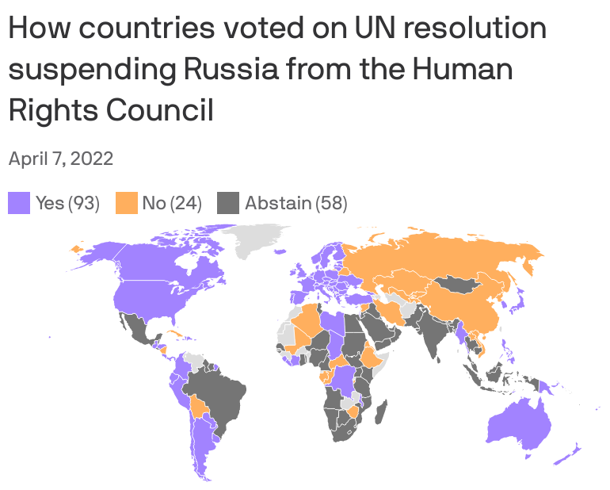

## Today's Agenda {background-image="Images/background-worldmap4.png" .center}

```{r}
# background-size="1920px 1080px"
library(tidyverse)
library(readxl)
library(kableExtra)
```

<br>

::: {.r-fit-text}

**III. Why is it so Hard to Cooperate with Other Countries?**

- Can we solve the prisoner's dilemma?

:::

<br>

::: r-stack
Justin Leinaweaver (Fall 2024)
:::

::: notes
Prep for Class

1. Markers needed for each group (x4)

2. Review canvas submissions

<br>

Today I'd like us to explore PD strategies and what those strategies tell us about real world situations.

- My apologies for being vague...

<br>

**Refresh my memory, what is the dilemma that the Prisoner's Dilemma model is meant to help us understand?**

- (Why is it so hard for groups to cooperate under certain conditions?)
- (When goods are rivalrous and uncertainty is high, actors who prefer cooperation may still choose to defect!)

<br>

### What are the key assumptions in this model of IR?
- (**SLIDE**)
:::


## The Prisoner's Dilemma {background-image="Images/background-blue_cubes_lighter3.png" .smaller}

<br>

**Interests:** 

- Rational individuals pursuing "gains"

**Institutions:**

- No restrictions on choosing defect or cooperate
- High uncertainty (e.g. simultaneous decisions, unknown time horizons)
- Benefits depend on choices of all actors

**Interactions:**

- Biggest rewards for short-term defection OR long-term cooperation

- A risk averse actor's dominant strategy is to defect

::: notes
**Questions on this model?**

Notes:

- Rational = Acts in accordance with transitive and ordered preferences

- Two sources of uncertainty: Unknown time horizons (how many rounds to play), simultaneous decision-making

- Non-excludable = Anyone can access it / hard to prevent access

- Rivalrous = Your use changes reward to other side

<br>

Here we see the PD game's answer to the question, why is international cooperation hard?

- Some international problems are structured in such a way that they make cooperation very hard to achieve (even when cooperating would make everyone better off!)

- Problems that look like THIS often lead to bad outcomes EVEN THOUGH all involved would like to cooperate!

<br>

**SLIDE**: Today I'd like us to explore strategies for dealing with prisoner's dilemmas.
:::


## A Prisoner's Dilemma {background-image="Images/background-worldmap4.png"}

```{r}
tibble(
  col1 = c("Player 1", ""),
  col2 = c("Cooperate", "Defect"),
  Cooperate = c("+2, +2", "+4, -6"),
  Defect = c("-6, +4", "-1, -1")
) |>
  kbl(align = c("l", "l", "c", "c"), col.names = c("", "", "Cooperate", "Defect")) |>
  add_header_above(c(" " = 2, "Player 2" = 2)) |>
  column_spec(column = 1:2, bold = TRUE, width = "10em") |>
  column_spec(column = 3:4, background = "#b3ccff", width = "10em") |>
  kable_styling(font_size = 40, bootstrap_options = "basic")
```

<br>

::: {.fragment}
- Play 10 rounds

- No negotiation / no talking

- Your goal is to maximize YOUR points
:::


::: notes

I've updated the outcomes table since the last time we played.

<br>

### Everybody still clear on how to read this game board?

<br>

In short, I've maintained the same Nash Equilibrium that gives us a dominant strategy of defection

- However, I've also increased the margins so each play of the game has bigger consequences for the players

<br>

**REVEAL**: As a warm-up let's pair off and play this new PD table

- Pairs, I'd like you to play the game 10 times and we'll see who can accrue the most points in the class

- For this version of the game there is no talking / negotiating allowed between or during rounds

- Your goal is to maximize your points
    - Our work today is focused on tactics, NOT differences in actor preferences

<br>

SLIDE: Here's how I suggest you do it...
:::


## A Prisoner's Dilemma {background-image="Images/background-worldmap4.png" .center .smaller}

<br>

:::: {.columns}
::: {.column width="50%"}
```{r}
tibble(
  col1 = c("Player 1", ""),
  col2 = c("Cooperate", "Defect"),
  Cooperate = c("+2, +2", "+4, -6"),
  Defect = c("-6, +4", "-1, -1")
) |>
  kbl(align = c("l", "l", "c", "c"), col.names = c("", "", "Cooperate", "Defect")) |>
  add_header_above(c(" " = 2, "Player 2" = 2)) |>
  column_spec(column = 1:2, bold = TRUE) |>
  column_spec(column = 3:4, background = "#b3ccff") |>
  kable_styling(font_size = 24, bootstrap_options = "basic")
```

<br>

- Play 10 rounds

- No negotiation / no talking

- Your goal is to maximize YOUR points
:::

::: {.column width="50%"}
```{r}
tibble(
  x1 = 1:10,
  Decision = "",
  Points = ""
) |>
  kbl(align = "c", col.names = c("Round", "Your Choice", "Your Points")) |>
  kable_styling(font_size = 24)
```
:::
::::

::: notes

- Take a out a piece of paper and make a list from 1-10 (with space for your decision and points earned each round)

- Each round each player makes their decision, defect or cooperate, and writes it on the paper next to the number for the round

- Both written down, simultaneously reveal your choices, tally up the points and move to the next round

<br>

Key here is that there is NO NEGOTIATING allowed!

- We're exploring tactics today focused on the rules of the game itself.

<br>

**Questions on the task?**

- Go!

<br>

**Who were the top point getters in the class?**

- **What did you try?**
:::


## {background-image="Images/background-worldmap4.png" .center}

::: {.r-fit-text}
**Can we solve the prisoner's dilemma?**

::: {.incremental}
1. Always cooperate

2. Always defect

3. The grim trigger

4. Tit for tat

5. Mixed
:::
:::

::: notes
Game theorists of every stripe, e.g. political scientists, economists, etc, have been working to untangle the prisoner's dilemma for years

- Tons of research, experiments, computer simulations and new theory have been thrown at the problem in an effort to "solve" the dilemma

<br>

REVEAL x 5: Let's discuss five "pure" strategies to the Prisoner's dilemma.

1. Always cooperate is a strategy wherein you cooperate every round, no matter what.

2. Always defect is a strategy wherein you defect every round, no matter what.

3. The grim trigger is a strategy wherein you cooperate in every round until the other side defects and then you defect forever
    - Defection triggers a grim outcome, no?
    
4. Tit for tat is a strategy wherein you cooperate in the first round and then in future rounds you do whatever the other person did last round
    - If they cooperated last time, you cooperate next time
    - If they defected last round, you defect next time

5. Mixed is a strategy wherein you alternate cooperation and defection every other round regardless of what the other player does

<br>

**Is everybody clear on how to implement each of these strategies?**

- **If I assigned you one, do you understand how it would make you play the game?**

<br>

*Split the class into FIVE groups, one group per strategy*

<br>

Go sit with your groups and make sure you have space on the board for recording results
:::


## Prisoner's Dilemma Strategies {background-image="Images/background-worldmap4.png" .center}

<br>

:::: {.columns}
::: {.column width="45%"}
```{r}
tibble(
  col1 = c("Player 1", ""),
  col2 = c("Cooperate", "Defect"),
  Cooperate = c("+2, +2", "+4, -6"),
  Defect = c("-6, +4", "-1, -1")
) |>
  kbl(align = c("l", "l", "c", "c"), col.names = c("", "", "Cooperate", "Defect")) |>
  add_header_above(c(" " = 2, "Player 2" = 2)) |>
  column_spec(column = 1:2, bold = TRUE) |>
  column_spec(column = 3:4, background = "#b3ccff") |>
  kable_styling(font_size = 22, bootstrap_options = "basic")
```
:::

::: {.column width="10%"}

:::

::: {.column width="45%"}
1. Always cooperate

2. Always defect

3. The grim trigger

4. Tit for tat

5. Mixed
:::
::::

::: notes
Groups, your job is to test YOUR strategy against all of the others

- We need to know how many points YOUR strategy is worth when it goes up against each of the other strategies

- I will ask you to test your strategy against each of the others 10x and record the result on the board

- You should also test your strategy against itself!

<br>

**Big picture, does what I'm asking you to do make sense?**

- You don't need to record the points "won" by the other group

- **Questions?**

- Get to work!

<br>

*While they work, you make a table on the board to capture points from the perspective of each strategy*

- *Columns represent the strategy of each opponent: C, D, GT, TT, M*
- *Rows represent the player: C, D, GT, TT, M*

From the Perspective of thr player
- C vs C (20pts), D (-60), GT (20), TT (20), M (-20)
- D vs C (40pts), D (-10), GT (-5), TT (-5), M (15)
- GT vs C (20), D (-15), GT (20), TT (20), M (+8)
- TT vs C (20), D (-15), GT (20), TT (20), M (2-6+4-6+4-6+4-6+4-6 = -12)
- M vs C (12), D (-35), GT (2+4-6-1-6-1-6-1-6-1 = -22), TT (-2), M (+5)


<br>

Report back results! *(overlap across groups means they can check each other and make sure that everyone got the same totals for each strategy dyad)*

<br>

### What do we learn from these results?

### - Is one strategy more effective than the others?

### - Is one strategy least effective?

<br>

**SLIDE**: Let's take these simulations into the real world!
:::


## {background-image="Images/10_1-Russia_out_G8.jpg"}

<p style="color: white;">**Smale and Shear (2014)**</p>

::: notes

Smale, Alison and Shear, Michael D. (2014, Mar 24). [Russia Is Ousted From Group of 8 by U.S. and Allies](https://www.nytimes.com/2014/03/25/world/europe/obama-russia-crimea.html). *The New York Times*. Section A, Page 1 of the New York edition.

<br>

### What elements of a prisoner's dilemma does this case study illustrate? Why?

### - What strategies are being attempted here by each set of actors?

<br>

### Did this act work to change Russian behavior? Why or why not?

<br>

### Was this the right strategy given the features of this PD structure? Why or why not?
:::


## {background-image="Images/background-worldmap4.png"}

::: {.r-fit-text}
**Shkrum, Natalukha & Vasylenko (2023)**
:::

```{r, fig.align='center'}

```

::: notes

Shkrum, A, Natalukha, D. and Vasylenko, L. (2023, Feb 23). [Russia Doesn’t Belong in the United Nations](https://time.com/6256488/russia-united-nations-security-council-undeserved-seat/). *Time*.

<br>

### Should the world escalate its strategy here by kicking Russia out of the UN? Why or why not?
:::


## Assignment for Next Class  {background-image="Images/background-blue_triangles2.png" .center}

<br>

::: {.r-fit-text}
Writing Workshop
:::


## Assignment for Next Class  {background-image="Images/background-blue_triangles2.png" .center}

<br>

Is the world free-riding on US contributions to the United Nations?

1. Council on Foreign Relations Editors (2023, Mar 13)

2. Bolton (2017)

3. Martin (2017)

::: notes
Next class we explore a real-world collective action problem

- Is the world free-riding on US contributions to the United Nations?

- If so, what should we do about it?
:::

