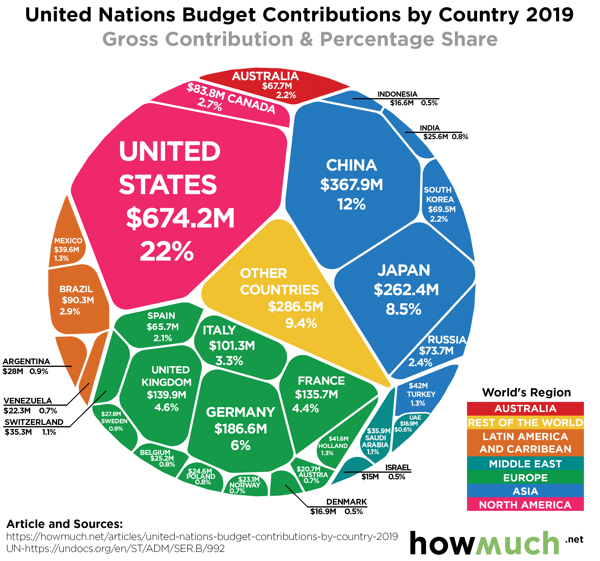

## Today's Agenda {background-image="libs/Images/background-worldmap3.png" .center}

```{r}
# background-size="1920px 1080px"
library(tidyverse)
library(readxl)
library(kableExtra)
```

<br>

**III. Why is it so Hard to Cooperate with Other Countries?**

- Should the US change its relationship with the United Nations?

<br>

<br>

::: r-stack
Justin Leinaweaver (Spring 2024)
:::

::: notes
Prep for Class

1. Consider doing this in two groups as a fight again. This was fun last time doing the DPRK battle.
:::


## {background-image="libs/Images/10-2-UN-Budget.png" background-size='55%'}

::: notes
Today I want us to examine an ongoing debate over funding the UN.

<br>

In a sense, we can think about funding the UN as a collective action problem.

- The current answer is to assess dues based on the size of your economy.

- Don't pay your dues and lose your seat on the various councils/committees AND you can lose your vote in the GA!

<br>

The US, as the country with the largest economy in the world, is assessed the largest UN dues of any other country.

- **SLIDE**: However, this assessment is far from the entirety of what the US pays to fund the UN.
:::


## {background-image="libs/Images/10_2-un_funding_cfr.png"}

::: notes

Here we see the 2021 data from the Council on Foreign Relations (CFR).

- Key here is the assessed budget, $830 million in 2021, is only one tiny part of the US contribution.

- Many UN entities have budgets built using purely voluntary budgets

- In 2021, the US provided an estimated $12.5 BILLION
    - UNHCR: UN High Commissioner for Refugees
    - UNICEF: UN Children's Fund
    - WFP: World Food Program
    - UNRWA: Relief and Works Agency for Palestinian Refugees

<br>

Since some of this money goes to places and items we might not like, some have argued we are playing a PD game and need a new strategy!
:::


## A Model of the Prisoner's Dilemma {background-image="libs/Images/background-worldmap3.png" .smaller}

<br>

**Interests:** 

- Rational individuals pursuing "gains"

**Institutions:**

- No restrictions on choosing defect or cooperate
- High uncertainty (e.g. simultaneous decisions, unknown time horizons)
- Benefits depend on choices of all actors

**Interactions:**

- Biggest rewards for short-term defection OR long-term cooperation

Therefore, a risk averse actor's dominant strategy is to defect

::: notes

First big question, how well does the PD model fit this situation (e.g. the US role as a major funder of the UN)?

- Let's consider the assumptions

<br>

**Is it useful to assume the US is a "rational actor pursuing gains" when it comes to its involvement in the UN? Why or why not?**

<br>

**Is it useful to assume the US has only two choices, defect or cooperate, when funding the UN? Why or why not?**

<br>

**Is it useful to assume high uncertainty in the funding decisions made by other countries when it comes to the UN?**

<br>

**Is it useful to assume the US receives more benefits when other countries help fund the UN?**

<br>

**All in all, does UN funding look something like a PD game?**


### 3) How high is the uncertainty in funding decisions by countries around the world?

### 4) How big a stretch is assuming the benefits depend on choices by other states?

### 5) Is this interaction a good way to describe the stakes for the US choice? Why or why not?

<br>

**SLIDE**: Ok, let's jump into the UN funding debate!
:::


## Should the US Defund the United Nations? {background-image="libs/Images/background-worldmap3.png" .center}

<br>

Bolton, J. (2017, December 25). “How to Defund the U.N.” *Wall Street Journal*.

Edwards, M. (2017, January 8). “Why defunding the UN is a bad idea.” *The Hill*.

::: notes

**What is the conclusion of the Bolton argument we'll be examining today?**

- (**SLIDE**)
:::


## Should the US Defund the United Nations? {background-image="libs/Images/background-worldmap3.png" .center}

<br>

**Bolton, J. (2017, December 25)**

+ Therefore, the US should only fund the parts of the UN we like and stop paying for the rest.

::: notes
**And what is the conclusion of the Edwards op-ed?**
:::


## Should the US Defund the United Nations? {background-image="libs/Images/background-worldmap3.png" .center}

<br>

**Bolton, J. (2017, December 25)**

+ Therefore, the US should only fund the parts of the UN we like and stop paying for the rest.

**Edwards, M. (2017, January 8)**

+ Therefore, the US should continue funding the UN.

::: notes
Clearly there is a debate to be had here and it is not one that has gone away.

- I would imagine the new House majority in Congress will very much be putting this issue back on the agenda as soon as our next UN bill comes due!

<br>

I also like the idea of analyzing UN funding through the lens of BOTH a prisoner's dilemma strategy AND a two-level game negotiation!

<br>

*Split class in half, assign one argument to each and get them diagramming the argument on the board!*
:::


## Bolton, J. (2017, December 25) {background-image="libs/Images/07-1-defund_UN.jpg" background-size='60%'}

::: notes
Let's start with John Bolton's fairly aggressive take.

- Everybody take 5 minutes on your own to reflect on Bolton's (2017) argument.
- I want you to write down the three most important premises in his argument.

<br>

Ok, small groups (3-4), consolidate your lists and get ready to give us your strongest version of this argument!

<br>

**ON 1/2 THE BOARD**

- UN does bad things (anti-semitism, picking on the US)
- UN actions matter (even GA resolutions)
- US threats work on member states
- US threats could also work to reform the UN itself
- UN is biased against the US
- US is FORCED to pay more than our fair share
- UN is a bloated and wasteful bureaucracy
- Even the good UN agencies need more scrutiny
- Voluntary payments break the rules of the charter but everybody breaks the rules of the charter all the time.
- Breaking this rule creates benefits and has no serious risks.
Therefore, the US should move to voluntary payments and only to those parts of the UN we like.

<br>

### Is this a logical argument? Why or why not?
:::


## {background-image="libs/Images/07-1-UN-vital.jpg"}

<p style="color: white;">**Edwards, M. (2017, January 8)**</p>

::: notes

Alright, now let's switch to the Edward' argument.

- I want you to write down the three most important premises in the Edwards (2017) argument.
- What are the biggest reasons supporting his conclusion?

FORM NEW SMALL GROUPS (mix it up!!), consolidate your lists and get ready to give us your strongest version of this argument!

<br>

**ON 1/2 THE BOARD**

- Congressional calls to punish the UN by cutting funding based on fundamental misunderstanding of what the UN is.
- Threatening cuts will not increase support for Israel.
- Actual cuts create an opening for China to fill the void and begin steering the UN.
- UN is a great forum for Trump's worldview as a deal-maker
- UN reform may be needed but calls for reform to make the UN our puppet will gather no support.
- Surveys of the US show widespread support for the UN and paying our dues on time.
- The UN is a force multiplier and global problem-solver.
Therefore, the US should not cut funding for the UN.

<br>

### Is this a logical argument? Why or why not?
:::


## What PD strategy is in play? {background-image="libs/Images/background-worldmap3.png" .center}

<br>

:::: {.columns}
::: {.column width='50%'}
1. Always cooperate

2. Always defect

3. The grim trigger

4. Tit for tat

5. Mixed
:::

::: {.column width='50%'}
```{r, fig.align='center'}

```
:::
::::

::: notes

Bottom line, where do we end up?

### Can we categorize each side of this debate as employing a pure PD strategy? How?

<br>

### What do our simulations from Monday indicate about the effect of these strategies? 

<br>

### All that said, what is likely to happen if the US selectively defunds the UN?

### - How would other countries respond?

<br>

### Should we do it? Why or why not?
:::


## Next Class: Writing Workshop {background-image="libs/Images/background-worldmap3.png" .center}

<br>

**Working on Paper 2**

::: notes
**Questions on the assignment?**
:::


