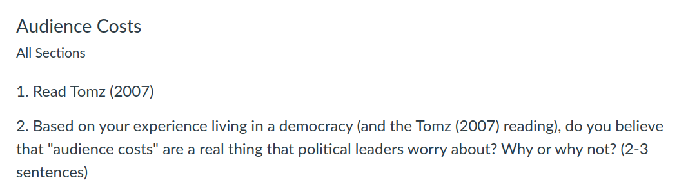

---
output:
  xaringan::moon_reader:
    css: ["default", "extra.css"]
    lib_dir: libs
    seal: false
    nature:
      highlightStyle: github
      highlightLines: true
      countIncrementalSlides: false
      ratio: '16:9'
---

```{r, echo = FALSE, warning = FALSE, message = FALSE}
##xaringan::inf_mr()
## For offline work: https://bookdown.org/yihui/rmarkdown/some-tips.html#working-offline
## Images not appearing? Put images folder inside the libs folder as that is the main data directory

library(tidyverse)
library(readxl)
library(stargazer)
##library(kableExtra)
##library(modelr)

knitr::opts_chunk$set(echo = FALSE,
                      eval = TRUE,
                      error = FALSE,
                      message = FALSE,
                      warning = FALSE,
                      comment = NA)
```

background-image: url('libs/Images/background-worldmap3.png')
background-size: 105%
background-class: top
class: middle

.center[.size50[**III. Why is it so Hard to Cooperate with Other Countries?**]]

<br>

.size50[
**Today's Agenda**

- Writing Workshop
]

<br>

.center[.size40[
  Justin Leinaweaver (Spring 2024)
]]

???


---

background-image: url('libs/Images/background-blue_triangles.jpg')
background-size: 100%
background-position: center
class: middle

.center[.size60[.content-box-white[**Paper 2**]]]

.size40[
Make an argument that one of the IR theories we've studied in class so far this term **"best"** explains the event you explored in Paper 1. 

Your paper must consider and evaluate how **THREE** of the IR theories from class explain your chosen event.

- Options: Neorealism, Offensive Realism, Democratic Peace, Economic Liberalism, and the Bargaining Model of War

]

???

Paper is due today!

<br>

### Any final questions on the assignment?

<br>

**SLIDE**: The rubric...


---

background-image: url('libs/Images/background-blue_cubes_lighter3.png')
background-size: 100%
background-position: center
class: middle

.size50[.content-box-white[**Convincing arguments...**]]

.size40[
+ .textred[**Logical**]: Do the premises support the conclusion?

+ .textred[**Clear**]: Is the paper easy to read and understand?

+ .textred[**Credible**]: Is there enough high quality evidence (cited using APA)?

+ .textred[**Critical**]: Does the paper address weaknesses in the argument (e.g. logic, evidence, consider counter-arguments)?
]

???

Keep my writing rubric in mind as you write and revise!

<br>

### Any questions on the rubric?

<br>

**SLIDE**: Before I let you get to work...


---

background-image: url('libs/Images/background-blue_triangles.jpg')
background-size: 100%
background-position: center
class: middle

.size60[.content-box-blue[**Assignment for Next Class**]]

<br>

```{r, echo = FALSE, fig.align = 'center', out.width = '100%'}

```

???


