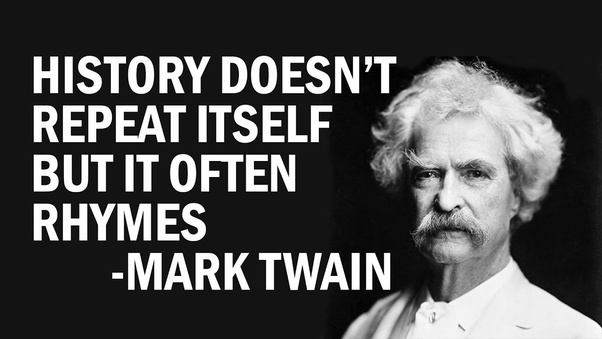
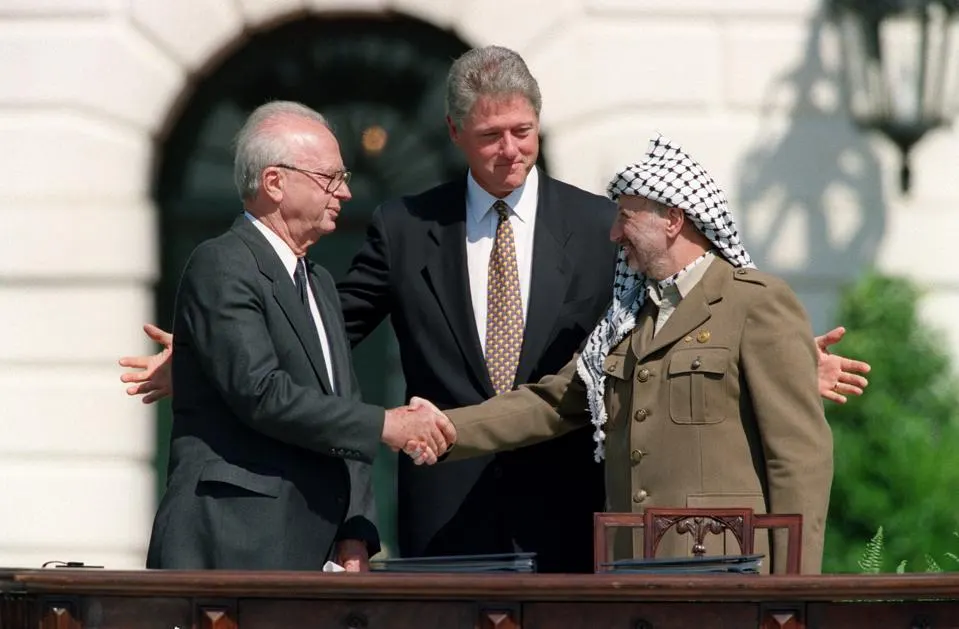
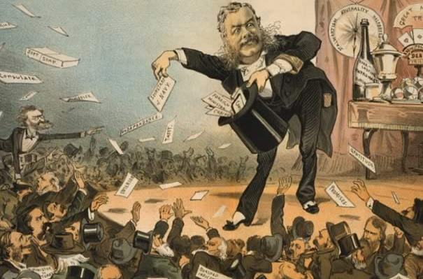
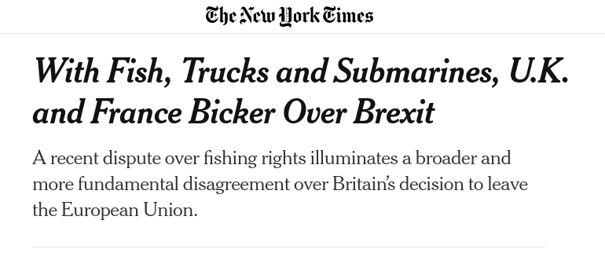

## Today's Agenda {background-image="Images/background-worldmap4.png" .center}

```{r}
# background-size="1920px 1080px"
library(tidyverse)
library(readxl)
library(kableExtra)
```

<br>

**III. Why is it so Hard to Cooperate with Other Countries?**

- Two-level Bargaining Games

<br>

<br>

::: r-stack
Justin Leinaweaver (Fall 2025)
:::

::: notes
Prep for Class

1. **FORCE the groups to sit together! Leaders sit up front!**

2. Make sure slides today reflect choices from last class

3. **Remove anybody who doesn't come to class today**

4. YOU need to decide the leadership rewards AFTER hearing how much each valued being the leader

<br>

**Putnam (1988) Notes**

- p427-430 intro real-world examples, 
- p433-440 two level games metaphor, 
- p441-452 determinants of win set size, 
- p452-453 uncertainty, 
- p453-456 attempts to influence the other side, 
- p456-459 role of the chief negotiator
:::


## {background-image="Images/09_1-patronage.jpg"}

::: notes

On Monday we re-played our prisoners' dilemma from a few weeks ago but with a few added wrinkles.

<br>

Before we dig into what happened, the leaders have a job to do.

- *Don't let them do it yet!*

- **Leaders are you ready to announce your decisions?**

- *They will inevitably ask about their reward for being leader*

<br>

Your leadership rewards can't be calculated yet, you still have work to do!

<br>

**SLIDE**: Before you announce your decision
:::


## {background-image="Images/09_1-patronage_filter80.png"}

:::: {.columns}
::: {.column width="50%"}
```{r}
tribble(
  ~Name, ~EC,
  "Grant", 2,
  "Miya", 2,
  "Jasper", 0,
  "Corah", 2,
  "Kylei", 0,
  "Isabel", 2,
  "Beau", 2,
  "Owen", 2,
  "Jack", 2
) |>
  kbl(align = c('l', 'c')) |>
  kable_styling(bootstrap_options = c("striped", "hover", "condensed"), font_size = 33) |>
  column_spec(1, width = '8em') |>
  row_spec(1, background = "gold") #|>
  #row_spec(2:6, background = "yellow3")
```
:::

::: {.column width="50%"}
```{r}
tribble(
  ~Name, ~EC,
  "Kai", 2,
  "Yevheniia", 2,
  "Topi", 0,
  "Isaiah", 2,
  "Tahrea", 2,
  "Parker", 2,
  "Brianna", 2,
  "Jacob", 0,
  "Bennett", 2,
  "Killian", 0
) |>
  kbl(align = c('l', 'c')) |>
  kable_styling(bootstrap_options = c("striped", "hover", "condensed"), font_size = 33) |>
  column_spec(1, width = '8em') |>
  row_spec(1, background = "gold")
```
:::
::::

::: notes

1. As is true in the real world, inequality exists!

    - Wealth and opportunity are not equally distributed across the population.

2. I have removed anyone who isn't in class today from eligibility

    - Not nearly awkward enough if they aren't here for it
    
3. I have highlighted all prior leaders in your group

<br>

Leaders, please take a moment to reflect on your proposal

- You don't have to make changes but I'd like you to reflect on this for a moment

- **Ready to go?**

<br>

Ok wait, one more thing to consider, the design of your domestic institutions

<br>

**Leader 1** you are in charge of a competitive authoritarian country. 

- You have implemented extreme gerrymandering, you use your secret police to punish your political enemies, you have bent the media to your control and you use your access to tax money to reward your allies (e.g. corruption)

- This means whatever plan for the EC points you have, you only need THREE yes votes to pass the plan (not counting your vote)

<br>

**Leader 2** you are in charge of a healthy democracy

- The right to vote is guaranteed to all citizens, your elections are free and fair and there are extensive checks and balances on your power

- This means whatever plan for the EC points you have, you need a super-majority of yes votes to pass the plan (not counting your vote)

<br>

**Any questions?**

- Please announce your decision.

<br>

**SLIDE**: Alright, let's talk about what happened in our game!
:::


## What Happened? {background-image="Images/background-worldmap4.png" .center}

```{r}
tribble(
  ~Round, ~Group_A, ~Group_B,
  "1", "Cooperate", "Cooperate",
  "2", "Cooperate", "Cooperate",
  "3", "Cooperate", "Cooperate",
  "4", "Cooperate", "Cooperate",
  "5", "Cooperate", "Cooperate",
  "6", "Cooperate", "Cooperate",
  "7", "Cooperate", "Defect",
  "8", "Defect", "Defect",
  "", "+15", "+22"
) |>
  kbl(align = "c", col.names = c("Round", "Group A", "Group B")) |>
  kable_styling(bootstrap_options = c("striped", "hover", "condensed", "responsive"), font_size = 30) |>
  column_spec(2:3, width = '7em') |>
  column_spec(2, background = c(rep("white", 7), rep("pink3", 1), "gold")) |>
  column_spec(3, background = c(rep("white", 6), rep("pink3", 2), "gold"))
```

::: notes
**Ok, what happened?**

- **What is your best description of the "outcome" of our simulation?**

<br>

**Is this an example of a successful interaction or not? Why?**

<br>

**SLIDE**: Let's dig into this
:::


## Explaining the Outcome {background-image="Images/background-worldmap4.png" .center}

<br>

```{r}
tibble(
  col1 = c("Group 1", ""),
  col2 = c("Cooperate", "Defect"),
  Cooperate = c("+3, +3", "+5, -2"),
  Defect = c("-2, +5", "-1, -1")
) |>
  kbl(align = c("l", "l", "c", "c"), col.names = c("", "", "Cooperate", "Defect")) |>
  add_header_above(c(" " = 2, "Group 2" = 2)) |>
  column_spec(column = 1:2, bold = TRUE, width = "20em") |>
  column_spec(column = 3:4, background = "#b3ccff", width = "20em") |>
  kable_styling(font_size = 40, bootstrap_options = "basic")
```

::: notes
I tweaked the game table for our simulation

<br>

**How did the updated values influence your approach to the game?**

- **Did it alter your approach? Why or why not?**
:::


## Explaining the Outcome {background-image="Images/background-worldmap4.png" .center}

<br>

```{r, fig.align='center'}

```

::: notes
In trying to explain the outcome of our game we also have to consider the history

- We've played this style of game before in this class

<br>

**How did the history of our class simulations impact your approach to the game?**

<br>

**SLIDE**: Let's talk power!
:::


## Explaining the Outcome {background-image="Images/10_2-Decision_v2.png"}

::: notes

Let's also consider how the individuals, e.g. non-leader citizens, influenced the game 

<br>

**Non-leaders, how powerful did you feel in this game?**

<br>

**What specific elements of the simulation existed to grant you power in the game?**

- *ON BOARD*

1. Vote
    - If there is an election, do you vote?
    
2. Participate
    - Do you talk while the group is deciding what to do?
    
3. Advocate
    - Do you push a specific choice during the discussion?

<br>

**Did you personally make use of these tools? Why or why not?**

<br>

**Non-leaders, bottom-line, to what degree did you feel control over the leader of your group? Why?**
:::


## {background-image="Images/10-2-powerful_leader.jpg"}

::: notes

Ok, leaders, your turn!

- Team A: Luke (2 rds), Gavin (2 rds), Caylee (2 rds), Antonio (1 rd), Sara (1 rd), Jillian (1 rd)

- Team B: Meyer

<br>

**Leaders, how powerful did you feel in this game? Why?**

<br>

**Citizens, do you agree with their perceptions? Why or why not?**

<br>

**Leaders, did you feel constrained by the other citizens in your state? Why or why not?**

<br>

**Did either side elect a new leader during the game? Why or why not?**

<br>

**Leaders, bottom-line, how much did you enjoy being in charge? Why or why not?**

<br>

*Use these answers to announce hypothetical leader rewards then invite discussion of whether these points accurately reflect the motivations of the leaders*

- *If they hated it, make the reward tiny (0-1 points)*

- *If they passed it around the room to spread the wealth then make the reward tiny (1 points)*

- *If they loved it, make it kind of obscene... (5 points?)*

- **Do these points accurately reflect what motivated the leaders? Why or why not?**

<br>

*Feel free to give all leaders one point after the conversation*

<br>

**SLIDE**: Let's end by highlighting the role of the negotiations
:::


## Explaining the Outcome {background-image="Images/10-2-How-to-negotiate-a-deal.jpg"}

::: notes

**Did the negotiations play a significant role in explaining our outcome? Why or why not?**

<br>

**Did you trust your own leader as a negotiator even though they were earning their own benefits?**

<br>

**Did you trust the word of the other team's leader as a negotiator? Why or why not?**
:::


## A Two-Level Prisoner's Dilemma {background-image="Images/background-worldmap4.png"}

{.absolute left=0 bottom=200 width=500}

{.absolute right=0 bottom=200 width=500}

::: notes
Given EVERYTHING we've just discussed and highlighted I hope you can see that there are really two outcomes of interest to this game

- Outcome 1 is how the groups interacted with each other

- Outcome 2 is how the leaders interacted with their citizens

<br>

Putnam's argument for us today is that we can't understand the international negotiation without considering the domestic game (and vice versa)!
:::


## {background-image="Images/09_2-chess.png"}

::: notes

Robert Putnam is a political scientist who wrote a great deal about modeling international negotiations.

- In a 1988 paper he introduced the concept of a two level game.

- Putnam argued that we could think usefully about international negotiations as a two level game.

<br>

I hope the excerpt from the reading made sense.

- **SLIDE**: Since it's a complicated idea, let's step through it together.
:::


## {background-image="Images/09_2-Chess_3.png" .center}

**Level I**

The international negotiation between leaders (or their representatives).

<br>

**Level II**

The leader's negotiation with constituents to accept their international deal.

::: notes

On the first level, leaders are actively negotiating with other leaders.

<br>

On the second level, leaders are actively negotiating with their supporters to stay in power.

<br>

The key is that these levels interact!
- International negotiations impact domestic politics, AND
    
- Domestic politics changes international negotiations

<br>

### Intuition make sense?

<br>

Putnam's model assumes each participant in each level has a separate "win-set."

### What is a "win-set" and how does the Level I win-set differ from the Level II win-set?
:::


## {background-image="Images/09_2-Chess_3.png" .center}

**Level I Win-Sets**

The range of outcomes the leader would accept in the international bargain.

<br>

**Level II Win-Sets**

The range of outcomes that could be ratified by domestic institutions.

::: notes

Difference between a Level I and a Level II "win-set"? (435-437)

### Everybody clear on the win-set concept?

- **SLIDE**: Let's tackle the ideas in this paper in smaller chunks!
:::


## {background-image="Images/09_2-Chess_3.png" .center}

1. Why do "larger win-sets make Level I agreement more likely"? (437-439)

2. Why do leaders benefit from having small Level II win-sets? (440-441)

3. How do Level II preferences/coalitions explain win-set size? (442-448)

4. How do Level II institutions explain win-set size? (448-450)

5. How do Level I negotiators strategies explain win-set size? (450-452)

::: notes

*Split class into five groups*

Ok groups, take a few minutes and get ready to answer this question for the class!

- Groups: Answer the question for us and identify how this aspect played out in our simulation last class.

<br>

1. Why do "larger win-sets make Level I agreement more likely"? (437-439)
    - The wider the range of acceptable agreements to each leader, the more flexibility they can offer to the other side
    - Remember, each leader has to worry about selling the international deal back home!
    - So, bigger win-sets more likely a deal can be found both sides believe can be ratified

2. Why should leaders benefit from having smaller Level II win-sets? (440-441)
    - Large level 2 win-sets invites "pushing you around"
    - Other negotiators don't have to care as much about your needs/wants/desires if you can get anything ratified
    - Ironically, domestic weakness may produce international strength!

3. Explain how the size of the win-set depends on Level II preferences
and coalitions (442-448)
    - You have to get the deal ratified so international negotiations depend to a large extent on the domestic battles over power, leadership and policymaking.
    - Remember, domestic constituents are not choosing between your deal and a different one. They choose between your deal and no deal. Leader not as weak as you might have thought.
    - What proportion of your constituents are open to international deals? Internationalists
    - Homogeneous vs heterogeneous conflicts

4. Explain how the size of the win-set depends on Level II institutions (448-450)
    - US Congress requires 2/3 vote in Senate, that's a very high threshold
    - Majoritarian parliamentary systems, lower threshold
    - Dictatorship with centralized control and no opposition, smallest still

5. Explain how the size of the win-set depends on Level I negotiators strategies (450-452)
    - Negotiators are not powerless to adjust the bargaining outcome
    - Side-payments help!
    - Increasing popularity of the deal at home ("good will")
    
<br>

**SLIDE**: Assignment for next class
:::


## Assignment for Next Class  {background-image="Images/background-worldmap4.png" .center}

<br>

Find us a real world case illustrating at least some of the dynamics of Putnam's Two-Level Game (e.g. domestic politics complicating international bargaining or vice versa).

1. Submit APA citation,
2. Explain what happened, and 
3. Explain how it is an example of two-level game dynamics

::: notes
**Questions on the assignment?**
:::


## semester with 2 days

## Two-Level Games are Everywhere  {background-image="Images/background-worldmap4.png"}

{.absolute right=0 top=100 width="700"}

{.absolute left=0 top=250 width="500"}

::: notes

Talk me through the spat between the UK and France described in our NYT article.

### What is the international political event here?

<br>

### Use the Putnam Two-level Game metaphor to help me understand what is going on here.

<br>

### What does Macron actually want from this interaction?

#### - Is it about fish? Nuclear subs? Or something else?

<br>

### What does Boris Johnson want?

<br>

### Is this strong evidence that domestic politics matters for understanding international outcomes? Why or why not?

<br>

**SLIDE**: I think domestic politics changes everything about how I think about international politics, but let's see what you think! 
:::


## Assignment for Next Class  {background-image="Images/background-worldmap4.png" .center}

<br>

Hopf, T. (1998). The Promise of Constructivism in International Relations Theory. International Security. 23(1), 171–200.


