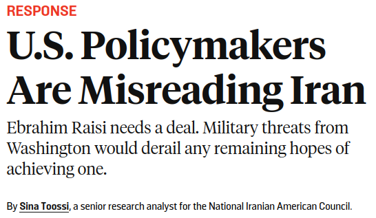
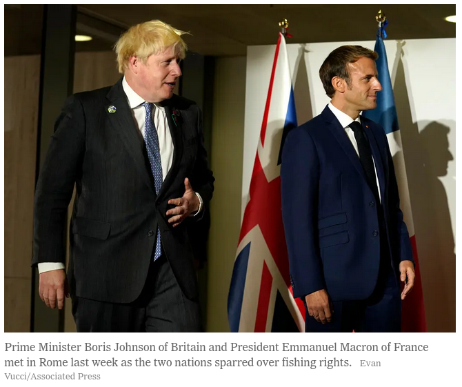
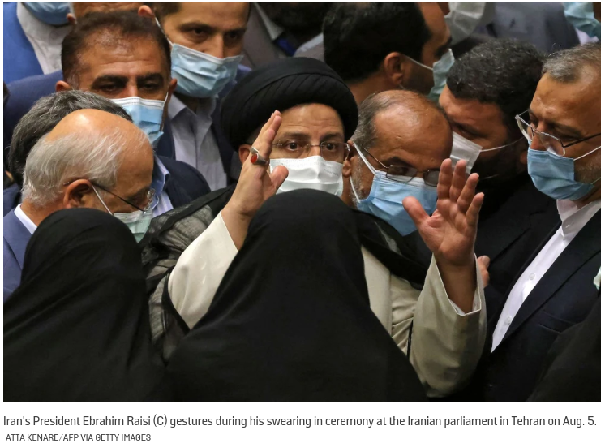
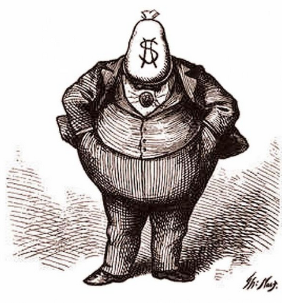
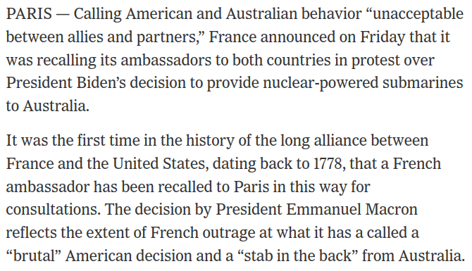

---
output:
  xaringan::moon_reader:
    css: ["default", "extra.css"]
    lib_dir: libs
    seal: false
    nature:
      highlightStyle: github
      highlightLines: true
      countIncrementalSlides: false
      ratio: '16:9'
---

```{r, echo = FALSE, warning = FALSE, message = FALSE}
##xaringan::inf_mr()
## For offline work: https://bookdown.org/yihui/rmarkdown/some-tips.html#working-offline
## Images not appearing? Put images folder inside the libs folder as that is the main data directory

library(tidyverse)
library(readxl)
library(stargazer)
##library(kableExtra)
##library(modelr)

knitr::opts_chunk$set(echo = FALSE,
                      eval = TRUE,
                      error = FALSE,
                      message = FALSE,
                      warning = FALSE,
                      comment = NA)
```

class: slideblue

.size80[**Today's Agenda**]

<br>

.size70[.center[

Explore the logic of a two-level bargaining game

]]

<br>

.center[.size40[
  Justin Leinaweaver (Spring 2022)
]]

???

## Prep for Class
1. *WHEN POSSIBLE, make the groups sit together*

<br>

*Opening Discussion*

### Anything interesting going on in world politics at the moment?

<br>

### Everybody have the readings for today?


---

background-image: url('libs/Images/09_1-patronage.jpg')
background-size: 83%
background-position: center

???

On Monday we re-played our prisoners' dilemma from earlier in the semester with a few added wrinkles.

<br>

Before we dig into what happened, the leaders have a job to do.

Leader A, please come to the front of the room and announce your decision.

### Anybody in group A want to call for an immediate election to replace the leader before the points are distributed?

<br> 

Leader B, please come to the front of the room and announce your decision.

### Anybody in group B want to call for an immediate election to replace the leader before the points are distributed?

<br>

Alright, let's review what happened in our simulation!


---

background-image: url('libs/Images/10-2-Decision.jpg')
background-size: 83%
background-position: center

???

Let's start by discussing the strategic approach each of you brought to the game individually.

### What decisions did each of you have to make each round within your groups?
- Vote: Vote for leader,
- Choose to Participate: Participate in the group decision-making,
- Choose to Advocate: Advocate for one or the other decision in the group decision-making
- ?

<br>

### Brainstorm: What characteristics predict when a citizen will choose to be active in these scpecific ways in their democracy?
- *ON BOARD*

<br>

### Did our simulation represent these decisions in a useful way (e.g. how people face these choices in the political world everyday)? Why or why not?


---

class: middle, center

.size50[.center[.content-box-blue[**Prisoner's Dilemma (v2)**]]]

<br>

```{css, echo=F}
/* Change the background color to white for shaded rows (even rows) */
.remark-slide thead, .remark-slide tr:nth-child(2n) {
      background-color: white;
}
```

```{r}
library(kableExtra)

tibble(
  col1 = c("Group 1", ""),
  col2 = c("Cooperate", "Defect"),
  Cooperate = c("+3, +3", "+5, -2"),
  Defect = c("-2, +5", "-1, -1")
) |>
  kbl(align = c("l", "l", "c", "c"), col.names = c("", "", "Cooperate", "Defect")) |>
  add_header_above(c(" " = 2, "Group 2" = 2)) |>
  column_spec(column = 1:2, bold = TRUE, width = "20em") |>
  column_spec(column = 3:4, background = "#b3ccff", width = "20em") |>
  kable_styling(font_size = 40, bootstrap_options = "basic")
```

???

Now let's discuss the strategic approach of each group as a collective.

### On the whole, what motivated your group?

#### - How much consensus was there on the strategic goals of the group?

#### - How much consensus was there on your round-to-round tactical decisions?

<br>

### Was your group motivated by obtaining relative or absolute gains? In other words, were you playing to win or to prevent the other side from winning? 

<br>

### Brainstorm: What characteristics of a problem or of a group predict when a group will prefer relative over absolute gains and vice versa?
- *ON BOARD*: Relative Gains Concerns: Problem Chars vs Group Chars


---

background-image: url('libs/Images/10-2-How-to-negotiate-a-deal.jpg')
background-size: 100%
background-position: center

???

The role of trust in a negotiation

### Did you find adding the negotiations between rounds helpful? Why or why not?
#### - Did the arguments made during the negotiations matter to you? Why or why not?

<br>

### Did you trust your own leader as a negotiator even though they were earning their own benefits?

<br>

### Did you trust the word of the other team's leader as a negotiator? Why or why not?

<br>

### Brainstorm: What characteristics predict greater utility of a negotiation?


---

background-image: url('libs/Images/10-2-powerful_leader.jpg')
background-size: 100%
background-position: center

???

Power of the leader

### How powerful was the leader (or leaders) of your group?

<br>

### Did either side elect a new leader during the game? Why or why not?

<br>

### Leaders, did you feel constrained by the other citizens in your state? Why or why not?

<br>

### Brainstorm: What characteristics are necessary for a leader to feel constrained by their citizens? Why not just do only what you want to enrich yourself?
- *ON BOARD*


---

background-image: url('libs/Images/10-2-global-negotation.png')
background-size: 100%
background-position: center

???

Our Takeaways

### In what specific ways do we believe domestic politics matters for understanding international political events?


---

background-image: url('libs/Images/10_2-nyt_uk_fr2.png')
background-size: 67%
background-position: right

.pull-left[

<br>

<br>

<br>

<br>

```{r, fig.retina=3, fig.align='left', out.width='100%'}
knitr::include_graphics("libs/Images/10_2-nyt_uk_fr.png")
```

]

???

Ok, talk to me about the spat between the UK and France described in our NYT article.

### What is the international political event here?

<br>

### What does Macron actually want from this interaction?

#### - Is it about fish? Nuclear subs? Or something else?

<br>

### What does Boris Johnson want?

<br>

### Is this strong evidence that domestic politics matters for understanding international outcomes? Why or why not?


---

background-image: url('libs/Images/10_2-FP_Iran2.png')
background-size: 60%
background-position: right

.pull-left[

<br>

<br>

```{r, fig.retina=3, fig.align='left', out.width='90%'}

```

]

???

Ok, let's shift to the FP article about Iran.

### What is the international political event here?

<br>

### Is this strong evidence that domestic politics matters for understanding international outcomes? Why or why not?

<br>

Let's talk about how IR scholars have sought to formalize our thinking about the role of domestic politics in international politics.


---

background-image: url('libs/Images/09_2-chess.png')
background-size: 100%
background-position: center

???

Robert Putnam is a political scientist who wrote a great deal about modeling international negotiations.

In a 1988 paper he introduced the concept of a two level game.

- Putnam argued that we could think usefully about international negotiations as a two level game.

On the first level, leaders are actively negotiating with other leaders.

On the second level, leaders are actively negotiating with their supporters to stay in power.

<br>

### Anybody know which "level" happens first in this game?
- (They happen simultaneously!)

And, even more importantly, the two levels interact!

- Moves made on one game board change the layout of the pieces on the other board!

<br>

The takeaway is that domestic politics influences international outcomes in a fundamental and inseparable way.

- Moves that make no sense on one level might make perfect sense on the other.

Let's look at an example of this dynamic in play.


---

background-image: url('libs/Images/09_2-kim_jong_un_war_plans.jpg')
background-size: 100%
background-position: center

???

In April a few years back (2013) the North Korean news service released a series of photos showing Kim Jong Un preparing war plans for the US.

- The US is on many of the maps with missile targets painted on some of our cities.

<br>

### Does anybody think North Korea was actually close to attacking the US mainland as indicated by these photos? Why not?

Important to keep in mind, often world leaders are playing multiple games simultaneously.

Kim Jong Un had only been leader for a short time and we believe he was struggling to keep the military on his side.

This photo op and series of belligerent statements sent a signal of strength to his domestic audience.
- Show the military he is not weak
- Remind his people to support him against a worse enemy e.g. the US.

This is one way the two level game helps us navigate international politics.
- It's important to remember that there are mutliple games being played simulatenously and not all of them are meant for us.


---

class: middle, slideblue

.pull-left[
```{r, out.width='100%'}
knitr::include_graphics('libs/Images/10_2-nyt_uk_fr.png')


```
]

.pull-right[
```{r}



```
]

???

### Ok, so, how specifically does the two-level game help us think about these current events?

*Force this discussion*


---

class: middle

.size80[.center[**The Schelling Conjecture**]]

???

I'd like to introduce you to another complication in thinking about international negotiations.

### Has anybody ever heard of the Schelling Conjecture?

<br>

A few weeks back we read some of Schelling's work on diplomacy.

### Remind me, how does Schelling define "diplomacy"?
- (bargaining where two sides agree a deal in which they both lose something to avoid a much worse outcome.)

### And, where does bargaining power come from?
- (SLIDE)


---

background-image: url('libs/Images/06_3-diplomacy1.png')
background-size: 47%
background-position: center

???

Does the "power to hurt" ring a bell?

- "The power to hurt" means the threat of pain, shock, loss and grief, privation and horror to motivate others to do what we want.

- All about the threat, not the action

### How does Schelling suggest you put this plan into action during a negotiation?
1. (Know what your adversary treasures and what scares them.)
2. (Communicate what they must do to avoid this "hurt.")

<br>

Here's the ironic twist to all those arguments.

The Schelling conjecture is the idea that you can get more of what you want in a negotiation by making yourself weaker.

- In other words, reducing your power before the negotiation can allow you to better define the outcome of the negotiation.

### Does that make sense?

Of course it doesn't, it's deeply counter-intuitive.


---

background-image: url('libs/Images/09_2-child_labor.jpg')
background-size: 100%
background-position: center

.pull-right[

<br>

```{r, fig.retina=3, fig.align='right', out.width='85%'}

```

]

???

Let's discuss a hypothetical negotiation.

- On the one side is a billionaire factory owner and on the other his workforce of children making 10 cents an hour.

- Imagine it is time for these workers to renegotiate their contracts with the big boss.

<br>

Let's talk about bargaining strength in Schelling's terms.

### In what specific ways are the workers vulnerable?
- (Big boss has all the money)
- (Workers can be easily divided, picked off one-by-one)
- (Appears to be low-skill work so they can be replaced)

### In what specific ways is the factory owner vulnerable?
- (Needs workers to run the factory)

### Who has more power in this specific bargaining situation? Why?

### So, what can the workers do to try and strengthen their position in the negotiation?


---

background-image: url('libs/Images/09_2-child_protest.jpg')
background-size: 100%
background-position: center

???

### Why does unionizing strengthen the workers position in the bargaining?
1. An attempt to reduce the vulnerabilities of the workers
    - Union dues build up a savings account that can be used to keep the workers alive during the strike

2. An attempt to make one of the boss's vulnerabilities worse
    - Unifying the working class also denies the boss a ready pool of new employees (scabs) to replace the striking workers    
    - Training a brand new workforce is costly and time consuming
    
<br>

So, the kids unionize and elect a union president to negotiate on their behalf.


---

```{r, fig.retina=3, fig.align='center', fig.width = 8, fig.asp = 0.618, out.width = '100%'}
## GGPLOT Experiment
## Baseline plot
## d <- tibble(
##     x = 1:10,
##     y = 1:10
## )

## ggplot(data = d, aes(x = x, y = y)) +
##     labs(x = "", y = "") +
##     ggthemes::theme_tufte() +
##     annotate("segment", x = 0, xend = 9, y = 2, yend = 2, arrow = arrow(ends = "both", angle = 45, length = unit(.3,"cm"))) +
##     coord_cartesian(xlim = c(0,9), ylim = c(2,9)) +
##     scale_x_continuous(breaks = 1:8, labels = str_c("$0.", 1:8, "0")) +
##     scale_y_continuous(breaks = NULL)

# Baseline plot 700x400
x <- 1:10
y <- 1:10

plot(x,y, xlab = '', ylab = '', type = 'n', xaxt = 'n', yaxt = 'n', bty = 'n')

# The number line / bargaining space
arrows(x0 = 1, y0 = 2, x1 = 10, y1 = 2, length = .1, code = 3)
segments(x0 = 2:9, y0 = 1.9, x1 = 2:9, y1 = 2.1)
text(x = 2:9, y = 1.5, labels = str_c('$', seq(.1,.8,.1), 0))

# Current salary
arrows(x0 = 2, y0 = 2.5, x1 = 2, y1 = 3.5, length = .1, code = 1, col = 'red')
text(x = 2, y = 4, labels = "Current Salary", col = "red")
```

???

In a simplified, economic sense, we can think about this upcoming negotiation between the boss and the child workers as happening along a two dimensional line of possible salaries.

The workers currently earn 10 cents an hour and would like more.


---

```{r, fig.retina=3, fig.align='center', fig.width = 8, fig.asp = 0.618, out.width = '100%'}
# Win set for both 700x400
x <- 1:10
y <- 1:10

par(mar = c(2,2,2,2)) # BLTR
plot(x,y, xlab = '', ylab = '', type = 'n', xaxt = 'n', yaxt = 'n', bty = 'n')

# The number line / bargaining space
arrows(x0 = 1, y0 = 2, x1 = 10, y1 = 2, length = .1, code = 3)
segments(x0 = 2:9, y0 = 1.9, x1 = 2:9, y1 = 2.1)
text(x = 2:9, y = 1.5, labels = str_c('$', seq(.1,.8,.1), 0))

# Current salary
arrows(x0 = 2, y0 = 2.5, x1 = 2, y1 = 3.5, length = .1, code = 1, col = 'red')
text(x = 2, y = 4, labels = "Current Salary", col = "red")

# The Boss
# arrows(x0 = 2, y0 = 8, x1 = 4, y1 = 8, length = .05, angle = 90, code = 3)
# text(x = 1.5, y = 8, labels = "Boss")
# text(x = 2, y = 9, labels = "$0.10")
# text(x = 4, y = 9, labels = "$0.30")

# The Workers
arrows(x0 = 3.5, y0 = 5, x1 = 10, y1 = 5, length = .1, code = 2)
arrows(x0 = 3.5, y0 = 5, x1 = 10, y1 = 5, length = .05, angle = 90, code = 1)
text(x = 1.5, y = 5, labels = "Workers")
text(x = 3.5, y = 6, labels = "$0.25")
```

???

Here we see the workers' demands as a win-set.

- We discussed win-sets a bit when we explored Fearon's bargaining model of war.

- A "win-set" is an important concept in models of bargaining.

- It is the range of possible outcomes you would find acceptable.

<br>

Here we see the workers would be happy with any salary at or above $.25 per hour.

### If you were the union president how much would you make as your opening demand? Why?
- *DISCUSS*

<br>

Of course, the wisdom of your opening gambit depends A TON on the win-set of the "big boss"!


---

```{r, fig.retina=3, fig.align='center', fig.width = 8, fig.asp = 0.618, out.width = '100%'}
# Win set for both 700x400
x <- 1:10
y <- 1:10

par(mar = c(2,2,2,2)) # BLTR
plot(x,y, xlab = '', ylab = '', type = 'n', xaxt = 'n', yaxt = 'n', bty = 'n')

# The number line / bargaining space
arrows(x0 = 1, y0 = 2, x1 = 10, y1 = 2, length = .1, code = 3)
segments(x0 = 2:9, y0 = 1.9, x1 = 2:9, y1 = 2.1)
text(x = 2:9, y = 1.5, labels = str_c('$', seq(.1,.8,.1), 0))

# The Boss
arrows(x0 = 2, y0 = 8, x1 = 4, y1 = 8, length = .05, angle = 90, code = 3)
text(x = 1.5, y = 8, labels = "Boss")
text(x = 2, y = 9, labels = "$0.10")
text(x = 4, y = 9, labels = "$0.30")

# The Workers
arrows(x0 = 3.5, y0 = 5, x1 = 10, y1 = 5, length = .1, code = 2)
arrows(x0 = 3.5, y0 = 5, x1 = 10, y1 = 5, length = .05, angle = 90, code = 1)
text(x = 1.5, y = 5, labels = "Workers")
text(x = 3.5, y = 6, labels = "$0.25")
```

???

So, here's the information you didn't have when making your opening demand.

### What do we learn from mapping the two win-sets in this figure?
#### - How can this help us predict what will happen?
- (Agreement can only happen where the two line segments overlap)
- (The wider the area of overlap, the greater the likelihood of agreement)

<br>

### Why can't each side simply tell the other side what their win-set is?
- *Force discussion*

I mean, you can, but you have an incentive to lie and they have an incentive to assume you are lying...

<br>

This is where independent mediators can play a role.

- If both sides trust the mediator and can reveal their true win-sets to them, the mediator can help the sides find a mutually satisfactory agreement.

- In this case, somewhere between .25 and .30 cents per hour.


---

```{r, fig.retina=3, fig.align='center', fig.width = 8, fig.asp = 0.618, out.width = '100%'}
# Win set for both 700x400
x <- 1:10
y <- 1:10

par(mar = c(2,2,2,2)) # BLTR
plot(x,y, xlab = '', ylab = '', type = 'n', xaxt = 'n', yaxt = 'n', bty = 'n')

# The number line / bargaining space
arrows(x0 = 1, y0 = 2, x1 = 10, y1 = 2, length = .1, code = 3)
segments(x0 = 2:9, y0 = 1.9, x1 = 2:9, y1 = 2.1)
text(x = 2:9, y = 1.5, labels = str_c('$', seq(.1,.8,.1), 0))

# The Boss
arrows(x0 = 2, y0 = 8, x1 = 4, y1 = 8, length = .05, angle = 90, code = 3)
text(x = 1.5, y = 8, labels = "Boss")
text(x = 2, y = 9, labels = "$0.10")
text(x = 4, y = 9, labels = "$0.30")

# The Workers
arrows(x0 = 3.5, y0 = 5, x1 = 10, y1 = 5, length = .1, code = 2)
arrows(x0 = 3.5, y0 = 5, x1 = 10, y1 = 5, length = .05, angle = 90, code = 1)
text(x = 1.5, y = 5, labels = "Workers")
text(x = 3.5, y = 6, labels = "$0.25")
```

???

Now, this is where the Schelling Conjecture comes into play.

- The Schelling Conjecture is a risky strategy you can employ to try and get more of what you want from a negotiation in which mediation is unavailable.

<br>

Schelling argued that wide discretion made a deal more likely, but the terms of that deal would be less likely to be in your favor.

- Per this overlap a deal is entirely possible around 25 or 30 cents although neither side will be very happy.

- It would be at the top of the boss's range and the bottom of the workers'.


---

```{r, fig.retina=3, fig.align='center', fig.width = 8, fig.asp = 0.618, out.width = '100%'}
# $.30 announcement 700x400
x <- 1:10
y <- 1:10

par(mar = c(2,2,2,2)) # BLTR
plot(x,y, xlab = '', ylab = '', type = 'n', xaxt = 'n', yaxt = 'n', bty = 'n')

# The number line / bargaining space
arrows(x0 = 1, y0 = 2, x1 = 10, y1 = 2, length = .1, code = 3)
segments(x0 = 2:9, y0 = 1.9, x1 = 2:9, y1 = 2.1)
text(x = 2:9, y = 1.5, labels = str_c('$', seq(.1,.8,.1), 0))

# The Boss
arrows(x0 = 2, y0 = 8, x1 = 4, y1 = 8, length = .05, angle = 90, code = 3)
text(x = 1.5, y = 8, labels = "Boss")
text(x = 2, y = 9, labels = "$0.10")
text(x = 4, y = 9, labels = "$0.30")

# Representative
arrows(x0 = 4, y0 = 5, x1 = 10, y1 = 5, length = .1, code = 2)
arrows(x0 = 4, y0 = 5, x1 = 10, y1 = 5, length = .05, angle = 90, code = 1)
text(x = 1.5, y = 5, labels = "Union Rep")
text(x = 4, y = 6, labels = "$0.30")
```

???

Schelling argued that a smart union president should consider making themselves WEAKER in order to get STRONGER!

So, right before the negotiation the prez stands in front of the crowd and pledges, "I will NEVER accept a deal of less than 30 cents per hour!"

If I ever take a deal for less than .30 cents you should fire me and then tear up the deal!

<br>

### How does this alter the bargaining with the big boss?

#### - Best case scenario?
(Only one deal is possible and it would make the workers happier than $.25.)

#### - Worst case scenario? Why is this a risky gamble?


---

```{r, fig.retina=3, fig.align='center', fig.width = 8, fig.asp = 0.618, out.width = '100%'}
# $.30 announcement but you misread the boss! 700x400
x <- 1:10
y <- 1:10

par(mar = c(2,2,2,2)) # BLTR
plot(x,y, xlab = '', ylab = '', type = 'n', xaxt = 'n', yaxt = 'n', bty = 'n')

# The number line / bargaining space
arrows(x0 = 1, y0 = 2, x1 = 10, y1 = 2, length = .1, code = 3)
segments(x0 = 2:9, y0 = 1.9, x1 = 2:9, y1 = 2.1)
text(x = 2:9, y = 1.5, labels = str_c('$', seq(.1,.8,.1), 0))

# The Boss
arrows(x0 = 2, y0 = 8, x1 = 3, y1 = 8, length = .05, angle = 90, code = 3)
text(x = 1.5, y = 8, labels = "Boss")
text(x = 2, y = 9, labels = "$0.10")
text(x = 3, y = 9, labels = "$0.20")

# Representative
arrows(x0 = 4, y0 = 5, x1 = 10, y1 = 5, length = .1, code = 2)
arrows(x0 = 4, y0 = 5, x1 = 10, y1 = 5, length = .05, angle = 90, code = 1)
text(x = 1.5, y = 5, labels = "Union Rep")
text(x = 4, y = 6, labels = "$0.30")
```

???

What if you estimate the other side's win set incorrectly?

Here a demand for anything above 20 cents makes a deal impossible.

1. Limits your room for compromise.

2. Rep doesn't know the boss win-set, what if you guess wrong?

<br>

### Does everybody understand the Schelling Conjecture?
#### - How weakness can create strength?


---

background-image: url('libs/Images/09_2-obama_g20.jpg')
background-size: 100%
background-position: center

???

Let's look at an example in international politics.

<br>

Not too long ago, Pres. Obama went to an international conference to convince the world to help in the fight against ISIS.

A group of states refused to help until the US closes the prison at Guantanamo Bay in Cuba.
- They say it is a violation of international law and a major recruiting tool for terrorist groups.

<br>

### How did Obama respond? What is his stated position on Gitmo?


---

background-image: url('libs/Images/09_2-obama_mccain.png')
background-size: 100%
background-position: center

???

(Obama tried repeatedly to close the prison but Congress stopped him every time.)

So, he was able to say to those countries, I'd love to help on this but my hands are tied.

- For the purposes of this negotiation, the issue of Guantanamo must come off the table or the negotiation is over.

<br>

### Does everyone understand how this illustrates the Schelling Conjecture?

Being constrained domestically can make you more powerful during international negotiations.

Of course, Obama would rather not be constrained in this way but the effect was helpful to him.


---

background-image: url('libs/Images/09_2-obama_copenhagen.jpg')
background-size: 100%
background-position: center

???

There are also situations where, as in a good marriage, sometimes we use our partner to get more of what we want in a bargain.

This kind of dynamic happens and sometimes we don't realize it.

<br>

During the negotiations over the Copenhagen Accord to fight climate change Obama frequently used the threat of a Republican Congress to extract better terms for the US.

- He could credibly claim that they would only ratify deals they loved so better give him what he wants.

<br>

Of course, all of this invites the question of whether or not the president fighting with Congress is real vs a bit of theater to get better international deals...

- This means that sometimes Congress and the President may be fighting with each other but the intended audience is international and not domestic!


---

background-image: url('libs/Images/10_1-French_Ambassador1.png')
background-size: 60%
background-position: left

.pull-right[

<br>

<br>

<br>

```{r, fig.retina=3, fig.align='right', out.width='100%'}

```

]

???

It also means it is extra challenging for us as social scientists to understand if the signals sent by world leaders are meant for their domestic game, the international game or both.

### In this case how do we tell if Macron is negotiating with us or preparing for the next presidential election?

<br>

### Make sense?

<br>

### Any questions on the two level game model or the Schelling Conjecture?

<br>

Friday writing workshop! Come to class ready to work on the paper!

