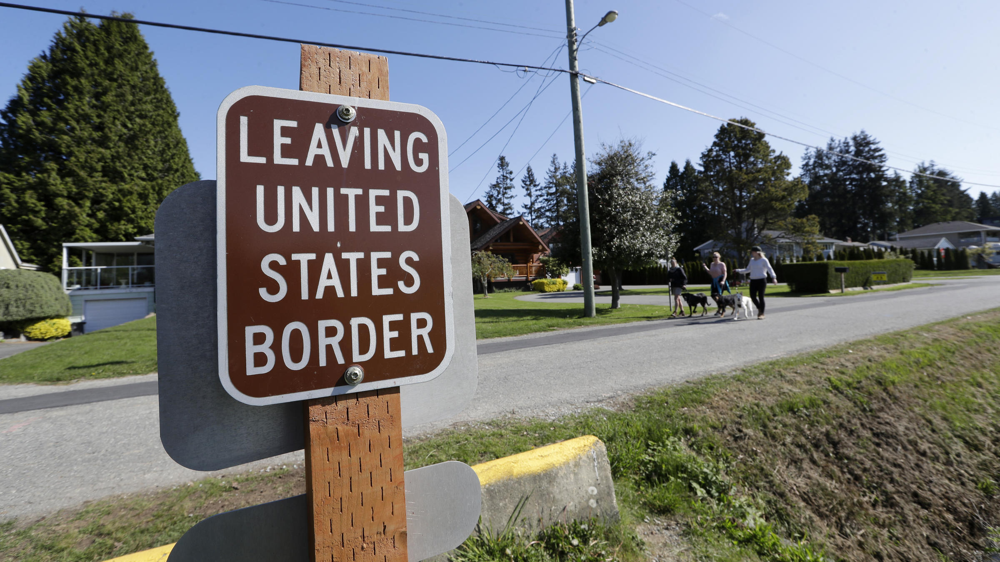
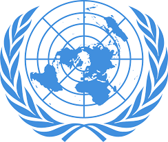

---
output:
  xaringan::moon_reader:
    css: ["default", "extra.css"]
    lib_dir: libs
    seal: false
    nature:
      highlightStyle: github
      highlightLines: true
      countIncrementalSlides: false
      ratio: '16:9'
---

```{r, echo = FALSE, warning = FALSE, message = FALSE}
##xaringan::inf_mr()
## For offline work: https://bookdown.org/yihui/rmarkdown/some-tips.html#working-offline
## Images not appearing? Put images folder inside the libs folder as that is the main data directory

library(tidyverse)
library(readxl)
library(stargazer)
##library(kableExtra)
##library(modelr)

knitr::opts_chunk$set(echo = FALSE,
                      eval = TRUE,
                      error = FALSE,
                      message = FALSE,
                      warning = FALSE,
                      comment = NA)
```

class: slideblue

.size80[**Today's Agenda**]

<br>

.size50[

Explore constructivism as an approach to building models of international politics

]

<br>
<br>

.center[.size40[
  Justin Leinaweaver (Spring 2022)
]]

???

## Prep for Class
1. ...

<br>

* Opening Discussion *

### Anything interesting going on in world politics at the moment?

<br>

### Everybody have the readings for today?

<br>

This week we begin exploring a VERY different approach to explaining international political events.

Constructivism is going to push us to question everything.

Constructivism is a challenging view to summarize so, instead, Hopf (1988) tells us how constructivists think about some of the biggest puzzles in international relations.


---

background-image: url('libs/Images/background-blue_triangles2.png')
background-size: 100%
background-position: center
class: middle

.size50[**Hopf (1998) Reframes the Question**]

<br>

.size40[**How do we explain international politics?**]

.size40[
1. Who matters and what do they want?

2. What is the effect of anarchy?

3. What is power?

4. What explains changes in the system?
]

???

Before we get to Hopf's answers to these questions and to exploring the constructivist model, let's evaluate the framing.

### Based on our work over the last 12 weeks tell me, is this a useful way to organize an exploration of international politics? Why or why not?

#### - In other words, is hopf asking the right questions if what you want is to understand international politics?

*Force this discussion*

<br>

I've encouraged you all semester to think about models of international politics in terms of interests, interactions and institutions.

### Would Hopf be opposed to these shortcuts to model building? Why or why not?

*Force this discussion*

<br>

(It depends!)

So, a constructivist would say that, fundamentally, if you organize your theory of IR around anarchy or interests as fixed concepts you've badly missed the point.


---

class: middle, center, slidegreen

.size90[**1. Actors and Structures are Mutually Constituted**]

???

### What does it mean when Hopf (1998) asserts that actors and structure are mutually constituted?


---

class: middle, slidegreen

.size60[**1. Actors and Structures are Mutually Constituted**]

<br>

.size40[

+ Actors

+ Structures

+ Mutually

+ Constituted
]

???

### What does he mean by "actors"?
(The units whose behavior we are trying to understand)

### What does he mean by "structures"?
("a set of relatively unchangeable constraints on the behavior of states" p172.)

### What does that sound like? 
(Similar to our definition of institutions)

### What does mutually mean? 
(with mutual action; experienced or done by each of two or more parties toward the other or others.)

### What does constituted mean?
(combine to form; be a part of a whole)

<br>

### Ok, somebody put this together and tell us what the first assumption of Constructivism tells us about international politics.


---

class: middle, center, slideblue

.size50[**1. Actors and Structures are Mutually Constituted**]

```{r, fig.align='center'}
knitr::include_graphics("libs/Images/13_1-circle.png")
```

???

Actors and structures are defined by their interactions together.
- Actors create structures by taking action.
- Structures define what actors can and cannot do

Neither can be understood without the other.
- Neither is fixed...

### Does that make sense?


---

background-image: url('libs/Images/13_1-movies.jpg')
background-size: 100%
class: center

???

### How does the movie theater example in the hopf excerpt help us understand this first assumption of Constructivism?

<br>

Reaction to the fire?
- Order or chaos? An orderly line forms or a mad rush for the doors? Women and children first? Violence and looting breaks out?

Peoples' reaction to the fire depends on the "culture, norms, institutions, procedures, rules and social practices that constitute the actors and the structure alike" (p103).
- In other words, behavior depends on much more than just actors and institutions.

<br>

### Do we buy this?

#### - Would your personal reaction to the fire be influenced in those ways?


---

background-image: url('libs/Images/13_1-movies2.jpg')
background-size: 100%
background-position: center
class: bottom

.size60[.textwhite[**1. Actors and Structures are Mutually Constituted**]]

???

### 1. Is this a useful assumption for explaining international politics?

#### - What are the pros and cons of building from this premise?

<br>

### 2. How is this different from our prior models of international politics?

+ (- The rules are not fixed, they come from our interactions.)
+ (- Which actors matter depends on the situation and the societal rules.)
+ (- Structure is meaningless without societal context.)


---

background-image: url('libs/Images/13_1-traffic_jam.jpg')
background-size: 100%
class: center

.size60[.textwhite[**1. Actors and Structures are Mutually Constituted**]]

???

Let's illustrate the comparison.

When a realist or economic liberal tries to explain the world, they make certain assumptions about which actors and institutions matter.

<br>

For example, they would likely start their explanation of a traffic jam by focusing on how the cars deal with each other and the rules of driving.

- Drivers want things, cars help them get those things and the rules govern what they can do.

<br>

### How would a Constructivist approach this "puzzle"?

(On the other hand, constructivists argue that:)

1. The cars aren't the only actors who matter
2. Each driver and each car are fundamentally different and will likely behave differently.
3. The "rules" of the road are determined by the actions of the actors using it NOT NECESSARILY the ones written down in city codes.

<br>

### What questions do you have about this first assumption?


---

class: middle, center, slideblue

.size80[**2. Anarchy as Imagined Community**]

???

Hopf's second argument is that anarchy is an imagined community.

### What does that mean?
(The implications of anarchy depend on societal context.)

### Give me an example.


---

class: middle, center, slideblue

.size50[**2. Anarchy as Imagined Community**]

```{r, fig.align='center', out.width='75%'}
knitr::include_graphics("libs/Images/13_1-hippies.jpg")
```

???

Anarchy is unlikely a scary, survival threatening prospect when you're living on a commune and everyone shares everything.

In this case, your strong sense of community shapes the meaning of the anarchy you live under.

Life and death are not constantly at stake so you are unlikely to approach every decision with fear.


---

class: middle, center, slideblue

.size50[**2. Anarchy as Imagined Community**]

```{r, fig.align='center', out.width='75%'}
knitr::include_graphics("libs/Images/13_1-dark_street.png")
```

???

However, walking alone at night down a dark alley is an entirely different world.

In this case, you have no sense of shared community with the stranger in the distance.

This unfamiliarity gives the anarchy of the moment a much more frightening set of stakes.


---

class: middle, center, slideblue

.size50[**2. Anarchy as Imagined Community**]

.pull-left[

```{r, fig.align='center'}
knitr::include_graphics("libs/Images/13_1-hippies.jpg")
```

]

.pull-right[

```{r, fig.align='center'}
knitr::include_graphics("libs/Images/13_1-dark_street.png")
```

]

???

Both scenarios may be "anarchic", but only one generates fear.

The point is that context matters for determining how you will react to anarchy.

### Does that make sense?

<br>

### Somebody give us a real-world example of this dynamic helping us understand international politics.

(SLIDE)


---

class: middle, center, slideblue

.size50[**2. Anarchy as Imagined Community**]

.pull-left[

```{r, fig.align='center'}

```

]

.pull-right[

```{r, fig.align='center'}
knitr::include_graphics("libs/Images/13_1-korean_border.jpg")
```

]

???

Here we compare the international border between the US and Canada to the one between North and South Korea.

Slightly different vibe, right?

<br>

### Ok, what do we think of this as a second assumption in the model?

#### - Pros vs cons?


---

.size60[**3. The Power of Practice**]

.size40[**Criteria to be a Great Power (Waltz 1979)**

+ Size of population & territory

+ Resource endowment

+ Economic capability

+ Military strength

+ Political stability and competence
]

???

Here's a list of criteria Kenneth Waltz proposed for determining which states in the world are the "great" powers.

What we might use to think about what a superpower is in today's language.

<br>

### What do constructivists like Hopf (1998) add to traditional definitions of power?


---

background-image: url('libs/Images/13_1-MLK.jpg')
background-size: 100%
class: center

???

### In what concrete ways was MLK powerful?

#### - Are any of those ways reflected on Waltz's criteria?


---

background-image: url('libs/Images/13_1-Gandhi.jpg')
background-size: 100%
class: center

???

### In what concrete ways was Ghandi powerful?

#### - Are any of those ways reflected on Waltz's criteria?


---

.size50[**3. The Power of Practice**]

<br>

.size40[**Criteria to be a Great Power (Waltz 1979)**]

.size30[
+ Size of population & territory

+ Resource endowment

+ Economic capability

+ Military strength

+ Political stability and competence

+ .textred[**Discourse (Hopf 1988)**]
]

???

Constructivists agree that power is all of these things, but adds DISCOURSE!

Constructivists believe that the other theories conceive of power far too narrowly.

<br>

### How does Hopf define discourse?
(Knowledge, ideas, culture, ideology and language.)

<br>

### Does "discourse" belong on this list? Why or why not?

<br>

### What questions do you have about this third assumption?


---

background-image: url('libs/Images/13_1-change.png')
background-size: 100%
class: center

???

### According to Hopf (1998), where does change come from?

(Happening all the time.)
- Evolutionary as actors and structures interact and mutually constitute each other.

Change is inherent in constructivism.
- Built into the theory.

Constructivists argue our "goals" are fluid and depend on our identity and the current context of the situation.

<br>

Think back to our "cars in a traffic jam" puzzle.

Where the driver is heading is informed by who you are, what you want AND how the car drives, what the cars around you are doing and how you perceive your role in traffic.

This means that directions are constantly in flux, change is everywhere.

### What questions do you have about this fourth assumption?


---

background-image: url('libs/Images/13_1-raphael.png')
background-size: 100%
class: center

???

### Finally, what role does identity play in Constructivist theory?
- (Identities tell others who you are and tell you who others are.)
- (They are the source of our interests / preferences.)

<br>

*Save the meat of this for norms on Wed*

*Just: 1. What is your identity? 2. How does it influence your behavior?*

<br>

### What is your identity?

+ We all have many identities: Human being, DU student, family member, MO, Springfieldian, American, etc.
+ e.g citizenship, residence, geographic origin, gender, class, politics, profession, employment, food habits, sports interests, taste in music, social commitments, etc.

<br>

### How does your identity influence your behavior? Do you behave the same way at home as you do on a night out with friends?

1. We all use identities as shortcuts to making judgements about other people.
2. Helps us to define who is on our team and who is not.


### What questions do you have about this fifth assumption?


---

background-image: url('libs/Images/background-blue_triangles2.png')
background-size: 100%
background-position: center
class: middle

.size50[.center[**Applying Constructivism to IR Puzzles**]

+ Security Dilemma

+ Neoliberal Cooperation

+ Democratic Peace
]

???

To make sure we understand what all this means for understanding the world.

Let's examine Hopf's approach to some of the common puzzles we encounter in international relations.

Specifically, let's discuss how constructivism explains the security dilemma, neoliberal cooperation and the democratic peace.


---

background-image: url('libs/Images/13_1-security_dilemma.png')
background-size: 100%
class: center

???

### Refresh my memory, what is the security dilemma?
#### - How does it work and why do Realists expect it to happen?

1. Purely defensive moves look threatening in a world of uncertainty and anarchy.
    - At no point did either you or your neighbor act with the intention of attacking the other person.
    - These were entirely defensive moves only and they still spiral out of control!

2. Cooperation should be almost impossible to start and maintain in any meaningful ways.


---

background-image: url('libs/Images/13_1-security_dilemma.png')
background-size: 100%
class: center

???

### So, how does Hopf explain this puzzle using Constructivism?

(p188)

The security dilemma is born from uncertainty.
- I can't know for sure what you are doing / if you're a threat.

Empirically not a useful model for lots of different pairs of states: "members of the same alliance, members of the same economic institution, perhaps two peaceful states or two neutral states, and so on.")

Why?
- Because identity reduces uncertainty.

The Constructivist model acknowledges this and helps us study identity formation and transformation!

<br>

### Do we buy this?
#### - Any drawback to replacing the realist security dilemma prediction with the study of identities?

*Force this discussion*


---

class: middle, slideblue

.size60[**Neoliberal Cooperation**]

.pull-left[
.size40[
+ Setting standards of behavior

+ Verifying compliance

+ Resolving disputes

+ Reducing the costs of joint decision making

]]

.pull-right[

<br>
<br>

```{r, fig.align='center'}

```

]

???

Hopf (1988) next examines what he calls neoliberal cooperation.
- What we have called institutionalism or the use of international institutions to make cooperation possible.

### How does hopf explain this puzzle using Constructivism?
- (p188)
- (Similar to last critique: We need to study identities, norms and practices to understand why institutions facilitate cooperation and how they change over time)

<br>

### What are the pros and cons of rooting our study of international institutions in identities, norms and practices?

*Force this discussion*


---

background-image: url('libs/Images/13_1-global_peace_index.png')
background-size: 100%
class: center

???

The Democratic Peace

### And finally, how does Hopf hope to help us understand the democratic peace using a Constructivist model of politics?

(p191)

1. ("Its approach aims at apprehending how the social practices and norms of states construct the identities and interests of the same. Ergo, if democracies do not fight each other, then it must be because of the way they understand each other, their intersubjective accounts of each other, and the socio-international practices that accompany those accounts.")

2. ("But constructivism could offer a more general account of zones of peace, one not limited to democracies. Different periods of the histories of both Africa and Latin America have been marked by long stretches of little or no warfare between states. These pacific periods are obviously not associated with any "objective" indicators of democracy. By investigating how African and Latin American states constructed themselves and others, it might be possible to understand these neglected zones of "authoritarian peace.")

<br>

### Do those two arguments make sense?

#### - Does being able to do those two things make constructivism more useful than our other models? Why or why not?


---

class: slideblue, middle

.size50[**Constructivism (Hopf 1998)**]

.size40[

+ Actors and structures are mutually constituted

+ Interests and identities are linked and multi-layered

+ Anarchy is an imagined community

+ Power is material AND discursive

+ Change is possible, difficult and a normal part of the process

]

???

In sum.

### What are the strengths and weaknesses of a Constructivist perspective on international politics?

(Strengths:)
- Identifies some powerful mechanisms that influence human behavior: identity, norms, context

(Weaknesses:)
- Adds tons of complexity to our work


Tough part is figuring out if that trade-off is worth it.
