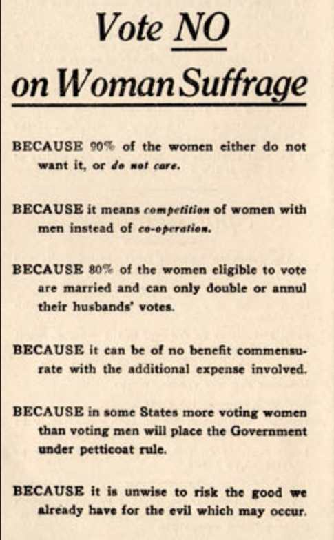

## Today's Agenda {background-image="Images/background-worldmap4.png" .center}

```{r}
# background-size="1920px 1080px"
library(tidyverse)
library(readxl)
library(kableExtra)
```

<br>

::: {.r-fit-text}
**IV. What is the Future of Transnational Politics and IR?**

- The power of norms to shape international politics
:::

<br>

<br>

::: r-stack
Justin Leinaweaver (Fall 2024)
:::

::: notes
Prep for Class

1. Review Canvas submissions

<br>

### DISCUSS: Name me an international political event that has happened since we last met as a class.

<br>

On Monday we discussed Hopf’s take on Constructivism.

### As a Constructivist, how would you sell your theory to people who just wanted to understand how international politics works?
:::


## Constructivism (Hopf 1998) {background-image="Images/background-worldmap4.png" .center}

<br>

::: {.r-fit-text}

+ Actors and structures are mutually constituted

+ Interests and identities are linked and multi-layered

+ Anarchy is an imagined community

+ Power is material AND discursive

+ Change is possible, difficult and a normal part of the process
:::

::: notes

Think about the elements we explored on Monday.

### What strengths would you emphasize and how would you keep it simple?

<br>

### Could you use a real-world example to drive home the benefit of the approach? Why?
:::


## {background-image="Images/13_2-Gandhi2.jpg"}

::: notes
My approach would be to tell them that Constructivism offers the most direct guidance for how YOU can change the world.

+ There is no fixed meaning to anything.

+ Your actions shape the world and personal identities.

+ Change is a constant and you can use that!

+ Thinking like a Constructivist encourages individuals to claim power over the world they live in.

<br>

### Make sense?

<br>

Finnemore and Sikkink want to help us deepen our understanding of how constructivists think about the rules of the game.

### According to these authors, what is the difference between a norm and an institution?
:::


## {background-image="Images/13_2-norm_vs_institution.png"}

::: notes

**A norm** is "...a standard of appropriate behavior for actors with a given identity" (p108).

<br>

A sociological view of **institutions** is that they aggregate many rules and practices.
:::


## {background-image="Images/13_2-slave_auction.png"}

::: notes

This is a rough example, but bear with me here for a sec.

- **For example, was slavery in early America an institution or a norm? Why?**

<br>

(Slavery was an institution.)

Within the institution of slavery there were many, many "rules."

- Who can be thought of as property and who cannot?
- How slaves were to be valued and sold.
- How slaves could be controlled or treated.

<br>

### First, do we understand the conceptual distinction here between a norm and an institution according to Constructivists?

<br>

### Ok then, what is the benefit of making this distinction? how does this distinction help us?

(SLIDE)
:::


## {background-image="Images/13_2-slave_auction.png"}

::: notes

For the most part we live in a world of institutions.
- And some, like slavery, are incredibly objectionable.

- The problem is that challenging institutions is REALLY, REALLY hard.

<br>

HOWEVER, individual norms can be challenged much more easily.
- Still hard, but doable.

- And if you alter enough of the underlying norms, the institution changes (or disappears).

<br>

Abolitionists couldn't simply end the institution of slavery all at once, but they could work to alter the fundamental rules under it.
- They pushed on understandings about respect for family units, 

- emphasized the inconsistency between slavery and founding principles of the country, and 

- tried to enact rules about how slaves could be treated.

<br>

Chipping away at these smaller rules helped weaken the entire structure.
:::


## {background-image="Images/13_2-usa.png"}

::: notes

So, studying norms allows us to look inside our social institutions.

While institutions are important, to really understand them we have to understand their basic units first.
- How did each norm come into being?
- Who defends it and why?

Then we can start to explore how many norms come together as an institution.

<br>

### What are some of the norms expected of people living in the US?

+ (We get mad if you cut in line e.g. at an atm)
+ (If you bump into someone as you pass by we expect you to say "excuse me")
+ (We like our personal space when it comes to strangers)
+ (Tipping at restaurants)
:::


## {background-image="Images/13_2-FSU.png"}

::: notes

I went to FSU for my undergrad.

At football games, if you were in the student section there were important norms to follow:

1. Everyone stands the entire game!
2. You must do the "chop"
3. You must sing the fight song after we score.

<br>

Rules not written down, but powerfully effect all students' behavior.
- We all want to belong to the group!
:::


## {background-image="Images/13_2-drury.png"}

::: notes

**Are there any "norms" related to being a Drury student?**

<br>

Ok, it's not enough just to break institutions down into norms.

- We also need to differentiate by type of norm.

<br>

**What is the difference between a regulative and a constitutive norm?**

- (constitutive: creates new actors, interests, or categories of action)
- (regulative: order and constrain behavior)
:::


## {background-image="Images/13_2-touchdown.png"}

::: notes

**Is scoring a TD in football a constitutive or regulative norm?**

- (constitutive: The activity itself cannot exist without these rules.)
:::


## {background-image="Images/13_2-football2.png"}

::: notes

**Is the rule against taunting a constitutive or regulative norm?**

- (Regulative: Regulates a pre-existing activity whose existence is independent of this rule.)

<br>

<br>

**Give me an example of a constitutive norm in international politics.**
:::


## {background-image="Images/13_2-obama_cartoon.png" background-size='85%'}

::: notes

(SLIDE)

Don't invade other countries! Borders are inviolable

- Remember, this doesn't mean it cannot happen, just that "appropriate" behavior is defined as one who doesn't.

<br>

**What makes this a constitutive norm?**

- (Without respected state borders the current system lacks definition.)

<br>

### Example of a regulative norm at the international level?
:::


## {background-image="Images/13_2-tariffs.png"}

::: notes

(SLIDE)

All states apply tariffs to goods made in other countries but sold in theirs.

<br>

### Does the distinction between a constitutive and regulative norm make sense?
:::


## {background-image="Images/11-2-norms_cartoon.jpg"}

::: notes
**BRAINSTORM: How does thinking about different types of norm help us understand international politics better?**

<br>

First, we have to recognize that some norms are much harder to change than others.

### Which type of norm is harder to change? Why?
- Much harder to change a constitutive norm as it is fundamental to an activity.
    - Regulative norms are made to be tweaked...
- We can change the taunting penalty to be 5 or 20 yards but altering what a touchdown is worth would dramatically change the sport.

<br>

Second, we need to recognize that violations of some norms are a MUCH bigger deal than others.

### Which type of norm carries a bigger stigma when you violate it?
- (Constitutive!)
    - Violate the rules that make up the heart of the system and people will notice.
:::


## {background-image="Images/11-1-totalitarian_leaders.jpg" background-size="75%"}

::: notes

Third, we must recognize that norms are linked to identity, not to normative beliefs about truth, justice or goodness.

<br>

### Can anybody identify the WW2 era dictators on the slide?
- (Stalin, Hitler, Pinochet (Chile), Mao, Mussolini and Kim Il-Sung)

All of these leaders adopted and tried to spread some incredibly offensive norms.

<br>

Take for example, Hitler's views on his "master" race.

### What do Finnemore and Sikkink mean when they write that these racist norms weren't "bad"?

- Remember, a norm is a standard of appropriate behavior for actors with a given identity.
    - If you were a Nazi, then these beliefs were considered "good" to you.

- What matters is that the group that holds the norm believes it is appropriate.
    - Not that we approve of it.

- We really want to be careful not to assume norms are somehow linked to objective values of goodness.
:::


## The Norm Life Cycle {background-image="Images/13_2-norm_life_cycle.png" background-size="92%"}

::: notes

Finnemore and Sikkink tell us that norms are created as a product of the norm "life cycle."

### How does this figure help us impact international political events?

- If we adopt a constructivist view, then we accept that societal norms have a powerful effect on actor behavior.

- This means that if we can control or modify societal norms, we can control the behavior of the actors around us!

<br>

Let's discuss the stages.
:::


## The Norm Life Cycle {background-image="Images/13_2-norm_life_cycle.png" background-size="92%"}

::: notes
**What happens in stage 1? What is "norm emergence"?**

<br>

### Who are the "norm entrepreneurs" and what do they do? 
- (They actively try to convince their community that some behavior is either desirable and should be required OR undesirable and should be stopped.)

A very important idea.

- Norms are intentionally created by people who want things.
- They are not an accident, they are a strategic tool!

<br>

### According to Finnemore and Sikkink, how do norm entrepreneurs convince society to adopt their norm?
- (Issue framing)

### What does that mean? What is framing?
- (Use language that names, interprets and dramatizes an issue.)
:::


## {background-image="Images/13_2-votes_for_women.png"}

::: notes

Let's explore the framing idea using a huge debate from the turn of the century.

<br>

Let's say it is 1915, and you believe women should have the right to vote.

- **As a norm entrepreneur, how could we frame women's suffrage in a way that convinces the rest of society?**
:::


## {background-image="Images/13_2-votes_for_women2.png"}

::: notes

**Are these examples of effective framing? Why or why not?**

<br>

Some very clever framing here.

- Liberty for all appeals to Constitutive American norms
- No taxation without representation (powerful historical analogy)

<br>

### Imagine you are a norm entrepreneur for the other side, defend the status quo!

Just kidding, don't shout out ideas for that!
:::


## {background-image="Images/background-worldmap4.png" .center}

:::: {.columns}

::: {.column width="50%"}
```{r, fig.align='center'}
knitr::include_graphics("Images/13_2-no_votes_for_women3.jpg")
```
:::

::: {.column width="50%"}
```{r, fig.align='center', out.width='78%'}
knitr::include_graphics("Images/13_2-no_votes_for_women2.jpg")
```
:::

::::

::: notes

Arguments aimed at husbands.

### What can we learn about the "no" side from these posters?
:::


## {background-image="Images/background-worldmap4.png" .center .smaller}

<br>

:::: {.columns}

::: {.column width="75%"}
BECAUSE 90% of the women either do not want it, or do not care.

BECAUSE it means competition of women with men instead of co-operation.

BECAUSE 80% of the women eligible to vote are married and can only double or annul their husband's votes.

BECAUSE it can be of no benefit commensurate with the additional expense involved.

BECAUSE in some States more voting women than voting men will place the Government under petticoat rule.

BECAUSE it is unwise to risk the good we already have for the evil which may occur.
:::

::: {.column width="25%"}
```{r, fig.align='center', out.width='100%'}

```
:::

::::

::: notes
Anti-vote Arguments for Men

### What can we learn about the "no" side from this pamphlet?

(A direct appeal to men of the time.)

- Invokes sexist beliefs about competency and presents women's voting as a threat to men's influence.
:::


## {background-image="Images/background-worldmap4.png" .center}

- You do not need a ballot to clean out your sink spout.

- Good cooking lessens alcoholic craving quicker than a vote.

- Why vote for pure food laws, when your husband does that, while you can purify your ice-box with saleratus water?

- Common sense and common salt applications stop hemorrhage quicker than ballots.

- Sulpho naphthol and elbow grease drive out bugs quicker than political hot air.

::: notes

Anti-vote Arguments for Women

### Is the author doing a good job reaching out to the other side here? Why or why not?
:::


## {background-image="Images/11-2-issue_framing.jpg"}

::: notes

Ok, what’s the point of this exercise?

FIRST, issue framing is a very powerful tool when trying to enact or defend certain rules.

- We strategically frame our positions to make our preferred norm appeal to more people.

<br>

Lot's of present day examples:

- Pro-choice people don’t defend abortion clinics, they defend Family Planning Clinics!

- Those opposed to abortion do not describe themselves as anti-choice, they are pro-life!

- Oil companies do not push for more drilling, they push for expanded exploration.

<br>

SECOND, there is almost never a chance to create norms where no social rules exist before.

- The debate over women’s suffrage was held at a time when the role of women had been defined for many people in very specific ways.

- Creating a new norm will always require you to fight against the established ones.
:::


## {background-image="Images/13_2-putin_ukraine1.png" background-size="85%"}

::: notes

For today I gave you a New York Times article on Putin's rationale for annexing Crimea.

I know this feels INSANELY outdated right now, but his argument is quite pertinent.

### What was Putin's rationale for annexing crimea? What issue framing did he utilize?

- The Ukrainian government is oppressing the Crimean people.
    - The Crimean people demanded it democratically!
    
- Russian citizens lived there and were in danger.
    - States must protect their citizens!

<br>

### Is this a convincing argument? Why or why not?

<br>

### How did the western powers frame it?
:::


## {background-image="Images/13_2-putin_ukraine2.png" background-size="73%"}

::: notes

1. A reckless and unwarranted invasion!

2. A violation of state sovereignty.

<br>

Both sides tried to invoke widely accepted norms as justification for their behavior.

<br>

### Everybody clear on the importance and power of framing?
:::


## {background-image="Images/13_2-norm_life_cycle.png" background-size="92%"}

::: notes

The Norm Life Cycle

**What happens in stage 3? What is internalization?**

- (The norm becomes a part of an actor's identity)
- Once internalized the norm is taken for granted

<br>

### Why is an internalized norm so very powerful?
- (This means that, at this point, we don't even realize we are obeying a rule!)
- It is now part of how we think and therefore how we act.
    - Very, very hard to dislodge.

<br>

### Can everybody see why being able to control societal norms is incredibly powerful?

<br>

**SLIDE**: Next class we examine a global effort by the UN to act as a norm entrepreneur.
:::


## Assignment for Next Class  {background-image="Images/background-blue_triangles2.png" .center}

<br>

1. Read the Universal Declaration of Human Rights

2. **Before class** submit an argument to Canvas: 

The US should (or should not) enshrine the UN's Universal Declaration of Human Rights into US law.

::: notes
**Questions on the assignment?**
:::