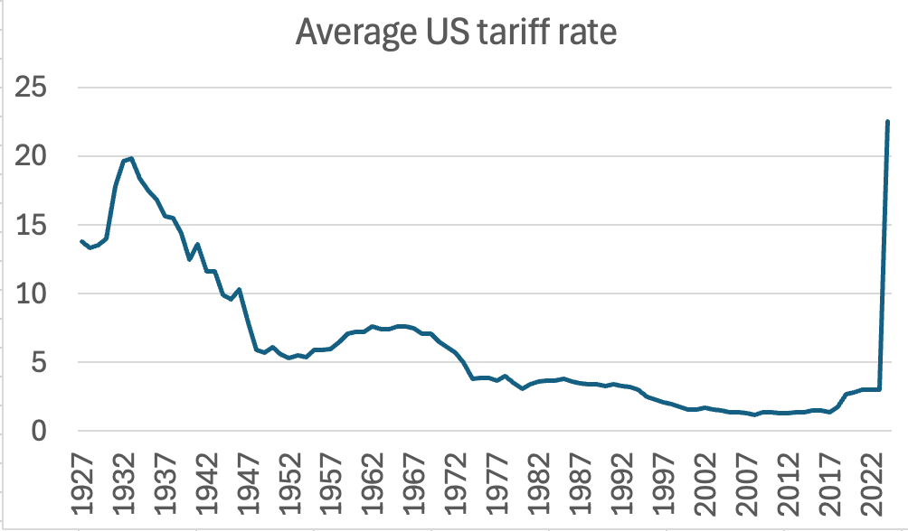
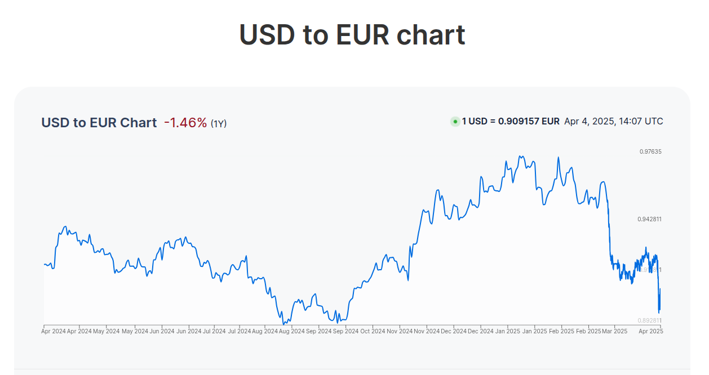
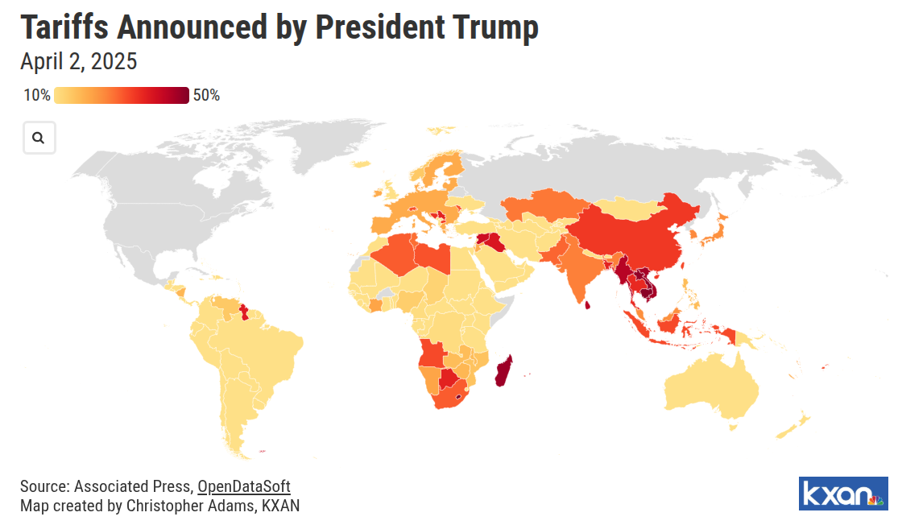
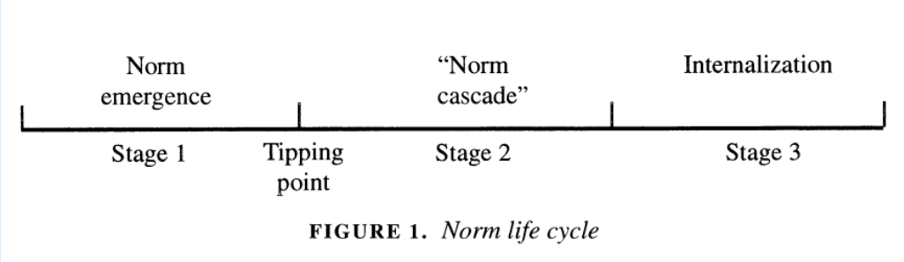

## Today's Agenda {background-image="Images/background-worldmap4.png" .center}

```{r}
# background-size="1920px 1080px"
library(tidyverse)
library(readxl)
library(kableExtra)
```

<br>

**IV. What is the Future of Transnational Politics and IR?**

- Should the US enshrine the UN's Universal Declaration of Human Rights into domestic law?

<br>

<br>

::: r-stack
Justin Leinaweaver (Spring 2025)
:::

::: notes
Prep for Class

1. Review Canvas submissions AND track which articles claimed to be most problematic (line 237-ish)

2. Bring markers x 4

3. Post link to Google Sheet for claiming countries on Canvas
    - First name, Last name, Country 1 - Dictatorship, Country 2 - Democracy
    - Plus include a list of each beside table (see FA23 version)
    
<br>

Today I want us to analyze the UN's role as a norm entrepreneur in creating and propagating the Universal Declaration of Human Rights

- We're undoubtedbly going to get sidetracked a lot, but let's try to keep our eye on evaluating the norm creation process

<br>

**SLIDE**: President Trump has launched a global trade war

:::


## {background-image="Images/background-worldmap4.png" .center}

{style="display: block; margin: 0 auto"}

::: notes

What is going on in this administration?

- How does anyone look at American history and think, those Smoot-Hawley tariffs led to a global depression and world wars

- I'll have some of that, please!

<br>

And you'll not be shocked to hear, this will likely be more damaging to us today

- Per the St Louis Federal Reserve and the Bureau of Economic Analysis

- In 1920, total trade with the world made up under 10% of the US economy (GDP)

- In 2023, per the World Bank, it was 25%.

<br>

When Smoot-Hawley acted they were gambling with 10% of our economy.

- President Trump is jeopardizing one quarter of our economy.

<br>

**SLIDE**: Even more dangerous, the world doesn't seem to believe him anymore

:::


## {background-image="Images/background-worldmap4.png" .center}

{style="display: block; margin: 0 auto"}

::: notes

Why aren't these tariffs increasing the value of the dollar?

<br>

Per Nobel Prize winning economist Paul Krugman

- Standard economic analysis says that tariffs strengthen a nation’s currency. 

- If the United States puts taxes on imports, this discourages businesses and consumers from buying foreign goods, which reduces the supply of dollars to the foreign exchange market and should drive the value of the dollar up.

- But the dollar fell once investors began to see Trump policy in action. 

- What business can’t deal with is a regime under which trade policy reflects the whims of a mad king, where nobody knows what tariffs will be next week, let alone over the next five years. Are these tariffs going to be permanent? Are they a negotiating ploy? The administration can’t even get its talking points straight

- Under these conditions, how is a business supposed to make investments, or any kind of long-term commitment? Everyone is going to sit on their hands, waiting for clarity that may never come.

<br>

**SLIDE**: Are they wrong to think the administration doesn't know what it is doing?

:::


## {background-image="Images/background-worldmap4.png" .center}

{style="display: block; margin: 0 auto"}

::: notes

Why has Russia been excluded from these tariffs?

- We have a trade deficit with them, why isn't that one a problem?

<br>

Why are we applying tariffs to small islands that have no economic trade and no inhabitants?

<br>

Why have we applied a tariff to the US military base at Diego Garcia in the Indian Ocean?

<br>

I'm not even getting into the insane way these "reciprocal" tariff rates have been determined.

- Amusingly described on BlueSky as: “You might as well divide the numbers of apples in your kitchen by the number of bagels & use it to calculate your mortgage rate. To criticise it on political or economic grounds is too generous”.

<br>

So, yeah, if it weren't all so horrible it'd be funny.

<br>

**SLIDE**: Basics on the UN DHR

:::


## {background-image="Images/13_3-Roosevelt.png"}

::: notes

The UDHR was adopted by the UN General Assembly on December 10, 1948.

<br>

**Anybody recognize this person?**

- (Eleanor Roosevelt!)

    - Wife of FDR (president 1933-1945)
    
    - Had an incredible career as a diplomat and activst
    
    - "She served as the first Chairperson of the Commission on Human Rights and played an instrumental role in drafting the Universal Declaration of Human Rights" ([UN Link](https://www.un.org/en/observances/human-rights-day/women-who-shaped-the-universal-declaration)).

<br>

**Had anybody ever read this UN document before?**

- **Anything about what it includes that surprised you? Why or why not?**

<br>

Today I want us to analyze the UN DHR as an attempt by the UN to enshrine new global norms

- **SLIDE**: But first, a quick refresher on Constructivism
:::


## Constructivism {background-image="Images/background-worldmap4.png" .center}

+ Actors and structures are mutually constituted

+ Interests and identities are linked and multi-layered

+ Anarchy is an imagined community

+ Power is material AND discursive

+ Change is possible, difficult and a normal part of the process

{style="display: block; margin: 0 auto"}

::: notes

This week we've been exploring Constructivism as an approach to explaining international political events

- **What do we like about this approach to explaining international political events?**

- **What concerns do you have with using this approach to explaining international political events?**

<br>

Last class we explored Finnemore and Sikkink's work on the norm life cycle.

- Today I want us to evaluate the UN DHR using this theoretical map

- Let's make sure we're clear on the three stages

<br>

**What happens in the norm emergence stage?**

- (Norm entrepreneurs actively try to convince their community that some behavior is EITHER:)

    - Desirable and should be required, OR
    
    - Undesirable and should be stopped.

- We can think of Eleanor Roosevelt and the UN General Assembly as doing this work with the DHR

<br>

**What happens in the norm cascade stage?**

- The norm cascade phase is when a norm, having achieved initial support, begins to spread rapidly

- States and organizations adopt it for reasons ranging from:

    - moral conviction,
    
    - reputational benefits, and 
    
    - international pressure 

<br>

**Finally, what is internalization and why is it so powerful?**

- (Internalization: The norm becomes a part of an actor's identity)

- (Powerful: Rules we follow without thinking about it)

    - Once internalized the norm is taken for granted

    - It is now part of how we think and therefore how we act.

    - Very, very hard to dislodge.

<br>

Let's now examine the UN DHR

- *Split class into four groups, mix up the people!*

- Go sit with your groups and grab some board space

<br>

**SLIDE**: The job

:::


## {background-image="Images/background-worldmap4.png" .center}

::: {.r-fit-text}
**The UN’s Universal Declaration of Human Rights (1948)**
:::

{style="display: block; margin: 0 auto"}

::: notes

Groups, three columns on the board: emergence, cascade, internalized

- Your job is to classify each article in the UN DHR by where it currently sits in this process

- Don't set the stage 3 bar too high!

    - A norm can be internalized even if broken occasionally
    
    - Think about the efforts China and Russia go to in order to justify certain problematic behaviors as consistent with international law

<br>

**Questions on the task?**

- Go!

<br>

*Report Back and Discuss*

<br>

**SLIDE**: The US case
:::


## {background-image="Images/background-worldmap4.png" .center}

::: {.r-fit-text}
**The UN’s Universal Declaration of Human Rights (1948)**
:::

{style="display: block; margin: 0 auto"}

<br>

::: {.r-fit-text}
**Where is the US in this process?**
:::

::: notes

**Would your answers change if I asked you to focus on the US alone?**

- **In other words, is the US further along in this process than the global community? Why or why not?**

<br>

**SLIDE**: US law

:::


## {background-image="Images/background-worldmap4.png" .center}

::: {.r-fit-text}
**The UN’s Universal Declaration of Human Rights (1948)**

- Any conflicts with the US legal system?

:::

- One Vote: Articles 9, 10, 11, 18, 19

- Two Votes: Articles 5, 12, 13, 21

- Three Votes: Articles 28

- More Votes: Articles 14, 22, 23, 24, 25, 26, 29

::: notes

In Canvas today I asked you to identify which articles struck you as the toughest fit for the US legal system

<br>

Let's hear your reasoning

- **Why are these the toughest fit for the US system?**

<br>

**SLIDE**: Overall

:::


## Constructivism {background-image="Images/background-worldmap4.png" .center}

+ Actors and structures are mutually constituted

+ Interests and identities are linked and multi-layered

+ Anarchy is an imagined community

+ Power is material AND discursive

+ Change is possible, difficult and a normal part of the process

{style="display: block; margin: 0 auto"}

::: notes

**So, where are we in the norm life cycle with the UN's DHR?**

<br>

- **How close do you think we are to a "tipping point" of wide acceptance?**

- **Which rights are furthest away?**
:::


## Assignment for Next Class  {background-image="Images/background-worldmap4.png" .center}

<br>

Claim a democracy and a dictatorship (first-come, first-served) and review their current human rights record using:

1. The country reports by the US Department of State
2. The country reports by Amnesty International
3. The country reports by Human Rights Watch

Submit a summary of each country to Canvas before class (2-3 sentences each)

::: notes

Next week we explore the power of publicity to reduce human rights violations.

- To get us ready for that, I want to get you some practice with some of the key pieces of evidence that research draws on.

<br>

Technically I've given you a list of "most" and "least" democratic states in the world according to the V-Dem project's electoral democracy index.

<br>

**Questions on the assignment?**
:::