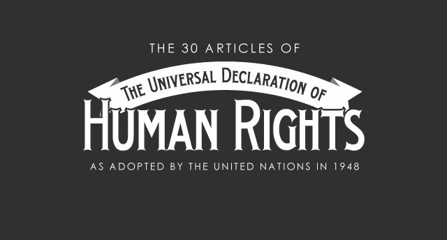

## Today's Agenda {background-image="Images/background-worldmap4.png" .center}

```{r}
# background-size="1920px 1080px"
library(tidyverse)
library(readxl)
library(kableExtra)
```

<br>

**IV. What is the Future of Transnational Politics and IR?**

- Should the US enshrine the UN's Universal Declaration of Human Rights into domestic law?

<br>

<br>

::: r-stack
Justin Leinaweaver (Spring 2025)
:::

::: notes
Prep for Class

1. Review Canvas submissions

2. Post link to Google Sheet for claiming countries on Canvas
    - First name, Last name, Country 1 - Dictatorship, Country 2 - Democracy
    - Plus include a list of each beside table (see FA23 version)
    
<br>

FOR NEXT TIME

Emphasize that we are evaluating norm internalization

- Not about finding rules on the books, it's about practice

- Have these norms been completely internalized in the US?
:::


## {background-image="Images/13_3-Roosevelt.png"}

::: notes

The UDHR was adopted by the UN General Assembly on December 10, 1948.

### Anybody recognize this incredibly famous person?
- (Eleanor Roosevelt!)

<br>

### Had anybody ever read this UN document before?

### - Anything about what it includes that surprised you? Why or why not?
:::


## {background-image="Images/13_2-norm_life_cycle.png" background-size="92%"}

::: notes

Let's talk about the UN DHR as an attempt by the UN to enshrine new global norms.

- In other words, let's evaluate this document using the Constructivism material from this week.

<br>

### First, do the articles in the DHR represent constitutive or regulative norms? 

<br>

**SLIDE**: Before we can debate if the US "SHOULD" turn the UN DHR into law we need to discuss how far we are from it currently.
:::


## Has the US public internalized the norms in each article? {background-image="Images/background-blue_cubes_lighter3.png" .center}

<br>

::: {.r-fit-text}

+ Completely internalized

+ Somewhat internalized

+ Not internalized

:::

::: notes

*Split class into FOUR groups*

<br>

GROUPS, work directly on the board

- Three columns

- Classify each article by these three levels

- Have we internalized the norms in each article?

- e.g. Do most people behave like this is a rule in our society?

<br>

**Questions on the task?**

- Get to it!

<br>

*Report Back and Discuss*

<br>

### Evaluate the performance of the US in terms of meeting the standards established by the UN's Universal Declaration of Human Rights.

### - Areas of disagreement across the groups?

<br>

**SLIDE**: Now we move from "is" to "should."
:::


## Should the US enshrine the UN DHR in domestic law? {background-image="Images/background-blue_cubes_lighter3.png" .center}

<br>

```{r, echo = FALSE, fig.align = 'center', out.width = '60%'}

```

::: notes

Everybody take a moment to review the argument submissions on Canvas.

<br>

### Ok, what are the pros and cons of enshrining the UN DHR in domestic law?

- *ON BOARD*
:::


## {background-image="Images/13_2-norm_life_cycle.png" background-size="92%"}

::: notes

### So, where are we in the Norm Life Cycle with the UN's DHR?

<br>

### If we're in Stage 1, how effectively do you think the UN DHR does at framing these issues for global acceptance?

### - Any evidence in your mind of some rights being watered down for acceptance?

<br>

### How close do you believe we are to the "tipping point"?

### - Which rights are furthest away?
:::


## Assignment for Next Class  {background-image="Images/background-blue_triangles2.png" .center}

<br>

Claim a democracy and a dictatorship (first-come, first-served) and review their current human rights record using:

1. The country reports by the US Department of State
2. The country reports by Amnesty International
3. The country reports by Human Rights Watch

Submit a summary of each country to Canvas before class (2-3 sentences each)

::: notes

Next week we explore the power of publicity to reduce human rights violations.

- To get us ready for that, I want to get you some practice with some of the key pieces of evidence that research draws on.

<br>

Technically I've given you a list of "most" and "least" democratic states in the world according to the V-Dem project's electoral democracy index.

<br>

**Questions on the assignment?**
:::