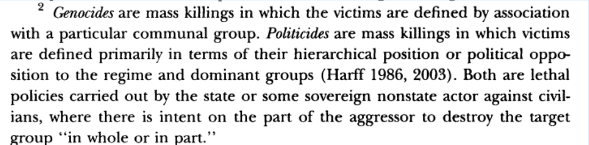

## Today's Agenda {background-image="libs/Images/background-worldmap3.png" .center}

```{r}
# background-size="1920px 1080px"
library(tidyverse)
library(readxl)
library(kableExtra)
```

<br>

**IV. What is the Future of Transnational Politics and IR?**

- Krain (2012) on naming and shaming "bad" states (p574-578)

<br>

<br>

::: r-stack
Justin Leinaweaver (Spring 2024)
:::

::: notes
Prep for Class

1. Review Canvas submissions

<br>

### DISCUSS: Name me an international political event that has happened since we last met as a class.
:::


## Comparative Case Studies {background-image="libs/Images/background-blue_cubes_lighter3.png" .center}

<br>

What do we learn about human rights violations in the world today?

+ Most common "human rights" violations?

+ Who specifically in the country is doing the harms?

+ How are victims being targeted?

::: notes

On Monday we explored a series of case studies describing human rights abuses around the world and the naming and shaming efforts made by certain NGOs to stop them.

### What conclusions did we draw from comparing and contrasting those cases?
:::


## {background-image="libs/Images/15_2-krain_header.png" background-size='85%'}

::: notes

Today we shift our focus to a research article that hopefully advances our knowledge about the topic.

### What is the research question in the Krain (2012) paper?

The title is a big hint, right?
- Does Naming and Shaming Perpetrators Reduce the Severity of Genocides or Politicides?

<br>

### Based only on the introduction of this article, how has the author tried to convince you that this is a clear and important question?

*Force this discussion*

<br>

Let's clarify a few elements of this before diagramming the model in this paper.

### First, why is this paper a good test of Constructivism as we began exploring it last week?
:::


## {background-image="libs/Images/15_2-discourse.png"}

::: notes

**Remind me, what does this mean?**

- (Hopf (1988) and the power of discourse!)

- Ideas and the framing of issues as a source of power as important, if not more important, than tanks, bombs or wealth.

<br>

The first reason this paper is a good test of Constructivism is it puts the discourse as power mechanism to the test.

- We assume states commit violent acts for reasons they feel strongly about.

- The intriguing question is, can the discourse power overcome those reasons?
:::


## {background-image="libs/Images/15_2-china-scs.png"}

::: notes

The second reason this paper is a good test of Constructivism is it explores how much global norms matter.

- Do widely accepted rules, not written down international laws, constrain state actions?

<br>

As we know China has strong territorial ambitions in the South China Sea.

- It also has the capacity to take that area by force although that would likely lead to war.

<br>

The Chinese government is working hard on the international stage to build the perceived legitimacy of their claims.

- They acknowledge the "relevant" "international practices" and the "rights of countries to the freedom of navigation and flight over the South China Sea..."

<br>

So, Krain (2012) is playing with mechanisms that constructivism makes clear should be very important for explaining international political outcomes. 

### Any questions on this?
:::


## {background-image="libs/Images/15_2-krain_header.png" background-size='85%'}

::: notes

Let's also clarify the central outcome concepts in the paper.

### What are the specific international violations Krain (2012) is focused on?

#### - What is the outcome variable in the study?
(Genocide and politicide)

<br>

### How does Krain define a "genocide" and a "politicide"?

(SLIDE: Footnote 2, p574)
:::


## Krain (2012): Key Concepts {background-image="libs/Images/background-slate_v2.png" .center}

<br>

```{r, fig.align='center'}

```

::: notes

(Footnote 2, p574)

"Genocides are mass killings in which the victims are defined by association with a particular communal group.

Politicides are mass killings in which victims are defined primarily in terms of their hierarchical position or political opposition to the regime and dominant groups (Harff 1986, 2003).

Both are lethal policies carried out by the state or some sovereign nonstate actor against civilians, where there is intent on the part of the aggressor to destroy the target group ‘‘in whole or in part.’’

<br>

### Why do we need both concepts? Doesn't genocide cover it all?

- (Krain not super interested in litigating the specific form of objectionable murder.)

- (Aim is to see if naming and shaming ends any and all forms of mass killing outside of legitimate security actions by the state.)
:::


## Krain (2012): Hypothesis {background-image="libs/Images/background-slate_v2.png" .center}

<br>

"Increases in human rights 'naming and shaming' activity against perpetrators of an ongoing genocide or politicide by actors within transnational advocacy networks should reduce the severity of genocide or politicide" (577).

::: notes

Here is the hypothesis in the paper.

### One more time, remind me, how do the hypotheses relate to the model?

(The hypotheses represent the testable implications of a model)

- The model lays out a set of assumptions about the world.

- When you combine those assumptions you generate predictions about what we should see happen in a specific situation.

- Those predictions are the hypotheses.

<br>

So, what we have here is a prediction about the world generated using Krain's (2012) model.

Our first job is to figure out the key elements of this model so we can evaluate it.
:::


## {background-image="libs/Images/background-slate_v2.png" .center}

<br>

**Krain (2012): Diagram the Model**

+ Who are the key **Interests**?

+ What are the key **Institutions**?

+ What are the key **Interactions**?

::: notes

Everybody take five minutes on your own to diagram the model.

Focus on the theory section of the paper and make a list of the key interests, institutions and interactions involved.

<br>

**PAIRS**: Now take five minutes to share your lists with the person next to you.

Combine and consolidate your lists.

<br>

**GROUPS**: Finally, take 5-7 minutes to discuss your lists with a nearby pair.

Combine and consolidate your lists.

<br>

### Ok, what have we got?

**ON BOARD**

<br>

(**SLIDE**: Your diagram)
:::


## {background-image="libs/Images/background-slate_v2.png" .center .smaller}

**Interests**

+ Leaders of states care about their reputations and legitimacy
+ NGOs / IOs want less genocide / politicide

**Institutions**

+ Global norm: Genocide / Politicide is not legitimate

**Interactions**, e.g. Naming and Shaming (N&S):

+ Exposes the crimes (public not private)
+ Raises the profile of the crimes (global not domestic)
+ May change perpetrators' self-perceptions
+ Activates bystanders
+ Encourages state sanctions
+ May cost the perpetrator state access to aid or trade

::: notes

Alright, let's evaluate this model of politics.

<br>

Remember, models are like maps.

### What is this map supposed to help us find?
(The key outcome of interest...)

<br>

### Does this model focus on this outcome? Why or why not?

<br>

### What are the strengths of this as a model of politics?

<br>

### What are the weaknesses of this as a model of politics?
#### - What possibly important things does it ignore?
:::


## Assignment for Next Class  {background-image="libs/Images/background-blue_triangles2.png" .center}

<br>

Krain (2012) on naming and shaming "bad" states (p578-587)

::: notes
Friday we dig into the data analyses in the paper.

- Your job for Friday is to start thinking about what specifically he did to test the model and whether you are convinced by it or not.

<br>

### Questions on the assignment?
:::