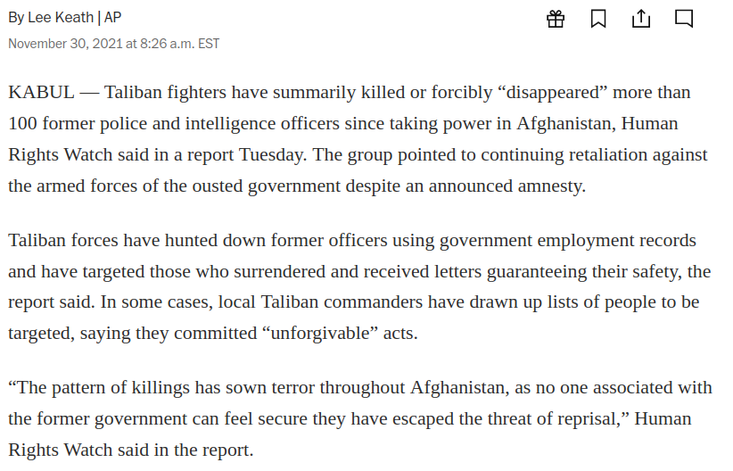
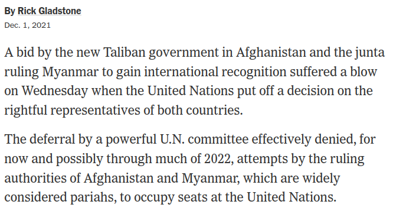
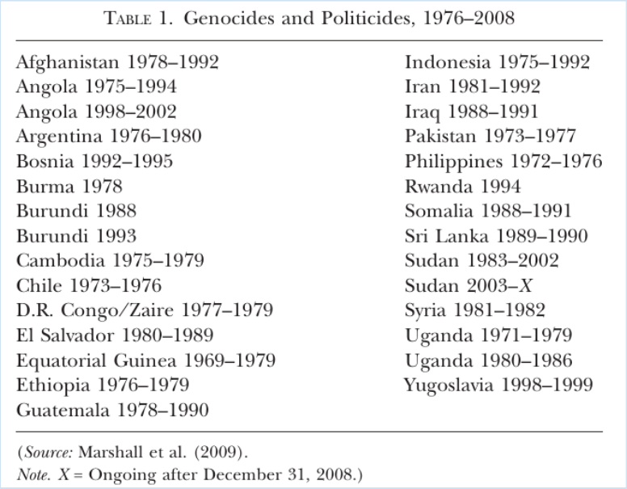
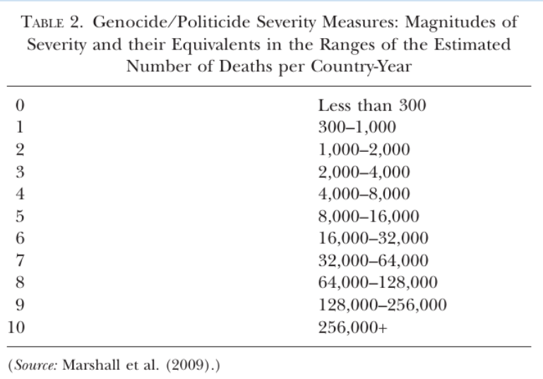
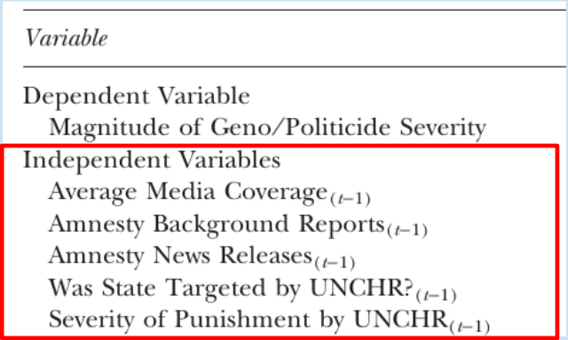
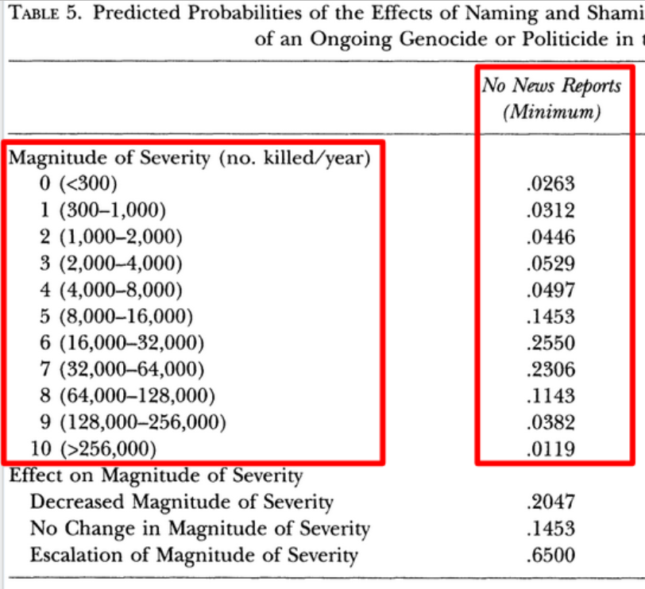

---
output:
  xaringan::moon_reader:
    css: ["default", "extra.css"]
    lib_dir: libs
    seal: false
    nature:
      highlightStyle: github
      highlightLines: true
      countIncrementalSlides: false
      ratio: '16:9'
---

```{r, echo = FALSE, warning = FALSE, message = FALSE}
##xaringan::inf_mr()
## For offline work: https://bookdown.org/yihui/rmarkdown/some-tips.html#working-offline
## Images not appearing? Put images folder inside the libs folder as that is the main data directory

library(tidyverse)
library(readxl)
library(stargazer)
##library(kableExtra)
##library(modelr)

knitr::opts_chunk$set(echo = FALSE,
                      eval = TRUE,
                      error = FALSE,
                      message = FALSE,
                      warning = FALSE,
                      comment = NA)
```

class: slideblue

.size70[**Today's Agenda**]

<br>

.size40[

Krain, M. (2012). J’accuse! Does Naming and Shaming Perpetrators Reduce the Severity of Genocides or Politicides? *International Studies Quarterly*. 56(3), 574–589.

+ Critically analyze the conclusions

]

<br>
<br>

.center[.size40[
  Justin Leinaweaver (Spring 2022)
]]

???

## Prep for Class
1. Google shared document for collecting citations
- ?

2. Email link to class (at end of class)

<br>

ANYTHING INTERESTING GOING ON IN WORLD POLITICS AT THE MOMENT?

<br>

EVERYBODY HAVE THE READINGS FOR TODAY?


---

background-image: url('libs/Images/15_3-Post_Article.png')
background-size: 40%
background-position: left
class: middle, slideblue

.right-column[

```{r, fig.retina=3, fig.align='right', out.width='80%'}

```
]

???

A highly relevant article in the Washington Post this week.

DID ANYBODY SEE THIS?

OUT OF CURIOSITY, AND RELEVANT TO THE KRAIN ARTICLE, DO WE COUNT THIS NEWSPAPER REPORT AS A "WIN" FOR HUMAN RIGHTS WATCH? WHY OR WHY NOT?

*DISCUSS*


---

background-image: url('libs/Images/15_3-NYT_UN.png')
background-size: 40%
background-position: left
class: middle, slideblue

.right-column[

```{r, fig.retina=3, fig.align='right', out.width='80%'}

```
]

???

Well, let's now consider this in the context of a different news item from this week.

DID ANYBODY SEE THIS?

ONE HELL OF A COINCIDENCE, NO?

<br>

WHAT EVIDENCE WOULD YOU NEED TO SEE TO CONVINCE YOU THAT THESE TWO EVENTS ARE CONNECTED?

- THAT HUMAN RIGHTS WATCH SUCCEEDED IN STOPPING THE UN FROM RECOGNIZING THE TALIBAN?

*DISCUSS*

<br>

This week we've been exploring research by Matt Krain (2012).

WHAT IS THE RESEARCH QUESTION IN THE PAPER?
(Does "naming and shaming" reduce the severity of genocide and politicides?)

AND WHAT'S THE DIFFERENCE BETWEEN GENOCIDE AND POLITICIDE?
(Both are mass killings, one targeting a "communal" group, the other political enemies)


---

class: middle, slideblue

.size30[**Interests**
+ Leaders of states care about their reputations and legitimacy
+ NGOs / IOs want less genocide / politicide
]

.size30[**Institutions**
+ Global norm: Genocide / Politicide is not legitimate
]

.size30[**Interactions**, Naming and Shaming (N&S):

+ Exposes the crimes (public not private)
+ Raises the profile of the crimes (global not domestic)
+ May change perpetrators' self-perceptions
+ Activates bystanders
+ Encourages state sanctions
+ May cost the perpetrator state access to aid or trade
]

???

Here are the interests, institutions and interactions we identified on Wednesday.

HOW CONVINCING DO YOU FIND THESE MECHANISMS IN TERMS OF THEIR LOGIC?

- ARE THEY SUFFICIENTLY CLEAR?

- DO THEY CONNECT SUFFICIENTLY TO THE DECISION-MAKING OF THE BAD LEADER?

<br>

REMIND ME ALSO, HOW DOES THIS REPRESENT A TEST OF THE CONSTRUCTIVIST MODEL OF POLITICS?
(1. The power of discourse!)
AND
(2. The importance of identity and your inability to control how others assign that identity to you)

<br>

OK, WHAT ARE THE BIG CONCLUSIONS RAISED AT THE END OF THIS PAPER?


---

class: middle, slideblue

.size40[**Argument: Based on the data and methods used here do we have .textred[high, low or no] confidence in each of these conclusions?**

"The results suggest that naming and shaming by...

1. NGOs
2. the Northern media
3. IOs

...all have significant ameliorative effects on the severity of the most extreme atrocities" (14).
]

???

We'll need to keep in mind that the answers to this question about our confidence may depend on which of the mechanisms we are focused on.

We may find that the argument about NGOs, the media or IOs is more convincing than the others.

<br>

Let's evaluate these three conclusions split out into groups.

** Split class into three groups, one per conclusion **


---

class: slideblue

.left-column[
.size50[
**.textblack[Krain (2012)]**

**.textblack[Cases]**
]]

.right-column[

```{r, fig.retina=3, fig.align='center', out.width='80%'}

```

.size40[.center[**Focus on footnote 7 (p578)**]]

]


???

Let's start by trying to understand the case selection in the paper.

HOW DID KRAIN SELECT HIS CASES TO STUDY?

- WHAT DOES "ONGOING" MEAN IN FOOTNOTE 7?

* Report Back *

<br>

I think: "Ongoing" implies ignoring cases that wrapped up in less than a year.

- Makes sense if data analysis is year to year change BUT

- What is the effect on our confidence of eliminating short genocides?

- Long genocides likely to invoke many, many different interests and pressures. Hard to isolate a press release, no?

<br>

ASSUMING IT IS THE RIGHT LIST, ARE WE CONFIDENT THE TABLE 1 LIST PRESENTS AN EQUAL TEST OF THE MEDIA, AI AND THE UNCHR?

(Media: Big variation in attention paid by "northern" media to different countries around the world, right?)

- Selection bias...


---

class: slideblue

.left-column[
.size50[
**.textblack[Krain (2012)]**

**.textblack[Outcome]**
]]

.right-column[

```{r, fig.retina=3, fig.align='center', out.width='92%'}

```

]

???

Groups, now evaluate the measurement used for the outcome variable as it impacts our level of confidence in the three conclusions.

* Report Back *

<br>

This is the variation the paper aims to explain.

LET'S GET IT OUT OF THE WAY FIRST, WHY NOT JUST USE THE ACTUAL NUMBERS?
(We simply don't know that precisely.)
- Great uncertainty at the super-specific level

<br>

OK, GROUPS, HOW DOES THE OPERATIONALIZATION AND MEASUREMENT OF THE OUTCOME VARIABLE IMPACT YOUR LEVEL OF CONFIDENCE IN THE CONCLUSION?

(Problems identified:)

1. Takes way more killings to move to the highest levels than to move across the low levels. Intervals not consistent.

2. If not per capita (and Pakistan / Indonesia have way bigger populations) than this might not be an equal test across the cases.
- Small number of deaths in a huge vs small state carries different seriousness, no?

<br>

DO THESE SPECIFIC GROUPING CHOICES MAKE IT HARDER TO IDENTIFY SMALL, BUT MEANINGFUL, EFFECTS?
- TO THE DISADVANTAGE OF ONE OF OUR ACTORS MORE THAN THE OTHERS?


---

class: slideblue, middle

.left-column[
.size50[
**.textblack[Krain (2012)]**

**.textblack[Predictors]**
]]

.right-column[

```{r, fig.align='center', out.width='80%'}

```

]

???

OK, GROUPS, SAME QUESTION APPLIED TO THE OPERATIONALIZATION AND MEASUREMENT OF THE KEY PREDICTOR VARIABLES.

NGO: Amnesty International

IO: UN CHR

Media: Economist and Newsweek

* Report Back *

Focus on the predictors related to your group!

- STRENGTHS AND WEAKNESSES HERE?


---

background-image: url('libs/Images/15_3-Appendix.png')
background-size: 100%
background-position: center

???

As we've noted before, the descriptive statistics in the appendix are a useful way to think about how the world looks in this analysis.

DOES EVERYBODY REMEMBER WHAT THE "MEAN" TELLS YOU?

WHAT ABOUT THE MINIMUM AND MAXIMUM?

BASED ON THE DESCRIPTIVE STATISTICS, TELL ME ABOUT HOW THE WORLD LOOKS IN THIS SAMPLE.

- HOW BRUTAL IS THE AVERAGE ABUSE? 

- HOW MUCH MEDIA COVERAGE? (Super low, .67 articles in a given 12 months)

- HOW MANY AI REPORTS GET RELEASED ON AVERAGE? (6.49)

- WHAT PROPORTION OF CASES ARE TARGETED BY THE UNCHR? (55% Politics in all things)

- WHAT PROPORTION OF CASES ARE DURING THE COLD WAR? (79%)

- TELL ME ABOUT THE BREAKDOWN OF INTERVENTIONS: PRO-PERPETRATOR VS ANTI-PERPETRATOR VS IMPARTIAL. DOES THIS MAKE SENSE? (53% Pro perpetrator!)

- ETC.

<br>

DOES THIS TELL US ANYTHING ABOUT WHAT LIFE IS LIKE IN MOST DICTATORSHIPS? WHY OR WHY NOT?


---

background-image: url('libs/Images/15_3-Regressions1.png')
background-size: 100%
background-position: center

.size50[.center[**Regression Results**]]

???

OK, GROUPS, HOW DO THE REGRESSION RESULTS IN TABLES 3 AND 4 IMPACT YOUR LEVEL OF CONFIDENCE IN THE CONCLUSION?

<br>

ANY SENSE OF WHY THE AMNESTY INTERNATIONAL PRESS RELEAEASES WOULD HAVE LESS IMPACT THAN THE COUNTRY BACKGROUND REPORTS?


---

background-image: url('libs/Images/15_3-regression2.png')
background-size: 95%
background-position: center

???

ARE WE CONVINCED EACH OF THESE CONTROL VARIABLES IS AN IMPORTANT CONFOUNDER IN THESE RELATIONSHIPS?

Remember, a confounder means this control variable influences both the predictor AND the outcome of interest.


---

background-image: url('libs/Images/15_3-Table5.png')
background-size: 100%
background-position: center

???

This just leaves us with a question of how sizable the impacts of naming and shaming are according to this model of international politics.

Tables 5, 6 and 8 give us one way of estimating the size of these effects.

Let's examine Table 5 together.

This focuses on naming and shaming efforts by media.

The columns represent different levels of media attention: no attention, average attention, 1 SD above average and the maximum level of observed attention.

The rows represent the number of people killed the next year after this naming and shaming has occurred.


---

.pull-left[

<br>

```{r, fig.retina=3, fig.align='center', out.width='100%'}

```

]

.pull-right[
```{r, fig.retina=3, fig.align='center', out.width='100%', fig.width=5, fig.height=6}
# Input the data from Table 5
mags1 <- c("<300", "300-1k", "1k-2k", "2k-4k", "4k-8k", "8k-16k", "16k-32k", "32k-64k", "64k-128k", "128k-256k", ">256k")

# Actual table
d <- tibble(
  Magnitude = 0:10,
  Magnitude_txt = factor(x = mags1, levels = mags1),
  News_Reports_0 = c(.03,.03,.04,.05,.05,.15,.26,.23,.11,.04,.01),
  News_Reports_12 = c(.67,.15,.07,.04,.02,.02,.02,.01,.002,.0005,.0002),
  one_column_var = 1
)

# long version of the data
d2 <- d %>%
  pivot_longer(cols = News_Reports_0:News_Reports_12, names_to = "Reports", values_to = "Value")

# Visualize the no news reports alone
# bar plot needs to reverse order to match rows in Table 5
d %>%
  ggplot(aes(x = Magnitude_txt, y = News_Reports_0)) +
  geom_col() +
  coord_flip() +
  labs(x = "", y = "", title = "Magnitude of Severity (# Killed, No News)") +
  theme_minimal() +
  scale_y_continuous(labels = scales::percent_format(accuracy = 1), breaks = seq(0, .3, .1)) +
  scale_x_discrete(limits = rev(mags1))
```
]

???

Let's zoom in here on just the first column.

These numbers estimate the number of people killed in a state committing human rights violations and receiving no media attention.

The values are proportions that run from 0 to 1, or 0% to 100%.

This bar plot helps us visualize the data.

If you add all these proportions together you get 100%

DOES EVERYBODY UNDERSTAND THE NUMBERS IN THE RED BOX AND HOW THOSE NUMBERS BECOME THE BAR PLOT ON THE SIDE?

<br>

SO, WHAT DO WE LEARN FROM THIS COLUMN OF %'s?

- IN OTHER WORDS, IF THE MEDIA IGNORES AN ONGOING GENOCIDE / POLITICIDE WHAT IS THE LIKELY NUMBER OF DEATHS NEXT YEAR?

(Most likely, e.g. the three biggest proportions, is between 8k and 64k deaths!)

Does everybody see the bulk of this distribution on the medium to high end of the spectrum.

<br>

SO, BASED ON THIS MODEL OF SIMULATED OUTCOMES HOW SERIOUS IS ANY ONGOING GENOCIDE OR POLITICDE LIKELY TO BE?

(90% of ignored cases will result in more than 2k dead)

(75% of ignored cases will see more than 8k killed)

(Apprx 40% of ignored cases will see more than 32k killed)

DOES THAT MAKE SENSE?

<br>

This model indicates that countries experiencing any degree of genocide or politicide are likely to spiral very rapidly.


---

background-image: url('libs/Images/15_3-Table5_news.png')
background-size: 100%
background-position: center

???

SO, WHAT HAPPENS WHEN WE MOVE FROM ZERO MEDIA ATTENTION TO THE MAXIMUM LEVEL OBSERVED (12 REPORTS)?


---

```{r, fig.retina=3, fig.align='center', out.width='100%', fig.height=4}
# Visualize both
# histograms
d2 %>%
  mutate(
    Reports = if_else(Reports == "News_Reports_0", "No News Reports", "Twelve News Reports")
  ) %>%
  ggplot(aes(x = Magnitude_txt, y = Value)) +
  geom_col() +
  facet_wrap(~ Reports) +
  coord_flip() +
  labs(x = "", y = "", title = "Magnitude of Severity (# Killed)") +
  theme_minimal() +
  scale_y_continuous(labels = scales::percent_format(accuracy = 1), breaks = seq(0, .6, .2))
```

???

NOTE! I've reversed the y-axis to make this more logical.

Moving up the y-axis should mean more killings, not less.

<br>

A striking result!

Increases in the number of media reports pushes the cases to the lower ends of the scale in some sizable ways.

In the "no news reports" cases, most observations between 8k and 64k killed per year.
- That's an obscene number of deaths.

Shift to the maximum (12 reports) and now 67% of cases below 300 deaths!

So many lives apparently saved.

<br>

Now, the minimum to the maximum is probably not the effect we are most interested in.

It would be hard for an individual or group to convince the entire media to focus on one thing in one way.

However, increasing from one story (the mean) to two stories (mean + 1 sd) might be doable.


---

background-image: url('libs/Images/15_3-Table5-news2.png')
background-size: 100%
background-position: center

???

DOES EVERYBODY UNDERSTAND HOW TO READ THIS TABLE OF PERCENTAGES?

WHAT IS THE SIMULATED EFFECT OF THIS SMALLER, BUT MORE REALISTIC, SHIFT?


---

```{r, fig.retina=3, fig.align='center', out.width='100%', fig.height=4}
## Table 5 but use mean and mean + 1 sd
# Actual table
d3 <- tibble(
  Magnitude = 0:10,
  Magnitude_txt = factor(x = mags1, levels = mags1),
  News_Reports_1 = c(.04,.04,.06,.07,.06,.17,.25,.19,.09,.03,.01),
  News_Reports_2 = c(.05,.06,.08,.08,.07,.18,.23,.15,.06,.02,.01),
  one_column_var = 1
)

# long version of the data
d4 <- d3 %>%
  pivot_longer(cols = News_Reports_1:News_Reports_2, names_to = "Reports", values_to = "Value")

# histograms
d4 %>%
  mutate(
    Reports = if_else(Reports == "News_Reports_1", "One News Report", "Two News Reports")
  ) %>%
  ggplot(aes(x = Magnitude_txt, y = Value)) +
  geom_col() +
  facet_wrap(~ Reports) +
  coord_flip() +
  labs(x = "", y = "", title = "Magnitude of Severity (# Killed)") +
  theme_minimal() +
  scale_y_continuous(labels = scales::percent_format(accuracy = 1), breaks = seq(0, .25, .05))
```

???

A small shift but hard to see this way.


---

```{r, fig.retina=3, fig.align='center', out.width='100%', fig.height=4}
# side-by-side bars
d4 %>%
  mutate(
    Reports = if_else(Reports == "News_Reports_1", "One News Report", "Two News Reports")
  ) %>%
  ggplot(aes(x = Magnitude_txt, y = Value, fill = Reports)) +
  geom_col(position = "dodge") +
  coord_flip() +
  labs(x = "", y = "", title = "Magnitude of Severity (# Killed)") +
  theme_minimal() +
  scale_y_continuous(labels = scales::percent_format(accuracy = 1), breaks = seq(0, .25, .05)) +
  scale_fill_viridis_d(end = .6)
```

???

Better, right?

SO, ACCORDING TO THIS MODEL HOW POWERFUL IS MEDIA ATTENTION FOR STOPPING HUMAN RIGHTS VIOLATORS?


---

background-image: url('libs/Images/15_3-Table6.png')
background-size: 100%
background-position: center

???

Table 6 focuses on the effect of Amnesty International reports.

HOW BIG IS THE EFFECT OF AMNESTY REPORTS ACCORDING TO TABLE 6?
(- Not as big as media at the extremes but slightly bigger in the middle changes)

HOW CONFIDENT SHOULD WE BE IN THESE RESULTS?


---

background-image: url('libs/Images/15_3-Table8.png')
background-size: 100%
background-position: center

???

HOW BIG IS THE EFFECT OF THE UN HUMAN RIGHTS COUNCIL'S ATTENTION AND TARGETING ACCORDING TO TABLE 8?
(Exists but isn't huge.)

HOW CONFIDENT SHOULD WE BE IN THESE RESULTS?


---

class: slideblue

.size40[**Argument: Based on the data and methods used here do we have .textred[high, low or no] confidence in each of these conclusions?**]

.size40[

"The results suggest that naming and shaming by...

1. NGOs
2. the Northern media
3. IOs

...all have significant ameliorative effects on the severity of the most extreme atrocities" (14).
]

???

OK, BOTTOM LINE TIME, HOW CONFIDENT ARE WE IN KRAIN'S CONCLUSIONS?

<br>

DOES THIS RESEARCH MAKE YOU MORE OR LESS SUPPPORTIVE OF THE WORK OF GROUPS LIKE HUMAN RIGHTS WATCH AND AMNESTY INTERNATIONAL?

<br>

WOULD YOU BE WILLING TO SEND THEM MONEY OR SUPPORT THEIR WORK IN OTHER WAYS BASED ON THIS?
- WHY OR WHY NOT?


---

background-image: url('libs/Images/12-2-feminist_revolution.png')
background-size: 92%
background-position: center

???

Over the next two weeks we'll be exploring some new territory for me.

A number of critical theories of international relations are doing some incredibly interesting work and I'd like to start exploring them.

Next week we explore feminist IR which can be oversimplified to mean the interaction of gender and international politics.

Although, as we'll see, it is so much more than that.

The week after we'll do the same with race.

I am not an expert in either subject and am really looking forward to our readings and discussions.

