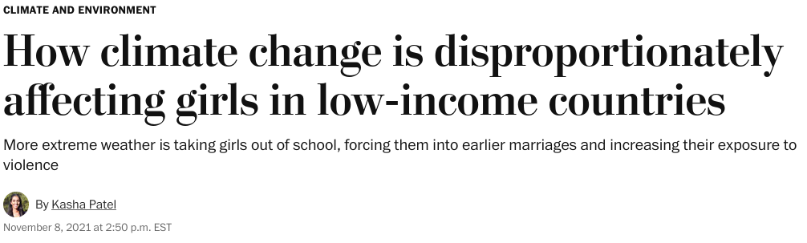

## Today's Agenda {background-image="Images/background-worldmap4.png" .center}

```{r}
# background-size="1920px 1080px"
library(tidyverse)
library(readxl)
library(kableExtra)
```

<br>

**IV. What is the Future of Transnational Politics and IR?**

- Explore the intersection of gender and International Relations

<br>

<br>

::: r-stack
Justin Leinaweaver (Spring 2025)
:::

::: notes
Prep for Class

1. Review cases submitted to Canvas

2. Your Case: Patel, Kasha. (2021, Nov 8). How climate change is disproportionately affecting girls in low-income countries. *The Washington Post*. [LINK](https://www.washingtonpost.com/weather/2021/11/08/cop26-girls-education-climate-weather/)

<br>

Over time a series of "critical" approaches to International Relations have developed and I'd like us to explore one of them this week.

- Specifically, this week we explore international political events using a Feminist approach to international relations
:::


## Assignment for Today  {background-image="Images/background-worldmap4.png" .center}

<br>

1. Find a current, or recent, international political event that **explicitly deals with issues of gender**

2. **Before class** submit to our Canvas discussion board: 
    - The APA citation for your evidence, and
    
    - A short explanation for why this case illustrates a gender issue in international politics

::: notes
Before we dig into the approach I'd like us to build up to it starting with case studies.

- I think it's incredibly useful to begin discussions like this from a real-world perspective.

- If we can identify a type of real-world case that our current theories fail to explain well then that will help us understand what a new theory needs to do to be useful.

<br>

For today I asked each of you to go find us a real-world case that includes an important gender dynamic.

- I meant this to be very broad, so I'm super curious to see what you brought in.

<br>

**SLIDE**: I did the exercise too, so let's kick this off with my case!
:::


## {background-image="Images/13_1-gender_climate.avif"}

{.absolute left=0 width="5.3in" height="1.5in"}

::: notes
As you may or may not know, my research tends to focus on international problem-solving using policy

- I'm fascinated by instances of the global community trying to solve a massive problem simultaneously at the domestic and international levels.

<br>

One particular policy challenge I have been studying for a long time is the disproportionate impacts of climate and weather catastrophes

- In short, what should we do when countries experience disasters not of their own making?

<br>

**SLIDE**: And that led me to this story

:::


## {background-image="Images/background-worldmap4.png" .center}

```{r, fig.align='center'}

```

<br>

1. What is the "event"?

2. Why "international"?

3. Why "political"?

4. What is the role of "gender" in this event?

::: notes
What is the event?

- In the build-up to the 26th Conference of the Parties to the UN Framework Convention on Climate Change a weather disaster struck Malawi

- Specifically, as the climate change conference was beginning a storm in Malawi destroyed the schools in a number of villages

<br>

Why is this international?

- Extreme weather events made worse/more likely by climate change are increasing around the world.

- Many of the poorest countries who contributed almost nothing to the problem are being hit the hardest.

- So, poor countries are being made to pay dearly for the behavior of people in other countries

<br>
    
Why is this political?

- Countries with limited resources have to make VERY difficult decisions about where to spend to prevent this damage and where to spend to fix the damage

<br>    
4. Why is gender important here?

- Per UNESCO, Malawi currently enrolls approximately 37% of eligible students in secondary school (US is basically 100%) and to maintain that rate they estimate a need for 30,000 more classrooms.

- This is BEFORE dealing with the current storm damage.

- In developing countries like Malawi when serious storm damages occur girls are often kept home to save money for food, are expected to work in the fields or by gathering water from long distances or are married off to older men. 
    
<br>
    
So, bottom line, "bad" behavior by other countries creates damage for the developing world and those damages appear to disproportionately harm women and girls.

- **Does this case make sense?**
:::


## Gender Case Studies {background-image="Images/background-worldmap4.png" .center}

::: {.r-fit-text}

1. What is the "event"?

2. Why is it "international"?

3. Why is it "political"?

4. What is the role of "gender" in this event?

:::

::: notes

Ok, I want each of you to introduce your case to us by answering these four questions.

- Take a few minutes to get ready to present your cases.

<br>

Alright, let's hear the cases.

- **After we hear each case, give me takeaways or lessons for the board!**

- *PRESENT and DISCUSS each*

<br>

(4/17/23)

- TBD

(4/20/22)

- Inequality is structural and deep rooted
- Women as asylum seekers more vulnerable
- Policy responds more to men than women
- Women under-represented in gov't around the world
- Only 6/27 leaders of EU countries are female (were female?)
- Recruitment by political parties shows gender biases

<br>

**SLIDE**: The question is, are our current theories of IR missing these important dynamics or not?
:::


## Gender Case Studies {background-image="Images/background-worldmap4.png" .center}

:::: {.columns}
::: {.column width="50%"}
```{r, fig.align='center', out.width='80%'}
knitr::include_graphics("Images/02_2-drury_map.jpg")
```
:::

::: {.column width="50%"}
**Scientific models are:**

+ Neither true nor false

+ Limited in their accuracy

+ Partial representations

+ Useful for only some uses

+ A reflection of the interests of the designer
:::
::::

::: notes

To refresh our memories!
- Scientific models are, by definition, limited representations of reality!
- And, they reflect the interests of their designers.

<br>

We have to acknowledge that none of the theories we have studied this term were designed expressly to center gender dynamics in our explanations.

<br>

**SLIDE**: The question is, even without making this dynamic central to their "maps" can they still usefully explain today's international political events?
:::


## Theories of International Relations (so far) {background-image="Images/background-worldmap4.png" .center}

+ Neorealism

+ Offensive Realism

+ Bargaining Model of War

+ Liberal Institutionalism

+ Economic Liberalism

+ Two-Level Games

+ Constructivism

::: notes

Here is an abbreviated list of the models we've explored in class so far.

- Each is a purpose-built "map" of international political events

- None are "true" or "false" but each was designed to be useful!

<br>

### Any questions on these models or how we mapped each as a function of interests, institutions and interactions?

<br>

Make sure you have this list written down!

- It may prove useful in the near future...

- *final exam hint...*
:::


## Can these models of IR be used to "accurately" explain our cases from today? {background-image="Images/background-worldmap4.png" .center}

+ Neorealism

+ Offensive Realism

+ Bargaining Model of War

+ Liberal Institutionalism

+ Economic Liberalism

+ Two-Level Games

+ Constructivism

::: notes

*Encourage debate*

- Strongest reasons why?

- Strongest reasons why not?
:::


## How difficult would it be to add a gender dynamic to these theories? {background-image="Images/background-worldmap4.png" .center}

+ Neorealism

+ Offensive Realism

+ Bargaining Model of War

+ Liberal Institutionalism

+ Economic Liberalism

+ Two-Level Games

+ Constructivism

::: notes

*Discuss*

<br>

### Is this an explicit argument in favor of Constructivism? Why or why not?

<br>

**SLIDE**: All that said, gender may be so central to the experience of human societies that we have no choice but to redesign our theories of IR.
:::


## Assignment for Next Class  {background-image="Images/background-worldmap4.png" .center}

<br>

1. Read Enloe (2014)

2. **Before class** submit to our Canvas discussion board: 
    - What are the strongest critiques of international relations made by Enloe (2014)?

::: notes

For Wednesday I want you to read the first chapter of an intriguing book by Cynthia Enloe that explores the arguments we have begun today.

<br>

In short, the question for you as you do the reading is, in order for us to be better students of global politics:

- How should we approach gender dynamics?

- Do our theories need to change?

- Does our media coverage of global politics need to change?

<br>

### Questions on the assignment?
:::
