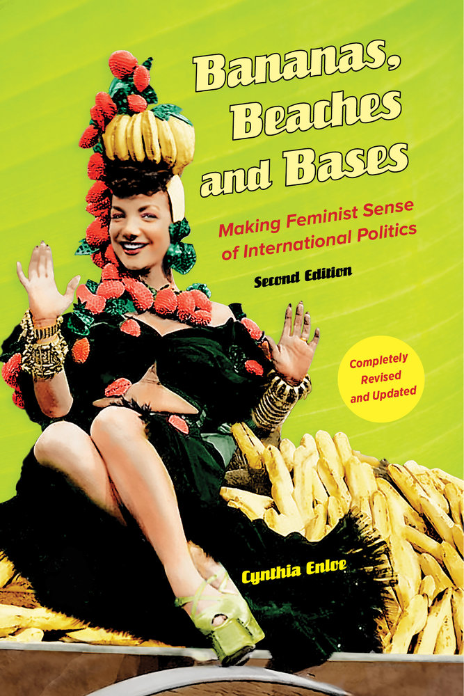
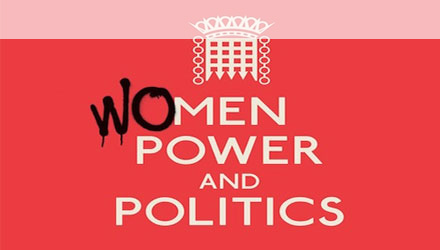
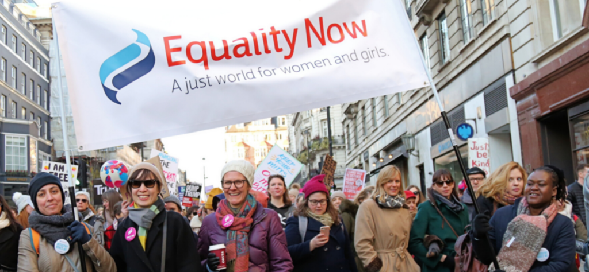
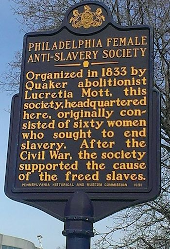
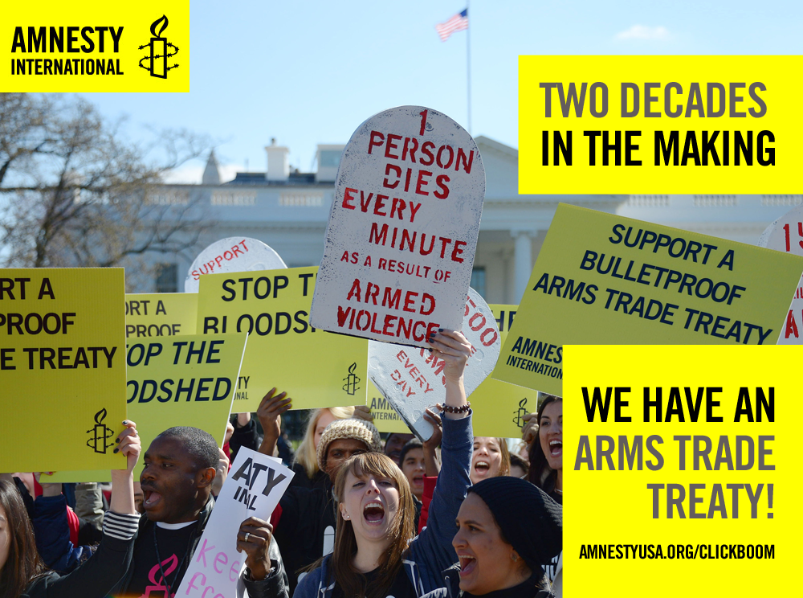

## Today's Agenda {background-image="Images/background-worldmap4.png" .center}

```{r}
# background-size="1920px 1080px"
library(tidyverse)
library(readxl)
library(kableExtra)
```

<br>

::: {.r-fit-text}

**IV. What is the Future of Transnational Politics and IR?**

- Critical Theories of IR: Feminist Approaches

:::

<br>

::: r-stack
Justin Leinaweaver (Spring 2025)
:::

::: notes
Prep for Class

1. Review Canvas submissions

2. Make sure you have dry eraser markers for five groups

3. Move through the set-up slides promptly, get those groups to work!
:::


## {background-image="Images/background-worldmap4.png" .center}

::: {.r-fit-text}
**Theories of International Relations (so far)**
:::

+ Neorealism

+ Offensive Realism

+ Bargaining Model of War

+ Liberal Institutionalism

+ Economic Liberalism

+ Two-Level Games

+ Constructivism

::: notes
To refresh, on Monday you each brought in a case study meant to highlight some aspect of the intersection between gender and international political events.

- We used those cases to re-evaluate the theories of IR we have been studying this semester.

- In short we asked, does IR have a blind spot for gender issues in international political events?
:::


## {background-image="Images/13-1-World_Map_Old.jpg"}

::: notes
Important to that discussion and where we need to go today we must keep a clear definition of "theory" in mind.

### Remind me, what is true about every map (and scientific model) you've ever encountered?
- Neither true nor false
- Limited in their accuracy
- Partial representations
- Useful for only some uses
- A reflection of the interests of the designer

<br>

### So, if all maps are, by definition, "false," why can't we just pick the one we like the best and drop the rest?

- (**SLIDE**: Maps/Models are purpose-built!)
:::


## {background-image="Images/13-1-weather_map.webp"}

::: notes
Key for us is to remember that maps are purpose-built

- They are useful for helping us understand something specific about the world.

<br>

This is a pretty darn good map for answering the question, where is it currently raining or snowing.

<br>

However, a terrible map for driving across town or finding a dentist.
:::


## {background-image="Images/13-1-topo-map.jpg"}

::: notes
Here is a very handy topographical map for the next time you go for a hike!

<br>

However, utterly useless for driving directions to the trail, weather to expect, or the location of nice spots for lunch.
:::


## {background-image="Images/13-1-us_map_population.jpg"}

::: notes
Finally, here's a map of the US states resized by population.

- Please don't use this for driving directions...

<br>

This map is a useful way to think about population density in the US, and

- A damning indictment of the apportionment rules in the Senate.

<br>

Bottom line, the usefulness of a map depends on what you are trying to do or explain in a given moment.

<br>

**SLIDE**: Ok, why the long preamble before we get to work?
:::


## "Gender Makes the World Go Round: Where are the women?" {background-image="Images/background-worldmap4.png" .center}

<br>

```{r, fig.align='center'}

```

::: notes
Today we continue our exploration of gender and international relations using the first chapter in Cynthia Enloe's book, *Bananas, Beaches and Bases: Making Feminist Sense of International Politics*

- Dr. Enloe uses this book to make a series of compelling arguments about how our current models fail or miss important elements in international politics.

<br>

For class today I asked each of you to highlight the strongest critiques of IR made in the chapter.

- Everybody take a few minutes to review the submissions on Canvas.

- Use this as a chance to refresh your memory on the chapter and see where people are leaning.

<br>

**SLIDE**: Let's now make sure we are grappling with the arguments in the chapter!

<br>

### Notes from first part of chapter
- Making feminist sense of international politics takes curiosity and imagination. It requires us to make a serious effort to view the world through the eyes of diverse women in spheres typically considered "private", "domestic", "local" or "trivial" (p3)
- Example: Feminist scholars have learned much about the "behind the curtain" workings of foreign policy making by studying and taking seriously the role of the women working as secretaries in foreign affairs ministries. "Devoting attention to women who are government secretaries, for instance, exposes the far-reaching political consequences of feminized loyalty, feminized record -keeping, feminized routine, masculinized status, and masculinized control" (4).
- What do we mean by "gendered causes and consequences"? Examples as thought experiment (p6-7): the woman tourist and the chambermaid, the schoolteacher and her students, the film star, her studio owners, the banana company executives, ...
- "If one fails to pay close attention to women--all sorts of women--one will miss who wields power and for what ends" (9).
- The international political impacts of marriage example is super fascinating (to me at least)
- Is it possible feminist IR theory takes power more seriously than any of the other standard models (realism included!)? (p10)
- EVERYTHING has been made (e.g. receding glacier, low-cost sweatshirt, heavily weaponized police force, masculinized peace negotiation, the romantic marriage, the all-male Joint Chiefs of Staff) and that means we have to think about: Who made it and how does it sustain or reflect their power?
:::


## "Gender Makes the World Go Round: Where are the women?" {background-image="Images/background-worldmap4.png" .center}

<br>

:::: {.columns}
::: {.column width="30%"}
```{r}

```
:::

::: {.column width="70%"}
1. Where Does Power Operate? (8-13)

2. Who Takes Seriously the Ideas of Transnational Feminists? (13-20)

3. What We Miss: Two Brief Case Studies (21-28)

4. Where Are the Men? (28-32)

5. Beyond the Global Victim (32-36)
:::
::::

::: notes

*Split class into five groups, assign one to each section*

<br>

Groups, diagram the argument in this section

- Work directly on the board.

<br>

1. What is the central conclusion of this section?

    - Please phrase the conclusion as: "IR theory is doing a bad job because..."

2. What are the key premises/evidence underpinning this conclusion?

:::


## Where Does Power Operate? (p8-13) {background-image="Images/background-worldmap4.png" .center}

<br>

```{r, fig.align='center'}

```

::: notes

Group 1 walk us through the argument in: Where Does Power Operate? (8-13)

### What is the central critique of IR theory in this section?
- (IR theories fundamentally misunderstand power!)

<br>

### What are the key premises supporting this conclusion?
- (EVERYTHING has been made (e.g. receding glacier, low-cost sweatshirt, heavily weaponized police force), so who made it and how does it sustain or reflect their power?)

- (There are more types of power and wielders of power than we might have assumed (11))

- (How are some gendered wieldings of power camouflaged so they do not even look like power?)

- (Class SP23: Power depends on how you look)

- (Class SP23: Gendered understanding of marriage)

<br>

### Are you persuaded by it? Do Feminist approaches do a better job modeling power than the realisms? Why or why not?

<br>

### Notes: Where Does Power Operate?
- Feminist gender analysis requires going beyond asking what masculinity and femininity mean to a gendered analysis of power: "What forms does it take? Who wields it? How are some gendered wieldings of power camouflaged so they do not even look like power?" AND "Who gains what from wielding a particular form of gender-infused power? What do challenges to those wieldings of that form of power look like? When do those challenges succeed? When are they stymied?" (8-9)
- "Power, taste, attraction, and desire are not mutually exclusive" (9)
- Corporate execs choose certain logos to appeal to consumer stereotypes of femininity, government officials may market their women's alleged beauty or deferential nature to attract tourism revenue, elected legislators may make some sexual attractions legal and others illegal as it suits them.
- "Power operates across borders" (9) Example of the power dynamics of marriage as both political and international. 
- Who has the power to confer citizenship on outsiders? Are the laws easier to navigate for men bringing women to their countries than for women bringing men into theirs? What about same-sex marriages? All of this is tied up into transnational immigration flows, the provision of state sponsored benefits, colonial rule, new international norms of human rights, transnational religious evangelizing, etc.
- Feminist IR theory's guidance to take seriously women's roles in the world (how did they get where they are and what do they think about it?) forces us to recognize that power operates in way more places / aspects of our lives than we might have realized.
- There are more types of power and wielders of power than we might have assumed (11)
- Too often incurious commentators deny women agency in their own lives and "attribute women's roles in international affairs to tradition, cultural preferences, and timeless norms... What sacrifices a woman as a mother should make, what priorities a woman as a wife should embrace, what sexualized approaches in public a woman should consider innocent or flattering... in reality, all of these are shaped by the exercise of power by people who believe that their own local and international interests depend on women and girls internalizing these particular feminized expectations."
- This is why women's movements around the world (for suffrage, political office, career advancement, etc) are so frequently met with such harsh resistance. The current global system is built on the acceptance of these gendered norms and challenges to them threaten those who benefit from the system currently. (12)
- EVERYTHING has been made (e.g. receding glacier, low-cost sweatshirt, heavily weaponized police force, masculinized peace negotiation, the romantic marriage, the all-male Joint Chiefs of Staff) and that means we have to think about: Who made it and how does it sustain or reflect their power?
:::


## Who Takes Seriously the Ideas of Transnational Feminists? (p13-20) {background-image="Images/background-worldmap4.png" .center}

<br>

```{r, fig.align='center'}

```

::: notes
Group 2 walk us through the argument in: Who Takes Seriously the Ideas of Transnational Feminists? (13-20)

### What is the central critique of IR theory in this section?
- (IR theories have a too narrow understanding of stability, security, etc.)
- (IR theories treat gender-focused groups treated as special interests, NOT representative of the broader body politic)

<br>

### What are the key premises supporting this conclusion?
- (Media: women suffering commented on by men)

- (We fail to appreciate the connections between the public and private spheres)

- (Women's issues often framed as "lost causes" seeking to change things that cannot be changed.)

- (Class SP23: Feminist issues hidden or trivialized by media)

<br>

### Are you persuaded by it? Why or why not?

<br>

### Notes
- Large growth in feminist activists organizing into groups BUT not a monolith. Much debate across groups about most important issues / goals, however, much coordination also

- Why do we not hear the names of these groups or their research product on the nightly news? Power sustaining itself on the back of three arguments: 1) They are "special interests" and not general experts (Messed up because: womens' interests equated to any other special interest like a "logging company" or "soccer club"), 2) These groups focused on the power dynamics and important public dimensions of interests / problems that are typically classified as belonging in the private sphere (Messed up because: our public discussions of security, stability, crisis and development are WAY too narrowly defined and seem to omit the experiences of, and issues important to, women), 3) Women's campaigns are viewed as "lost causes" focused naively on changing things that can never be changed, "masculinized privileges and practices" (Messed up because: This is both ahistorical and insane)

- Media is super guilty of illustrating troubling events with images of suffering women but only interviewing "experts" who are men. Major media conglomerates have come to represent a barrier to any story or movement that doesn't meet their definition of "international", "political" and "significant".

- Women have long had to create their own information dissemination channels in order to get their messages out (suffragists in the early 1900s setting up their own pamphlet printing presses)
:::


## What We Miss: Case Studies (p21-28) {background-image="Images/background-worldmap4.png"}

{.absolute left=0 width=400}

{.absolute right=0 width=550}

::: notes

Group 3 walk us through the arguments in: What We Miss: Two Brief Case Studies (21-28)

### What is the central critique of IR theory in this section?
- (IR theory's lack of gendered lens means we fail to understand many important international political events!)

<br>

### What are the key premises supporting this conclusion?
- (The "big" abolitionst groups that get all the history book space excluded women, so women made their own! And those roots led directly into social pressure for the vote!)

- (We completely miss the internal tensions in these abolitionist groups key to understanding what they do and how)

- (How can we ignore women's roles and power in any course that purports to "make reliable sense of democratization, political mobilization, and international politics?" (22))

- (Arms Treaty: - Women's activists lobbied hard and expertly and ultimately prevailed. Failing to ask, "Where were the women?" would miss this and many other huge elements of the treaty's design and future functioning.)

<br>

### Are you persuaded by it? Why or why not?

<br>

### Notes

What We Miss: Two Brief Case Studies (21-)
First Case: The transatlantic antislavery movement
- While many abolitionist groups already existed at this time, most excluded women in favor of an all male membership.
- Why have the massive contributions of women been omitted from the history of this movement?
1) "...we grossly underestimate how much racialized gendered power it took for proslavery advocates to sustain the slave trade and systems of slave labor for as long as they did." 2) Ignoring the women means underestimating the internal tensions that marked the movement, 3) ignoring the women means missing the roots of the suffrage movement to come.
- How can we ignore women's roles and power in any course that purports to "make reliable sense of democratization, political mobilization, and international politics?" (22)

Second Case: The international Arms Trade Treaty
- Art 7, para 4 includes "gender-based violence" which is a HUGE accomplishment for women's activists and groups like WILPF, IANSA, Women's Network and Global Action to Prevent War and Armed Conflict
- Unlike the other governments and groups lobbying to influence the treaty's terms in broader ways, these groups were bringing the research to bear showing the gendered effects of arms and violence. Interviews with women around the world discussing what guns in the home did to the dynamics of their home life, even when they weren't being used to fire a shot were powerful messages.
- Surprising opposition from the Vatican! It wanted to remove "gender-based violence" and preferred the patriarchal "violence against women and children" as a part of the preamble and not a binding obligation. Their allies were Syria, Iran and North Korea!
- Women's activists lobbied hard and expertly and ultimately prevailed. Failing to ask, "Where were the women?" would miss this and many other huge elements of the treaty's design and future functioning.
:::


## Where Are the Men? (p28-32) {background-image="Images/background-worldmap4.png" .center}

```{r, fig.align='center'}

```

::: notes

Group 4 walk us through the argument in: Where Are the Men? (28-32)

### What is the central critique of IR theory in this section?
- (IR theory fails to understand the agency and roles of men as much as those of women)
<br>

### What are the key premises supporting this conclusion?
- What does masculinity refer to?

- Why does referring to the world as "dangerous" after 9/11 matter? Frames men as protectors, women as needing protection. Defines women's role as "in the home" thus making them non-expert in what is happening "out there." 

- Why did Margaret Thatcher have to be presented as "the toughest man in the room"?

- Why do some men try to weaken others by feminizing them? "Consequently, rival men are prone to try and tar each other with the allegedly damning brush of femininity." Why should that work?

<br>

### Are you persuaded by it? Why or why not?

<br>

### Notes
- In a funny way, we come to better understand politics using a gender lens even when our focus is on the behavior of men!
- What does masculinity refer to?
- Why does referring to the world as "dangerous" after 9/11 matter? Frames men as protectors, women as needing protection. Defines women's role as "in the home" thus making them non-expert in what is happening "out there." 
- Why did Margaret Thatcher have to be presented as "the toughest man in the room"?
- Why do some men try to weaken others by feminizing them? "Consequently, rival men are prone to try and tar each other with the allegedly damning brush of femininity." Why should that work?
:::


## Beyond the Global Victim (p32-36) {background-image="Images/13-1-Times-Square_v2.png"}

::: notes

Group 5 walk us through the argument in: Beyond the Global Victim (p32-36)

### What is the central critique of IR theory in this section?
- (None of us are powerless in international politics!)

<br>

### What are the key premises supporting this conclusion?
- The "women-need-to-learn-more-about-foreign-affairs" perspective is problematic because it keeps women as objects the world is doing things to, not as thinkers and actors actively shaping the world.

- Funnily enough, standard treatments of international politics that present things as hopelessly complicated make us all feel disempowered and helpless!

- We need to "remap the boundaries" of "international" and "political" so that we can see "how one's family dynamics, consumer behaviors, travel choices, relationships with others, and ways of thinking about the world actually help shape that world. We are not just acted upon; we are actors. ... One discovers that one is often complicit in creating the very world that one finds so dismaying." (35)

<br>

### Are you persuaded by it? Why or why not?

<br>

### Notes
- The "women-need-to-learn-more-about-foreign-affairs" perspective is problematic because it keeps women as objects the world is doing things to, not as thinkers and actors actively shaping the world.
- Funnily enough, standard treatments of international politics that present things as hopelessly complicated make us all feel disempowered and helpless!
- We need to "remap the boundaries" of "international" and "political" so that we can see "how one's family dynamics, consumer behaviors, travel choices, relationships with others, and ways of thinking about the world actually help shape that world. We are not just acted upon; we are actors. ... One discovers that one is often complicit in creating the very world that one finds so dismaying." (35)
:::


## Do our models need to change or do we need an entirely new model focused on gender and IR? {background-image="Images/background-worldmap4.png" .center}

+ Neorealism

+ Offensive Realism

+ Bargaining Model of War

+ Liberal Institutionalism

+ Economic Liberalism

+ Two-Level Games

+ Constructivism

::: notes
?
:::


## Assignment for Next Class  {background-image="Images/background-blue_triangles2.png" .center}

<br>

::: {.r-fit-text}
Puechguirbal (2010) on Gender Policy in the UN
:::

::: notes
**Questions on the assignment?**
:::