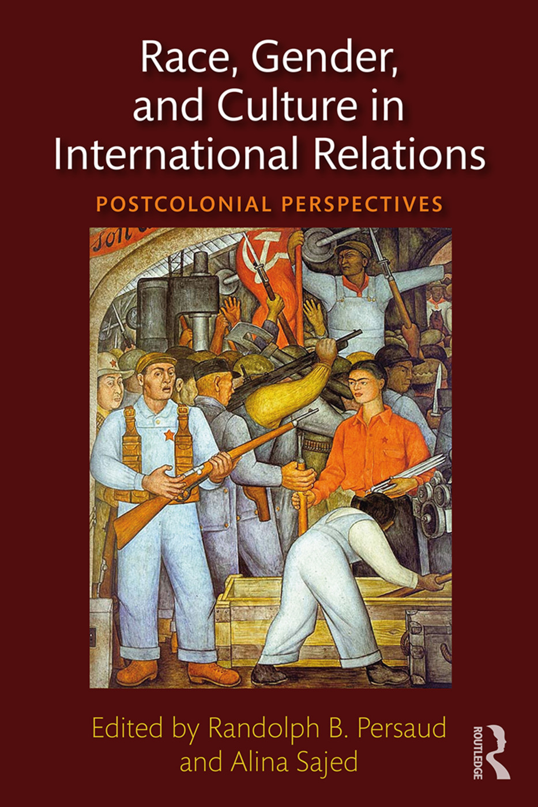
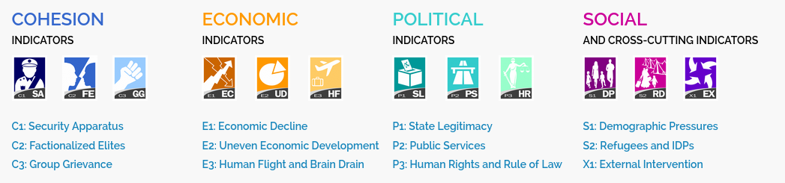
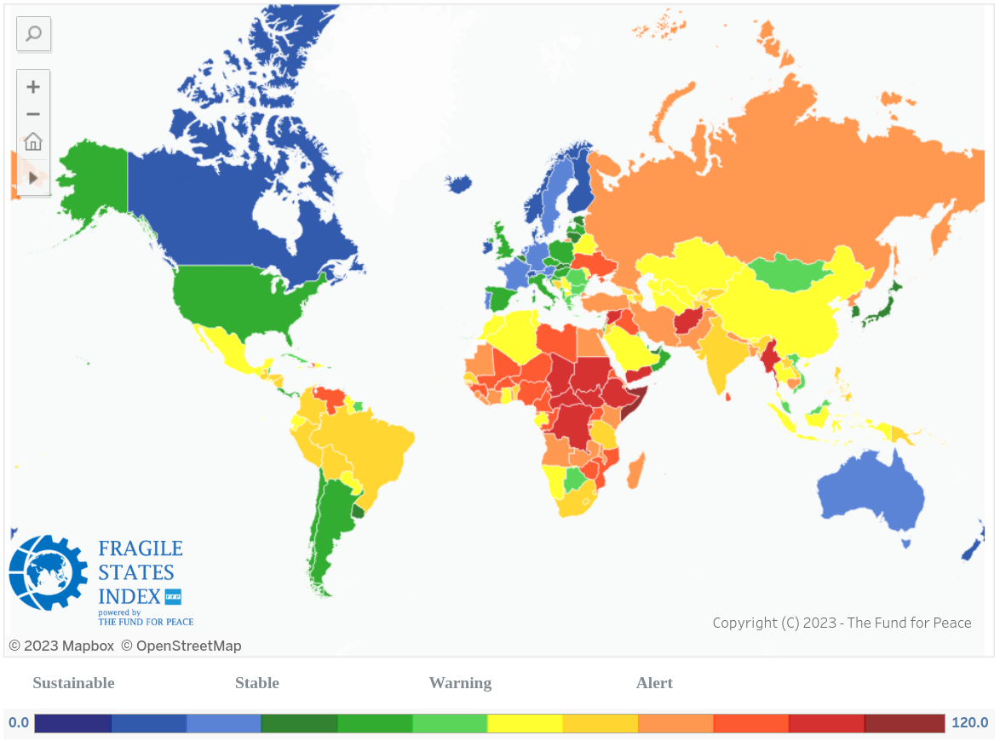
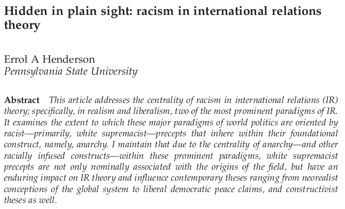
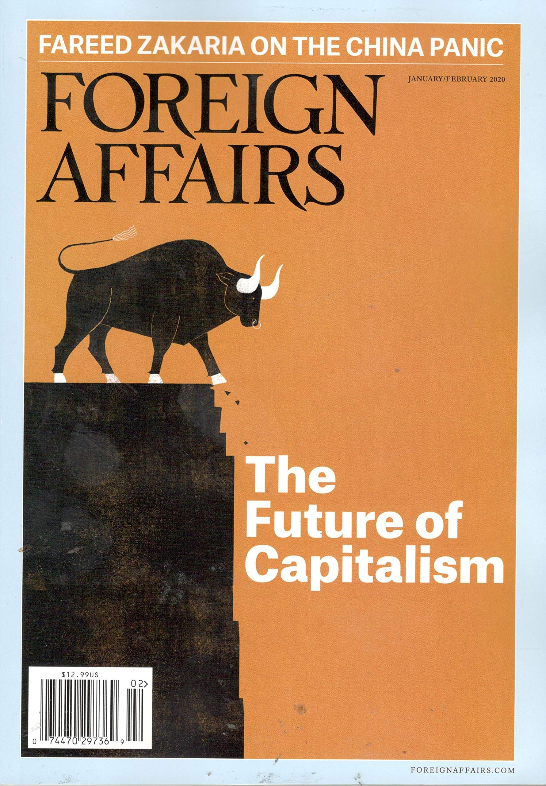
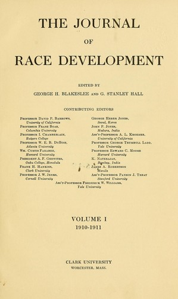
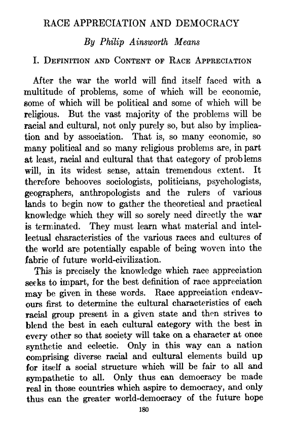
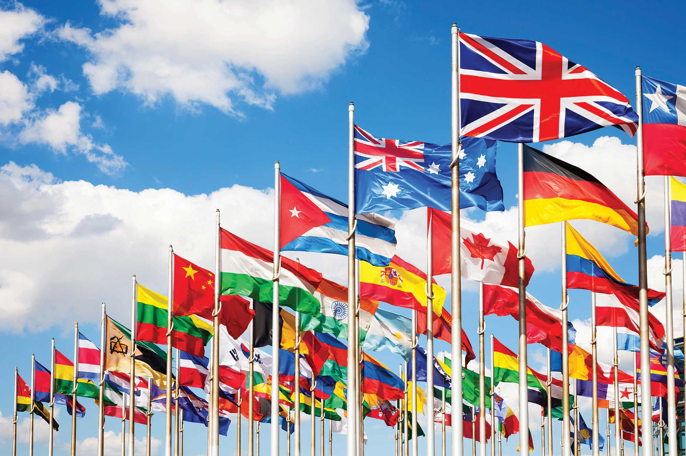
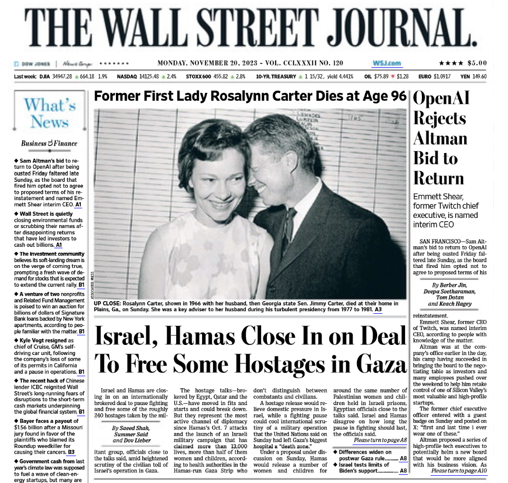

## Today's Agenda {background-image="libs/Images/background-worldmap4.png" .center}

```{r}
# background-size="1920px 1080px"
library(tidyverse)
library(readxl)
library(kableExtra)
```

<br>

::: {.r-fit-text}

**IV. What is the Future of Transnational Politics and IR?**

- Critical Theories of IR: Postcolonialism and Race

:::

<br>

::: r-stack
Justin Leinaweaver (Spring 2024)
:::

::: notes
Prep for Class

1. Update Fragile States index for the USA on slides

2. Review Canvas submissions

3. Put the review case studies slide back if semester had race case studies

<br>

Today I want to briefly introduce you to a second strand of critical IR theory: Postcolonial Approaches to IR

- These scholars focus on the effects of colonialism and race on international political events

<br>

**SLIDE**: Let's refresh our work on critical IR theory from the last two weeks
:::


## Feminist IR Theory (Enloe 2014) {background-image="libs/Images/background-worldmap4.png" .center}

:::: {.columns}
::: {.column width="50%"}
```{r, out.width='80%'}
knitr::include_graphics('libs/Images/13-1-Enloe_Book_Cover.jpg')
```
:::

::: {.column width="50%"}

<br>

1. Where Does Power Operate?

2. Who Takes Seriously the Ideas of Transnational Feminists?

3. What We Miss: Two Brief Case Studies

4. Where Are the Men?

5. Beyond the Global Victim
:::
::::

::: notes
**Based on the Enloe reading, how does a feminist approach to IR theory push us to think differently about the interests, institutions and interactions that matter for explaining international political events?**

- *Force this discussion*

<br>

**SLIDE**: Today we shift to a second critical approach to IR theory, postcolonialism
:::


## Postcolonial IR Theory {background-image="libs/Images/background-worldmap4.png" .center}

:::: {.columns}
::: {.column width="50%"}
```{r, out.width='80%'}

```
:::

::: {.column width="50%"}

<br>

<br>

Postcolonialism tends to emphasize "how societies, governments and peoples in the formerly colonised regions of the world experience international relations" (Nair 2017).
:::
::::

::: notes

*Read quote on slide*

<br>

I've been asking you to think about "interests" in our models all semester and this literature pushes us to think about those interests more broadly

- One of the real strengths of the critical IR theories is that they take seriously the experiences of people in the non-western or less developed parts of the world.

<br>

Everybody open up our Canvas discussion board and review the submissions for today.

<br>

### Ok, based on the Vucetic and Persaud (2018) reading you did for today let's try to define "race" as a concept.

- *ON BOARD: Race is...* 

<br>

(**SLIDE**: Book notes)
:::


## Postcolonial IR Theory {background-image="libs/Images/background-worldmap4.png" .center}

:::: {.columns}
::: {.column width="50%"}
```{r, out.width='80%'}

```
:::

::: {.column width="50%"}

<br>


**Race is:**

+ a social phenomenon

+ a 'relation', not a 'thing'

+ a product of racism

+ a reflection of power
:::
::::

::: notes

In order to dig into this definition, let's focus on the argument made by the reading.

<br>

### What is the big conclusion in the section "Race in Global Society" (p11-16)?

- (**SLIDE**: "Race" is a tool invented by the powerful in order to control, exclude and exploit the less powerful.)
:::


## "Race" is a tool invented by the powerful in order to control, exclude and exploit the less powerful {background-image="libs/Images/14-1-Race-The-Power-of-an-Illusion_v3.png" background-size='98%'}

::: notes

Hot damn that's a huge argument!

<br>

These researchers are asking us to accept that "race" is not a fixed thing that exists in the world

<br>

IF this is correct, then your race is NOT defined by your genetics or any other immutable characteristic of who you are

- It is a fluid concept invented by the powerful in society to protect and preserve their power

<br>

**SLIDE**: This is a big conclusion, so let's unpack the argument they are making before I ask you to reflect on it.
:::


## Race in Global Society (p11-16) {background-image="libs/Images/background-worldmap4.png" .center}

+ ?

+ ?

+ ?

Therefore, "race" is a tool invented by the powerful in order to control, exclude and exploit the less powerful.

::: notes

Focus on the section of the paper "Race in Global Society" (p11-16) and let's work to identify the key premises that support the conclusion of this part of their argument.

- Take a few minutes on your own.

<br>

Compare notes with the people around you!

- Report back and let's get this onto the board!

<br>

- (**SLIDE**: My version)

<br>

#### Notes Below
+ Definition of "race" fluid across time
    + Sometimes refers to: ‘civilization,’ ‘spirit’, ‘blood’, ‘’nature’, ‘culture’, OR all of the above at once" (11).
    
+ "Biological racism" (e.g. racism based on the color of your skin) arose to justify the slave trade.
    + "...an effort to affix the indigenous peoples in the Americas and Africa as non-human or less-than-human indistinguishable from livestock for the purposes of their enslavement, dispossession, exploitation and extermination (11).

+ "Scientific racism" develops "a standard of civilization" test to adapt racism to a new age
    + "...a pseudo-scientific body of thought that in essence sought to prove the inherent superiority of the cultures and races of the West" (11).
    + A conceptual-legal yardstick invented by "the West" that took its own standards and approaches to development as the determiner of civilization and progress. 
    + Staggering: In the 19th century "no colonial intervention could take place without a ‘civilization debate’—that is, on whether the target area can be, or should be, civilized through colonization" (13). "As architects of modern international order, white Europeans considered only themselves to be competent to adjudicate the civilization of others" (14).

+ Many examples of historical Western powers using the "standards of civilization" test
    + Haitian Revolution (1791-1804) as example of how white supremacy was central to European thinking about the world. "...most European intellectuals at first refused to believe it. The notion that a successful slave revolt—on this island alone the colonizers had previously quashed at least eight such revolts—could give birth to an actually existing and radically revolutionary black polity in the New World island was simply unthinkable to them" (14). "This is why no other colonial power with interests in the Caribbean supported Haiti over France; in fact, the colonial powers scrambled together to prevent similar revolutions from occurring elsewhere" (15).
    + The post-WW1 "mandate system" meant to transfer German and Ottoman colonies to new sovereign authorities (the winners of the war) continued to use the established "standard-of-civilization schema"
    
+ Racism driving state actions up to the present day
    + "In many ways, racialization is as central for understanding state sovereignty, migration and borders today as it was a century ago (Klotz 2017; also see Box 2)" (16).
    + "...and these foundations later influenced "UN trusteeship systems (Toussaint 1956: 2-3) and thus today’s international state-building debates (Sabaratnam 2017: Ch: 2)" (16).
    + Trump's ‘Muslim ban’, a new ‘voter fraud’ commission, refusals to condemn Nazism and neo-Nazis, etc.
    + A growing use of "mandatory and indefinite detention for asylum seekers" across “advanced liberal democracies”
:::


## Race in Global Society (p11-16) {background-image="libs/Images/background-worldmap4.png" .center}

+ "Race" sometimes means "civilization," "spirit," "blood," "nature," "culture" and any combination too

+ "Racism" has evolved and adapted to the times (from biological to pseudo-scientific standards of civilization)

+ Tons of examples across history and into the present day of states using race to maintain or extend their power

Therefore, "race" is a tool invented by the powerful in order to control, exclude and exploit the less powerful.

::: notes
**On the whole, is this a logical argument?**

<br>

### Does it provide sufficiently high quality evidence for its premises?

<br>

### Bottom line then, is this a convincing argument? 

### - Are you convinced "race" is an invention not tied to any fixed "truth" about you? Why or why not?

<br>

Ok then, assuming we accept this model of the world, how does it help us explain international political events?

- The next two sections of the chapter aim to introduce us to the research on the intersection of race with economic development and international security.

<br>

**SLIDE**: Let's explore those while also thinking about some data.
:::


## {background-image="libs/Images/14-1-Fund_for_Peace.png"}

::: notes

The Fund for Peace is an NGO created in 1957

- They produce and fund research into topics related to global peace and security

- Their original focus was on nuclear non-proliferation but they have broadened their work over time

<br>

Each year they produce a report that scores all of the countries in the world on a "Fragile States Index."

- The index is meant to help leaders, policy-makers and researchers identify sources of global instability.

- Fragile states are more likely to be sources of global instability.

<br>

They build their index using twelve conflict risk indicators to measure the condition of a state at any given moment. 

- The indicators provide a snapshot in time that can be measured against other snapshots in a time series to determine whether conditions are improving or worsening. 

<br>

**SLIDE**: Let's consider the indicators they have selected ([LINK](https://fragilestatesindex.org/indicators/))

:::


## The Fragile States Index {background-image="libs/Images/background-worldmap4.png"}

(The Fund for Peace 2023)

<br>

```{r}

```

::: notes


<br>

The cohesion indicators describe a country in terms of its:

- Security threats: Domestic threats to stability and the institutions created to address them

- Factionalized elites: How have the leaders in our society organized themselves and come to define "who matters?"

- Group grievance: How divided or polarized is your society?


They focus on four broad sources of possible conflict in every country of the world:

- How cohesive is your society?

- How strong is your economy and are the benefits spread widely?

- How good a job is your political system doing in providing for the country?

- How is your country handling social pressures?

<br>


### What are the pros and cons of evaluating the fragility of a country using these four broad categories?
### - Anything else important they might be missing?

<br>

**SLIDE**: How's the US doing?
:::


## [Current Country Data LINK](https://fragilestatesindex.org/country-data/) {background-image="libs/Images/14-1-Fragile_States-US2023.png" background-size='70%'}

::: notes

Here you can see the US position overall in 2023 [LINK](https://fragilestatesindex.org/country-data/).

- Note that higher scores on the fragility index are bad (e.g. becoming a bigger source of instability)

<br>

### If you had to guess, which of the four measures are we losing ground in? Cohesion, Economic, Political or Social?

(**SLIDE**)
:::


## {background-image="libs/Images/14-1-Fragile_States-US2-2023.png" background-size='70%'}

::: notes

All three of the cohesion indicators are getting much worse (grey line is the avg of the other three)
- Security apparatus, factionalized elites and group grievance

<br>

Economics all headed in the right direction until last year

<br>

Political indicators getting worse since 2016...

<br>

Demographic pressures getting much worse
- Is the population growing? Are people getting healthier?

<br>

### What explains these changes?

<br>

### How optimistic are you that these measures will rebound soon?
:::


## [Current Data LINK](https://fragilestatesindex.org/analytics/fsi-heat-map/) {background-image="libs/Images/14-1-fragility_world_map2023.png" background-size='70%'}

::: notes

This map shows the current status of countries around the world using the Fund for Peace's "Fragile States Index" [LINK](https://fragilestatesindex.org/analytics/fsi-heat-map/)

- Blue is the most stable, green is in the middle and the yellow/reds are bad.

<br>

### Any surprises on the map?
:::


## "Race and Global Economic Development" (p17-22) {background-image="libs/Images/background-worldmap4.png" .center}

```{r, fig.align='center'}

```

::: notes

Postcolonial scholars argue that we cannot understand the variation on this map without considering race and racism.

<br>

Focus on the "Race and Global Economic Development" (17-22) section of the reading.

### What specific examples does the chapter give us to make the argument that without considering "race" and "domination" we cannot explain international economic development?

- ?

<br>

#### Notes
- "The impact of race on economic development has also been profound" (32).

- "The racialization of the political economy of development" has two "principal dimensions"

1. "The first concerns the right of the Third World states and peoples to govern themselves." 

2. "The second dimension ... is the widespread notion that the Third World is a late comer to modern life, meaning here a combination of capitalist economics, individualism, and ways of life" (22).
:::


## "Race and Security" (22-29) {background-image="libs/Images/background-worldmap4.png" .center}

```{r, fig.align='center'}

```

::: notes

Now shift to the "Race and Security" (22-29) section of the reading.

<br>

### What specific examples does the chapter give us to make the argument that without considering "race" and "domination" we cannot explain international security?

- ?

- Example: "When nineteenth- and twentieth-century colonial agents conducted censuses of the local population and related research, they did so with imperial security in mind but what matters more are the new insecurities they created. Typically, the colonized peoples were enumerated and classified through a mix of interviews with local elites and the methods of scientific racism—skin color assessments and physiognomic measurements, some of which were done via photographs (Metcalfe 1995). In this process race was in fact grafted onto the intertwined and highly context-dependent local identities—caste, tribal, regional and religious—and the result was a system of knowledge that at once confirmed white supremacy and forced new divisions and discord on the colonized" (24).

- "In World War II, the ‘war without mercy’ in the Pacific, like the treatment of ‘lower races’ as soldiers, prisoners of war, workers, and objects of strategy can all be regarded as continuations of the inter-racial politics that began in previous centuries (Dower 1986; Horne 2004)" (26).

- "US race laws, and not just those associated with the Jim Crow regime in the South, impressed and inspired Nazi jurists in the 1930s" (26).

<br>

**SLIDE**: All that said, I want to end today by highlighting one other important reason international relations needs to take these criticisms seriously.

<br>

#### Notes
- "Race has had a devastating impact in terms of security relation broadly defined" (31).

- "In international relations, ‘security’ has traditionally focused on the military and economic security of mostly European great powers. This, too, has to do with a Eurocentric conception of the world" (22).

- Empire as a key concept: "For postcolonial scholars, many analytical goals in this area revolve around structural power, that is, around the question of how empires produce political, cultural, and social subjectivities" (24).
:::


## What does this mean for International Relations? {background-image="libs/Images/background-worldmap4.png"}

```{r, fig.align='center'}

```

::: notes

Let's not beat around the proverbial bush, Henderson (2013) and many other scholars have sought to convince us of a big argument.

- Racism is CENTRAL to the birth, development and current research product of International Relations scholars.

- AND, if we accept his argument that IR has a massive blindspot to racism and actively contributes to spreading it, then the conclusion follows...
:::


## Henderson's (2013) Argument {background-image="libs/Images/background-worldmap4.png" .center}

<br>

Therefore, most of the current IR theories cannot be used to produce meaningful research or policy for the "vast majority of the world's people" (90).

::: notes

Holy crap!

Our goal as social scientists is to explain the world using models and data.
- In IR we aim to explain international political events.

Last week, Cynthia Enloe was pushing us to use our established tools to explore more stuff, to be more curious about the world!
- Power matters in more places than we realize!
- The experiences of more people are important to understand how foreign policy is made and shaped.

<br>

Henderson is definitely NOT arguing we need to apply our tools in more places or to more people.
- He's arguing that our tools themselves are broken.

If we apply our current tools of IR to ignored peoples, races or places all we create are more inaccurate explanations!
- Because IR research was built on racist foundations, the use of our models reinforces the racism in our global system.

<br>

It's a super tough article, so I didn't assign it.
- However, it is on Canvas if you're curious.
:::


## {background-image="libs/Images/14-1-FA_Magazines_Old_v2.png"}

{.absolute right=0}

::: notes

With our time left today I'll present some of the highlights from the Henderson article so we can talk through the implications of this argument for IR today.

<br>

Henderson's paper presents a fairly damning history of how racism was deeply embedded in the birth of international relations as an academic discipline.

<br>

Take for example one of the most widely read IR academic journals, Foreign Affairs.

- As V&P also note, this was not it's original name.

<br>

**SLIDE**: Let's take a look at the very first issue of Foreign Affairs under its original name!
:::


## {background-image="libs/Images/background-worldmap4.png"}

:::: {.columns}
::: {.column width="50%"}
```{r, out.width='75%'}

```
:::

::: {.column width="50%"}

<br>

Vol 1, Issue 1 (1910)

<br>

**The Point of View Toward Primitive Races**

G. Stanley Hall
:::
::::

::: notes

Needless to say, the table of contents and these articles do not make for a pleasant read.

- At the time, the Journal of Race Development was the central corpus of scholarship

- The research in this journal placed race at the centre of the study of world politics

- It advocated or acknowledged a ‘racialized and biological understanding of “development”’.

<br>

In other words, IR started from a place that assumed your biology (e.g. skin color) determined your ability to be successful or civilized.
:::


## {background-image="libs/Images/background-worldmap4.png"}

:::: {.columns}
::: {.column width="50%"}
```{r, out.width='75%'}

```
:::

::: {.column width="50%"}

<br>

Vol 9, Issue 4 (1918)

<br>

**Race Appreciation and Democracy**

Philip Ainsworth Means
:::
::::

::: notes

After WWI the IR research in this journal got even more problematic
- Shifted its focus from endorsing biological racism to raising alarms about a possible race war

- The articles argued the teeming masses of nonwhite peoples were becomingly increasingly assertive (e.g. ‘race conscious’)" and this would lead to war.

<br>

So, not a great start.

- Ok, IR scholars in the 20's were fixated on race but not in useful or helpful ways.

How does this matter for us in this class?
- The problem is that these racist roots still exist in some of the foundational assumptions we use in models today.
:::


## {background-image="libs/Images/05_1-Hobbes_quote.jpg"}

::: notes

Hobbes is essentially the father of modern Realist theory.

- Essentially, Hobbes felt justified in arguing for a strong central government in order to protect us from a state of nature.

<br>

The problem is that his expectations about the violence of the "state of nature" are ahistorical.

- The examples he draws from are made-up tales about "the savage people in many places of America" who live according to their "natural lust" and in a "brutish manner."

- He contrasted these made-up stories with his experience of Europe where he argued rationality guided behavior of the "white" races.

<br>

Why is this a problem for modern Realists?

- His empirical examples of why the "state of nature" is dangerous were not at all true, and

- The "state of nature" premise evolves to become the premise about the dangers of international anarchy.

- Why should his nasty and brutish state of nature operate at the international level if it doesn't operate at the domestic level?
    
<br>

### Does this make sense?
:::


## Kant's (1798) Plan for Perpetual Peace {background-image="libs/Images/background-worldmap4.png" .center .smaller}

<br>

**The First Definitive Article for Perpetual Peace**

- "The Civil Constitution of Every State Should Be Republican"

**The Second Definitive Article for Perpetual Peace**

- "The Law of Nations Shall be Founded on a Federation of Free States"

**The Third Definitive Article for Perpetual Peace**

- "The Law of World Citizenship Shall Be Limited to Conditions of Universal Hospitality"

::: notes

Don't think this lets liberalism off the hook!

In our class we studied both economic liberalism and Kant's plan for perpetual democratic peace.

### Do we remember these?

<br>

### Are you ready to be shocked to find out that Kant was a raging racist who believed his articles should only apply to "persons" and that the color of your skin determined personhood?
:::


## Kant and the Nazis {background-image="libs/Images/background-worldmap4.png" .center}

<br>

"...the embarrassing fact for the white West (which doubtless explains its concealment) is that their most important moral theorist of the past three hundred years is also the foundational theorist in the modern period of the division between Herrenvolk and Untermenschen, persons and subpersons, upon which Nazi theory would later draw" (Mills 1997, 72).

::: notes

Kant believed the color of your skin was 'evidence of an unchanging and unchangeable moral quality.'
:::


## What does this mean for International Relations? {background-image="libs/Images/background-worldmap4.png"}

```{r, fig.align='center'}

```

::: notes
**So, what does this mean for IR theories in the liberal tradition?**

- They are all built on the idea that institutions, and especially democracy, could be used to achieve peace on the global level.

- But the theoretical framework by which those institutions could do their work DEPENDED on maintaining white supremacist views of personhood and citizenship!

Jay-sus!

<br>

So, what does this mean for us?

- A big question with no easy answer

- My hope over the last two weeks was to get you thinking about how different perspectives on international politics can help deepen our understandings of international political events.

- Ultimately, my goal is always to be a better modeler of political outcomes and I find these theories intriguing for doing that.

<br>

Remember, models are like maps and the more maps you have access to, the better prepared you are to explain outcomes.

### Make sense?
:::


## Assignment for Next Class  {background-image="libs/Images/background-blue_triangles2.png" .center}

<br>

Get ready for Paper 3!

- Collect and review your notes for all of the IR models we have explored this term

::: notes
**Questions on the assignment?**

<br>

- Neorealism
- Offensive Realism
- Liberal Peace
- Economic Liberalism
- Bargaining Model of War
- Prisoner's Dilemma
- Two-Level Bargaining
- Constructivism
- Feminist Theory
- Postcolonial Theory
:::


## Slides to save for future


## {background-image="libs/Images/background-worldmap4.png"}

```{r, fig.align='center'}

```

::: notes

**Can we think of any current events that might illustrate the power of a postcolonial IR approach to explaining the world?**

<br>

Israel's invasion of Gaza?
- Both sides justifying violence against civilians at least in part on the grounds of ethnicity and race

- Does being a Palestinian in Gaza mean you are Hamas (e.g. a terrorist to be killed)?

- Does being an Israeli near the border mean you can be slaughtered to punish the government for its policies?

- It's all about colonialism! Who gets to own Gaza going forward? 
:::


## Assignment for Next Class  {background-image="libs/Images/background-blue_triangles2.png" .center}

<br>

What is the single biggest international threat facing the United States over the next 25 years? 

- Submit APA evidence and explanation to Canvas

- Be specific, try to avoid overlap!

::: notes

### Questions on the assignment for next class?

- Can be a "what" or a "who", it's up to you!

- Help us build a wide array of options, try to avoid direct overlaps!
:::


## What does this mean for International Relations? {background-image="libs/Images/background-worldmap4.png"}

```{r, out.width='60%'}

```

::: notes

Vucetic & Persaud argue that "race" has clearly shaped global history AND that it continues to shape our policies and actions today.

- We cannot understand international political events without acknowledging race.

<br>

So, what does this mean for the academic field of International Relations?

- It turns out, we may have a serious problem.
:::


