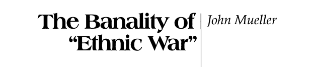

---
output:
  xaringan::moon_reader:
    css: ["default", "extra.css"]
    lib_dir: libs
    seal: false
    nature:
      highlightStyle: github
      highlightLines: true
      countIncrementalSlides: false
      ratio: '16:9'
---

```{r, echo = FALSE, warning = FALSE, message = FALSE}
##xaringan::inf_mr()
## For offline work: https://bookdown.org/yihui/rmarkdown/some-tips.html#working-offline
## Images not appearing? Put images folder inside the libs folder as that is the main data directory

library(tidyverse)
library(readxl)
library(stargazer)
##library(kableExtra)
##library(modelr)

knitr::opts_chunk$set(echo = FALSE,
                      eval = TRUE,
                      error = FALSE,
                      message = FALSE,
                      warning = FALSE,
                      comment = NA)
```

class: slideblue

.size70[**Today's Agenda**]

<br>

.size50[
Using real-world, current events cases to examine the intersection of race and ethnicity with international politics.
]

<br>

.center[.size40[
  Justin Leinaweaver (Spring 2022)
]]

???

## Prep for Class

1. Review cases submitted to Google doc
    - https://docs.google.com/document/d/1CmC9gnItvOJHvXzfFEyg3nCrmYcCbY4dc_f0O7qdDxE/edit?usp=sharing

2. You brought examples too!
    - How the coronavirus pandemic is fueling ethnic hatred: The economic crisis is pushing megacities’ dominant groups to be less tolerant and more resentful of outsiders [Link](https://www.washingtonpost.com/politics/2020/09/18/megacities-pandemics-economic-crisis-is-fueling-ethnic-hatred/)
    - Bhambra, G., Bouka, Y., Persaud, R., Rutazibwa, O., Thakur, V., Bell, D., Smith, K., Haastrup, T. and Adem, S. (2020, Jul 3). Why Is Mainstream International Relations Blind to Racism? Foreign Policy. [Link](https://foreignpolicy.com/2020/07/03/why-is-mainstream-international-relations-ir-blind-to-racism-colonialism/)

<br>

Over the last two weeks we've begun exploring critical theories of international relations.

Last week we explored a feminist lens and this week what is sometimes referred to as a postcolonialist or race-based lens.

Today I want to hear about the real-world cases you each brought to class and see how they help us think about the usefulness of this approach to explaining international politics.


---

background-image: url('libs/Images/background-swirls.jpg')
background-size: 100%
background-position: center

class: middle

.size65[**Assignment for Today**]

<br>

.size45[
Bring to class a real-world, current events cases to illustrate, extend or challenge the arguments made in Vucetic and Persaud (2018)!

+ Help us examine the intersection of race and ethnicity with international politics.
]

???

### Everybody ready to go with this?

<br>

Let's check all the citations for APA formatting.

### You tell me which entries need to be reformatted.


---

background-image: url('libs/Images/background-swirls.jpg')
background-size: 100%
background-position: center

class: middle

# Introduce Your Case

.size45[
1. What is your event?

2. Why is it "current," "international" and "political"?

3. How does it illustrate the usefulness of a postcolonial or race-centric approach to IR?
]

???

Take five minutes and get ready to present your case as an answer to these questions.

Alright, let's hear the cases.

*PRESENT and DISCUSS each*


<br>

Let's start by going around the room to introduce your cases.

Briefly tell us what you picked and either why it interests you or why you think it speaks to the arguments from Monday.


---

background-image: url('libs/Images/14-2-race_racism.jpg')
background-size: 100%
background-position: center
class: middle

???

### Ultimately, how convinced are you by the readings this week that a postcolonial or race-based lens helps us to better explain international political events?

<br>

### So, if we could go back to the start of the semester would you prefer we had attacked the first 13 weeks of our material using the critical approaches to IR? Why or why not?

- e.g. post-colonialist or feminist perspectives?


---

background-image: url('libs/Images/14-3-rwanda_photo.webp')
background-size: 100%
background-position: top center
class: bottom

```{r, out.width='80%', fig.align='center'}

```

???

On Friday we'll dig into a research article that brings the idea of race as a social construct to bear.

