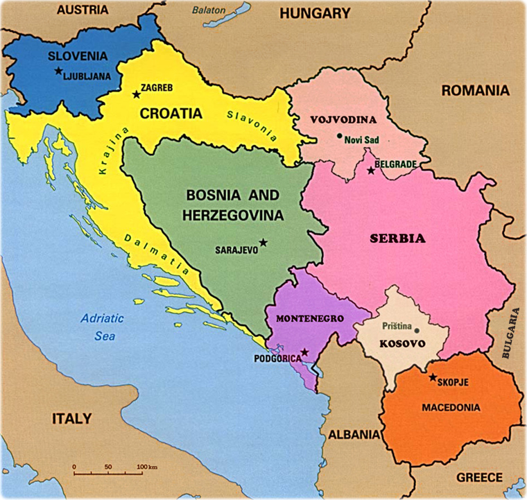
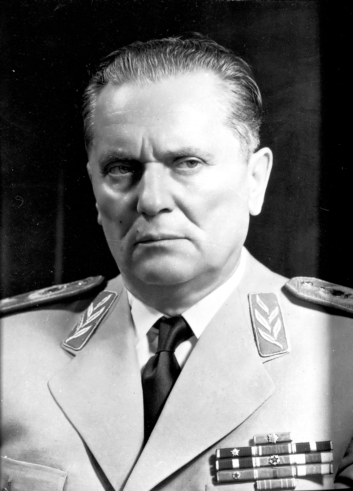

---
output:
  xaringan::moon_reader:
    css: ["default", "extra.css"]
    lib_dir: libs
    seal: false
    nature:
      highlightStyle: github
      highlightLines: true
      countIncrementalSlides: false
      ratio: '16:9'
---

```{r, echo = FALSE, warning = FALSE, message = FALSE}
##xaringan::inf_mr()
## For offline work: https://bookdown.org/yihui/rmarkdown/some-tips.html#working-offline
## Images not appearing? Put images folder inside the libs folder as that is the main data directory

library(tidyverse)
library(readxl)
library(stargazer)
##library(kableExtra)
##library(modelr)

knitr::opts_chunk$set(echo = FALSE,
                      eval = TRUE,
                      error = FALSE,
                      message = FALSE,
                      warning = FALSE,
                      comment = NA)
```

background-image: url('libs/Images/14-3-rwanda_photo.webp')
background-size: 100%
background-position: top center
class: bottom

.size60[.content-box-grey[**Today's Agenda**]]

<br>

<br>

<br>

<br>

<br>

<br>

<br>

<br>

```{r, out.width='80%', fig.align='center'}
knitr::include_graphics('libs/Images/14-3-Banality_title.png')
```

???

## Prep for Class

1. Prep email link to Google sheet to collect citations.

<br>

Today we cap our week exploring the intersection of race and international politics with a research article that brings the idea of race as a social construct to bear.

I'm not kidding when I tell you that this article blew my mind in grad school and I hope you found it equally fascinating.


---

background-image: url('libs/Images/14_1-yugoslavia_map.jpg')
background-size: 60%
background-position: center

???

The main case Mueller (2000) explores is the violence that broke out in Yugoslavia in the 90s.

In short, after WWI all of these separate kingdoms were merged into a single country, Yugoslavia.
- These had been part of the Austro-Hungarian empire.
- Yugoslavia was, for a short time,  a monarchy.

During WW2 resistance groups in Yugoslavia fight back against the Nazis.

One particularly effective group, the Partisans, a communist group led by Josip Broz establish themselves as an important source of power in Yugoslavia.


---

class: middle

.pull-left[

<br>
<br>

```{r, fig.align='center', out.width='100%'}

```

]

.pull-right[

```{r, fig.align='center', out.width='90%'}

```

]

???

After the war, Broz now known as marshal Tito consolidates power and rules ruthlessly as a dictator.

Tito was a canny strategic operator, very Machiavellian

Maintained an iron grip in order to hold these very different kingdoms together as one country.

<br>

Now, Chairman Tito faced a problem that confronts all dictators: the future.

IF YOU ARE THE DICTATOR, WHAT ARE THE PROS AND CONS OF NAMING A PREFERRED SUCCESSOR TO FOLLOW YOU AS LEADER?

(Pro: Direct benefits to those you care about; Trust the system will remain intact; create a scapegoat)

(Con: Invites rivals to your power)

<br>

MAKE THIS CLEAR FOR ME, WHY IS IT DANGEROUS TO IDENTIFY A PREFERRED SUCCESSOR FOR WHEN YOU ARE GONE?
(Creates and endorses a rival to your power)
(- A focal point for dissatisfied elites to work to replace you.)

<br>

So, let's say you play it smart and don't name a successor.

WHAT HAPPENS WHEN YOU DIE?

(This often means that when the leader dies, the country falls apart.)
- This plays out after Tito's death.
- Yugoslavian regions scramble to defend their territory and to claim new areas.

<br>

IN THE CHAOS AND UNCERTAINTY AFTER TITO'S DEATH, WHAT LOGICAL WAY DID VARIOUS POLITICAL LEADERS SEEK TO BOOST THEIR OWN POWER?

(Many politicians tried to use ethnicity as a path to power:)
1. Demonstrates your connection to a given people / region
2. Unites the people already in your territory

Appeals to ethnic nationalism begin to spread.
- Serbia for the Serbs!
- Bosnia for the Bosnians!

<br>

ANY PROBLEM WITH MAKING ETHNICITY THE ORGANIZING PRINCIPAL OF POLITICAL COMPETITION IN YUGOSLAVIA?


---

background-image: url('libs/Images/14_1-yugoslavia_ethnic.png')
background-size: 100%
background-position: center

???

Census data (1991) gives one view of the ethnic breakdown in Yugoslavia.

WHAT DOES THIS IDENTIFY IS THE PROBLEM WITH APPEALS TO ETHNICITY?
(Ethnically homogenous areas do not cleanly fit in many of the recognized territorial borders.)

Tito managed to hold the country together with an iron fist.
- Once that was removed, things rapidly fell apart.

<br>

Note: This figure oversimplifies reality.
- There is more mixing here than evident by solid colors.

The roots of many of the problems we come to know in Yugoslavia can be seen this figure.

- Kosovo's make-up being so different from the rest of Serbia.
- The mess that is Bosnia and Herzegovina
- The pockets of muslims on "Serbian" territory.
- Serbs in concentrated blocs in other regions.


---

background-image: url('libs/Images/14_1-ratko_mladic.jpg')
background-size: 100%
background-position: center

???

Very, very long story short, these political fights turn into armed fights.

Starting in 1991:
- Estimates 140,000 killed
- Genocide, ethnic cleansing and rape frequently employed 

That is Ratko Mladic a notorious Serb war commander.

A fascinating and complex period of time.
- I am NOT an area expert, so we’ll shift to the article.


---

background-image: url('libs/Images/background-slate_v2.png')
background-size: 100%
background-position: center
class: middle, center

.size60[**The Banality of "Ethnic War" (Mueller 2000)**]

<br>
<br>

.size50[**The Case of Yugoslavia**]

.size40[
Therefore, "ethnic war" is not a good description for what happened in the former Yugoslavia in the 1990s.
]

???

The Mueller article does an excellent job pushing beyond our standard understandings of ethnic warfare.
- There is much more going on here than ethnic divisions.

Before we diagram the argument, let's clarify the central concept here.

WHAT IS "ETHNICITY"?
(Mess of identity, race, history...)

MUELLER HAS A SPECIFIC TEST FOR "ETHNIC" WARFARE, WHAT IS IT?
(Prejudice that is expressed in violence.)

IS THIS A GOOD DEFINITION? WHY OR WHY NOT?
(Might be too vague to be useful…)

<br>

Take five minutes on your own to pull out the main premises that support this conclusion.
- What happened in Yugoslavia that makes Mueller so confident this wasn't an ethnic war?

<br>

Work with the people next to you, consolidate into one argument diagram.

* ON BOARD *

* Call on people! *

<br>

class 2018-11-14
- Not everyone joined in (most people didn't participate, didn't support the crimes or were indifferent)
- Many killings within-group
- Unifying factors: criminality (weekend warriors, released prisoners) and opportunistic leaders
- Reaction by many was bewilderment
- Military refused to participate (mass desertions)
- Pre-war surveys showed strong national identity as Yugoslavians, not by ethnicity

Revised by me
- Most people didn't participate
- Pre-war polling indicate very little support for breaking Yugoslavia apart by "nation"
- Violence happened across AND within "ethnic" groups
- Many Serbs in the military mutinied or deserted rather than participate.
- Opportunistic leaders unleash criminal resources (releasing prisoners, criminal syndicates, local hooligans, weekend warriors) on 


---
background-image: url('libs/Images/background-slate_v2.png')
background-size: 100%
background-position: center
class: middle

.size35[

+ Most people didn't participate
+ Pre-war polling: very little support for breaking Yugoslavia apart by "nation"
+ Violence happened across AND within "ethnic" groups
+ Many Serbs in the military mutinied or deserted rather than participate.
+ Opportunistic leaders used criminal resources to achieve their worst aims (prisoners, criminal syndicates, hooligans, weekend warriors)

Therefore, "ethnic war" is not a good description for what happened in the former Yugoslavia in the 1990s.

]

???

Here is one version of the argument diagram.

IS THIS A CONVINCING ARGUMENT? WHY OR WHY NOT?

<br>

The intriguing part of this article is where Mueller goes from here.

He makes a fairly huge inference from his analyses of the genocides in Yugoslavia and Rwanda.


---

background-image: url('libs/Images/background-slate_v2.png')
background-size: 100%
background-position: center
class: middle, center

.size60[**The Big Arguments (Mueller 2000)**]

.size50[

**1. "Ethnic war essentially does not exist"**

and

**2. It could happen anywhere**
]


---

background-image: url('libs/Images/background-slate_v2.png')
background-size: 100%
background-position: center
class: middle

.center[.size50[**The Banality of "Ethnic War" (Mueller 2000)**]]

.size40[.center[Mueller's Four Stages of War and "Ethnic Cleansing":]

1. Takeover

2. Carnival

3. Revenge

4. Occupation and Desertion
]

???

Meuller's research seems to reveal a pattern underpinning the kinds of violence we see around the world that we label "ethnic cleansing."

Takeover (53)
"Recruited and encouraged by leading politicians, and operating under a general framework of order provided by the army, a group of well-armed thugs-or skinhead or redneck or soccer hooligan or Hell's Angels types-would emerge in an area where the former civil order had ceased to exist or where the police actually or effectively were in alliance with them. As the only group willing-indeed, sometimes eager-to use force, they would quickly take control."

Carnival (55)
"The thugs often exercised absolute power in their small fiefdoms and lorded it over their new subjects. Carnivals of looting and destruction would take place, as would orgies of rape, arbitrary violence and murder, and roaring drunkenness; pay often came in the form of alcohol and cigarettes."

Revenge (56)
"Some among the brutalized might wish to fight-and to seek revenge against-their persecutors."

"Often the choice was essentially one of being dominated by vicious bigots of one's own ethnic group or by vicious bigots of another ethnic group."

Occupation and Desertion (56)
"Life in areas controlled by the thugs could be miserable, as the masters argued among themselves and looked for further prey among those remaining, whatever their ethnic background. As Rieff observes, the involvement of gangsters on all sides meant that the "political aims of the war became hopelessly intertwined on a day-to-day level with profiteering and black market activities."

QUESTIONS ON THE FOUR STAGES?


---

background-image: url('libs/Images/14_1-could_it1.png')
background-size: 100%
background-position: center

???

My question for you is, could the chaos and violence described by Mueller as appearing to be ethnic warfare happen here?

DISCUSS


---

background-image: url('libs/Images/background-slate_v2.png')
background-size: 100%
background-position: center
class: middle

.size60[.center[**The Banality of "Ethnic War" (Mueller 2000)**]]

.size40[
**Conclusions**

1. Ethnicity is important only as an ordering device

2. International policing could probably have been effective

3. It could happen anywhere

4. It was not inevitable
]


---

background-image: url('libs/Images/14_1-could_it2.png')
background-size: 100%
background-position: center


---

background-image: url('libs/Images/14_1-could_it3.png')
background-size: 100%
background-position: center


---

class: center, middle, slideblue

.size60[**Next Week: Final Exam Paper**]

<br>

.size50[
Analyze a recent international political event using three of the theories, models or causal mechanisms we've studied in class this term. 
]

???

This is your chance to apply what we've studied this term to a case that interests you!

QUESTIONS ON THE PROMPT?

<br>

To get us ready for this, here's what we need for Monday

SLIDE


---

class: middle, center, slideblue

.size60[**Assignment for Monday**]

<br>

.size45[
Bring to class a recent international political event we have not explored in class. 

Find something you think is interesting and be ready to explain to the class why you picked it.
]

???


