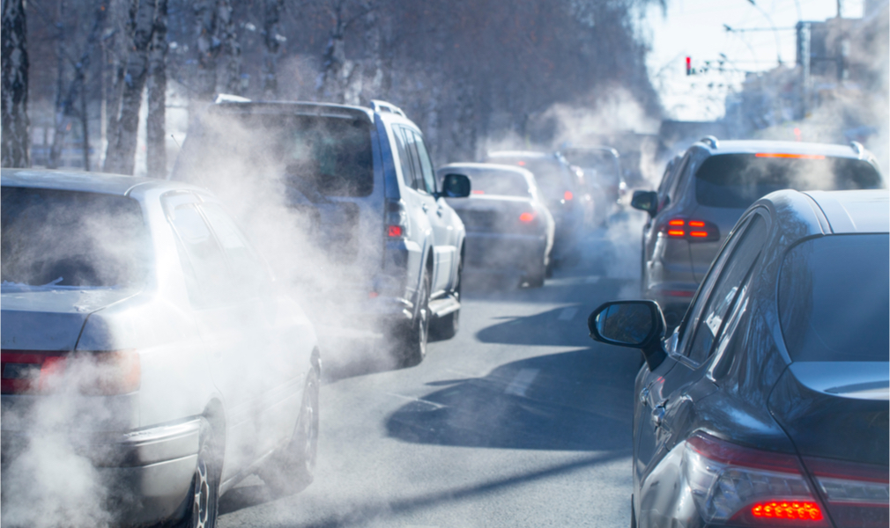

---
output:
  xaringan::moon_reader:
    css: ["default", "extra.css"]
    lib_dir: libs
    seal: false
    nature:
      highlightStyle: github
      highlightLines: true
      countIncrementalSlides: false
      ratio: '16:9'
---

```{r, echo = FALSE, warning = FALSE, message = FALSE}
##xaringan::inf_mr()
## For offline work: https://bookdown.org/yihui/rmarkdown/some-tips.html#working-offline
## Images not appearing? Put images folder inside the libs folder as that is the main data directory

library(tidyverse)
library(readxl)
library(stargazer)
##library(kableExtra)
##library(modelr)

knitr::opts_chunk$set(echo = FALSE,
                      eval = TRUE,
                      error = FALSE,
                      message = FALSE,
                      warning = FALSE,
                      comment = NA)
```

background-image: url('libs/Images/background-worldmap3.png')
background-size: 105%
background-class: top
class: middle

.center[.size50[**III. Why is it so Hard to Cooperate with Other Countries?**]]

<br>

.size50[
**Today's Agenda**

- Interests, Institutions and Interactions
]

<br>

.center[.size40[
  Justin Leinaweaver (Spring 2024)
]]

???

## Prep for Class:
1. Review canvas submissions for participation

<br>

*Opening Discussion: From this point forward students need to practice identifying international political events everyday in class. These are more than just 'things happening far away'!*

### DISCUSS: Name me an international political event that has happened since we last met as a class.

<br>


---

background-image: url('libs/Images/background-cloth_v2.png')
background-size: 100%
background-position: center
class: middle

.size50[**A Prisoner's Dilemma**]

.size30[
+ Each round your group must choose to cooperate or defect.
+ Your reward depends on the choice made by the other group.
]

```{r, fig.align='right', out.width='95%'}
knitr::include_graphics("libs/Images/04_1-PD_Table.png")
```

???

I asked each of you to reflect on that game both in terms of what you might have learned about yourself and and what you learned about your classmates.

<br>

### Let's start with this, can we all agree on what happened?
#### - Give me a short description of the "event."

*Encourage a few different stabs at this*

<br>

### Does everybody agree with that?


---

background-image: url('libs/Images/background-cloth_v2.png')
background-size: 100%
background-position: center
class: middle, center

.size80[**What did you learn about yourself from the game?**]

???

### Did anybody learn anything interesting about themselves from the game?

#### - Anything about how you work in a group?

#### - Anything about how you weigh risk and reward?

#### - Anything about how you make decisions?

<br>

### Was this a useful simulation for learning about yourself as a political decision-maker? Why or why not?

<br>

As a budding social scientist I hope you are always on the lookout for opportunities to connect your lived experience in the world with ideas for how the world works.


---

background-image: url('libs/Images/background-cloth_v2.png')
background-size: 100%
background-position: center
class: middle, center

.size55[**Does the class PD game reveal the true character of your classmates (e.g. something about their nature, trustworthiness, reliability, etc)?**]

???

### Did anybody learn anything interesting about their classmates?

#### - Do you have a good sense of who they are and what they value?

#### - How about their decision-making processes?

<br>

### Out of curiosity, do you believe this simulation is a good test of a person's character? Why or why not?


---

background-image: url('libs/Images/background-blue_cubes_lighter3.png')
background-size: 100%
background-position: center
class: middle

.size50[.center[.content-box-white[**Building a Model of the Prisoner's Dilemma**]]]

.size65[
+ Interests

+ Institutions

+ Interactions
]

???

Let's construct a model to explain the game we just played.

- Remember, the aim of a model is to give us a simplified map of an outcome!

- On your own, diagram your experience of the game in terms of the interests, institutions and interactions.

<br>

Pairs, share and consolidate lists.

<br>

Make four groups and get these diagrams onto the board!

*PRESENT and DISCUSS each*

<br>

**SLIDE**: My version


---

background-image: url('libs/Images/background-blue_cubes_lighter3.png')
background-size: 100%
background-position: center
class: middle

.size35[
**Interests:** 
- Rational actors pursuing positive return

**Institutions:**
- Uncertainty is high
- Available resource is non-excludable
- Rewards for short-term defection OR long-term cooperation

**Interactions:**
- Rivalrous resource

Therefore, risk averse actor's dominant strategy is to defect
]

???

Notes:
- Rational = Acts in accordance with transitive and ordered preferences

- Two sources of uncertainty: Unknown time horizons (how many rounds to play), simultaneous decision-making

- Non-excludable = Anyone can access it / hard to prevent access

- Rivalrous = Your use changes reward to other side

<br>

Here we see the PD game's answer to the question, why is international cooperation hard?

- Some international problems are structured in such a way that they make cooperation very hard to achieve (even when cooperating would make everyone better off!)

- Problems that look like THIS often lead to bad outcomes EVEN THOUGH all involved would like to cooperate!


---

background-image: url('libs/Images/08_2-Classroom.jpg')
background-size: 100%
background-position: center
class: bottom, center

.size50[.content-box-blue[**Making Predictions**]]

???

Imagine we are now going to observe a different class play this exact game. 
### What characteristics about that class would you want to know to help you predict the outcome of that class playing seven rounds of our game?

- *ON BOARD*

<br>

### BRAINSTORM: In  what ways could we alter the game to achieve specific outcomes REGARDLESS of player characteristics?

- *ON BOARD*


---

background-image: url('libs/Images/background-blue_cubes_lighter3.png')
background-size: 100%
background-position: center
class: middle

.size50[.center[.content-box-white[**Real-World Prisoner's Dilemmas**]]]

<br>

```{r, fig.align='center', out.width='95%'}
knitr::include_graphics("libs/Images/04_1-PD_Table.png")
```

???

### Give me some examples from the real world of situations that mirror the dynamics of a prisoner's dilemma.

- Ideally international, but I'll take anything!

<br>

- **SLIDE**: GHG emissions leading to severe climate change


---

background-image: url('libs/Images/08_2-climate_change.jpg')
background-size: 100%
background-position: center
class: middle

.pull-left[
```{r, fig.align='center', out.width='80%'}

```
]

.pull-right[
```{r, fig.align='center', out.width='75%'}

```
]

.size50[
<br>

<br>

.center[.content-box-white[**Real-World Prisoner's Dilemmas**]]]

???

We know that manmade GHG emissions are changing the climate system in some scary ways.

- We'd all be better off to reduce our emissions but the effect only significant if EVERYONE gets on board.

- If just you, then you pay the costs and others take the benefit!

<br>

A kind of prisoner's dilemma!

- Long-term were all better off cooperating on this, BUT short term incentives are to defect!


---

background-image: url('libs/Images/background-blue_triangles2.png')
background-size: 100%
background-position: center
class: middle

.size50[**A Prisoner's Dilemma**]

.size30[
+ Each round your group must choose to cooperate or defect.
+ Your reward depends on the choice made by the other group.
]

```{r, fig.align='right', out.width='95%'}
knitr::include_graphics("libs/Images/04_1-PD_Table.png")
```

???

Bottom line, my hope is that this work today has helped you think about our simulation more deeply.

Building models requires breaking complex situations down into their component pieces and thinking carefully about how each piece works on its own and when colliding with the other pieces.

<br>

### Given your work today, how confident are you that you could tweak the PD game we played to encourage certain specific outcomes?

#### - e.g. Force the players to do something you want them to do...

<br>

More important than that, I hope you are starting to see how these skills connect to the real world.

If you can get specific about the thing you are trying to explain (the outcome), thinking about the interests, institutions and interactions will help you structure ANY investigation.

- Why do wars happen?
- Can we stop international terrorism?
- What should we do about famine and global poverty?

<br>

Huge questions have to be broken down into smaller pieces.

- We can then carefully examine these smaller pieces that explain some part of the outcome.

- Once we identify these causal mechanisms we can then try to alter the outcomes we care about on the global stage.

<br>

### In other words, are you starting to see how models can be used to manipulate complex social systems?

Scary powerful once you see the world this way...

### Any questions on this?


---

background-image: url('libs/Images/background-blue_triangles2.png')
background-size: 100%
background-position: center
class: middle

.pull-left[

<br>
<br>

.size70[.center[**For Friday**]]

<br>
<br>

.size70[.center[**Draft an Outline**]]

]

.pull-right[

.size30[**Intro**
+ What is the question?
+ Why do we care?
+ Thesis statement
]

.size30[**Apply/Evaluate Theory 1**
+ Evidence x 2
]

.size30[**Apply/Evaluate Theory 2**
+ Evidence x 2
]

.size30[**Apply/Evaluate Theory 3**
+ Evidence x 2
]]


???
